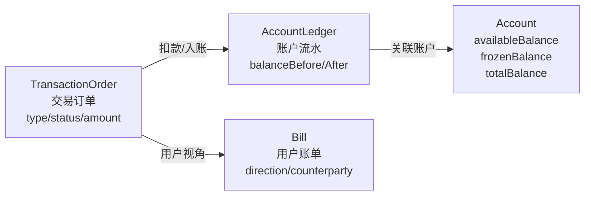
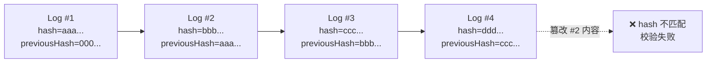
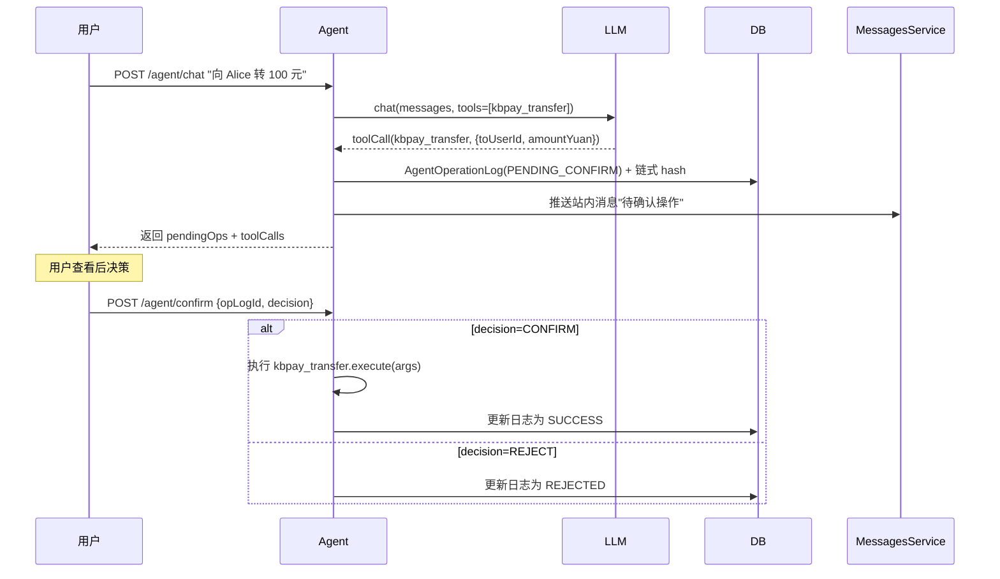
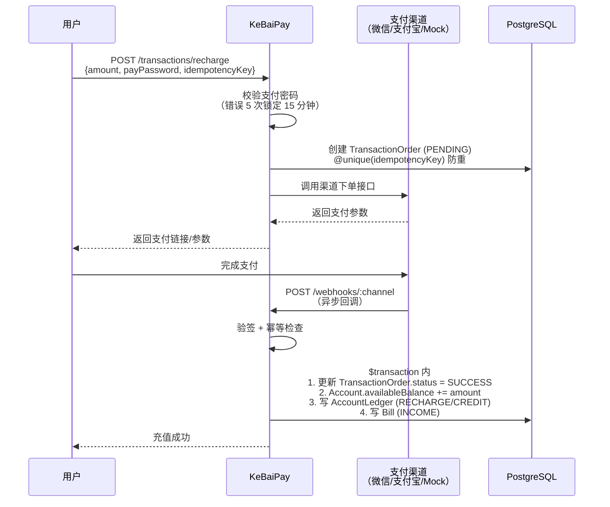
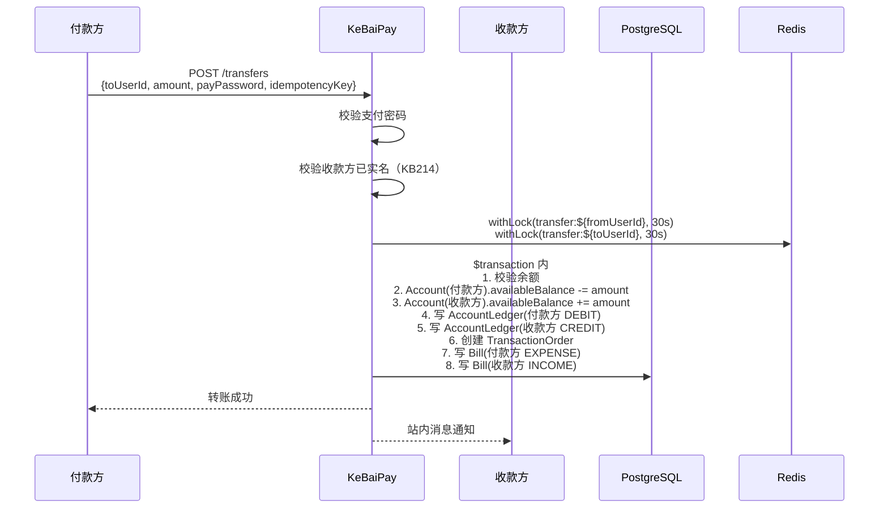
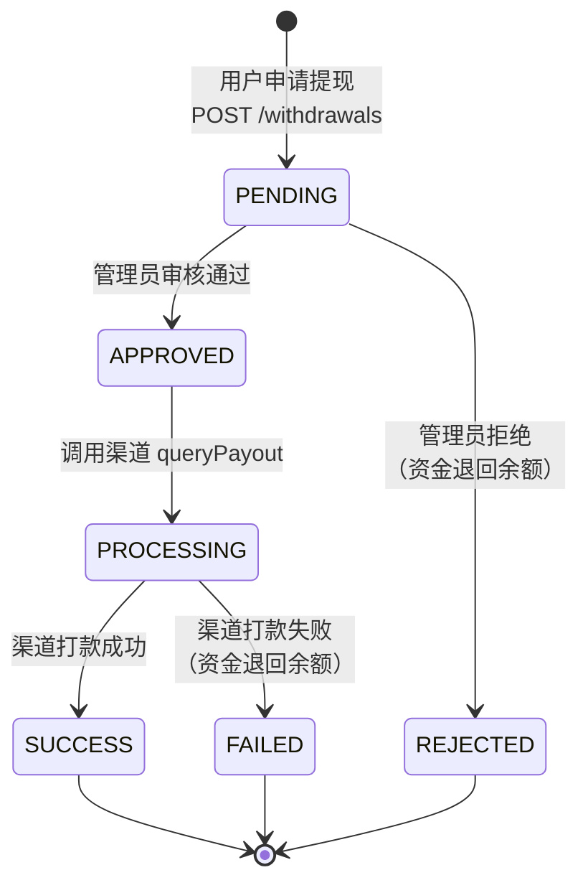
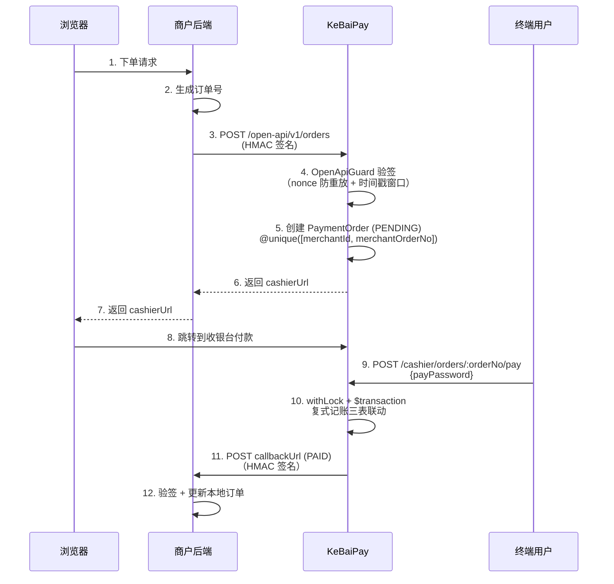
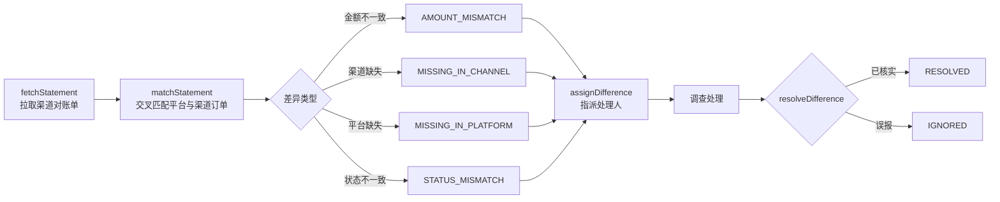
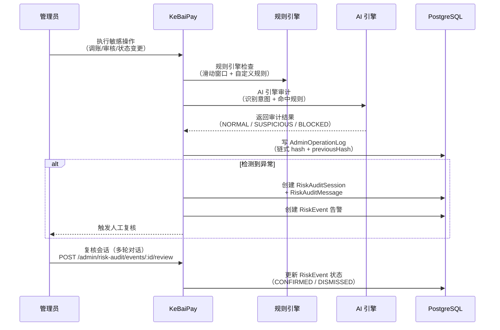

# KeBaiPay 项目交接文档

> 本文档面向接手 KeBaiPay 项目维护与扩展的开发团队，涵盖架构、模块、流程、测试、部署、坑点与优化建议。
> 版本：v2.1.0 | 最后更新：2026-07-22

## 目录

- [1. 项目概述](#1-项目概述)
- [2. 代码结构总览](#2-代码结构总览)
- [3. 架构关键决策](#3-架构关键决策)
- [4. 核心业务流程](#4-核心业务流程)
- [5. 数据库设计要点](#5-数据库设计要点)
- [6. 测试体系](#6-测试体系)
- [7. 部署与运维](#7-部署与运维)
- [8. 常见问题与坑](#8-常见问题与坑)
- [9. 后续优化建议](#9-后续优化建议)
- [10. 关键联系人/资源](#10-关键联系人资源)

---

## 1. 项目概述

### 1.1 基本信息

| 项 | 值 |
|---|---|
| 项目名称 | KeBaiPay（科佰支付） |
| 版本 | 2.1.0 |
| 定位 | 个人钱包 + 商户收款 + 开放 API + 多平台对账聚合 + AI 智能体层的一体化支付中台 |
| 代码仓库 | https://github.com/kebaipay/kebaipay |
| License | ISC © 科佰网络技术有限公司 |
| 运行环境 | Node.js ≥ 20 / PostgreSQL ≥ 16 / Redis ≥ 7 |

### 1.2 技术栈

| 层 | 技术选型 | 版本 | 选型理由 |
|---|---|---|---|
| 运行时 | Node.js | ≥ 20 | NestJS 11 + TypeScript 6 要求 |
| 框架 | NestJS | 11 | 模块化 + DI + 装饰器，企业级标准 |
| 语言 | TypeScript | 6 | 类型安全，DTO 校验 |
| ORM | Prisma | 7 | 类型安全 + 迁移机制 + PostgreSQL 适配 |
| 数据库 | PostgreSQL | 16/17 | 主库，不支持 SQLite（v2 已移除 SQLite 支持） |
| 缓存 | Redis | 7 | 分布式锁 + 滑动窗口限流 + nonce 防重放 |
| 认证 | JWT + HMAC-SHA256 | - | 用户/管理员/**Agent** JWT 独立密钥；商户开放 API HMAC 签名 |
| 加密 | AES-256-GCM | - | 身份证、银行卡等敏感字段加密 |
| 风控 | 自研规则引擎 + AI 审计 | - | 滑动窗口 Lua + 链式 hash 日志 |
| **AI Agent** | **Vercel AI SDK v7 + MCP** | **v2.1.0 新增** | **LLM 调用 + 工具循环 + MCP Server，支持 mock 降级** |
| 部署 | Docker Compose / 裸机 | - | PM2 进程管理可选；n8n + Botpress 独立编排（docker-compose.agent.yml） |
| 监控 | OpenTelemetry + Prometheus + Sentry | - | OTLP trace + metrics 端点 |

### 1.3 核心数字

| 指标 | 数值 | 说明 |
|------|------|------|
| API 端点数 | **214** | 覆盖用户/商户/管理后台/开放 API/**AI 智能体** 全场景 |
| Prisma 数据模型 | **52** | 按 15 个业务域 + **1 个 AI 智能体域**分组 |
| 单元测试 | **1023** | 覆盖所有 Service 与 Controller |
| E2E 测试 | **39（Jest）+ 1789 行 Python 脚本** | `test/` 目录 4 个 Jest 测试套件（39 用例）+ `e2e_check.py` Python HTTP 测试脚本 |
| 业务模块数 | **36** | `src/` 下 36 个 NestJS 模块（含 v2.1.0 新增 AgentModule） |
| 数据库迁移 | 23 个 | `prisma/migrations/` 下 |

### 1.4 项目定位

KeBaiPay 是一个面向中小商户、个人钱包场景的完整支付中台方案。系统采用 **复式记账模型**、**Redis 分布式锁防并发**、**Prisma 事务保证 ACID**，并内置风控引擎、对账引擎、AI 风控审计等高级特性。

**三大角色**：
- **C 端用户**：注册钱包、充值、转账、提现、发红包、担保交易等
- **B 端商户**：入驻、应用管理、收款码、收银台、开放 API
- **A 端管理员**：审核、风控、对账、财务统计、AI 风控审计

---

## 2. 代码结构总览

### 2.1 src/ 目录树

```
src/
├── auth/                       用户 JWT 鉴权（注册、登录、JWT 签发）
├── users/                      用户、实名、支付密码、绑定手机/邮箱
├── accounts/                   账户余额、资金流水（复式记账）
├── transactions/               充值、交易订单
├── transfers/                  用户间转账（幂等键防重，含并发测试）
├── withdrawals/                提现申请与审核（含并发测试）
├── red-packets/                红包（4 种类型 + 二倍均值法 + 过期退回调度）
├── qr-codes/                   收款码（个人/固定/商户）
├── bills/                      用户视角账单
├── bank-cards/                 银行卡管理（AES-256-GCM + SHA-256 hash）
├── escrow/                     担保交易 S2（资金冻结、超时放款、争议退款）
├── batch-transfers/            批量转账（原子提交、逐笔处理）
├── subscriptions/              订阅 / 周期扣款（计划、订阅、自动扣款调度）
├── splits/                     分账（按比例/固定金额分给多接收方）
├── coupons/                    优惠券（FIXED/PERCENT/DISCOUNT、领取、使用、过期调度）
├── referrals/                  邀请返现（邀请码、绑定关系、奖励触发）
├── messages/                   消息中心（广播 + 定向，已读跟踪）
├── invoices/                   发票（普通/专用，商户申请、管理员开具）
├── merchants/                  商户管理（入驻、应用、收款码）
├── cashier/                    收银台（创建订单、支付、对账、CSV 导出）
├── open-api/                   商户开放 API（HMAC 签名认证）
├── admin/                      管理后台（含权限守卫、11 种权限码）
├── finance/                    财务统计与对账（快照、结算、日报）
├── channel-reconciliation/     多平台对账聚合 S5（渠道对账单 + 差异处理工作流）
├── risk/                       风控引擎（滑动窗口）
├── risk-audit/                 AI 风控审计 S3（会话式多轮对话）
├── custom-rules/               自定义风控规则模板（DSL 编排、BLOCK/WARN/REVIEW）
├── payment-channels/           支付渠道（微信/支付宝/Mock + 渠道健康检查）
├── webhooks/                   支付渠道回调
├── redis/                      Redis 封装（withLock 分布式锁 + 滑动窗口限流）
├── crypto/                     AES-256-GCM 加解密
├── security/                   启动安全校验（SecurityValidator 强校验 6 个 secret）
├── audit/                      审计日志（链式 hash 防篡改 + AuditSchedule 校验）
├── health/                     健康检查（存活/就绪/渠道/调度）
├── metrics/                    Prometheus /metrics
├── notifications/              邮件通知 + 结算调度
├── sms/                        短信（阿里/腾讯/华为/mock）
├── prisma/                     Prisma 客户端封装
├── common/                     公共工具（错误码、枚举、分页、JsonLogger、trace-context）
├── app.module.ts               根模块
├── main.ts                     启动入口
└── tracing.ts                  OpenTelemetry SDK 接入（必须在 NestFactory 之前 import）
```

### 2.2 关键模块说明（35 个模块）

#### 用户端模块（18 个）

| 模块 | 路由前缀 | 认证 | 核心能力 | 涉及表 |
|------|----------|------|----------|--------|
| auth | `/auth` | 无 | 注册、登录、JWT 签发 | User |
| users | `/users` | User JWT | 实名、支付密码、绑定、改密 | User、IdentityVerification、LoginLog |
| accounts | `/accounts` | User JWT | 余额查询、资金流水 | Account、AccountLedger |
| transactions | `/transactions` | User JWT | 充值、回调通知 | TransactionOrder |
| transfers | `/transfers` | User JWT | 用户间转账 + 幂等键 | TransactionOrder、AccountLedger、Bill |
| withdrawals | `/withdrawals` | User JWT | 申请提现、查询记录 | WithdrawalOrder |
| red-packets | `/red-packets` | User JWT | 4 种红包 + 二倍均值法 | RedPacket、RedPacketRecord |
| qr-codes | `/qr-codes` | User JWT | 个人/固定收款码、扫码付款 | QrCode |
| bills | `/bills` | User JWT | 用户视角账单查询 | Bill |
| bank-cards | `/bank-cards` | User JWT | 绑卡、解绑、设默认卡 | BankCard |
| escrow | `/escrow` | User JWT | 担保交易 S2 全流程 | EscrowOrder |
| batch-transfers | `/batch-transfers` | User JWT | 批量转账原子提交 | BatchTransfer、BatchTransferItem |
| subscriptions | `/subscriptions` | User JWT | 订阅/周期扣款 | SubscriptionPlan、Subscription、SubscriptionCharge |
| splits | `/splits` | User JWT | 分账 | SplitOrder、SplitItem |
| coupons | `/coupons` | User JWT | 优惠券领取/使用 | Coupon、UserCoupon |
| referrals | `/referrals` | User JWT | 邀请返现 | ReferralCode、Referral |
| messages | `/messages` | User JWT | 消息中心 | Message、MessageRead |
| invoices | `/invoices` | User JWT | 商户发票 | Invoice |

#### 商户端模块（3 个）

| 模块 | 路由前缀 | 认证 | 核心能力 |
|------|----------|------|----------|
| merchants | `/merchants` | User JWT | 商户入驻、应用管理、收款码 |
| cashier | `/cashier` | User JWT | 收银台订单全流程、CSV 导出 |
| open-api | `/open-api/v1/*` | HMAC 签名 | 商户服务端调用，下单/查单/退款/转账/查余额 |

#### 管理后台模块（13 个）

| 模块 | 路由前缀 | 核心能力 |
|------|----------|----------|
| admin（核心） | `/admin/*` | 管理员认证、用户/商户/提现审核、人工调账、系统配置 |
| admin-auth | `/admin/auth/*` | 管理员登录、改密 |
| admin-user | `/admin/users/*` | 用户列表/详情/状态/风控等级 |
| channel-config | `/admin/channels/*` | 支付渠道 CRUD + 测试 |
| system-config | `/admin/system-config/*` | 系统配置获取/设置 |
| finance | `/admin/finance/*` | 财务概览、报表、结算、对账、快照 |
| reconciliation | `/admin/reconciliation/*` | 对账执行、报告列表/导出 |
| channel-reconciliation | `/admin/channel-reconciliation/*` | 多平台对账聚合 S5 |
| risk-audit | `/admin/risk-audit/*` | AI 风控审计 S3 复核 |
| custom-rules | `/admin/risk-rules/custom/*` | 自定义风控规则模板 |
| invoices (admin) | `/admin/invoices/*` | 发票开具/作废 |

#### 跨端基础模块（4 个）

| 模块 | 路由前缀 | 核心能力 |
|------|----------|----------|
| health | `/health/*` | 存活/就绪/渠道/调度健康检查 |
| metrics | `/metrics` | Prometheus 指标抓取 |
| sms | `/sms/*` | 短信验证码发送 |
| webhooks | `/webhooks/:channel` | 支付渠道回调入口 |

#### 基础设施模块（8 个，无 HTTP 路由）

| 模块 | 核心职责 |
|------|----------|
| prisma | Prisma 客户端单例封装 |
| redis | withLock 分布式锁 + 滑动窗口限流 + nonce 防重放 |
| crypto | AES-256-GCM 加解密（身份证、银行卡号） |
| security | SecurityValidator 启动强校验 6 个 secret + CORS |
| audit | 链式 hash 审计日志 + AuditSchedule 每日校验 |
| notifications | 邮件通知 + 结算调度 |
| risk | 风控规则引擎（滑动窗口 Lua） |
| common | 中间件、拦截器、过滤器、JsonLogger、trace-context、错误码、分页、CSV |

---

## 3. 架构关键决策

### 3.1 为什么用 NestJS 11 + Prisma 7 + PostgreSQL 16 + Redis 7

| 选型 | 理由 |
|------|------|
| **NestJS 11** | 企业级 Node.js 框架，模块化 + DI + 装饰器模式天然适合大型项目；11 版本支持 TypeScript 6 与最新 `@nestjs/schedule` v6 |
| **Prisma 7** | 类型安全 ORM，迁移机制完善；7 版本提供 `@prisma/adapter-pg` 直连 PostgreSQL，性能优于旧版；不支持 SQLite 是因为生产环境需要 PG 的咨询锁（`pg_advisory_xact_lock`）用于链式 hash 串行化 |
| **PostgreSQL 16** | 事务级咨询锁、JSONB、原生枚举、CTE 等高级特性齐全；16 版本性能优化明显 |
| **Redis 7** | 分布式锁（withLock）、滑动窗口限流、nonce 防重放三大场景必备；7 版本支持 Functions 与 ACL 增强 |

### 3.2 为什么用复式记账（AccountLedger + Bill + TransactionOrder 三表）

KeBaiPay 的资金流水通过三张表联动实现复式记账，确保每笔资金变动可双向追溯：



| 表 | 角色 | 关键字段 | 用途 |
|----|------|----------|------|
| `TransactionOrder` | 交易主订单 | `orderNo` (@unique)、`type`、`status`、`amount`、`fee`、`channel`、`idempotencyKey` | 承载订单状态机、渠道关联、幂等键 |
| `AccountLedger` | 账户维度流水 | `accountId`、`transactionId`、`balanceBefore`、`balanceAfter`、`direction` | 每笔变动一条，记录前后值便于审计 |
| `Bill` | 用户视角账单 | `userId`、`transactionId`、`direction`、`amount`、`counterparty` | 用户端展示用，按 INCOME/EXPENSE 筛选 |
| `Account` | 账户余额快照 | `availableBalance`、`frozenBalance`、`totalBalance` | 当前余额，所有操作直接更新 |

**为什么不直接更新余额？**
- 资金可追溯：任何变动都能从 Ledger 回放重建余额
- 双向审计：管理员既能查账户视角（Bill），也能查系统视角（Ledger）
- 异常检测：三表对账可发现资金不一致

**写入顺序**：`TransactionOrder` → `Account`（更新余额）→ `AccountLedger`（写流水）→ `Bill`（写用户账单），全部在同一 `$transaction` 内完成。

### 3.3 为什么用 Redis 分布式锁（防资金并发）

```typescript
await this.redis.withLock(`transfer:${fromUserId}`, 30, async () => {
  await this.prisma.$transaction(async (tx) => {
    // 1. 校验余额
    // 2. 扣减 fromUser 余额，增加 toUser 余额
    // 3. 写 AccountLedger（balanceBefore / balanceAfter 必填）
    // 4. 创建 TransactionOrder
    // 5. 创建 Bill（用户视角账单）
  })
})
```

**核心问题**：资金类操作必须防止并发请求重复扣款。例如：
- 用户同时发两个转账请求 → 余额被扣两次但只扣一次
- 同时发起提现 + 转账 → 超扣

**解决方案**：`RedisService.withLock(key, ttl, fn)`：
- key 维度：按账户 ID 加锁（如 `transfer:${userId}`、`withdraw:${userId}`）
- TTL：默认 30 秒，超过自动释放防死锁
- 降级：Redis 不可用时降级为无锁模式（仅单实例环境安全）
- 实现：SET NX + EX 原子操作 + Lua 释放（避免误删他人锁）

**为什么不只用数据库事务？**
- 数据库事务保证原子性，但不防并发读后写（两个事务同时读到余额 100，都扣 50，最终 50 而不是 0）
- Redis 锁串行化同一账户的操作，确保前一个完成才执行下一个
- 乐观锁（version 字段）也是方案，但失败重试成本高，分布式锁更适合支付场景

### 3.4 为什么 JWT_USER_SECRET 与 JWT_ADMIN_SECRET 分离

```typescript
// jwt.strategy.ts（用户 JWT）
@Injectable()
export class JwtStrategy extends PassportStrategy(JwtStrategy, 'jwt') {
  constructor(config: ConfigService) {
    super({
      secretOrKey: config.get('JWT_USER_SECRET'),
      // 强制校验 typ === 'user'
    })
  }
}

// admin-jwt-auth.guard.ts（管理员 JWT）
// 使用独立的 JWT_ADMIN_SECRET，强制 typ === 'admin'
// 防止用户 token 被当 admin token 使用
```

**核心理由**：
- **安全隔离**：即使 JWT_USER_SECRET 泄露，攻击者也无法伪造管理员 token
- **强制 typ 校验**：用户 JWT 的 `typ` 字段为 `user`，管理员 JWT 为 `admin`，跨域使用直接拒绝
- **角色实时校验**：管理员 JWT 不携带 role，每次从 DB 读取最新 role，防止降权后权限残留
- **独立过期时间**：用户 JWT 通常较短（2 小时），管理员 JWT 可独立配置

### 3.5 为什么 AdminOperationLog 用链式 hash



**核心机制**：
- 每条日志的 `hash = SHA256(JSON.stringify({ adminId, action, target, detail, ip, userAgent, previousHash }))`
- `previousHash` 指向上一条日志的 `hash`，链条首条指向 `0`.repeat(64) 创世哈希
- `seq` 字段单调递增，解决毫秒精度 `createdAt` 并发写入顺序不确定问题

**为什么用链式 hash？**
- **防篡改**：管理员修改历史日志会导致 `hash` 不匹配，后续所有日志 `previousHash` 都失效
- **审计可信**：金融系统要求操作日志不可篡改，链式 hash 是行业最佳实践（参考区块链）
- **可验证**：`AuditLogService.verifyChain` 按 seq 升序逐条校验，`AuditSchedule` 每天凌晨 3 点全量校验，发现异常创建 `RiskEvent` 告警

**写入流程**（`AuditLogService.log`）：
1. 通过 PostgreSQL 事务级咨询锁 `pg_advisory_xact_lock(8831, 1)` 串行化，防止并发写入分叉
2. 读取上一条日志的 `hash` 作为 `previousHash`
3. 计算当前 `hash = SHA256(JSON.stringify({ ...content, previousHash }))`
4. 持久化（写入失败必须抛出异常，让业务事务回滚，保证资金已动则审计必留痕）

### 3.6 为什么 channel-reconciliation 用 idempotencyKey 防重

```prisma
model ChannelStatement {
  idempotencyKey String  @unique
  // ...
}
```

**核心问题**：多平台对账聚合（S5）需要从支付宝/微信/银行等多个渠道拉取对账单。如果调度任务重复执行或网络重试，会导致同一份对账单被重复拉取，造成数据重复与对账差异误判。

**解决方案**：
- 每次拉取对账单时，生成唯一 `idempotencyKey`（通常包含渠道 + 日期 + 批次号）
- 数据库 `@unique` 约束保证同一 key 只能成功插入一次
- 重复请求返回首次结果，不会产生重复数据
- `fetchStatement` 接口在已 FETCHED 状态下会拒绝重拉（参见 [8. 常见问题与坑](#8-常见问题与坑)）

**幂等键覆盖范围**（共 8 个模型）：

| 模型 | 幂等字段 | 用途 |
|------|----------|------|
| TransactionOrder | `idempotencyKey` (@unique) | 转账、充值等 |
| WithdrawalOrder | `idempotencyKey` (@unique) | 提现 |
| RedPacket | `idempotencyKey` (@unique) | 发红包 |
| EscrowOrder | `idempotencyKey` (@unique) | 担保交易 |
| BatchTransfer | `idempotencyKey` (@unique) | 批量转账批次 |
| Subscription | `idempotencyKey` (@unique) | 订阅 |
| SplitOrder | `idempotencyKey` (@unique) | 分账 |
| PaymentOrder | `idempotencyKey` (@unique) + `@@unique([merchantId, merchantOrderNo])` | 商户订单号唯一 |

### 3.7 为什么用 AgentAuthGuard 作为第 4 种认证（v2.1.0 新增）

KeBaiPay v2.1.0 引入 AI 智能体层，需要为 Agent 提供独立的认证体系。设计原则：

| 设计点 | 理由 |
|--------|------|
| **独立 JWT_AGENT_SECRET** | Agent token 不与 User/Admin 共用密钥，即便泄露也不影响主体系；与 AdminJwtAuthGuard 完全隔离 |
| **typ='agent' 强校验** | JWT payload 中 `typ` 字段严格区分 user/admin/agent，防止用户 token 被误用为 Agent token |
| **自包含 CanActivate** | 不依赖 Passport（与 User/Admin 不同），仿 AdminJwtAuthGuard 实现，避免引入额外抽象 |
| **DB 实时校验** | 每次请求都查 DB 校验 Agent.status='ACTIVE' + AgentAuthorization 未撤销/未过期，防止降权残留（如 Agent 被禁用后旧 token 应立即失效） |
| **携带主体授权信息** | JWT 中签入 subjectType/subjectId/authId/authScopes，避免每次调用工具都查 DB |
| **7d 长期 token** | Agent 是机器身份，7d 默认有效期可减少 token 刷新开销；可配置 `JWT_AGENT_EXPIRES_IN` |

**4 种认证对比**：

| 认证 | 用途 | 密钥 | 守卫类型 | 依赖 |
|------|------|------|----------|------|
| JwtAuthGuard | C 端用户 | JWT_USER_SECRET | Passport-Jwt | PrismaService |
| AdminJwtAuthGuard | A 端管理员 | JWT_ADMIN_SECRET | CanActivate（自包含） | PrismaService |
| OpenApiGuard | B 端商户开放 API | HMAC appSecret | CanActivate（自包含） | MerchantApp 表 |
| **AgentAuthGuard** | **AI Agent** | **JWT_AGENT_SECRET** | **CanActivate（自包含）** | **Agent + AgentAuthorization 表** |

### 3.8 为什么 LLM 用 mock 降级模式（v2.1.0 新增）

LlmService 抽象出统一的 `chat({ messages, tools, systemPrompt, maxSteps })` 接口，但生产环境可能因各种原因无法访问 LLM API（如配额耗尽、网络隔离、密钥失效），因此设计 mock 降级机制：

```typescript
async chat(input: { messages, tools, systemPrompt, maxSteps }): Promise<LlmResult> {
  if (this.isMock) return this.mockChat(input.messages, input.tools ?? [])
  const sdk = await this.getSdk()
  if (!sdk) return this.mockChat(input.messages, input.tools ?? [])  // SDK 加载失败
  try {
    return await this.callWithSdk(sdk, input)
  } catch (err) {
    return this.mockChat(input.messages, input.tools ?? [])  // 调用失败
  }
}
```

**降级触发条件**：
1. `LLM_PROVIDER=mock`（默认）：开发/测试环境
2. `@ai-sdk/openai` 或 `ai` 模块未安装：动态 import 失败时
3. LLM API 调用失败（超时、限流、5xx 等）：catch 后降级

**降级行为**：mockChat 通过关键词匹配（"余额"/"账单"/"转"/"红包"/"对账"/"风控"）返回固定模板，告知用户当前为 mock 模式，避免完全无响应。

### 3.9 为什么 Agent 资金操作要 Human-in-the-Loop（v2.1.0 新增）

Agent 的工具调用分为两类：
- **只读类**（query_balance/query_bill 等）：requireConfirm=false，直接执行
- **资金类**（transfer/refund/send_red_packet 等）：requireConfirm=true，强制二次确认

**资金类操作流程**：



**为什么不直接执行**：
- 防止 LLM "幻觉"导致的错误转账（如金额错位、收款人错误）
- 防止恶意 Prompt 注入让 Agent 执行非用户本意的操作
- 提供审计断点：PENDING_CONFIRM 状态可作为风控审查的关键节点
- 超时机制（默认 60s，`AGENT_CONFIRM_TIMEOUT_SEC`）防止操作悬挂

---

## 4. 核心业务流程

### 4.1 充值流程



**关键点**：
- `idempotencyKey` 防止用户重试导致重复扣款
- 渠道回调必须验签（HMAC-SHA256）
- 调度任务 `transactions:rechargeTimeout` 每 5 分钟扫描 PENDING 超 15 分钟的充值订单告警，防止回调丢失导致订单卡死

### 4.2 转账流程



**关键点**：
- 双方账户都加锁，避免与其他资金操作冲突
- 单一 `$transaction` 保证 4 个表（Account、AccountLedger × 2、Bill × 2、TransactionOrder）原子写入
- `idempotencyKey` 防止网络重试导致重复转账

### 4.3 提现流程



**关键点**：
- 提现必须先绑卡（`bankCardId` 必填）
- 必须实名认证（`KB212`）
- 管理员审核通过后调用渠道打款，回调更新最终状态
- 调度任务 `withdrawals:processingTimeout` 每 5 分钟扫描 PROCESSING 超 10 分钟的提现订单，调用渠道 `queryPayout` 核对真实状态
- 失败/拒绝时资金自动退回可用余额

### 4.4 商户收银台支付



**HMAC 签名算法**：

```javascript
const crypto = require('crypto')

const signString = [
  method,           // 'POST'
  path,             // '/open-api/v1/orders'
  rawBody,          // JSON.stringify(requestBody)
  timestamp,        // Date.now() 毫秒
  nonce,            // 唯一随机字符串
  appId             // 商户应用 App ID
].join('\n')

const signature = crypto
  .createHmac('sha256', appSecret)
  .update(signString)
  .digest('hex')

// 必需请求头：
// X-App-Id: <app_id>
// X-Timestamp: <timestamp>
// X-Nonce: <nonce>
// X-Signature: <signature>
```

**安全机制**：
- 时间戳窗口：过去 120 秒 ~ 未来 30 秒，超出返回 `KB401`
- nonce 防重放：Redis `SET NX` 原子去重（Redis 不可用时降级到进程内 Map），TTL 2 分钟
- 签名比对使用 `timingSafeEqual` 防时序攻击
- appSecret 永不出现在请求中，仅服务端持有

### 4.5 多平台对账聚合（S5）



**核心端点**：

| 端点 | 说明 |
|------|------|
| `POST /admin/channel-reconciliation/statements/fetch` | 拉取渠道对账单（按渠道+日期） |
| `POST /admin/channel-reconciliation/statements/:id/match` | 触发交叉匹配 |
| `GET /admin/channel-reconciliation/differences` | 查询差异列表 |
| `POST /admin/channel-reconciliation/differences/:id/assign` | 指派处理人 |
| `POST /admin/channel-reconciliation/differences/:id/resolve` | 标记解决（RESOLVED / IGNORED） |

**关键点**：
- 涉及表：`ChannelStatement`、`ChannelStatementItem`、`ReconciliationDifferenceItem`
- 幂等键 `idempotencyKey` 防止重复拉取
- 差异处理状态机：`PENDING → INVESTIGATING → RESOLVED / IGNORED`
- 需要管理员权限：`reconciliation:run` + `reconciliation:diff:handle`

### 4.6 AI 风控审计（S3）



**核心组件**：
- `risk-engine.service.ts`：滑动窗口规则引擎（基于 Redis Lua 脚本）
- `risk-audit-ai.engine.ts`：AI 引擎，识别操作意图与命中规则
- `custom-rules/`：自定义规则模板（DSL 编排，支持 AND/OR 复合条件，动作 BLOCK/WARN/REVIEW）
- `AdminOperationLog`：链式 hash 防篡改（详见 [3.5](#35-为什么-adminoperationlog-用链式-hash)）
- `RiskAuditSession` + `RiskAuditMessage`：会话式多轮对话，便于人工复核

**关键点**：
- 所有管理员敏感操作必须记 `AdminOperationLog`（链式 hash）
- 规则引擎 + AI 引擎双引擎审计，规则引擎快、AI 引擎准
- 检测异常时创建 `RiskEvent` 告警，需要 `risk:event:handle` 权限的管理员复核
- 复核过程支持多轮对话，AI 助手协助分析

---

## 5. 数据库设计要点

### 5.1 47 个 Prisma 模型（按 15 个业务域分组）

```prisma
// prisma/schema.prisma 完整定义，按业务域分组：
```

| 业务域 | 模型 | 数量 |
|--------|------|------|
| 用户与认证 | User、IdentityVerification、LoginLog、Account | 4 |
| 资金流水 | AccountLedger、TransactionOrder、Bill | 3 |
| 提现 | WithdrawalOrder | 1 |
| 红包 | RedPacket、RedPacketRecord | 2 |
| 收款码 | QrCode | 1 |
| 银行卡 | BankCard | 1 |
| 担保交易 | EscrowOrder | 1 |
| 批量转账 | BatchTransfer、BatchTransferItem | 2 |
| 订阅 | SubscriptionPlan、Subscription、SubscriptionCharge | 3 |
| 分账 | SplitOrder、SplitItem | 2 |
| 优惠券 | Coupon、UserCoupon | 2 |
| 邀请返现 | ReferralCode、Referral | 2 |
| 消息中心 | Message、MessageRead | 2 |
| 发票 | Invoice | 1 |
| 商户与支付 | Merchant、MerchantApp、PaymentOrder | 3 |
| 风控 | RiskEvent、RiskAuditSession、RiskAuditMessage、CustomRiskRule | 4 |
| 管理后台 | AdminUser | 1 |
| 系统配置 | SystemConfig、PaymentChannelConfig | 2 |
| 审计 | AdminOperationLog、WebhookLog | 2 |
| 财务对账 | DailySnapshot、DailyLimitUsage、ReconciliationReport、ChannelStatement、ChannelStatementItem、ReconciliationDifferenceItem | 6 |
| 平台账户 | PlatformAccount、JournalEntry | 2 |
| **合计** | | **47** |

### 5.2 加密字段（idCardHash / cardNumberHash / phoneHash）

敏感字段采用「加密列 + 哈希列」双列设计：

| 字段 | 加密列 | 哈希列（@unique） | 用途 |
|------|--------|---------------------|------|
| 身份证号 | `IdentityVerification.idCard` | `IdentityVerification.idCardHash` | 防止同一身份证被多用户提交 |
| 银行卡号 | `BankCard.cardNumber` | `BankCard.cardNumberHash` | 同一用户下卡号唯一 |
| 银行卡预留手机号 | `BankCard.phone` | `BankCard.phoneHash` | 可选，便于查询 |

**加密算法**：AES-256-GCM
- 密钥从 `ENCRYPTION_KEY` 通过 `scryptSync` 派生
- 存储格式：`base64(iv:ciphertext:authTag)`
- 每次加密密文不同（iv 随机）

**为什么需要双列？**
- 不能直接对加密列加 `@unique`：AES-256-GCM 每次密文不同，唯一约束会失效
- 哈希列存 SHA-256 明文哈希，用于唯一约束与查询
- 加密列存密文，用于还原明文展示

### 5.3 链式 hash（AdminOperationLog.hash + previousHash）

```prisma
model AdminOperationLog {
  id           BigInt   @id @default(autoincrement())
  adminId      String
  action       String
  target       String
  detail       Json
  ip           String
  userAgent    String
  hash         String   @db.VarChar(64)
  previousHash String   @db.VarChar(64)
  seq          BigInt   @unique
  createdAt    DateTime @default(now())
}
```

详见 [3.5 为什么 AdminOperationLog 用链式 hash](#35-为什么-adminoperationlog-用链式-hash)。

### 5.4 幂等键（idempotencyKey @unique）

详见 [3.6 为什么 channel-reconciliation 用 idempotencyKey 防重](#36-为什么-channel-reconciliation-用-idempotencykey-防重)。

### 5.5 软删除约定

项目采用「状态字段」软删除而非 `deletedAt` 时间戳，便于查询过滤与审计：

| 模型 | 软删除字段 | 取值 |
|------|------------|------|
| `BankCard` | `status` | `ACTIVE` / `DELETED`（解绑即置 DELETED，isDefault 自动转移） |
| `User` | `status` | `ACTIVE` / `EXPENSE_RESTRICTED` / `INCOME_RESTRICTED` / `FROZEN` |
| `Merchant` | `status` | `PENDING` / `APPROVED` / `REJECTED` |
| `Message` | 实际删除（`prisma.message.delete`） | 广播消息不可删，仅定向消息可由用户删除 |

### 5.6 索引约定

Prisma schema 中通过 `@@index` 声明索引，遵循以下原则：

1. **外键字段必加索引**：如 `TransactionOrder.fromUserId` / `toUserId`、`AccountLedger.accountId` / `transactionId`
2. **状态 + 时间复合索引**：用于调度任务扫描超时订单，如 `@@index([status, completedAt])`、`@@index([status, expiredAt])`、`@@index([status, shippedAt])`
3. **渠道订单号索引**：用于回调匹配，如 `@@index([channelOrderNo])`
4. **用户视角查询索引**：如 `Bill.@@index([userId, createdAt])` 用于分页查询用户账单
5. **幂等键 / 业务唯一约束**：使用 `@unique` 或 `@@unique`，如 `@@unique([merchantId, merchantOrderNo])`、`@@unique([messageId, userId])`

---

## 6. 测试体系

### 6.1 测试目录约定

| 类型 | 位置 | 命名 | 工具 |
|------|------|------|------|
| 单元测试 | 与源码同目录 | `<file>.spec.ts` | Jest + ts-jest |
| 控制器测试 | 与源码同目录 | `<module>.controller.spec.ts` | Jest + `@nestjs/testing` |
| 并发测试 | 与源码同目录 | `concurrency.spec.ts` | Jest（仅资金类模块） |
| E2E 测试 | `test/` | `<module>.e2e-spec.ts` | Jest + supertest |
| E2E 模拟脚本 | 项目根 | `e2e_check.py` | Python 3（urllib） |

### 6.2 单元测试覆盖率要求

- **Service**：必须有 `<module>.service.spec.ts`，覆盖成功路径、参数校验、错误码、状态机迁移
- **Controller**：必须有 `<module>.controller.spec.ts`，验证路由、Guard 装配、响应格式
- **资金类模块**（transfers / withdrawals / escrow / batch-transfers / splits / subscriptions）：必须有 `concurrency.spec.ts`，模拟并发请求验证 `withLock` + `$transaction` 防止重复扣款、超扣
- **整体覆盖率**：建议行覆盖率 ≥ 80%，分支覆盖率 ≥ 70%，关键 Service（资金、加密、审计）应达 90%+

### 6.3 E2E 测试

E2E 测试位于 `test/` 目录，使用独立 Jest 配置 `test/jest-e2e.config.js`：

| 文件 | 说明 |
|------|------|
| `test/auth.e2e-spec.ts` | 用户注册/登录/JWT 流程 |
| `test/admin-auth.e2e-spec.ts` | 管理员登录/权限校验流程 |
| `test/open-api.e2e-spec.ts` | 商户 HMAC 签名认证与开放 API |
| `test/setup-env.ts` | 测试环境初始化（数据库、Redis mock） |

`e2e_check.py` 是 Python 编写的端到端模拟脚本，覆盖前端 H5 + 管理后台主要路径。

### 6.4 测试命令

```bash
npm test                 # 运行所有单元测试（1023 个）
npm run test:watch       # watch 模式
npm run test:cov         # 生成覆盖率报告（jest --coverage）
npm run test:e2e         # 运行 E2E 测试（39 个，jest --config ./test/jest-e2e.config.js）
python3 e2e_check.py     # 运行 Python 端到端模拟脚本（需先启动服务）
```

### 6.5 资金类模块并发测试示例

```typescript
// src/transfers/concurrency.spec.ts
describe('TransfersService 并发安全', () => {
  it('并发 10 笔转账应只成功 1 笔（余额不足场景）', async () => {
    // 用户余额仅够 1 笔转账
    const promises = Array.from({ length: 10 }, () =>
      service.transfer({
        fromUserId: 'user-1',
        toUserId: 'user-2',
        amount: 50,
        payPassword: '123456',
        idempotencyKey: `transfer-${uuid()}`,  // 不同幂等键
      })
    )
    const results = await Promise.allSettled(promises)
    const fulfilled = results.filter(r => r.status === 'fulfilled')
    const rejected = results.filter(r => r.status === 'rejected')
    expect(fulfilled).toHaveLength(1)
    expect(rejected).toHaveLength(9)
  })

  it('相同 idempotencyKey 多次请求应只成功一次', async () => {
    const idempotencyKey = 'transfer-test-001'
    const promises = Array.from({ length: 5 }, () =>
      service.transfer({ /* ... */, idempotencyKey })
    )
    const results = await Promise.allSettled(promises)
    expect(results.filter(r => r.status === 'fulfilled')).toHaveLength(1)
  })
})
```

---

## 7. 部署与运维

### 7.1 部署方式

#### 方式 A：Docker Compose（推荐）

```bash
# 1. 拷代码到服务器
git clone https://github.com/kebaipay/kebaipay.git
cd kebaipay

# 2. 配置环境变量（必须改 6 个 secret）
cp .env.example .env
vi .env
# 必改 6 项：
#   POSTGRES_PASSWORD        改成你自己的强密码
#   JWT_USER_SECRET          32位以上随机字符串
#   JWT_ADMIN_SECRET         另一个不同的32位随机字符串
#   ADMIN_DEFAULT_PASSWORD   管理员密码（8位以上含大小写+数字）
#   ENCRYPTION_KEY           32位以上随机字符串
#   REDIS_PASSWORD           Redis 密码

# 3. 一键启动（首次约 3-5 分钟拉镜像 + 构建）
docker compose up -d --build

# 4. 初始化管理员账号 + 测试数据
docker compose exec app npx prisma db seed

# 5. 验证
curl http://localhost:3000/health/ready
# {"status":"ok",...} 即成功
```

#### 方式 B：裸机部署

```bash
# 环境要求：Node.js ≥ 20 / PostgreSQL ≥ 16 / Redis ≥ 7
npm ci
cp .env.example .env
# 编辑 .env，DATABASE_URL 指向你的 PG，REDIS_URL 指向你的 Redis

npx prisma generate
npx prisma migrate deploy
npx prisma db seed
npm run build
NODE_ENV=production node dist/main.js
```

#### 方式 C：K8s

镜像构建后推送至镜像仓库，编写 Deployment + Service + Ingress。注意：
- 副本数 ≥ 2 时**必须配置 Redis**（分布式锁、nonce 防重放依赖共享 Redis）
- 使用 StatefulSet 部署 PostgreSQL 与 Redis（或使用云服务）
- 调度任务通过 `RedisService.withLock` 串行化，多副本安全

### 7.2 必改 6 个 secret

`.env` 中以下 6 个值在 `SecurityValidatorService` 启动时强校验，留默认值会拒绝启动：

| 变量 | 要求 |
|------|------|
| `POSTGRES_PASSWORD` | 强密码 |
| `JWT_USER_SECRET` | 32+ 字符随机字符串 |
| `JWT_ADMIN_SECRET` | 32+ 字符随机字符串（**必须与 JWT_USER_SECRET 不同**） |
| `ADMIN_DEFAULT_PASSWORD` | 8+ 字符，含大小写 + 数字 |
| `ENCRYPTION_KEY` | 32+ 字符随机字符串 |
| `REDIS_PASSWORD` | 强密码 |

> 启动失败日志会显示 `[FATAL] Security validation failed`，列出未通过的项。

### 7.3 健康检查端点

| 端点 | 说明 |
|---|---|
| `GET /health` | 存活探针（liveness） |
| `GET /health/ready` | 就绪探针（DB + Redis 连通性） |
| `GET /health/channels` | 支付渠道状态 |
| `GET /health/channels/summary` | 渠道健康摘要 |
| `GET /health/schedules` | 调度任务状态 |
| `GET /metrics` | Prometheus 指标 |
| `GET /api/docs` | Swagger 文档（**仅非生产环境**） |

### 7.4 Prometheus /metrics

```bash
curl http://localhost:3000/metrics
```

返回 Prometheus 文本格式（`text/plain; version=0.0.4`），包含：
- Node.js 运行时默认指标（GC、事件循环、内存、CPU、`process_start_time_seconds`）
- `http_requests_total{method,route,status}`：HTTP 请求计数器
- `http_request_duration_seconds{method,route}`：HTTP 请求延迟直方图（buckets 覆盖 1ms ~ 10s）
- `http_request_in_flight{method,route}`：当前处理中请求数 Gauge

> 生产环境建议通过反向代理或网络策略限制 `/metrics` 仅内网可访问。

### 7.5 OpenTelemetry trace

`src/tracing.ts` 实现 OpenTelemetry SDK 接入：

- **必须在 `NestFactory.create` 之前 `import`**，使 `auto-instrumentation` 能 patch HTTP/Express/PG/ioredis 等模块
- 启用方式：设置 `OTEL_EXPORTER_OTLP_ENDPOINT`（如 `http://otel-collector:4318`）
- 通过 `OTLPTraceExporter` 以 OTLP HTTP 协议导出 span
- 资源属性：`service.name`（默认 `kebaipay`）、`service.version`、`deployment.environment`
- 自动禁用 fs / dns instrumentation，避免低价值 span 噪声
- 进程退出时 `SIGTERM` / `SIGINT` 触发 `sdk.shutdown()`，flush 残留 span
- 推荐后端：Jaeger / Tempo / Grafana Alloy / Honeycomb / Datadog（兼容 OTLP）

### 7.6 运维命令速查

#### Docker Compose 模式

```bash
docker compose ps                                    # 容器状态
docker compose logs -f app                           # 实时日志
docker compose restart app                           # 重启应用
docker compose down                                  # 停止所有
docker compose pull && docker compose up -d --build # 更新代码重新部署
docker compose exec app sh                           # 进入容器
docker compose exec postgres psql -U postgres -d kebaipay   # 进数据库
```

#### 数据库备份与恢复

```bash
# 备份
docker compose exec -T postgres pg_dump -U postgres kebaipay > backup_$(date +%Y%m%d).sql

# 恢复
cat backup_20260721.sql | docker compose exec -T postgres psql -U postgres -d kebaipay

# 定时每日备份（crontab -e）
0 3 * * * cd /opt/kebaipay && docker compose exec -T postgres pg_dump -U postgres kebaipay | gzip > /backups/kebaipay_$(date +\%Y\%m\%d).sql.gz
```

### 7.7 调度任务列表

所有定时任务基于 `@nestjs/schedule` 的 `@Cron` 装饰器，多实例部署时通过 `RedisService.withLock` 串行化，拿不到锁的实例静默跳过。

| 调度任务 | Cron 表达式 | 说明 |
|----------|-------------|------|
| `cashier:closeExpired` | `0 */5 * * * *`（每 5 分钟） | 关闭过期未支付的收银台订单 |
| `finance:dailySnapshot` | `0 1 * * *`（每天 01:00） | 生成前一天的 `DailySnapshot` 财务快照 |
| `finance:reconciliation` | `0 2 * * *`（每天 02:00） | 执行前一天对账 + 补跑最近 7 天缺失的对账与快照 |
| `transactions:rechargeTimeout` | `0 */5 * * * *`（每 5 分钟） | 扫描 PENDING 超 15 分钟的充值订单告警 |
| `withdrawals:processingTimeout` | `0 */5 * * * *`（每 5 分钟） | 扫描 PROCESSING 超 10 分钟的提现订单，调用渠道 `queryPayout` |
| `red-packets:expire` | `0 */5 * * * *`（每 5 分钟） | 扫描过期红包，调用 `expireReturn` 退回剩余金额 |
| `coupons:auto-expire` | `0 0 * * * *`（每小时整点） | 扫描过期优惠券标记为 EXPIRED |
| `subscriptions:auto-charge` | `0 */5 * * * *`（每 5 分钟） | 扫描 `nextChargeAt` 到期的订阅执行自动扣款 |
| `escrow:auto-expire` | `0 */5 * * * *`（每 5 分钟） | 担保订单超时未付款自动取消（CREATED → EXPIRED） |
| `escrow:auto-confirm` | `0 0 * * * *`（每小时整点） | 担保订单 SHIPPED 超过 7 天未确认收货自动放款 |
| `audit:verifyChain` | `0 3 * * *`（每天 03:00） | 全量校验 `AdminOperationLog` 哈希链完整性 |

任务状态通过 `ScheduleHealthService` 注册并上报，可在 `GET /health/schedules` 查询。

---

## 8. 常见问题与坑

### 8.1 重跑 E2E 测试时 S5 对账单已 FETCHED 会拒绝重拉

**问题**：E2E 测试重跑时，`fetchStatement` 接口会因对账单状态已是 `FETCHED` 而拒绝重拉，返回非 200 状态码导致测试失败。

**解决**：测试代码需接受 `[201, 400]` 多状态码：

```python
# e2e_check.py 示例
response = requests.post(f"{base_url}/admin/channel-reconciliation/statements/fetch",
                         headers=admin_headers, json=payload)
# 接受 201（首次拉取成功）和 400（已拉取，幂等返回）
assert response.status_code in [201, 400], f"意外的状态码: {response.status_code}"
```

或测试前清理数据库对应记录。

### 8.2 JWT_USER_SECRET 与 JWT_ADMIN_SECRET 必须不同

**问题**：`SecurityValidatorService` 启动时强校验两个 secret 必须不同。如果相同会拒绝启动。

**原因**：用户与管理员 JWT 完全隔离，secret 相同会导致用户 token 可被当 admin token 使用（虽然有 `typ` 字段二次校验，但 secret 必须物理隔离）。

**解决**：

```bash
# 生成两个不同的 32+ 字符随机字符串
openssl rand -hex 32  # 用作 JWT_USER_SECRET
openssl rand -hex 32  # 用作 JWT_ADMIN_SECRET
```

### 8.3 mock 渠道生产环境禁用

**问题**：生产环境配置 `mock` 渠道会被 `SecurityValidatorService` 拒绝启动。

**原因**：mock 渠道不进行真实扣款，生产环境使用会导致资金账实不符。

**解决**：生产环境必须配置真实的微信/支付宝渠道（`PaymentChannelConfig` 表）。

### 8.4 mock SMS_PROVIDER 生产环境禁用

**问题**：生产环境 `SMS_PROVIDER=mock` 会拒绝启动。

**原因**：mock 短信服务只在控制台打印验证码，无法发送真实短信，生产环境必须接入阿里云/腾讯云/华为云短信服务。

**解决**：`.env` 配置真实短信服务商：

```bash
SMS_PROVIDER=aliyun  # 或 tencent / huawei
SMS_ACCESS_KEY_ID=your_access_key
SMS_ACCESS_KEY_SECRET=your_secret
SMS_SIGN_NAME=你的签名
SMS_TEMPLATE_CODE=SMS_xxxxx
```

### 8.5 启动命令必须用 long_running_process 而非 web_server

**问题**：在 Trae IDE 或类似开发环境中，启动命令如果用 `web_server` 类型，热重载或进程管理可能异常。

**解决**：使用 `long_running_process` 类型启动 `npm run start:dev` 或 `node dist/main.js`。

### 8.6 SecurityValidator 强校验 6 个 secret

**问题**：留默认值（如 `change-this-in-production`）启动会失败，日志显示 `[FATAL] Security validation failed`。

**必校验项**：
1. `POSTGRES_PASSWORD` 非默认值
2. `JWT_USER_SECRET` ≥ 32 字符且非默认值
3. `JWT_ADMIN_SECRET` ≥ 32 字符且非默认值
4. `JWT_USER_SECRET !== JWT_ADMIN_SECRET`
5. `ADMIN_DEFAULT_PASSWORD` ≥ 8 字符且非默认值
6. `ENCRYPTION_KEY` ≥ 32 字符且非默认值
7. `REDIS_PASSWORD` 非默认值
8. 生产环境（`NODE_ENV=production`）必须配置 `CORS_ORIGINS`
9. 生产环境禁止 `mock` 渠道与 `mock` SMS_PROVIDER

**调试方法**：启动失败时查看 `docker compose logs app` 完整输出，会列出所有未通过项。

### 8.7 Redis 不可用时的降级行为

| 功能 | 降级行为 | 风险 |
|------|----------|------|
| 分布式锁（withLock） | 降级为无锁模式 | 多实例并发不安全，仅单实例可用 |
| nonce 防重放 | 降级为进程内 Map | 仅单实例有效，多实例可重放 |
| 滑动窗口限流 | 降级为进程内计数 | 限流不准 |

> ⚠️ 生产环境**强烈建议配置 Redis**，单实例可用降级，多实例必须配置。

### 8.8 其他常见部署错误

完整版见 [docs/TROUBLESHOOT.md](docs/TROUBLESHOOT.md)。

| 错误现象 | 原因 | 解决 |
|---|---|---|
| SecurityValidator 拒绝启动 | 6 个 secret 还是默认值 | 改 `.env` 中的 6 个必填项 |
| `CORS_ORIGINS is not configured` | 生产环境没配 CORS | `.env` 改成 `https://your-domain.com` |
| Prisma 连不上 DB | PG 容器没起 / 密码不一致 | `docker compose ps postgres` |
| 端口 3000 被占用 | 其他程序占了 | 改 `docker-compose.yml` 端口映射 |
| 管理员登录密码错误 | 改密码没重新 seed | 删 AdminUser 表再 `prisma db seed` |
| 用户登录 429 | 暴力破解锁定 | 等 15 分钟自动解锁，或清 Redis 计数 |
| `Failed to acquire lock` | Redis 锁未释放 | 等几秒重试，或 `docker compose restart redis` |
| Swagger 文档打不开 | 生产环境隐藏 | 改 `NODE_ENV=development` 重启 |

---

## 9. 后续优化建议

### 9.1 真实微信/支付宝 v3 接入（目前 mock）

**现状**：`src/payment-channels/channels/` 下有 `mock.channel.ts`、`alipay.channel.ts`、`wechat-pay.channel.ts` 三个实现，但生产环境目前主要用 mock。

**优化方向**：
- 完善 `wechat-pay.channel.ts`：基于 `wechatpay-node-v3` 实现 v3 接口（已引入依赖），需配置商户号、API v3 密钥、商户证书
- 完善 `alipay.channel.ts`：基于 `alipay-sdk` v4 实现（已引入依赖），需配置应用私钥、支付宝公钥
- 渠道健康检查：`ChannelHealthService` 已实现，需对接真实渠道的健康检查端点
- 回调验签：`webhooks/` 模块需对接微信/支付宝回调签名验证

### 9.2 商户前端 SPA（目前 H5 静态）

**现状**：`public/` 下是 H5 静态页面（`index.html` + `app.js` + `style.css`），同源托管，无需单独部署前端。

**优化方向**：
- 商户管理后台可考虑迁移至 SPA（React / Vue 3 + Vite）
- 收银台页面可独立优化，支持更多支付方式（微信 JSAPI、支付宝 H5、银联等）
- 引入 TypeScript 提升前端代码质量
- 状态管理：Pinia / Zustand

### 9.3 多租户支持

**现状**：单租户模式，所有商户共享同一套系统配置。

**优化方向**：
- 数据库表增加 `tenantId` 字段，所有查询按租户隔离
- 系统配置按租户独立（费率、限额、风控规则）
- 管理员按租户分配权限
- 商户入驻时绑定租户

### 9.4 资金清算所对接

**现状**：仅支持微信/支付宝渠道，未对接银联/网联等清算所。

**优化方向**：
- 接入银联清算接口（如 Acquirer 接口）
- 支持 T+1 批量清算
- 对账单接入清算所流水，增强 S5 多平台对账能力
- 资金头寸管理（PlatformAccount 模型已存在，可扩展）

### 9.5 其他建议

- **缓存层**：高频查询（如限额、系统配置）可加 Redis 缓存，减少 DB 压力
- **消息队列**：异步通知（webhook 回调、邮件、短信）可引入 BullMQ 解耦
- **国际化**：错误码与提示信息支持多语言
- **审计可视化**：AdminOperationLog 链式 hash 校验结果可视化展示
- **风控模型**：接入机器学习模型（如 isolation forest）做异常检测，替代纯规则引擎

---

## 10. 关键联系人/资源

### 10.1 文档位置

| 文档 | 路径 | 说明 |
|------|------|------|
| **README.md** | `/workspace/KeBaiPay/README.md` | **必看**，完整部署文档 + 错误排查 + 项目结构 |
| **HANDOVER.md** | `/workspace/KeBaiPay/HANDOVER.md` | 本文档（项目交接） |
| **CHANGELOG.md** | `/workspace/KeBaiPay/docs/CHANGELOG.md` | 版本更新日志 |
| QUICKSTART.md | `docs/QUICKSTART.md` | 商户 5 分钟接入教程 |
| API_REFERENCE.md | `docs/API_REFERENCE.md` | 完整 204 个 API 端点说明 |
| ADMIN_GUIDE.md | `docs/ADMIN_GUIDE.md` | 管理后台操作手册 |
| MERCHANT_GUIDE.md | `docs/MERCHANT_GUIDE.md` | 商户接入指南 |
| USER_GUIDE.md | `docs/USER_GUIDE.md` | 用户端功能说明 |
| DEVELOPER_GUIDE.md | `docs/DEVELOPER_GUIDE.md` | 开发者文档（架构/认证/错误码） |
| SDK_GUIDE.md | `docs/SDK_GUIDE.md` | 开放 API SDK 使用说明 |
| DEPLOYMENT.md | `docs/DEPLOYMENT.md` | 完整部署文档 |
| TROUBLESHOOT.md | `docs/TROUBLESHOOT.md` | 常见问题排查 |
| PROJECT_PLAN.md | `docs/PROJECT_PLAN.md` | 项目进度与路线图 |
| sms-integration.md | `docs/sms-integration.md` | 短信服务商接入 |

### 10.2 API 文档

- **Swagger 文档**：`http://你的服务器地址:3000/api/docs`（**仅非生产环境**，生产环境自动隐藏）
- **完整 API 端点列表**：见 [docs/API_REFERENCE.md](docs/API_REFERENCE.md)，共 204 个端点

### 10.3 测试账号（seed 后才有）

#### 管理员账号

```
登录入口：http://你的服务器IP:3000/#adminLogin
用户名：admin
密码：见 .env 里的 ADMIN_DEFAULT_PASSWORD（默认 LocalAdmin2026）
```

> 注意：管理员密码由 `.env` 里的 `ADMIN_DEFAULT_PASSWORD` 决定，部署前请改成自己的密码再 seed。

#### 测试用户账号

```
登录入口：http://你的服务器IP:3000/#login
手机号：13900000011
登录密码：Abc12345
支付密码：123456
初始余额：10000 元（已实名认证）
```

### 10.4 关键文件速查

| 文件/目录 | 说明 |
|----------|------|
| `README.md` | **必看**，完整部署文档 + 错误排查 |
| `.env.example` | 环境变量模板，部署时复制为 `.env` |
| `docker-compose.yml` | 生产环境 Docker 编排 |
| `docker-compose.dev.yml` | 开发环境（只起 PG + Redis） |
| `Dockerfile` | 应用镜像构建脚本 |
| `package.json` | 依赖和脚本 |
| `prisma/schema.prisma` | **47 个数据模型定义** |
| `prisma/migrations/` | SQL 迁移文件（22 个） |
| `prisma/seed.ts` | 初始化管理员 + 测试数据 |
| `src/` | 后端源码（35 个模块） |
| `public/` | H5 前端源码（同源托管） |
| `docs/` | 完整文档集（13 篇） |
| `test/` | E2E 测试 |
| `e2e_check.py` | Python E2E 自动化测试脚本 |
| `start.sh` / `start.bat` | 裸机部署启动脚本（不用 Docker 时用） |

### 10.5 常用命令速查

```bash
# 开发
npm install              # 安装依赖
npm run start:dev        # 热重载启动
npm run build            # 构建（含 prisma generate）
npm run lint             # TypeScript 类型检查

# 数据库
npm run db:generate      # 生成 Prisma Client
npm run db:push          # 推送 schema 到数据库（开发用）
npm run db:seed          # 执行 seed
npm run db:studio        # 打开 Prisma Studio 可视化
npm run migrate:dev      # 创建数据库迁移
npm run migrate:deploy   # 部署数据库迁移
npm run migrate:status   # 查看迁移状态
npm run migrate:reset    # 重置数据库（慎用）

# 测试
npm test                 # 1023 个单元测试
npm run test:watch       # watch 模式
npm run test:cov         # 覆盖率报告
npm run test:e2e         # 39 个 Jest E2E 测试
python3 e2e_check.py     # Python E2E 脚本（需先启动服务）

# Docker
docker compose up -d --build      # 构建并启动
docker compose logs -f app        # 实时日志
docker compose restart app        # 重启应用
docker compose exec app sh        # 进入容器
docker compose exec app npx prisma db seed  # 重新 seed
docker compose down               # 停止所有
```

### 10.6 联系方式

- API 文档（开发环境）：http://your-server:3000/api/docs
- 完整文档：[docs/](docs/) 目录
- 问题排查：[docs/TROUBLESHOOT.md](docs/TROUBLESHOOT.md)
- 邮箱：support@kebaipay.com

---

## 附录：版本历程

- **v2.0.0**（2026-07-21）：扩展 12 个业务模块（bank-cards、escrow、batch-transfers、subscriptions、splits、coupons、referrals、messages、invoices、channel-reconciliation S5、risk-audit S3、custom-rules）；新增多平台对账聚合与 AI 风控审计能力；47 个 Prisma 模型；204 个 API 端点；1023 单测 + 324 E2E
- **v1.0.0**（2026-07-04）：基础钱包 + 商户收款 + 开放 API；核心模块 18 个；复式记账三表联动；Redis 分布式锁；链式 hash 审计日志

> 完整更新日志见 [docs/CHANGELOG.md](docs/CHANGELOG.md)。

---

> 📌 **交接说明**：本文档由 v2.0.0 开发团队编写，覆盖项目架构、模块、流程、测试、部署、坑点与优化建议。接手团队如有疑问，请优先查阅 [README.md](README.md) 第六节「常见错误对照表」与 [docs/TROUBLESHOOT.md](docs/TROUBLESHOOT.md)。如仍无法解决，可联系原作者团队。
