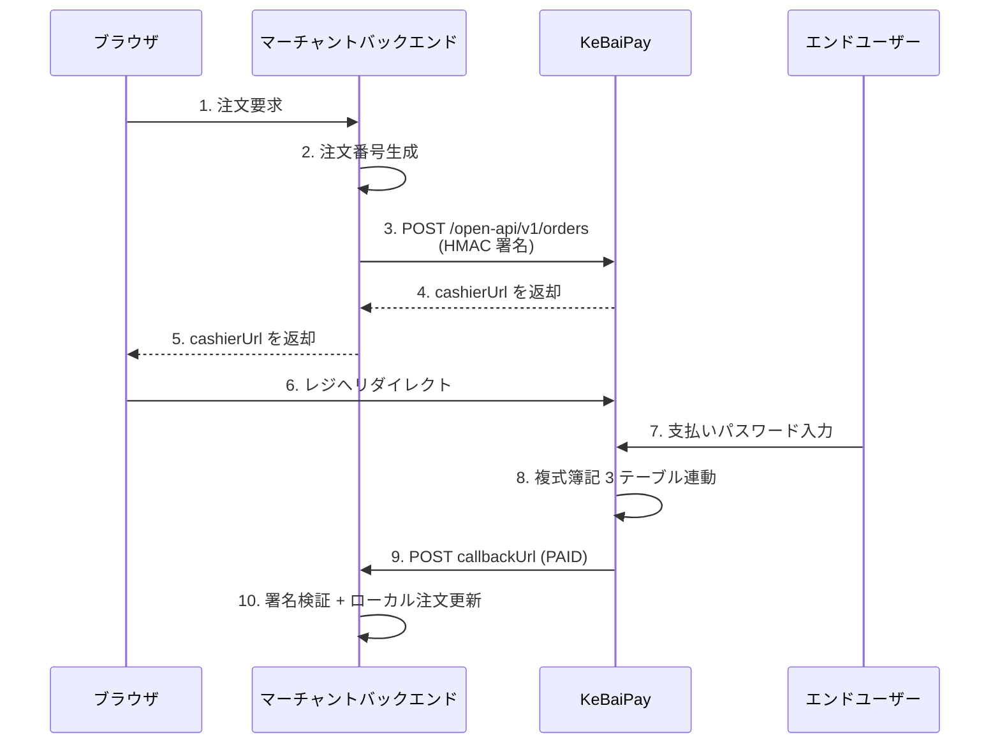
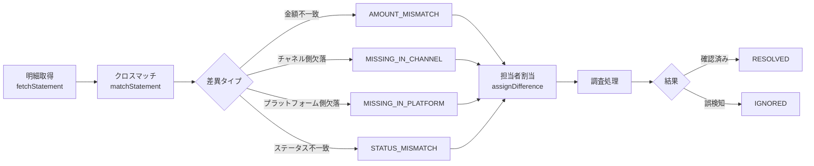

# KeBaiPay

[English](README.md) | [中文](README.zh.md) | [日本語](README.ja.md)

> オープンソース統合決済プラットフォーム — 個人ウォレット + マーチャント入金 + オープン API + マルチチャネル照合 + AI エージェント層

<div align="center">

<p>
  <a href="https://github.com/weed33834/KeBaiPay/actions"></a>
  
  
  
  
  
  
  
  
  
  
</p>

バージョン 2.1.0 · 214 API エンドポイント · 52 Prisma モデル · 1023 単体テスト + 39 E2E

デュアルプラットフォームミラー: [GitHub（国際）](https://github.com/weed33834/KeBaiPay) · [gitcode（中国国内）](https://gitcode.com/badhope/KeBaiPay)

[機能一覧](#機能一覧) · [クイックスタート](#クイックスタート) · [アーキテクチャ](#アーキテクチャ) · [API ドキュメント](docs/API_REFERENCE.md) · [デプロイガイド](docs/DEPLOYMENT.md)

</div>

---

## 概要

**KeBaiPay** は、中小マーチャントおよび個人ウォレット向けのオープンソース統合決済プラットフォームです。複式簿記モデル、Redis 分散ロックによる並行制御、Prisma トランザクションによる ACID 保証を実装し、リスク制御エンジン、照合エンジン、AI リスク監査、AI エージェント層を内蔵しています。セルフホストデプロイメントに対応し、マーチャントが資金データとシークレットを完全に管理できます。業務フローは WeChat Pay、Alipay、PayPal、Stripe、Ping++ などの主要決済プラットフォームを参考に設計されています。

### 対象ユーザー

- **中小マーチャント / スタートアップチーム**: SaaS ロックインを回避するため、完全にセルフホスト可能な決済プラットフォームを必要とする層
- **決済ドメイン学習者**: 複式簿記、分散ロック、チェーンハッシュ監査、AI エージェントなどのエンジニアリングプラクティスを学ぶ層
- **AI エージェント開発者**: MCP プロトコル経由で決済機能を統合し、ウォレットアシスタントや店舗マネージャーエージェントを構築する層
- **中国本土の開発者**: WeChat Pay / Alipay のフローとの比較、中国語ドキュメントと gitcode ミラーを利用する層

### 主な特徴

- **214 API エンドポイント**: ウォレット、マーチャント、オープン API、管理コンソール、AI エージェント層を網羅
- **52 Prisma データモデル**: 15 の業務ドメイン + 1 つの AI エージェントドメインにグループ化
- **4 種類の認証**: ユーザー JWT / 管理者 JWT / マーチャント HMAC / エージェント JWT（独立した `JWT_AGENT_SECRET`）
- **複式簿記 3 テーブル連動**（`AccountLedger` + `Bill` + `TransactionOrder`）による完全な資金トレーサビリティ
- **マルチチャネル照合集約（S5）**: Alipay / WeChat / 銀行明細のクロスマッチング、差異の自動分類
- **AI リスク監査（S3）**: ルール + AI デュアルエンジンによる管理者操作の監査、チェーンハッシュによる改ざん防止
- **AI エージェント層（v2.1.0）**: Vercel AI SDK v7 + MCP に基づき、C 側ウォレットアシスタント、B 側店舗アシスタント、A 側リスク監査官の 3 シナリオをサポート
- **Human-in-the-Loop による資金安全**: エージェントの資金操作は二次確認を要求（`PENDING_CONFIRM → ユーザー判断 → SUCCESS/REJECTED`）
- **MCP サーバー**: KeBaiPay の機能を外部 AI エージェント（Claude Desktop / Cursor / Trae）に公開
- **エスクロー取引（S2）**: 売買双方の仲介エスクロー、Alipay / WeChat のエスクローロジックに準拠
- **WeChat 倍平均値法レッドパケット（S1）**: グループレッドパケットのロジックが WeChat ネイティブ体験と一致
- **1023 単体テスト + 39 E2E テスト（Jest）+ 1789 行の Python E2E スクリプト**

### 技術スタック

| レイヤー | 選択 | 備考 |
|---|---|---|
| ランタイム | Node.js ≥ 20 | NestJS 11 + TypeScript 6 が要求 |
| フレームワーク | NestJS 11 | モジュール + DI + デコレータ |
| ORM | Prisma 7 | 型安全 + マイグレーション機構 |
| データベース | PostgreSQL 16/17 | プライマリストア、SQLite 非対応 |
| キャッシュ | Redis 7 | 分散ロック + スライディングウィンドウレート制限 + リプレイ保護 |
| 認証 | JWT + HMAC-SHA256 | ユーザー / 管理者 / エージェント JWT は独立シークレット、マーチャントオープン API は HMAC 署名 |
| 暗号化 | AES-256-GCM | 身分証、銀行カードなどの機密フィールド向け |
| リスク制御 | 自社ルールエンジン + AI 監査 | スライディングウィンドウ Lua + チェーンハッシュログ |
| AI エージェント | Vercel AI SDK v7 + MCP | v2.1.0 で追加: LLM 呼び出し + ツールループ + MCP サーバー |
| デプロイ | Docker Compose / ベアメタル | PM2 オプション、n8n + Botpress は独立編成 |
| 監視 | OpenTelemetry + Prometheus + Sentry | OTLP トレース + metrics エンドポイント |

---

## 機能一覧

### コンシューマー側（C 側）

| モジュール | 主な機能 | エンドポイント |
|---|---|---:|
| 認証 | 電話 / メール登録、ログイン、JWT 認証 | 2 |
| ユーザー | KYC、支払いパスワード、電話 / メール紐付け、パスワード変更 | 6 |
| アカウント | 残高照会、資金明細、方向別絞り込み | 1 |
| 取引 | チャージ、コールバック通知 | 1 |
| 送金 | ユーザー間送金、冪等キーによる重複防止 | 1 |
| 出金 | 出金申請、履歴照会 | 2 |
| レッドパケット | 送信 / 受領、送信済み / 受領済み一覧 | 4 |
| QR コード | 個人 / 固定金額集金コード、スキャン決済 | 3 |
| 明細 | 一覧照会、収支絞り込み | 1 |
| 銀行カード | 紐付け / 解除、デフォルトカード設定 | 4 |
| エスクロー | 注文作成、買い手支払い、売り手発送、受取確認、返金申請、紛争処理 | 6 |
| バッチ送金 | バッチ送信、明細照会、ステートマシン | 3 |
| サブスクリプション | 購読 / 解約、詳細照会、プラン一覧 | 3 |
| 分割 | 分割プラン作成、分割一覧照会 | 2 |
| クーポン | クーポン受領、自分のクーポン照会 | 2 |
| リファラル | 紹介コード取得、紹介履歴照会 | 2 |
| メッセージ | メッセージ一覧、未読数、既読マーク | 3 |
| 請求書 | 請求書発行申請、履歴照会 | 2 |

### マーチャント側（B 側）

| モジュール | 主な機能 | エンドポイント |
|---|---|---:|
| マーチャント管理 | オンボーディング、プロフィール更新、アプリ作成 / キーリセット、ダッシュボード、集金コード | 9 |
| レジ | 注文作成、照会、支払い、照合、CSV エクスポート、スキャン | 7 |
| オープン API | HMAC 署名: 注文作成、照会、返金、送金、残高照会 | 5 |

### 管理コンソール（A 側）

| モジュール | 主な機能 | エンドポイント |
|---|---|---:|
| 管理者認証 | ログイン、パスワード変更 | 2 |
| ダッシュボード | プラットフォーム概要 | 1 |
| ユーザー管理 | 一覧 / 詳細 / ステータス / リスクレベル | 4 |
| マーチャント管理 | 一覧 / 審査 / 設定 | 3 |
| KYC 審査 | 審査待ち一覧、承認 / 拒否 | 3 |
| 出金審査 | 一覧、承認 / 拒否 | 3 |
| 決済注文 | 一覧照会 | 1 |
| リスクイベント | 一覧、処理 | 2 |
| リスクルール | 一覧、更新 | 2 |
| リスクログ | ログインログ、監査ログ | 2 |
| 手動調整 | アカウント残高調整 | 1 |
| システム設定 | 取得 / 設定 | 2 |
| 決済チャネル | 作成 / 更新 / 削除 / テスト | 4 |
| 管理者管理 | 作成 / 更新 / 削除 / パスワードリセット | 4 |
| 財務統計 | 概要 / 集計 / 決済 / 手数料 / スナップショット / エクスポート | 14 |
| 照合 | 照合実行、レポート一覧 / エクスポート / 詳細 | 4 |
| マルチチャネル照合（S5） | 明細取得、クロスマッチ、差異処理ワークフロー | 9 |
| AI リスク監査（S3） | AI 監査イベント、リスク提案、手動レビュー | 5 |
| カスタムルール | リスクルールテンプレート CRUD | 5 |

### 共通

| モジュール | 主な機能 | エンドポイント |
|---|---|---:|
| ヘルスチェック | liveness / readiness / チャネル / スケジュール | 4 |
| メトリクス | Prometheus `/metrics` | 1 |
| SMS | 認証コード送信 | 1 |

### AI エージェント層（v2.1.0）

| モジュール | 主な機能 | エンドポイント |
|---|---|---:|
| エージェント認証 | 第 4 の認証 `AgentAuthGuard`（独立 `JWT_AGENT_SECRET`） | - |
| セッション管理 | セッション作成 / 照会 / 終了 | 4 |
| チャット | メッセージ送信 + LLM 呼び出し + ツールループ（コアエントリ） | 1 |
| 資金確認 | 保留操作の確認 / 拒否（Human-in-the-Loop） | 1 |
| 認可管理 | ユーザーによるエージェント認可、取り消し、認可一覧 | 3 |
| 監査検証 | エージェント操作のハッシュチェーン整合性チェック | 1 |
| C 側ウォレットアシスタント | `kbpay_query_balance` / `query_bill` / `send_message` / `claim_coupon` / `transfer`（確認必須） | 5 ツール |
| B 側店舗アシスタント | `kbpay_query_merchant_orders` / `query_merchant_balance` / `query_reconciliation_diff` | 3 ツール |
| A 側リスク監査官 | `kbpay_query_risk_events` / `query_health` / `query_reconciliation_diffs` | 3 ツール |
| MCP サーバー | KeBaiPay 機能を外部 AI エージェント（Claude Desktop / Cursor / Trae）に公開 | 5 ツール |
| AI 巡検スケジュール | システムヘルス / 照合差異 / リスクイベントの 3 つの `@Cron` タスク | - |

---

## クイックスタート

### 方法 A: Docker Compose（推奨）

```bash
# 1. リポジトリをクローン（いずれかを選択、中国本土からは gitcode が高速）
# GitHub（国際）:
git clone https://github.com/weed33834/KeBaiPay.git
# gitcode（中国）:
git clone https://gitcode.com/badhope/KeBaiPay.git
cd KeBaiPay

# 2. 環境変数を設定（6 つのシークレットを変更必須）
cp .env.example .env
# .env を編集し、すべての "change-...-in-production" を強力なシークレットに置換
# 最低限: POSTGRES_PASSWORD / JWT_USER_SECRET / JWT_ADMIN_SECRET /
#         ADMIN_DEFAULT_PASSWORD / ENCRYPTION_KEY / REDIS_PASSWORD

# 3. 起動（初回はイメージ取得とビルドで 3-5 分）
docker compose up -d --build

# 4. 管理者アカウントを初期化
docker compose exec app npx prisma db seed

# 5. 検証
curl http://localhost:3000/health/ready
# {"status":"ok",...} で成功
```

### 方法 B: ベアメタル

```bash
# 要件: Node.js >= 20 / PostgreSQL >= 16 / Redis >= 7
npm ci
cp .env.example .env
# .env を編集: DATABASE_URL を PG に、REDIS_URL を Redis に設定

npx prisma generate
npx prisma migrate deploy
npx prisma db seed
npm run build
NODE_ENV=production node dist/main.js
```

### 方法 C: ローカル開発

```bash
docker compose -f docker-compose.dev.yml up -d   # PG + Redis を起動
npm install
cp .env.example .env
npx prisma migrate dev
npm run start:dev    # ホットリロード
```

アクセス先:

- H5 ウォレット: `http://localhost:3000/`
- 管理者ログイン: `http://localhost:3000/#adminLogin`
- Swagger ドキュメント: `http://localhost:3000/api/docs`（非本番環境のみ）

---

## 初回利用チュートリアル

### 4.1 ユーザー登録と KYC

```bash
# 新規ユーザー登録
curl -X POST http://localhost:3000/auth/register \
  -H "Content-Type: application/json" \
  -d '{
    "nickname": "Zhang San",
    "phone": "13800138000",
    "password": "Password123"
  }'

# レスポンス: access_token を返却、フロントエンドは localStorage に保存
```

```bash
# KYC 提出（ログイン必須、<token> を上記の access_token に置換）
curl -X POST http://localhost:3000/users/verify-identity \
  -H "Authorization: Bearer <token>" \
  -H "Content-Type: application/json" \
  -d '{
    "realName": "Zhang San",
    "idCard": "110101199001011234"
  }'

# 管理者承認後に資金機能が利用可能
curl -X POST http://localhost:3000/admin/identity/<id>/approve \
  -H "Authorization: Bearer <admin_token>"
```

### 4.2 チャージと送金

```bash
# 100 元チャージ
curl -X POST http://localhost:3000/transactions/recharge \
  -H "Authorization: Bearer <token>" \
  -H "Content-Type: application/json" \
  -d '{
    "amount": 100.00,
    "payPassword": "pay_password_123",
    "idempotencyKey": "recharge_20260101_001"
  }'

# 他ユーザーへ送金
curl -X POST http://localhost:3000/transfers \
  -H "Authorization: Bearer <token>" \
  -H "Content-Type: application/json" \
  -d '{
    "toUserId": "target_user_uuid",
    "amount": 50.00,
    "payPassword": "pay_password_123",
    "remark": "dinner"
  }'
```

### 4.3 マーチャントオープン API 連携



署名アルゴリズム（HMAC-SHA256）:

```javascript
const crypto = require('crypto')

const signString = [
  method,           // 'POST'
  path,             // '/open-api/v1/orders'
  rawBody,          // JSON.stringify(requestBody)
  timestamp,        // Date.now() ミリ秒
  nonce,            // 一意のランダム文字列
  appId             // マーチャントアプリ ID
].join('\n')

const signature = crypto
  .createHmac('sha256', appSecret)
  .update(signString)
  .digest('hex')

// 必須ヘッダー:
// X-App-Id: <app_id>
// X-Timestamp: <timestamp>
// X-Nonce: <nonce>
// X-Signature: <signature>
```

### 4.4 管理者による照合と差異処理



---

## アーキテクチャ

### 5.1 全体アーキテクチャ

```
┌─────────────────────────────────────────────────────────────────────┐
│                         クライアント / ブラウザ                       │
│   H5 ウォレット │ マーチャントレジ │ 管理SPA │ マーチャントバックエンドSDK │
└───────────────────────────┬─────────────────────────────────────────┘
                            │ HTTPS
                            ▼
┌─────────────────────────────────────────────────────────────────────┐
│  Nginx リバースプロキシ (TLS 終端 / X-Forwarded-For)                │
└───────────────────────────┬─────────────────────────────────────────┘
                            ▼
┌─────────────────────────────────────────────────────────────────────┐
│                  NestJS アプリケーション (port 3000)                  │
│ ┌─────────────────────────────────────────────────────────────────┐ │
│ │  グローバルミドルウェア / ガード / インターセプタ / フィルタ       │ │
│ │  Helmet · Compression · ValidationPipe · AllExceptionsFilter    │ │
│ │  ResponseTransformInterceptor · ThrottlerGuard · RequestLog     │ │
│ └─────────────────────────────────────────────────────────────────┘ │
│ ┌───────────────────┐ ┌──────────────────┐ ┌────────────────────┐ │
│ │  コンシューマー(C) │ │  マーチャント(B)   │ │  管理者(A)          │ │
│ │  18 モジュール     │ │  3 モジュール     │ │  19 モジュール      │ │
│ │  JWT_USER_SECRET  │ │  HMAC 署名        │ │  JWT_ADMIN_SECRET  │ │
│ └───────────────────┘ └──────────────────┘ └────────────────────┘ │
│ ┌─────────────────────────────────────────────────────────────────┐ │
│ │  共通基盤レイヤー                                                 │ │
│ │  PrismaService · RedisService · CryptoService · AuditService   │ │
│ │  RiskEngineService · NotificationsService · SmsService          │ │
│ └─────────────────────────────────────────────────────────────────┘ │
└────────────┬───────────────────────────┬────────────────────────────┘
             ▼                           ▼
┌────────────────────────┐            ┌────────────────────────┐
│  PostgreSQL 16         │            │  Redis 7               │
│  ─ 52 データモデル       │            │  ─ 分散ロック            │
│  ─ 複式簿記連動          │            │  ─ スライディングウィンドウ │
│  ─ チェーンハッシュ監査   │            │  ─ nonce リプレイ保護     │
└────────────────────────┘            └────────────────────────┘
             ▲
             │
┌────────────────────────────────────────────────────────────────────┐
│  外部チャネル / サードパーティサービス                                │
│  WeChat Pay │ Alipay │ Ali/Tencent/Huawei SMS │ SMTP │ OTLP Collector │
└────────────────────────────────────────────────────────────────────┘
```

### 5.2 複式簿記モデル

```
ユーザーが資金操作を開始
       │
       ▼
┌──────────────────┐    ┌──────────────────┐    ┌──────────────────┐
│ TransactionOrder │───▶│   AccountLedger  │◀──▶│      Bill        │
│  (注文マスタ)      │    │   (アカウント明細) │    │   (ユーザー明細)   │
│                  │    │                  │    │                  │
│ - orderNo        │    │ - type           │    │ - type           │
│ - type (RECHARGE │    │ - direction      │    │ - direction      │
│   /TRANSFER/...) │    │ - amountBefore   │    │ - amountYuan     │
│ - amount         │    │ - amountAfter    │    │ - counterparty   │
│ - status         │    │ - refType        │    │ - remark         │
└──────────────────┘    │ - refId          │    └──────────────────┘
                        └──────────────────┘
       │
       ▼ すべての書き込みは $transaction に包む
       │
       ▼
   Redis 分散ロック
   redis.withLock(key, ttl, fn)
```

### 5.3 ステートマシン

#### 出金注文

```
PENDING ──admin approve──▶ APPROVED ──channel success──▶ SUCCESS
   │                          │
   │                          └──channel fail──▶ FAILED
   │
   └──admin reject──▶ REJECTED
```

#### レッドパケット

```
PENDING ──受領数>0──▶ PARTIALLY_RECEIVED ──全受領──▶ RECEIVED
   │                                                       ▲
   └──期限切れ未受領────────────────────────────────────────▶ EXPIRED
```

#### エスクロー取引

```
CREATED ──buyer pay──▶ PAID ──seller ship──▶ SHIPPED ──buyer confirm──▶ COMPLETED
                │                       │
                │                       ├─buyer refund──▶ REFUND_PENDING
                │                       │                  │
                │                       └─dispute──────────▶ DISPUTED
                │                                          │
                └──────────refund──▶ REFUNDED ◀────────────┘
```

#### マルチチャネル照合差異

```
PENDING ──assignDifference──▶ INVESTIGATING ──resolveDifference──▶ RESOLVED / IGNORED
```

---

## プロジェクト構成

```
kebaipay/
├── src/
│   ├── auth/                 ユーザー JWT 認証
│   ├── users/                ユーザー、KYC、支払いパスワード、電話 / メール紐付け
│   ├── accounts/             残高、資金明細（複式簿記）
│   ├── transactions/         チャージ、取引注文
│   ├── transfers/            ユーザー間送金（冪等キー）
│   ├── withdrawals/          出金（並行テスト含む）
│   ├── red-packets/          レッドパケット（倍平均値法）
│   ├── qr-codes/             集金コード（個人 / 固定）
│   ├── bills/                明細
│   ├── bank-cards/           銀行カード管理
│   ├── escrow/               エスクロー（S2）
│   ├── batch-transfers/      バッチ送金
│   ├── subscriptions/        サブスクリプション
│   ├── splits/               分割
│   ├── coupons/              クーポン
│   ├── referrals/            紹介キャッシュバック
│   ├── messages/             メッセージセンター
│   ├── invoices/             請求書
│   ├── merchants/            マーチャントオンボーディング、アプリ、設定
│   ├── cashier/              統合レジ
│   ├── open-api/             オープン API（HMAC 署名）
│   ├── admin/                管理コンソール（パーミッションガード付き）
│   ├── finance/              財務統計と照合
│   ├── channel-reconciliation/ マルチチャネル照合（S5）
│   ├── risk/                 リスクエンジン（スライディングウィンドウ）
│   ├── risk-audit/           AI リスク監査（S3）
│   ├── custom-rules/         カスタムルールテンプレート
│   ├── payment-channels/     WeChat / Alipay / Mock チャネル
│   ├── webhooks/             決済チャネルコールバック
│   ├── redis/                Redis ラッパー（分散ロック / スライディングウィンドウ）
│   ├── crypto/               AES-256-GCM 暗号化
│   ├── security/             起動時セキュリティ検証
│   ├── health/               ヘルスチェック（liveness / readiness / チャネル）
│   ├── metrics/              Prometheus /metrics
│   ├── notifications/        メール通知 + 決済スケジュール
│   ├── audit/                監査ログ（チェーンハッシュ）
│   ├── sms/                  SMS（Ali / Tencent / Huawei / mock）
│   ├── agent/                AI エージェント層（v2.1.0）
│   ├── prisma/               Prisma クライアント
│   ├── common/               ミドルウェア、インターセプタ、ユーティリティ
│   ├── app.module.ts         ルートモジュール
│   ├── main.ts               ブートストラップエントリ
│   └── tracing.ts            OpenTelemetry 設定
├── public/                  H5 ウォレット静的ページ（同一オリジン）
├── prisma/
│   ├── schema.prisma        52 データモデル
│   ├── migrations/           SQL マイグレーションファイル
│   └── seed.ts              管理者 + テストデータ初期化
├── test/                    E2E テスト
├── e2e_check.py             Python E2E 自動化スクリプト
├── docs/                    完全なドキュメント
├── docker-compose.yml       本番デプロイ
├── docker-compose.dev.yml   開発環境（PG + Redis）
├── Dockerfile               マルチステージビルド
├── .env.example             環境変数サンプル
├── package.json             依存関係とスクリプト
└── README.md                プロジェクト説明
```

---

## API 概要

完全なエンドポイント一覧は [docs/API_REFERENCE.md](docs/API_REFERENCE.md) を参照。

| エンドポイント | 説明 | 認証 |
|---|---|---|
| `POST /auth/register` | ユーザー登録 | なし |
| `POST /auth/login` | ユーザーログイン | なし |
| `GET /users/me` | 現在のユーザー情報 | ユーザー JWT |
| `POST /transactions/recharge` | チャージ | ユーザー JWT |
| `POST /transfers` | 送金 | ユーザー JWT |
| `POST /withdrawals` | 出金申請 | ユーザー JWT |
| `POST /red-packets` | レッドパケット送信 | ユーザー JWT |
| `POST /cashier/orders` | レジ注文作成 | ユーザー JWT |
| `POST /open-api/v1/orders` | マーチャント注文作成 | HMAC 署名 |
| `POST /admin/auth/login` | 管理者ログイン | なし |
| `GET /admin/dashboard` | 管理者概要 | 管理者 JWT + 権限 |
| `POST /admin/channel-reconciliation/statements/fetch` | チャネル明細取得 | 管理者 JWT + reconciliation 権限 |
| `POST /admin/risk-audit/events/:id/review` | AI リスク監査レビュー | 管理者 JWT + risk 権限 |
| `GET /metrics` | Prometheus メトリクス | なし |
| `GET /health` | liveness プローブ | なし |
| `GET /health/ready` | readiness プローブ | なし |

完全な 214 エンドポイント一覧は [docs/API_REFERENCE.md](docs/API_REFERENCE.md) を参照。

---

## ドキュメント

| ドキュメント | 内容 |
|---|---|
| [docs/QUICKSTART.md](docs/QUICKSTART.md) | 5 分マーチャントオンボーディング |
| [docs/API_REFERENCE.md](docs/API_REFERENCE.md) | 完全な API エンドポイントリファレンス |
| [docs/ADMIN_GUIDE.md](docs/ADMIN_GUIDE.md) | 管理コンソールマニュアル |
| [docs/MERCHANT_GUIDE.md](docs/MERCHANT_GUIDE.md) | マーチャントオンボーディングガイド |
| [docs/USER_GUIDE.md](docs/USER_GUIDE.md) | コンシューマー機能ガイド |
| [docs/DEVELOPER_GUIDE.md](docs/DEVELOPER_GUIDE.md) | 開発者ドキュメント（アーキテクチャ / 認証 / エラーコード） |
| [docs/SDK_GUIDE.md](docs/SDK_GUIDE.md) | オープン API SDK 利用方法 |
| [docs/DEPLOYMENT.md](docs/DEPLOYMENT.md) | 完全なデプロイドキュメント |
| [docs/TROUBLESHOOT.md](docs/TROUBLESHOOT.md) | トラブルシューティング |
| [docs/CHANGELOG.md](docs/CHANGELOG.md) | 変更履歴 |
| [docs/PROJECT_PLAN.md](docs/PROJECT_PLAN.md) | ロードマップと進捗 |
| [docs/sms-integration.md](docs/sms-integration.md) | SMS プロバイダ連携 |

---

## 環境変数

完全な説明は [.env.example](.env.example) を参照。**本番環境で必須** の項目を太字で表示:

| 変数 | 必須 | デフォルト | 説明 |
|---|:---:|---|---|
| `POSTGRES_PASSWORD` | **はい** | - | PostgreSQL パスワード |
| `JWT_USER_SECRET` | **はい** | - | ユーザー JWT シークレット（32+ 文字） |
| `JWT_ADMIN_SECRET` | **はい** | - | 管理者 JWT シークレット（上記と異なること） |
| `ADMIN_DEFAULT_PASSWORD` | **はい** | - | 初期管理者パスワード（8+ 文字） |
| `ENCRYPTION_KEY` | **はい** | - | AES 暗号化キー（32+ 文字） |
| `REDIS_PASSWORD` | **はい** | - | Redis パスワード |
| `JWT_AGENT_SECRET` | **はい** | - | エージェント JWT シークレット（上記と独立） |
| `DATABASE_URL` | ベアメタル | - | PostgreSQL 接続文字列 |
| `REDIS_URL` | 本番 | - | Redis 接続文字列 |
| `CORS_ORIGINS` | 本番 | localhost | CORS オリジン（カンマ区切り） |
| `RECHARGE_NOTIFY_URL` | いいえ | - | チャージコールバック URL（本番は https） |
| `CASHIER_BASE_URL` | いいえ | localhost:3000 | レジ外部 URL |
| `NODE_ENV` | いいえ | development | `production` でセキュリティチェック有効化 + Swagger 非表示 |
| `PORT` | いいえ | 3000 | リッスンポート |
| `SMS_PROVIDER` | いいえ | mock | aliyun / tencent / huawei / mock |
| `SMTP_HOST/PORT/USER/PASS/FROM` | いいえ | - | メール通知設定 |
| `LLM_PROVIDER` | いいえ | mock | mock / openai / deepseek / qwen / kimi / moonshot |
| `LLM_API_KEY` / `LLM_BASE_URL` / `LLM_MODEL` | いいえ | - | LLM サービス設定（OpenAI 互換） |
| `AGENT_MAX_AMOUNT_PER_OP` | いいえ | 50000 | エージェント単位上限（fen） |
| `AGENT_MAX_AMOUNT_PER_DAY` | いいえ | 200000 | エージェント日次上限（fen） |
| `OTEL_EXPORTER_OTLP_ENDPOINT` | いいえ | - | OpenTelemetry エクスポートエンドポイント |
| `SENTRY_DSN` | いいえ | - | Sentry アラート DSN |

---

## Nginx リバースプロキシ + HTTPS

本番環境では Nginx をフロントに置き TLS 終端させます:

```nginx
upstream kebaipay {
    server 127.0.0.1:3000;
    keepalive 64;
}

server {
    listen 80;
    server_name pay.yourdomain.com;
    return 301 https://$server_name$request_uri;
}

server {
    listen 443 ssl http2;
    server_name pay.yourdomain.com;

    ssl_certificate /etc/letsencrypt/live/pay.yourdomain.com/fullchain.pem;
    ssl_certificate_key /etc/letsencrypt/live/pay.yourdomain.com/privkey.pem;
    ssl_protocols TLSv1.2 TLSv1.3;

    add_header X-Frame-Options "SAMEORIGIN" always;
    add_header X-Content-Type-Options "nosniff" always;

    location / {
        proxy_pass http://kebaipay;
        proxy_http_version 1.1;
        proxy_set_header Host $host;
        proxy_set_header X-Real-IP $remote_addr;
        proxy_set_header X-Forwarded-For $proxy_add_x_forwarded_for;
        proxy_set_header X-Forwarded-Proto $scheme;
        proxy_read_timeout 300s;
    }

    location /health {
        proxy_pass http://kebaipay;
        access_log off;
    }
}
```

Let's Encrypt で無料証明書を取得:

```bash
apt install certbot python3-certbot-nginx
certbot --nginx -d pay.yourdomain.com
```

---

## 運用コマンドチートシート

### Docker Compose

```bash
docker compose ps                                    # コンテナ状態
docker compose logs -f app                           # ライブログ
docker compose restart app                           # アプリ再起動
docker compose down                                  # 全停止
docker compose pull && docker compose up -d --build # 更新 & 再デプロイ
docker compose exec app sh                           # コンテナにシェル接続
docker compose exec postgres psql -U postgres -d kebaipay   # DB 接続
```

### データベースのバックアップと復元

```bash
# バックアップ
docker compose exec -T postgres pg_dump -U postgres kebaipay > backup_$(date +%Y%m%d).sql

# 復元
cat backup_20260721.sql | docker compose exec -T postgres psql -U postgres -d kebaipay

# 日次 cron バックアップ (crontab -e)
0 3 * * * cd /opt/kebaipay && docker compose exec -T postgres pg_dump -U postgres kebaipay | gzip > /backups/kebaipay_$(date +\%Y\%m\%d).sql.gz
```

### ヘルスチェックエンドポイント

| エンドポイント | 説明 |
|---|---|
| `GET /health` | liveness プローブ |
| `GET /health/ready` | readiness プローブ（DB + Redis 接続性） |
| `GET /health/channels` | 決済チャネル状態 |
| `GET /health/channels/summary` | チャネルヘルスサマリー |
| `GET /health/schedules` | スケジュールタスク状態 |
| `GET /metrics` | Prometheus メトリクス |
| `GET /api/docs` | Swagger ドキュメント（非本番のみ） |

---

## テスト

```bash
npm run test           # 1023 単体テスト
npm run test:e2e       # E2E テスト
npm run test:cov       # カバレッジレポート
npm run lint           # TypeScript 型チェック
```

---

## 開発規約

- **金額単位**: DB では `fen` で保存、API では `yuan` で送信、DTO が自動変換
- **資金操作**: Prisma `$transaction` と Redis 分散ロックで必ずラップすること
- **DTO 検証**: `class-validator` + `whitelist: true` + `forbidNonWhitelisted: true`
- **機密データ**: 身分証と銀行カード番号は AES-256-GCM で保存時暗号化、SHA-256 ハッシュで一意制約
- **監査ログ**: すべての管理者操作は `AuditLog` に記録、機密操作は `AdminOperationLog`（チェーンハッシュ改ざん防止）
- **冪等性**: すべての資金エンドポイントは `idempotencyKey` を受け付け、`@unique` インデックスで重複を防止
- **エラーコード**: KB001-KB999、セグメント管理 — [docs/API_REFERENCE.md](docs/API_REFERENCE.md) 参照
- **レート制限**: Throttler グローバル 100/min、ログイン / 登録 10/min、オープン API 30/min
- **テスト**: 各 service に `.spec.ts`、各 controller に `.controller.spec.ts` を必須

---

## よくあるデプロイエラー

完全版は [docs/TROUBLESHOOT.md](docs/TROUBLESHOOT.md) を参照。

| 症状 | 原因 | 解決策 |
|---|---|---|
| SecurityValidator が起動を拒否 | 6 つのシークレットがデフォルトのまま | `.env` の 6 つの必須項目を変更 |
| `CORS_ORIGINS is not configured` | 本番で CORS 未設定 | `.env` を `https://your-domain.com` に設定 |
| Prisma が DB に接続できない | PG コンテナ停止 / パスワード不一致 | `docker compose ps postgres` |
| ポート 3000 が使用中 | 他プロセスが占有 | `docker-compose.yml` のポートマッピングを変更 |
| 管理者ログインパスワード不一致 | パスワード変更後に seed 未実行 | `AdminUser` テーブル削除後に `prisma db seed` |
| ユーザーログイン 429 | ブルートフォースロックアウト | 15 分で自動解除、または Redis カウンタをクリア |
| `Failed to acquire lock` | Redis ロック未解放 | 数秒後にリトライ、または `docker compose restart redis` |
| Swagger ドキュメントが開かない | 本番で非表示 | `NODE_ENV=development` にして再起動 |

---

## セキュリティ上の注意

1. **6 つのシークレットを必ず変更**: 本番起動は `SecurityValidatorService` で厳格チェック、デフォルト値は拒否されます
2. **Redis は必須**: 分散ロック、スライディングウィンドウレート制限、リプレイ保護はすべて Redis に依存
3. **本番は HTTPS**: `RECHARGE_NOTIFY_URL` は https 必須、さもなく WeChat / Alipay コールバックが失敗
4. **Mock チャネル無効**: `SecurityValidator` は本番で mock チャネルの有効化を拒否
5. **`.env` はコミットしない**: `.gitignore` で除外済み、デプロイ時にサーバー上で作成
6. **初回デプロイ後に seed 必須**: `npx prisma db seed` で管理者アカウント作成
7. **Swagger は非本番のみ**: `NODE_ENV=production` で `/api/docs` を自動非表示
8. **リクエストボディサイズ制限**: 1MB、DoS 対策

---

## ライセンス

MIT License — [LICENSE](./LICENSE) を参照

Copyright (c) 2026 KeBaiPay Contributors

## コントリビューター

本プロジェクトは以下の人々によって保守されており、コードは GitHub と gitcode の両プラットフォームでミラーされています:

| プラットフォーム | 役割 | 主な貢献 |
|---|---|---|
| [@weed33834](https://github.com/weed33834)（GitHub）・[@badhope](https://gitcode.com/badhope)（gitcode） | リード / アーキテクト | 全体アーキテクチャ、資金安全、API 契約、リスクエンジン、AI エージェント設計 |
| [@KEBAI-CN](https://github.com/KEBAI-CN) | 共同開発者 | 機能開発、テストケース、ドキュメント、フロントエンド、LLM 統合 |

[CONTRIBUTING.md](./CONTRIBUTING.md) と [docs/TEAM.md](docs/TEAM.md) を参照。

## サポート

- API ドキュメント（開発環境）: http://your-server:3000/api/docs
- 完全なドキュメント: [docs/](docs/) ディレクトリ
- トラブルシューティング: [docs/TROUBLESHOOT.md](docs/TROUBLESHOOT.md)
