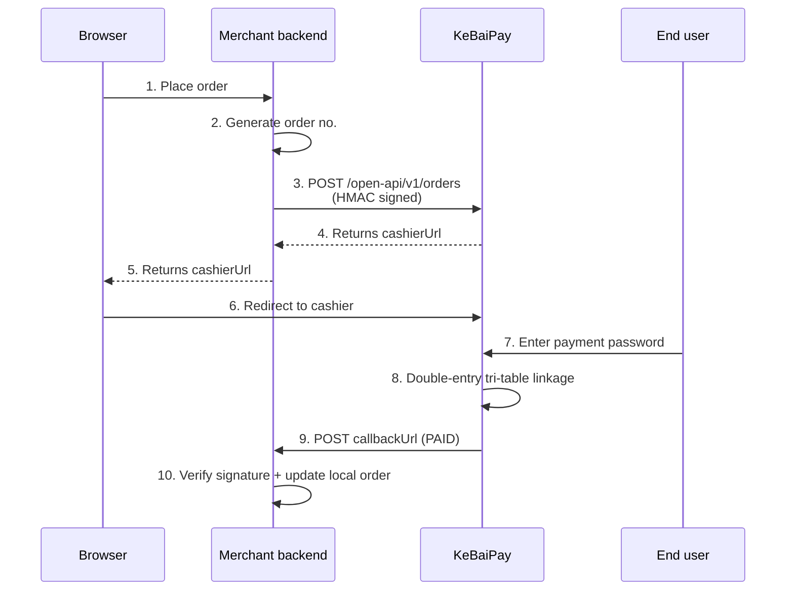
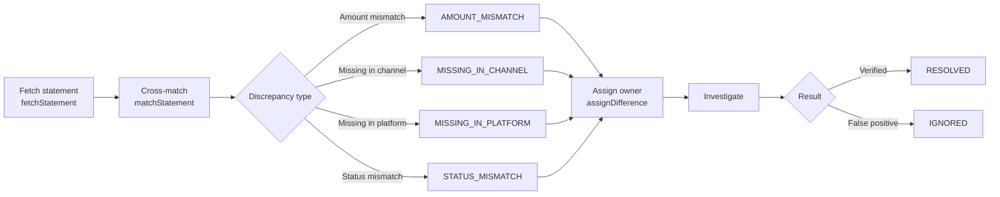

# KeBaiPay

[English](README.md) | [中文](README.zh.md) | [日本語](README.ja.md)

> Open-source unified payment platform — personal wallet + merchant collection + open API + multi-channel reconciliation + AI agent layer

<div align="center">

<p>
  <a href="https://github.com/weed33834/KeBaiPay/actions"></a>
  
  
  
  
  
  
  
  
  
  
</p>

Version 2.1.0 · 214 API endpoints · 52 Prisma models · 1023 unit tests + 39 E2E

Mirrored on two platforms: [GitHub (international)](https://github.com/weed33834/KeBaiPay) · [gitcode (China)](https://gitcode.com/badhope/KeBaiPay)

[Feature matrix](#feature-matrix) · [Quick start](#quick-start) · [Architecture](#architecture) · [API docs](docs/API_REFERENCE.md) · [Deployment](docs/DEPLOYMENT.md)

</div>

---

## Overview

**KeBaiPay** is an open-source unified payment platform designed for small and mid-sized merchants and personal wallet scenarios. The system implements a double-entry bookkeeping model, Redis distributed locks for concurrency control, and Prisma transactions for ACID guarantees, with a built-in risk-control engine, reconciliation engine, AI risk audit, and an AI agent layer. It supports self-hosted deployment, letting merchants retain full control over funds data and secrets. The business flows are modeled after mainstream payment platforms such as WeChat Pay, Alipay, PayPal, Stripe, and Ping++.

### Target audience

- **Small and mid-sized merchants / startup teams** needing a complete, self-hostable payment platform to avoid SaaS lock-in
- **Payment domain learners** studying engineering practices such as double-entry bookkeeping, distributed locks, chained-hash audit, and AI agents
- **AI agent developers** integrating payment capabilities over the MCP protocol to build wallet assistants or store-manager agents
- **Developers in mainland China** comparing against WeChat Pay / Alipay flows, with Chinese docs and a gitcode mirror

### Key features

- **214 API endpoints** covering wallets, merchants, open API, admin console, and the AI agent layer
- **52 Prisma data models**, grouped into 15 business domains plus 1 AI agent domain
- **4 authentication schemes**: user JWT / admin JWT / merchant HMAC / agent JWT (with a separate `JWT_AGENT_SECRET`)
- **Double-entry bookkeeping tri-table linkage** (`AccountLedger` + `Bill` + `TransactionOrder`) for full fund traceability
- **Multi-channel reconciliation aggregation (S5)**: cross-matching Alipay / WeChat / bank statements with automatic discrepancy classification
- **AI risk audit (S3)**: rule + AI dual-engine auditing of admin operations, with chained-hash tamper protection
- **AI agent layer (v2.1.0)**: built on Vercel AI SDK v7 + MCP, supporting three scenarios — C-side wallet assistant, B-side store-manager assistant, and A-side risk auditor
- **Human-in-the-loop fund safety**: agent fund operations require a second confirmation (`PENDING_CONFIRM → user decision → SUCCESS/REJECTED`)
- **MCP server**: exposes KeBaiPay capabilities to external AI agents (Claude Desktop / Cursor / Trae)
- **Escrow transactions (S2)**: buyer-seller intermediary escrow, aligned with Alipay / WeChat escrow logic
- **WeChat red-packet double-mean algorithm (S1)**: group red-packet logic identical to the native WeChat experience
- **1023 unit tests + 39 E2E tests (Jest) + 1789-line Python E2E script**

### Tech stack

| Layer | Choice | Notes |
|---|---|---|
| Runtime | Node.js ≥ 20 | Required by NestJS 11 + TypeScript 6 |
| Framework | NestJS 11 | Modules + DI + decorators |
| ORM | Prisma 7 | Type-safe + migration mechanism |
| Database | PostgreSQL 16/17 | Primary store; SQLite not supported |
| Cache | Redis 7 | Distributed lock + sliding-window rate limit + replay protection |
| Auth | JWT + HMAC-SHA256 | Separate JWT secrets for users/admins/agents; merchant open API uses HMAC signing |
| Encryption | AES-256-GCM | For ID cards, bank cards, and other sensitive fields |
| Risk control | In-house rule engine + AI audit | Sliding-window Lua + chained-hash logs |
| AI agent | Vercel AI SDK v7 + MCP | Added in v2.1.0: LLM calls + tool loop + MCP server |
| Deployment | Docker Compose / bare metal | PM2 optional; n8n + Botpress orchestration separate |
| Observability | OpenTelemetry + Prometheus + Sentry | OTLP trace + metrics endpoint |

---

## Feature matrix

### Consumer side (C-side)

| Module | Capabilities | Endpoints |
|---|---|---:|
| Auth | Phone/email registration, login, JWT auth | 2 |
| Users | KYC, payment password, bind phone/email, change password | 6 |
| Accounts | Balance query, fund flows, filter by direction | 1 |
| Transactions | Top-up, callback notification | 1 |
| Transfers | User-to-user transfers, idempotency-key dedup | 1 |
| Withdrawals | Submit withdrawal, query history | 2 |
| Red packets | Send/claim, sent/received lists | 4 |
| QR codes | Personal / fixed-amount collection codes, scan-to-pay | 3 |
| Bills | List query, income/expense filter | 1 |
| Bank cards | Bind/unbind, set default card | 4 |
| Escrow | Create order, buyer pay, seller ship, confirm receipt, refund request, dispute | 6 |
| Batch transfers | Batch submit, detail query, state machine | 3 |
| Subscriptions | Subscribe/cancel, view detail, list plans | 3 |
| Splits | Create split plan, query split list | 2 |
| Coupons | Claim coupon, view my coupons | 2 |
| Referrals | Get referral code, query referral history | 2 |
| Messages | Message list, unread count, mark read | 3 |
| Invoices | Apply for invoice, query history | 2 |

### Merchant side (B-side)

| Module | Capabilities | Endpoints |
|---|---|---:|
| Merchant management | Onboarding, profile update, app create / key reset, dashboard, collection codes | 9 |
| Cashier | Create order, query, pay, reconcile, export CSV, scan | 7 |
| Open API | HMAC-signed: create order, query, refund, transfer, query balance | 5 |

### Admin console (A-side)

| Module | Capabilities | Endpoints |
|---|---|---:|
| Admin auth | Login, change password | 2 |
| Dashboard | Platform overview | 1 |
| User management | List/detail/status/risk level | 4 |
| Merchant management | List/audit/config | 3 |
| KYC review | Pending list, approve/reject | 3 |
| Withdrawal review | List, approve/reject | 3 |
| Payment orders | List query | 1 |
| Risk events | List, handle | 2 |
| Risk rules | List, update | 2 |
| Risk logs | Login logs, audit logs | 2 |
| Manual adjustment | Account balance adjustment | 1 |
| System config | Get/set | 2 |
| Payment channels | Create/update/delete/test | 4 |
| Admin management | Create/update/delete/reset password | 4 |
| Finance stats | Overview/summary/settlement/fees/snapshot/export | 14 |
| Reconciliation | Run reconciliation, report list/export/detail | 4 |
| Multi-channel reconciliation (S5) | Fetch statements, cross-match, discrepancy workflow | 9 |
| AI risk audit (S3) | AI audit events, risk suggestions, manual review | 5 |
| Custom rules | Risk rule template CRUD | 5 |

### Cross-side common

| Module | Capabilities | Endpoints |
|---|---|---:|
| Health check | Liveness / readiness / channels / schedules | 4 |
| Metrics | Prometheus `/metrics` | 1 |
| SMS | Send verification code | 1 |

### AI agent layer (v2.1.0)

| Module | Capabilities | Endpoints |
|---|---|---:|
| Agent auth | 4th auth scheme `AgentAuthGuard` (separate `JWT_AGENT_SECRET`) | - |
| Session management | Create/query/close sessions | 4 |
| Chat | Send message + LLM call + tool loop (core entry) | 1 |
| Fund confirmation | Confirm/reject pending operations (Human-in-the-Loop) | 1 |
| Authorization | User authorizes agent, revoke, list authorizations | 3 |
| Audit verification | Agent operation hash-chain integrity check | 1 |
| C-side wallet assistant | `kbpay_query_balance` / `query_bill` / `send_message` / `claim_coupon` / `transfer` (confirm required) | 5 tools |
| B-side store assistant | `kbpay_query_merchant_orders` / `query_merchant_balance` / `query_reconciliation_diff` | 3 tools |
| A-side risk auditor | `kbpay_query_risk_events` / `query_health` / `query_reconciliation_diffs` | 3 tools |
| MCP server | Exposes KeBaiPay capabilities to external AI agents (Claude Desktop / Cursor / Trae) | 5 tools |
| AI inspection schedule | 3 `@Cron` jobs for system health / reconciliation diffs / risk events | - |

---

## Quick start

### Option A: Docker Compose (recommended)

```bash
# 1. Clone the repository (choose one; gitcode is faster from mainland China)
# GitHub (international):
git clone https://github.com/weed33834/KeBaiPay.git
# gitcode (China):
git clone https://gitcode.com/badhope/KeBaiPay.git
cd KeBaiPay

# 2. Configure environment variables (6 secrets must be changed)
cp .env.example .env
# Edit .env, replace all "change-...-in-production" placeholders with strong secrets
# At minimum: POSTGRES_PASSWORD / JWT_USER_SECRET / JWT_ADMIN_SECRET /
#             ADMIN_DEFAULT_PASSWORD / ENCRYPTION_KEY / REDIS_PASSWORD

# 3. Start (first run takes ~3-5 min to pull images and build)
docker compose up -d --build

# 4. Initialize the admin account
docker compose exec app npx prisma db seed

# 5. Verify
curl http://localhost:3000/health/ready
# {"status":"ok",...} means success
```

### Option B: Bare metal

```bash
# Requirements: Node.js >= 20 / PostgreSQL >= 16 / Redis >= 7
npm ci
cp .env.example .env
# Edit .env: DATABASE_URL points to your PG, REDIS_URL to your Redis

npx prisma generate
npx prisma migrate deploy
npx prisma db seed
npm run build
NODE_ENV=production node dist/main.js
```

### Option C: Local development

```bash
docker compose -f docker-compose.dev.yml up -d   # start PG + Redis
npm install
cp .env.example .env
npx prisma migrate dev
npm run start:dev    # hot reload
```

Entry points:

- H5 wallet: `http://localhost:3000/`
- Admin login: `http://localhost:3000/#adminLogin`
- Swagger docs: `http://localhost:3000/api/docs` (non-production only)

---

## First-use tutorial

### 4.1 User registration and KYC

```bash
# Register a new user
curl -X POST http://localhost:3000/auth/register \
  -H "Content-Type: application/json" \
  -d '{
    "nickname": "Zhang San",
    "phone": "13800138000",
    "password": "Password123"
  }'

# Response: returns access_token; the front end stores it in localStorage
```

```bash
# Submit KYC (login required; replace <token> with the access_token above)
curl -X POST http://localhost:3000/users/verify-identity \
  -H "Authorization: Bearer <token>" \
  -H "Content-Type: application/json" \
  -d '{
    "realName": "Zhang San",
    "idCard": "110101199001011234"
  }'

# Fund features become available after admin approval
curl -X POST http://localhost:3000/admin/identity/<id>/approve \
  -H "Authorization: Bearer <admin_token>"
```

### 4.2 Top-up and transfer

```bash
# Top up 100 yuan
curl -X POST http://localhost:3000/transactions/recharge \
  -H "Authorization: Bearer <token>" \
  -H "Content-Type: application/json" \
  -d '{
    "amount": 100.00,
    "payPassword": "pay_password_123",
    "idempotencyKey": "recharge_20260101_001"
  }'

# Transfer to another user
curl -X POST http://localhost:3000/transfers \
  -H "Authorization: Bearer <token>" \
  -H "Content-Type: application/json" \
  -d '{
    "toUserId": "target_user_uuid",
    "amount": 50.00,
    "payPassword": "pay_password_123",
    "remark": "dinner"
  }'
```

### 4.3 Merchant open-API integration



Signing algorithm (HMAC-SHA256):

```javascript
const crypto = require('crypto')

const signString = [
  method,           // 'POST'
  path,             // '/open-api/v1/orders'
  rawBody,          // JSON.stringify(requestBody)
  timestamp,        // Date.now() in ms
  nonce,            // unique random string
  appId             // merchant app ID
].join('\n')

const signature = crypto
  .createHmac('sha256', appSecret)
  .update(signString)
  .digest('hex')

// Required headers:
// X-App-Id: <app_id>
// X-Timestamp: <timestamp>
// X-Nonce: <nonce>
// X-Signature: <signature>
```

### 4.4 Admin reconciliation and discrepancy handling



---

## Architecture

### 5.1 Overall architecture

```
┌─────────────────────────────────────────────────────────────────────┐
│                         Client / Browser                            │
│   H5 wallet │ Merchant cashier │ Admin SPA │ Merchant backend SDK   │
└───────────────────────────┬─────────────────────────────────────────┘
                            │ HTTPS
                            ▼
┌─────────────────────────────────────────────────────────────────────┐
│  Nginx reverse proxy (TLS termination / X-Forwarded-For)            │
└───────────────────────────┬─────────────────────────────────────────┘
                            ▼
┌─────────────────────────────────────────────────────────────────────┐
│                  NestJS application (port 3000)                    │
│ ┌─────────────────────────────────────────────────────────────────┐ │
│ │  Global middleware / guards / interceptors / filters            │ │
│ │  Helmet · Compression · ValidationPipe · AllExceptionsFilter    │ │
│ │  ResponseTransformInterceptor · ThrottlerGuard · RequestLog     │ │
│ └─────────────────────────────────────────────────────────────────┘ │
│ ┌───────────────────┐ ┌──────────────────┐ ┌────────────────────┐ │
│ │  Consumer (C)     │ │  Merchant (B)    │ │  Admin (A)          │ │
│ │  18 modules       │ │  3 modules       │ │  19 modules         │ │
│ │  JWT_USER_SECRET  │ │  HMAC signing    │ │  JWT_ADMIN_SECRET   │ │
│ └───────────────────┘ └──────────────────┘ └────────────────────┘ │
│ ┌─────────────────────────────────────────────────────────────────┐ │
│ │  Shared base layer                                              │ │
│ │  PrismaService · RedisService · CryptoService · AuditService   │ │
│ │  RiskEngineService · NotificationsService · SmsService          │ │
│ └─────────────────────────────────────────────────────────────────┘ │
└────────────┬───────────────────────────┬────────────────────────────┘
             ▼                           ▼
┌────────────────────────┐            ┌────────────────────────┐
│  PostgreSQL 16         │            │  Redis 7               │
│  ─ 52 data models       │            │  ─ distributed lock     │
│  ─ double-entry linkage │            │  ─ sliding-window rate │
│  ─ chained-hash audit   │            │  ─ nonce replay guard  │
└────────────────────────┘            └────────────────────────┘
             ▲
             │
┌────────────────────────────────────────────────────────────────────┐
│  External channels / third-party services                          │
│  WeChat Pay │ Alipay │ Ali/Tencent/Huawei SMS │ SMTP │ OTLP Collector │
└────────────────────────────────────────────────────────────────────┘
```

### 5.2 Double-entry bookkeeping model

```
User initiates fund operation
       │
       ▼
┌──────────────────┐    ┌──────────────────┐    ┌──────────────────┐
│ TransactionOrder │───▶│   AccountLedger  │◀──▶│      Bill        │
│  (order master)   │    │   (account flow) │    │   (user bill)    │
│                  │    │                  │    │                  │
│ - orderNo        │    │ - type           │    │ - type           │
│ - type (RECHARGE │    │ - direction      │    │ - direction      │
│   /TRANSFER/...) │    │ - amountBefore   │    │ - amountYuan     │
│ - amount         │    │ - amountAfter    │    │ - counterparty   │
│ - status         │    │ - refType        │    │ - remark         │
└──────────────────┘    │ - refId          │    └──────────────────┘
                        └──────────────────┘
       │
       ▼ all writes wrapped in $transaction
       │
       ▼
   Redis distributed lock
   redis.withLock(key, ttl, fn)
```

### 5.3 State machines

#### Withdrawal order

```
PENDING ──admin approve──▶ APPROVED ──channel success──▶ SUCCESS
   │                          │
   │                          └──channel fail──▶ FAILED
   │
   └──admin reject──▶ REJECTED
```

#### Red packet

```
PENDING ──claims>0──▶ PARTIALLY_RECEIVED ──all claimed──▶ RECEIVED
   │                                                       ▲
   └──expired, not all claimed────────────────────────────▶ EXPIRED
```

#### Escrow transaction

```
CREATED ──buyer pay──▶ PAID ──seller ship──▶ SHIPPED ──buyer confirm──▶ COMPLETED
                │                       │
                │                       ├─buyer refund──▶ REFUND_PENDING
                │                       │                  │
                │                       └─dispute──────────▶ DISPUTED
                │                                          │
                └──────────refund──▶ REFUNDED ◀────────────┘
```

#### Multi-channel reconciliation discrepancy

```
PENDING ──assignDifference──▶ INVESTIGATING ──resolveDifference──▶ RESOLVED / IGNORED
```

---

## Project structure

```
kebaipay/
├── src/
│   ├── auth/                 user JWT auth
│   ├── users/                user, KYC, payment password, bind phone/email
│   ├── accounts/             balance, fund flows (double-entry)
│   ├── transactions/         top-up, transaction orders
│   ├── transfers/            user-to-user transfers (idempotency key)
│   ├── withdrawals/          withdrawals (incl. concurrency tests)
│   ├── red-packets/          red packets (double-mean algorithm)
│   ├── qr-codes/             collection codes (personal/fixed)
│   ├── bills/                 bills
│   ├── bank-cards/            bank card management
│   ├── escrow/                escrow (S2)
│   ├── batch-transfers/       batch transfers
│   ├── subscriptions/         subscriptions
│   ├── splits/                splits
│   ├── coupons/               coupons
│   ├── referrals/             referral cashback
│   ├── messages/              message center
│   ├── invoices/              invoices
│   ├── merchants/             merchant onboarding, apps, config
│   ├── cashier/               unified cashier
│   ├── open-api/              open API (HMAC signing)
│   ├── admin/                 admin console (with permission guards)
│   ├── finance/               finance stats and reconciliation
│   ├── channel-reconciliation/ multi-channel reconciliation (S5)
│   ├── risk/                  risk engine (sliding window)
│   ├── risk-audit/            AI risk audit (S3)
│   ├── custom-rules/          custom rule templates
│   ├── payment-channels/       WeChat/Alipay/Mock channels
│   ├── webhooks/              payment channel callbacks
│   ├── redis/                 Redis wrapper (distributed lock / sliding window)
│   ├── crypto/                AES-256-GCM encryption
│   ├── security/              startup security validation
│   ├── health/                health checks (liveness/readiness/channels)
│   ├── metrics/               Prometheus /metrics
│   ├── notifications/         email notifications + settlement schedule
│   ├── audit/                 audit logs (chained hash)
│   ├── sms/                   SMS (Ali/Tencent/Huawei/mock)
│   ├── agent/                 AI agent layer (v2.1.0)
│   ├── prisma/                Prisma client
│   ├── common/                middleware, interceptors, utilities
│   ├── app.module.ts          root module
│   ├── main.ts                bootstrap entry
│   └── tracing.ts             OpenTelemetry setup
├── public/                    H5 wallet static pages (same-origin)
├── prisma/
│   ├── schema.prisma          52 data models
│   ├── migrations/            SQL migration files
│   └── seed.ts                init admin + test data
├── test/                      E2E tests
├── e2e_check.py               Python E2E automation script
├── docs/                      full documentation
├── docker-compose.yml         production deployment
├── docker-compose.dev.yml     dev environment (PG + Redis)
├── Dockerfile                 multi-stage build
├── .env.example               environment variable sample
├── package.json               dependencies and scripts
└── README.md                  this file
```

---

## API overview

The full endpoint list is in [docs/API_REFERENCE.md](docs/API_REFERENCE.md).

| Endpoint | Description | Auth |
|---|---|---|
| `POST /auth/register` | User registration | none |
| `POST /auth/login` | User login | none |
| `GET /users/me` | Current user info | user JWT |
| `POST /transactions/recharge` | Top up | user JWT |
| `POST /transfers` | Transfer | user JWT |
| `POST /withdrawals` | Submit withdrawal | user JWT |
| `POST /red-packets` | Send red packet | user JWT |
| `POST /cashier/orders` | Create cashier order | user JWT |
| `POST /open-api/v1/orders` | Merchant create order | HMAC signing |
| `POST /admin/auth/login` | Admin login | none |
| `GET /admin/dashboard` | Admin overview | admin JWT + permission |
| `POST /admin/channel-reconciliation/statements/fetch` | Fetch channel statement | admin JWT + reconciliation permission |
| `POST /admin/risk-audit/events/:id/review` | AI risk audit review | admin JWT + risk permission |
| `GET /metrics` | Prometheus metrics | none |
| `GET /health` | Liveness probe | none |
| `GET /health/ready` | Readiness probe | none |

The full 214-endpoint list is in [docs/API_REFERENCE.md](docs/API_REFERENCE.md).

---

## Documentation

| Document | Contents |
|---|---|
| [docs/QUICKSTART.md](docs/QUICKSTART.md) | 5-minute merchant onboarding |
| [docs/API_REFERENCE.md](docs/API_REFERENCE.md) | Full API endpoint reference |
| [docs/ADMIN_GUIDE.md](docs/ADMIN_GUIDE.md) | Admin console manual |
| [docs/MERCHANT_GUIDE.md](docs/MERCHANT_GUIDE.md) | Merchant onboarding guide |
| [docs/USER_GUIDE.md](docs/USER_GUIDE.md) | Consumer feature guide |
| [docs/DEVELOPER_GUIDE.md](docs/DEVELOPER_GUIDE.md) | Developer docs (architecture/auth/error codes) |
| [docs/SDK_GUIDE.md](docs/SDK_GUIDE.md) | Open API SDK usage |
| [docs/DEPLOYMENT.md](docs/DEPLOYMENT.md) | Full deployment docs |
| [docs/TROUBLESHOOT.md](docs/TROUBLESHOOT.md) | Troubleshooting |
| [docs/CHANGELOG.md](docs/CHANGELOG.md) | Changelog |
| [docs/PROJECT_PLAN.md](docs/PROJECT_PLAN.md) | Roadmap and progress |
| [docs/sms-integration.md](docs/sms-integration.md) | SMS provider integration |

---

## Environment variables

Full reference in [.env.example](.env.example). **Required in production** are bold:

| Variable | Required | Default | Description |
|---|:---:|---|---|
| `POSTGRES_PASSWORD` | **yes** | - | PostgreSQL password |
| `JWT_USER_SECRET` | **yes** | - | User JWT secret (32+ chars) |
| `JWT_ADMIN_SECRET` | **yes** | - | Admin JWT secret (must differ from above) |
| `ADMIN_DEFAULT_PASSWORD` | **yes** | - | Initial admin password (8+ chars) |
| `ENCRYPTION_KEY` | **yes** | - | AES encryption key (32+ chars) |
| `REDIS_PASSWORD` | **yes** | - | Redis password |
| `JWT_AGENT_SECRET` | **yes** | - | Agent JWT secret (separate from above) |
| `DATABASE_URL` | bare metal | - | PostgreSQL connection string |
| `REDIS_URL` | production | - | Redis connection string |
| `CORS_ORIGINS` | production | localhost | CORS origins (comma-separated) |
| `RECHARGE_NOTIFY_URL` | no | - | Top-up callback URL (https in production) |
| `CASHIER_BASE_URL` | no | localhost:3000 | Cashier external URL |
| `NODE_ENV` | no | development | `production` enables security checks + hides Swagger |
| `PORT` | no | 3000 | Listening port |
| `SMS_PROVIDER` | no | mock | aliyun / tencent / huawei / mock |
| `SMTP_HOST/PORT/USER/PASS/FROM` | no | - | Email notification config |
| `LLM_PROVIDER` | no | mock | mock / openai / deepseek / qwen / kimi / moonshot |
| `LLM_API_KEY` / `LLM_BASE_URL` / `LLM_MODEL` | no | - | LLM service config (OpenAI-compatible) |
| `AGENT_MAX_AMOUNT_PER_OP` | no | 50000 | Per-op agent limit (fen) |
| `AGENT_MAX_AMOUNT_PER_DAY` | no | 200000 | Per-day agent limit (fen) |
| `OTEL_EXPORTER_OTLP_ENDPOINT` | no | - | OpenTelemetry exporter endpoint |
| `SENTRY_DSN` | no | - | Sentry alert DSN |

---

## Nginx reverse proxy + HTTPS

In production, put Nginx in front for TLS termination:

```nginx
upstream kebaipay {
    server 127.0.0.1:3000;
    keepalive 64;
}

server {
    listen 80;
    server_name pay.yourdomain.com;
    return 301 https://$server_name$request_uri;
}

server {
    listen 443 ssl http2;
    server_name pay.yourdomain.com;

    ssl_certificate /etc/letsencrypt/live/pay.yourdomain.com/fullchain.pem;
    ssl_certificate_key /etc/letsencrypt/live/pay.yourdomain.com/privkey.pem;
    ssl_protocols TLSv1.2 TLSv1.3;

    add_header X-Frame-Options "SAMEORIGIN" always;
    add_header X-Content-Type-Options "nosniff" always;

    location / {
        proxy_pass http://kebaipay;
        proxy_http_version 1.1;
        proxy_set_header Host $host;
        proxy_set_header X-Real-IP $remote_addr;
        proxy_set_header X-Forwarded-For $proxy_add_x_forwarded_for;
        proxy_set_header X-Forwarded-Proto $scheme;
        proxy_read_timeout 300s;
    }

    location /health {
        proxy_pass http://kebaipay;
        access_log off;
    }
}
```

Use Let's Encrypt for a free certificate:

```bash
apt install certbot python3-certbot-nginx
certbot --nginx -d pay.yourdomain.com
```

---

## Operations cheat sheet

### Docker Compose

```bash
docker compose ps                                    # container status
docker compose logs -f app                           # live logs
docker compose restart app                           # restart app
docker compose down                                  # stop everything
docker compose pull && docker compose up -d --build # update & redeploy
docker compose exec app sh                           # shell into container
docker compose exec postgres psql -U postgres -d kebaipay   # connect to DB
```

### Database backup and restore

```bash
# Backup
docker compose exec -T postgres pg_dump -U postgres kebaipay > backup_$(date +%Y%m%d).sql

# Restore
cat backup_20260721.sql | docker compose exec -T postgres psql -U postgres -d kebaipay

# Daily cron backup (crontab -e)
0 3 * * * cd /opt/kebaipay && docker compose exec -T postgres pg_dump -U postgres kebaipay | gzip > /backups/kebaipay_$(date +\%Y\%m\%d).sql.gz
```

### Health check endpoints

| Endpoint | Description |
|---|---|
| `GET /health` | Liveness probe |
| `GET /health/ready` | Readiness probe (DB + Redis connectivity) |
| `GET /health/channels` | Payment channel status |
| `GET /health/channels/summary` | Channel health summary |
| `GET /health/schedules` | Scheduled-task status |
| `GET /metrics` | Prometheus metrics |
| `GET /api/docs` | Swagger docs (non-production only) |

---

## Testing

```bash
npm run test           # 1023 unit tests
npm run test:e2e       # end-to-end tests
npm run test:cov       # coverage report
npm run lint           # TypeScript type check
```

---

## Development conventions

- **Money unit**: stored as `fen` in DB, transmitted as `yuan` in APIs; DTOs convert automatically
- **Fund operations**: must be wrapped in a Prisma `$transaction` plus a Redis distributed lock
- **DTO validation**: `class-validator` + `whitelist: true` + `forbidNonWhitelisted: true`
- **Sensitive data**: ID cards and bank card numbers are encrypted at rest with AES-256-GCM and deduplicated via SHA-256 hash
- **Audit logs**: all admin actions are recorded in `AuditLog`; sensitive actions in `AdminOperationLog` (chained-hash tamper protection)
- **Idempotency**: all fund endpoints accept `idempotencyKey`, backed by a `@unique` index to prevent duplicates
- **Error codes**: KB001-KB999, segmented — see [docs/API_REFERENCE.md](docs/API_REFERENCE.md)
- **Rate limiting**: Throttler global 100/min, login/register 10/min, open API 30/min
- **Tests**: every service has a `.spec.ts`; every controller has a `.controller.spec.ts`

---

## Common deployment errors

Full list in [docs/TROUBLESHOOT.md](docs/TROUBLESHOOT.md).

| Symptom | Cause | Fix |
|---|---|---|
| SecurityValidator refuses startup | 6 secrets still default | change the 6 required entries in `.env` |
| `CORS_ORIGINS is not configured` | CORS not set in production | set `.env` to `https://your-domain.com` |
| Prisma cannot reach DB | PG container down / password mismatch | `docker compose ps postgres` |
| Port 3000 occupied | another process holds it | change port mapping in `docker-compose.yml` |
| Admin login password wrong | password changed without re-seeding | drop the `AdminUser` table then `prisma db seed` |
| User login 429 | brute-force lockout | wait 15 min for auto-unlock, or clear the Redis counter |
| `Failed to acquire lock` | Redis lock not released | retry after a few seconds, or `docker compose restart redis` |
| Swagger docs won't open | hidden in production | set `NODE_ENV=development` and restart |

---

## Security notes

1. **6 secrets must be changed**: production startup is hard-checked by `SecurityValidatorService`; default values are rejected
2. **Redis is mandatory**: distributed locks, sliding-window rate limiting, and replay protection all rely on Redis
3. **HTTPS in production**: `RECHARGE_NOTIFY_URL` must be https, otherwise WeChat/Alipay callbacks will fail
4. **Mock channel disabled**: `SecurityValidator` refuses to enable mock channels in production
5. **`.env` is not committed**: ignored in `.gitignore`; create it on the server during deployment
6. **Run seed after first deploy**: `npx prisma db seed` creates the admin account
7. **Swagger non-production only**: `NODE_ENV=production` hides `/api/docs`
8. **Request body size limit**: 1MB to mitigate DoS

---

## License

MIT License — see [LICENSE](./LICENSE)

Copyright (c) 2026 KeBaiPay Contributors

## Contributors

This project is maintained by the following people, with code mirrored on both GitHub and gitcode:

| Platform | Role | Main contributions |
|---|---|---|
| [@weed33834](https://github.com/weed33834) (GitHub) · [@badhope](https://gitcode.com/badhope) (gitcode) | Lead / architect | overall architecture, fund safety, API contracts, risk engine, AI agent design |
| [@KEBAI-CN](https://github.com/KEBAI-CN) | Co-developer | feature development, test cases, docs, frontend, LLM integration |

See [CONTRIBUTING.md](./CONTRIBUTING.md) and [docs/TEAM.md](docs/TEAM.md).

## Support

- API docs (dev environment): http://your-server:3000/api/docs
- Full documentation: [docs/](docs/) directory
- Troubleshooting: [docs/TROUBLESHOOT.md](docs/TROUBLESHOOT.md)
