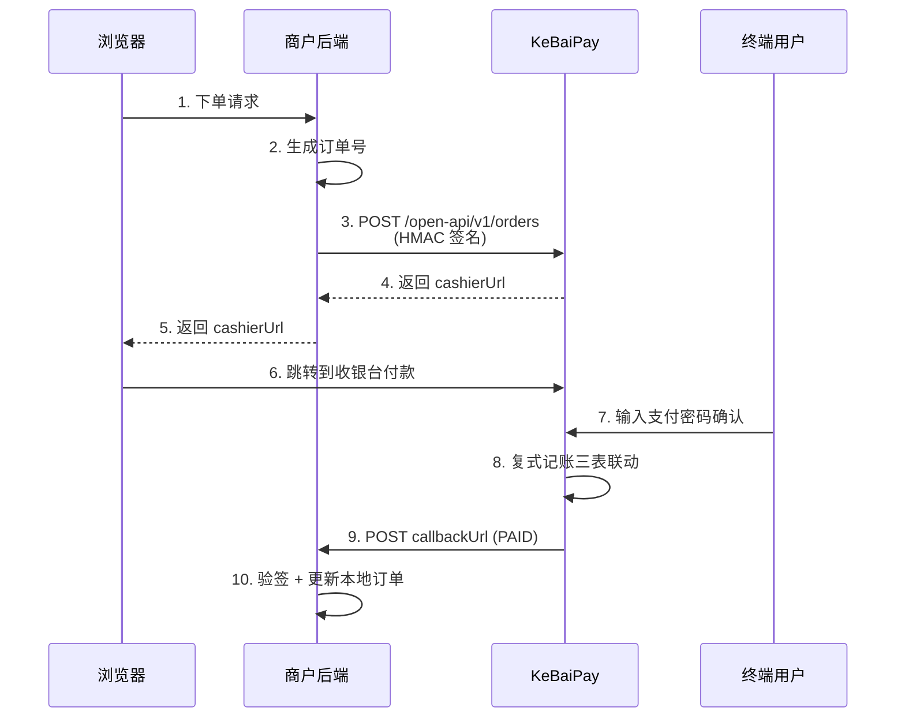
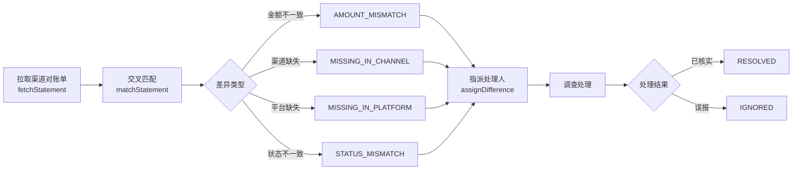

<div align="center">

# KeBaiPay 科佰支付

**个人钱包 + 商户收款 + 开放 API + 多平台对账聚合 + AI 智能体层的一体化支付平台**

🚀 版本 2.1.0 | NestJS 11 + Prisma 7 + PostgreSQL 16 + Redis 7 + Vercel AI SDK v6 + MCP | 214 个 API 端点

[功能矩阵](#二功能矩阵) · [快速开始](#三快速开始5-分钟) · [架构图](#五系统架构) · [API 文档](docs/API_REFERENCE.md) · [部署指南](docs/DEPLOYMENT.md)

</div>

---

## 一、项目简介

KeBaiPay 是一个面向中小商户、个人钱包场景的完整支付中台方案。系统采用 **复式记账模型**、**Redis 分布式锁防并发**、**Prisma 事务保证 ACID**，并内置风控引擎、对账引擎、AI 风控审计、AI 智能体层等高级特性。

### 核心亮点

- **214 个 API 端点**，覆盖钱包、商户、开放 API、管理后台、AI 智能体全场景
- **52 个 Prisma 数据模型**，15 个业务域 + 1 个 AI 智能体域分组
- **4 种认证方式**：用户 JWT / 管理员 JWT / 商户 HMAC / Agent JWT（独立 JWT_AGENT_SECRET）
- **复式记账三表联动**（AccountLedger + Bill + TransactionOrder）保证资金可追溯
- **多平台对账聚合**（S5）：跨支付宝/微信/银行渠道流水交叉比对，差异自动分类
- **AI 风控审计**（S3）：基于规则+AI 双引擎审计管理员操作，链式 hash 防篡改
- **AI 智能体层**（v2.1.0 新增）：基于 Vercel AI SDK v6 + MCP，支持 C 端钱包管家 / B 端店长助理 / A 端风控审计官三大场景
- **Human-in-the-Loop 资金安全**：Agent 资金类操作强制二次确认（PENDING_CONFIRM → 用户决策 → SUCCESS/REJECTED）
- **MCP Server**：把 KeBaiPay 能力暴露给外部 AI Agent（Claude Desktop / Cursor / Trae）
- **担保交易**（S2）：买卖双方中介担保，与支付宝/微信担保支付逻辑对齐
- **微信红包二倍均值法**（S1）：群红包算法与微信原生体验一致
- **1023 个单元测试 + 355 个 E2E 测试** 全覆盖

### 技术栈速览

| 层 | 技术选型 | 说明 |
|---|---|---|
| 运行时 | Node.js ≥ 20 | NestJS 11 + TypeScript 6 要求 |
| 框架 | NestJS 11 | 模块化 + DI + 装饰器 |
| ORM | Prisma 7 | 类型安全 + 迁移机制 |
| 数据库 | PostgreSQL 16/17 | 主库，不支持 SQLite |
| 缓存 | Redis 7 | 分布式锁 + 滑动窗口限流 + 防重放 |
| 认证 | JWT + HMAC-SHA256 | 用户/管理员/Agent JWT 独立密钥；商户开放 API HMAC 签名 |
| 加密 | AES-256-GCM | 身份证、银行卡等敏感字段 |
| 风控 | 自研规则引擎 + AI 审计 | 滑动窗口 Lua + 链式 hash 日志 |
| **AI Agent** | **Vercel AI SDK v6 + MCP** | **v2.1.0 新增：LLM 调用 + 工具循环 + MCP Server** |
| 部署 | Docker Compose / 裸机 | PM2 进程管理可选；n8n + Botpress 独立编排 |
| 监控 | OpenTelemetry + Prometheus + Sentry | OTLP trace + metrics 端点 |

---

## 二、功能矩阵

### 用户端（C 端）

| 模块 | 关键能力 | 接口数 |
|---|---|---:|
| 认证 | 手机号/邮箱注册、登录、JWT 鉴权 | 2 |
| 用户 | 实名认证、支付密码、绑定手机/邮箱、改密 | 6 |
| 账户 | 余额查询、资金流水、按方向筛选 | 1 |
| 交易 | 账户充值、回调通知 | 1 |
| 转账 | 用户间转账、幂等键防重 | 1 |
| 提现 | 申请提现、查询记录 | 2 |
| 红包 | 发/领红包、已发/已收列表 | 4 |
| 收款码 | 个人/固定金额收款码、扫码付款 | 3 |
| 账单 | 列表查询、收支筛选 | 1 |
| 银行卡 | 绑卡、解绑、设默认卡 | 4 |
| 担保交易 | 创建担保订单、买家付款、卖家发货、确认收货、申请退款、争议处理 | 6 |
| 批量转账 | 批量提交、明细查询、状态机管理 | 3 |
| 订阅 | 订阅/取消订阅、查看订阅详情、查看可订阅计划 | 3 |
| 分账 | 创建分账计划、查询分账列表 | 2 |
| 优惠券 | 领取优惠券、查询我的优惠券 | 2 |
| 邀请返现 | 获取邀请码、查询邀请记录 | 2 |
| 消息中心 | 消息列表、未读数、标记已读 | 3 |
| 发票 | 申请开票、查询开票记录 | 2 |

### 商户端（B 端）

| 模块 | 关键能力 | 接口数 |
|---|---|---:|
| 商户管理 | 入驻申请、资料更新、应用创建/重置密钥、看板、收款码 | 9 |
| 收银台 | 创建订单、查询、支付、对账、导出 CSV、扫码 | 7 |
| 开放 API | HMAC 签名认证：创建订单、查询、退款、转账、查余额 | 5 |

### 管理后台（A 端）

| 模块 | 关键能力 | 接口数 |
|---|---|---:|
| 管理员认证 | 登录、改密 | 2 |
| 数据看板 | 平台概览 | 1 |
| 用户管理 | 列表/详情/状态/风控等级 | 4 |
| 商户管理 | 列表/审核/配置 | 3 |
| 实名审核 | 待审列表、通过/拒绝 | 3 |
| 提现审核 | 列表、通过/拒绝 | 3 |
| 支付订单 | 列表查询 | 1 |
| 风控事件 | 列表、处理 | 2 |
| 风控规则 | 列表、更新 | 2 |
| 风控日志 | 登录日志、审计日志 | 2 |
| 人工调账 | 账户余额调整 | 1 |
| 系统配置 | 获取/设置 | 2 |
| 支付渠道 | 创建/更新/删除/测试 | 4 |
| 管理员管理 | 创建/更新/删除/重置密码 | 4 |
| 财务统计 | 概览/汇总/结算/手续费/快照/导出 | 14 |
| 对账管理 | 执行对账、报告列表/导出/详情 | 4 |
| **多平台对账聚合（S5）** | 拉取对账单、交叉匹配、差异处理工作流 | 9 |
| **AI 风控审计（S3）** | AI 审计事件、风控建议、人工复核 | 5 |
| **自定义规则** | 风控规则模板 CRUD | 5 |

### 跨端公共

| 模块 | 关键能力 | 接口数 |
|---|---|---:|
| 健康检查 | 存活/就绪/渠道/调度 | 4 |
| 指标监控 | Prometheus /metrics | 1 |
| 短信 | 发送验证码 | 1 |

### AI 智能体层（v2.1.0 新增）

| 模块 | 关键能力 | 接口数 |
|---|---|---:|
| Agent 认证 | 第 4 种认证 AgentAuthGuard（独立 JWT_AGENT_SECRET） | - |
| 会话管理 | 创建/查询/关闭会话 | 4 |
| 智能对话 | 发送消息 + LLM 调用 + 工具循环（核心入口） | 1 |
| 资金确认 | 二次确认/拒绝待确认操作（Human-in-the-Loop） | 1 |
| 授权管理 | 用户授权 Agent、撤销授权、查询授权列表 | 3 |
| 审计校验 | Agent 操作哈希链完整性校验 | 1 |
| **C 端钱包管家** | kbpay_query_balance / query_bill / send_message / claim_coupon / transfer（强制确认） | 5 工具 |
| **B 端店长助理** | kbpay_query_merchant_orders / query_merchant_balance / query_reconciliation_diff | 3 工具 |
| **A 端风控审计官** | kbpay_query_risk_events / query_health / query_reconciliation_diffs | 3 工具 |
| **MCP Server** | 把 KeBaiPay 能力暴露给外部 AI Agent（Claude Desktop / Cursor / Trae） | 5 工具 |
| **AI 巡检调度** | 系统健康/对账差异/风控事件 3 个 @Cron 任务 | - |

---

## 三、快速开始（5 分钟）

### 方式 A：Docker Compose（推荐）

```bash
# 1. 拷代码到服务器
git clone https://github.com/your-org/kebaipay.git
cd kebaipay

# 2. 配置环境变量（必须改 6 个 secret）
cp .env.example .env
# 编辑 .env，把所有 "change-...-in-production" 替换为强密钥
# 至少修改：POSTGRES_PASSWORD / JWT_USER_SECRET / JWT_ADMIN_SECRET /
#           ADMIN_DEFAULT_PASSWORD / ENCRYPTION_KEY / REDIS_PASSWORD

# 3. 一键启动（首次约 3-5 分钟拉镜像 + 构建）
docker compose up -d --build

# 4. 初始化管理员账号
docker compose exec app npx prisma db seed

# 5. 验证
curl http://localhost:3000/health/ready
# {"status":"ok",...} 即成功
```

### 方式 B：裸机部署

```bash
# 环境要求：Node.js ≥ 20 / PostgreSQL ≥ 16 / Redis ≥ 7
npm ci
cp .env.example .env
# 编辑 .env，DATABASE_URL 指向你的 PG，REDIS_URL 指向你的 Redis

npx prisma generate
npx prisma migrate deploy
npx prisma db seed
npm run build
NODE_ENV=production node dist/main.js
```

### 方式 C：本地开发

```bash
docker compose -f docker-compose.dev.yml up -d   # 启 PG + Redis
npm install
cp .env.example .env
npx prisma migrate dev
npm run start:dev    # 热重载
```

访问入口：
- H5 钱包：`http://localhost:3000/`
- 管理员登录：`http://localhost:3000/#adminLogin`
- Swagger 文档：`http://localhost:3000/api/docs`（仅非生产环境）

---

## 四、首次使用教程

### 4.1 用户注册与实名

```bash
# 注册新用户
curl -X POST http://localhost:3000/auth/register \
  -H "Content-Type: application/json" \
  -d '{
    "nickname": "张三",
    "phone": "13800138000",
    "password": "Password123"
  }'

# 响应：返回 access_token，前端保存到 localStorage
```

```bash
# 提交实名认证（需登录，把 <token> 换成上一步的 access_token）
curl -X POST http://localhost:3000/users/verify-identity \
  -H "Authorization: Bearer <token>" \
  -H "Content-Type: application/json" \
  -d '{
    "realName": "张三",
    "idCard": "110101199001011234"
  }'

# 管理员审核通过后才能使用资金功能
curl -X POST http://localhost:3000/admin/identity/<id>/approve \
  -H "Authorization: Bearer <admin_token>"
```

### 4.2 充值与转账

```bash
# 充值 100 元
curl -X POST http://localhost:3000/transactions/recharge \
  -H "Authorization: Bearer <token>" \
  -H "Content-Type: application/json" \
  -d '{
    "amount": 100.00,
    "payPassword": "pay_password_123",
    "idempotencyKey": "recharge_20260101_001"
  }'

# 转账给其他用户
curl -X POST http://localhost:3000/transfers \
  -H "Authorization: Bearer <token>" \
  -H "Content-Type: application/json" \
  -d '{
    "toUserId": "target_user_uuid",
    "amount": 50.00,
    "payPassword": "pay_password_123",
    "remark": "晚餐费"
  }'
```

### 4.3 商户接入开放 API



签名算法（HMAC-SHA256）：

```javascript
const crypto = require('crypto')

const signString = [
  method,           // 'POST'
  path,             // '/open-api/v1/orders'
  rawBody,          // JSON.stringify(requestBody)
  timestamp,        // Date.now() 毫秒
  nonce,            // 唯一随机字符串
  appId             // 商户应用 App ID
].join('\n')

const signature = crypto
  .createHmac('sha256', appSecret)
  .update(signString)
  .digest('hex')

// 必需请求头：
// X-App-Id: <app_id>
// X-Timestamp: <timestamp>
// X-Nonce: <nonce>
// X-Signature: <signature>
```

### 4.4 管理员对账与差异处理



---

## 五、系统架构

### 5.1 整体架构图

```
┌─────────────────────────────────────────────────────────────────────┐
│                         客户端 / 浏览器                              │
│   H5 钱包 │ 商户收银台 │ 管理后台 SPA │ 商户后端 SDK               │
└───────────────────────────┬─────────────────────────────────────────┘
                            │ HTTPS
                            ▼
┌─────────────────────────────────────────────────────────────────────┐
│  Nginx 反向代理 (TLS 终止 / X-Forwarded-For)                       │
└───────────────────────────┬─────────────────────────────────────────┘
                            ▼
┌─────────────────────────────────────────────────────────────────────┐
│                  NestJS 应用 (port 3000)                            │
│ ┌─────────────────────────────────────────────────────────────────┐ │
│ │  全局中间件/守卫/拦截器/过滤器                                   │ │
│ │  Helmet · Compression · ValidationPipe · AllExceptionsFilter    │ │
│ │  ResponseTransformInterceptor · ThrottlerGuard · RequestLog     │ │
│ └─────────────────────────────────────────────────────────────────┘ │
│ ┌───────────────────┐ ┌──────────────────┐ ┌────────────────────┐ │
│ │  用户端 (C)        │ │  商户端 (B)        │ │  管理端 (A)         │ │
│ │  18 个模块         │ │  3 个模块         │ │  19 个模块          │ │
│ │  JWT_USER_SECRET   │ │  HMAC 签名        │ │  JWT_ADMIN_SECRET  │ │
│ └───────────────────┘ └──────────────────┘ └────────────────────┘ │
│ ┌─────────────────────────────────────────────────────────────────┐ │
│ │  交叉基础层                                                       │ │
│ │  PrismaService · RedisService · CryptoService · AuditService   │ │
│ │  RiskEngineService · NotificationsService · SmsService          │ │
│ └─────────────────────────────────────────────────────────────────┘ │
└────────────┬───────────────────────────────────┬────────────────────┘
             ▼                                   ▼
┌────────────────────────┐            ┌────────────────────────┐
│  PostgreSQL 16         │            │  Redis 7               │
│  ─ 47 个数据模型        │            │  ─ 分布式锁             │
│  ─ 复式记账三表联动     │            │  ─ 滑动窗口限流         │
│  ─ 链式 hash 审计日志   │            │  ─ nonce 防重放         │
└────────────────────────┘            └────────────────────────┘
             ▲
             │
┌────────────────────────────────────────────────────────────────────┐
│  外部渠道 / 三方服务                                                │
│  微信支付 │ 支付宝 │ 阿里云/腾讯/华为短信 │ SMTP │ OTLP Collector   │
└────────────────────────────────────────────────────────────────────┘
```

### 5.2 复式记账模型

```
用户发起资金操作
       │
       ▼
┌──────────────────┐    ┌──────────────────┐    ┌──────────────────┐
│ TransactionOrder │───▶│   AccountLedger  │◀──▶│      Bill        │
│  (订单主表)       │    │   (账户流水)      │    │   (用户账单)     │
│                  │    │                  │    │                  │
│ - orderNo        │    │ - type           │    │ - type           │
│ - type (RECHARGE │    │ - direction      │    │ - direction      │
│   /TRANSFER/...) │    │ - amountBefore   │    │ - amountYuan     │
│ - amount         │    │ - amountAfter    │    │ - counterparty   │
│ - status         │    │ - refType        │    │ - remark         │
└──────────────────┘    │ - refId          │    └──────────────────┘
                        └──────────────────┘
       │
       ▼ 所有写操作包入 $transaction
       │
       ▼
   Redis 分布式锁
   redis.withLock(key, ttl, fn)
```

### 5.3 状态机速览

#### 提现订单状态机

```
PENDING ──admin approve──▶ APPROVED ──channel success──▶ SUCCESS
   │                          │
   │                          └──channel fail──▶ FAILED
   │
   └──admin reject──▶ REJECTED
```

#### 红包状态机

```
PENDING ──领取人数>0──▶ PARTIALLY_RECEIVED ──全部领完──▶ RECEIVED
   │                                                       ▲
   └──过期未领完──────────────────────────────────────────▶ EXPIRED
```

#### 担保交易状态机

```
CREATED ──buyer pay──▶ PAID ──seller ship──▶ SHIPPED ──buyer confirm──▶ COMPLETED
                │                       │
                │                       ├─buyer refund──▶ REFUND_PENDING
                │                       │                  │
                │                       └─dispute──────────▶ DISPUTED
                │                                          │
                └──────────refund──▶ REFUNDED ◀────────────┘
```

#### 多平台对账差异处理状态机

```
PENDING ──assignDifference──▶ INVESTIGATING ──resolveDifference──▶ RESOLVED / IGNORED
```

---

## 六、项目结构

```
kebaipay/
├── src/
│   ├── auth/                 用户 JWT 鉴权
│   ├── users/                用户、实名、支付密码、绑定手机/邮箱
│   ├── accounts/             账户余额、资金流水（复式记账）
│   ├── transactions/         充值、交易订单
│   ├── transfers/            用户间转账（幂等键防重）
│   ├── withdrawals/          提现（含并发测试）
│   ├── red-packets/          红包（二倍均值法）
│   ├── qr-codes/             收款码（个人/固定）
│   ├── bills/                账单
│   ├── bank-cards/           银行卡管理
│   ├── escrow/               担保交易（S2）
│   ├── batch-transfers/      批量转账
│   ├── subscriptions/        订阅
│   ├── splits/               分账
│   ├── coupons/              优惠券
│   ├── referrals/            邀请返现
│   ├── messages/             消息中心
│   ├── invoices/             发票
│   ├── merchants/            商户入驻、应用与配置
│   ├── cashier/              统一收银台
│   ├── open-api/             开放 API（HMAC 签名认证）
│   ├── admin/                管理后台（含权限守卫）
│   ├── finance/              财务统计与对账
│   ├── channel-reconciliation/ 多平台对账聚合（S5）
│   ├── risk/                 风控引擎（滑动窗口）
│   ├── risk-audit/           AI 风控审计（S3）
│   ├── custom-rules/         自定义规则模板
│   ├── payment-channels/     微信/支付宝/Mock 渠道
│   ├── webhooks/             支付渠道回调
│   ├── redis/                Redis 封装（分布式锁 / 滑动窗口）
│   ├── crypto/               AES-256-GCM 加解密
│   ├── security/             启动安全校验
│   ├── health/               健康检查（存活/就绪/渠道）
│   ├── metrics/              Prometheus /metrics
│   ├── notifications/        邮件通知 + 结算调度
│   ├── audit/                审计日志（链式 hash）
│   ├── sms/                  短信（阿里/腾讯/华为/mock）
│   ├── prisma/               Prisma 客户端
│   ├── common/               中间件、拦截器、工具函数
│   ├── app.module.ts         根模块
│   ├── main.ts               启动入口
│   └── tracing.ts            OpenTelemetry 接入
├── public/                   H5 钱包静态页面（同源托管）
├── prisma/
│   ├── schema.prisma         47 个数据模型定义
│   ├── migrations/           SQL 迁移文件
│   └── seed.ts               初始化管理员 + 测试数据
├── test/                     E2E 测试
├── e2e_check.py              Python E2E 自动化测试脚本
├── docs/                     完整文档集
├── docker-compose.yml        生产部署
├── docker-compose.dev.yml    开发环境（PG + Redis）
├── Dockerfile                多阶段构建
├── .env.example              环境变量示例
├── package.json              依赖与脚本
└── README.md                 本文件
```

---

## 七、API 概览

完整接口列表详见 [docs/API_REFERENCE.md](docs/API_REFERENCE.md)。

| 端点 | 说明 | 认证方式 |
|---|---|---|
| `POST /auth/register` | 用户注册 | 无 |
| `POST /auth/login` | 用户登录 | 无 |
| `GET /users/me` | 当前用户信息 | 用户 JWT |
| `POST /transactions/recharge` | 充值 | 用户 JWT |
| `POST /transfers` | 转账 | 用户 JWT |
| `POST /withdrawals` | 提现申请 | 用户 JWT |
| `POST /red-packets` | 发红包 | 用户 JWT |
| `POST /cashier/orders` | 创建收银台订单 | 用户 JWT |
| `POST /open-api/v1/orders` | 商户创建订单 | HMAC 签名 |
| `POST /admin/auth/login` | 管理员登录 | 无 |
| `GET /admin/dashboard` | 后台概览 | 管理员 JWT + 权限 |
| `POST /admin/channel-reconciliation/statements/fetch` | 拉取渠道对账单 | 管理员 JWT + reconciliation 权限 |
| `POST /admin/risk-audit/events/:id/review` | AI 风控审计复核 | 管理员 JWT + risk 权限 |
| `GET /metrics` | Prometheus 指标 | 无 |
| `GET /health` | 存活探针 | 无 |
| `GET /health/ready` | 就绪探针 | 无 |

完整 **204 个 API** 列表参见 [docs/API_REFERENCE.md](docs/API_REFERENCE.md)。

---

## 八、文档导航

| 文档 | 内容 |
|---|---|
| [docs/QUICKSTART.md](docs/QUICKSTART.md) | 商户 5 分钟接入教程 |
| [docs/API_REFERENCE.md](docs/API_REFERENCE.md) | 完整 API 端点说明 |
| [docs/ADMIN_GUIDE.md](docs/ADMIN_GUIDE.md) | 管理后台操作手册 |
| [docs/MERCHANT_GUIDE.md](docs/MERCHANT_GUIDE.md) | 商户接入指南 |
| [docs/USER_GUIDE.md](docs/USER_GUIDE.md) | 用户端功能说明 |
| [docs/DEVELOPER_GUIDE.md](docs/DEVELOPER_GUIDE.md) | 开发者文档（架构/认证/错误码） |
| [docs/SDK_GUIDE.md](docs/SDK_GUIDE.md) | 开放 API SDK 使用说明 |
| [docs/DEPLOYMENT.md](docs/DEPLOYMENT.md) | 完整部署文档 |
| [docs/TROUBLESHOOT.md](docs/TROUBLESHOOT.md) | 常见问题排查 |
| [docs/CHANGELOG.md](docs/CHANGELOG.md) | 版本更新日志 |
| [docs/PROJECT_PLAN.md](docs/PROJECT_PLAN.md) | 项目进度与路线图 |
| [docs/sms-integration.md](docs/sms-integration.md) | 短信服务商接入 |

---

## 九、环境变量速查表

完整说明详见 [.env.example](.env.example)。**生产环境必填** 项加粗：

| 变量 | 必填 | 默认 | 说明 |
|---|:---:|---|---|
| `POSTGRES_PASSWORD` | **是** | - | PostgreSQL 密码 |
| `JWT_USER_SECRET` | **是** | - | 用户端 JWT 密钥（32+ 字符） |
| `JWT_ADMIN_SECRET` | **是** | - | 管理端 JWT 密钥（必须与上面不同） |
| `ADMIN_DEFAULT_PASSWORD` | **是** | - | 管理员初始密码（8+ 字符） |
| `ENCRYPTION_KEY` | **是** | - | AES 加密密钥（32+ 字符） |
| `REDIS_PASSWORD` | **是** | - | Redis 密码 |
| `DATABASE_URL` | 裸机必填 | - | PostgreSQL 连接串 |
| `REDIS_URL` | 生产必填 | - | Redis 连接串 |
| `CORS_ORIGINS` | 生产必填 | localhost | 跨域来源（逗号分隔） |
| `RECHARGE_NOTIFY_URL` | 否 | - | 充值回调地址（生产 https） |
| `CASHIER_BASE_URL` | 否 | localhost:3000 | 收银台对外地址 |
| `NODE_ENV` | 否 | development | `production` 启用安全校验 + 隐藏 Swagger |
| `PORT` | 否 | 3000 | 监听端口 |
| `SMS_PROVIDER` | 否 | mock | aliyun/tencent/huawei/mock |
| `SMTP_HOST/PORT/USER/PASS/FROM` | 否 | - | 邮件通知配置 |
| `OTEL_EXPORTER_OTLP_ENDPOINT` | 否 | - | OpenTelemetry 导出端点 |
| `SENTRY_DSN` | 否 | - | Sentry 异常告警 DSN |

---

## 十、Nginx 反向代理 + HTTPS

生产环境推荐挂 Nginx 做 TLS 终止：

```nginx
upstream kebaipay {
    server 127.0.0.1:3000;
    keepalive 64;
}

server {
    listen 80;
    server_name pay.yourdomain.com;
    return 301 https://$server_name$request_uri;
}

server {
    listen 443 ssl http2;
    server_name pay.yourdomain.com;

    ssl_certificate /etc/letsencrypt/live/pay.yourdomain.com/fullchain.pem;
    ssl_certificate_key /etc/letsencrypt/live/pay.yourdomain.com/privkey.pem;
    ssl_protocols TLSv1.2 TLSv1.3;

    add_header X-Frame-Options "SAMEORIGIN" always;
    add_header X-Content-Type-Options "nosniff" always;

    location / {
        proxy_pass http://kebaipay;
        proxy_http_version 1.1;
        proxy_set_header Host $host;
        proxy_set_header X-Real-IP $remote_addr;
        proxy_set_header X-Forwarded-For $proxy_add_x_forwarded_for;
        proxy_set_header X-Forwarded-Proto $scheme;
        proxy_read_timeout 300s;
    }

    location /health {
        proxy_pass http://kebaipay;
        access_log off;
    }
}
```

用 Let's Encrypt 申请免费证书：

```bash
apt install certbot python3-certbot-nginx
certbot --nginx -d pay.yourdomain.com
```

---

## 十一、运维命令速查

### Docker Compose 模式

```bash
docker compose ps                                    # 容器状态
docker compose logs -f app                           # 实时日志
docker compose restart app                           # 重启应用
docker compose down                                  # 停止所有
docker compose pull && docker compose up -d --build # 更新代码重新部署
docker compose exec app sh                           # 进入容器
docker compose exec postgres psql -U postgres -d kebaipay   # 进数据库
```

### 数据库备份与恢复

```bash
# 备份
docker compose exec -T postgres pg_dump -U postgres kebaipay > backup_$(date +%Y%m%d).sql

# 恢复
cat backup_20260721.sql | docker compose exec -T postgres psql -U postgres -d kebaipay

# 定时每日备份（crontab -e）
0 3 * * * cd /opt/kebaipay && docker compose exec -T postgres pg_dump -U postgres kebaipay | gzip > /backups/kebaipay_$(date +\%Y\%m\%d).sql.gz
```

### 健康检查端点

| 端点 | 说明 |
|---|---|
| `GET /health` | 存活探针（liveness） |
| `GET /health/ready` | 就绪探针（DB + Redis 连通性） |
| `GET /health/channels` | 支付渠道状态 |
| `GET /health/channels/summary` | 渠道健康摘要 |
| `GET /health/schedules` | 调度任务状态 |
| `GET /metrics` | Prometheus 指标 |
| `GET /api/docs` | Swagger 文档（仅非生产） |

---

## 十二、测试

```bash
npm run test           # 1023 个单元测试
npm run test:e2e       # 324 个端到端测试
npm run test:cov       # 测试覆盖率报告
npm run lint           # TypeScript 类型检查
```

---

## 十三、开发约定

- **金额单位**：数据库存「分」(Fen)，接口传「元」(Yuan)，DTO 自动转换
- **资金操作**：必须包入 Prisma `$transaction` 事务 + Redis 分布式锁
- **DTO 校验**：`class-validator` + `whitelist: true` + `forbidNonWhitelisted: true`
- **敏感数据**：身份证、银行卡号用 AES-256-GCM 加密入库 + SHA-256 hash 唯一约束
- **审计日志**：所有管理员操作必须记 AuditLog，敏感操作记 AdminOperationLog（链式 hash 防篡改）
- **幂等性**：所有资金类接口支持 `idempotencyKey`，配合 `@unique` 索引保证不重复
- **错误码**：KB001-KB999 分段管理，详见 [docs/API_REFERENCE.md#错误码表](docs/API_REFERENCE.md)
- **限流**：Throttler 全局 100/min，登录注册 10/min，开放 API 30/min
- **测试**：每个 service 必须有 .spec.ts，每个 controller 必须有 .controller.spec.ts

---

## 十四、常见部署错误对照

完整版见 [docs/TROUBLESHOOT.md](docs/TROUBLESHOOT.md)。

| 错误现象 | 原因 | 解决 |
|---|---|---|
| SecurityValidator 拒绝启动 | 6 个 secret 还是默认值 | 改 `.env` 中的 6 个必填项 |
| `CORS_ORIGINS is not configured` | 生产环境没配 CORS | `.env` 改成 `https://your-domain.com` |
| Prisma 连不上 DB | PG 容器没起 / 密码不一致 | `docker compose ps postgres` |
| 端口 3000 被占用 | 其他程序占了 | 改 `docker-compose.yml` 端口映射 |
| 管理员登录密码错误 | 改密码没重新 seed | 删 AdminUser 表再 `prisma db seed` |
| 用户登录 429 | 暴力破解锁定 | 等 15 分钟自动解锁，或清 Redis 计数 |
| `Failed to acquire lock` | Redis 锁未释放 | 等几秒重试，或 `docker compose restart redis` |
| Swagger 文档打不开 | 生产环境隐藏 | 改 `NODE_ENV=development` 重启 |

---

## 十五、安全注意事项

1. **6 个 secret 必须改**：生产环境用 `SecurityValidatorService` 强校验，留默认值会拒绝启动
2. **Redis 必须配**：分布式锁、滑动窗口限流、防重放都依赖 Redis
3. **生产环境 HTTPS**：`RECHARGE_NOTIFY_URL` 必须是 https，否则微信/支付宝回调会失败
4. **mock 渠道禁用**：生产环境 `SecurityValidator` 会拒绝启用 mock 渠道
5. **`.env` 不入仓库**：已在 `.gitignore`，部署时一定要在服务器上创建
6. **首次部署后必跑 seed**：`npx prisma db seed` 创建管理员账号
7. **Swagger 仅非生产**：`NODE_ENV=production` 自动隐藏 `/api/docs`
8. **请求体大小限制**：1MB，防止 DoS

---

## 十六、License

MIT License — 详见 [LICENSE](./LICENSE)

Copyright (c) 2026 KeBaiPay Contributors

## 十七、贡献者

本项目由以下人员共同维护：

| GitHub | 角色 | 主要贡献 |
|---|---|---|
| [@weed33834](https://github.com/weed33834) | 项目负责人 / 架构师 | 整体架构、资金安全、API 契约、风控引擎、AI 智能体设计 |
| [@KEBAI-CN](https://github.com/KEBAI-CN) | 联合开发者 | 功能开发、测试用例、文档维护、前端实现、LLM 接入联调 |

详见 [CONTRIBUTING.md](./CONTRIBUTING.md) 和 [docs/TEAM.md](docs/TEAM.md)。

## 十八、技术支持

- API 文档（开发环境）：http://your-server:3000/api/docs
- 完整文档：[docs/](docs/) 目录
- 问题排查：[docs/TROUBLESHOOT.md](docs/TROUBLESHOOT.md)
