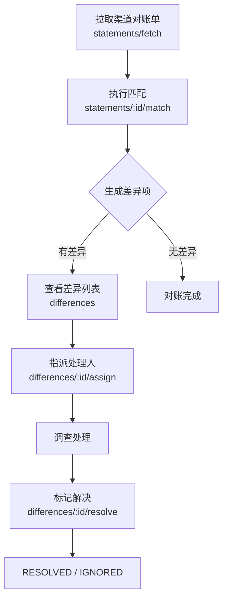
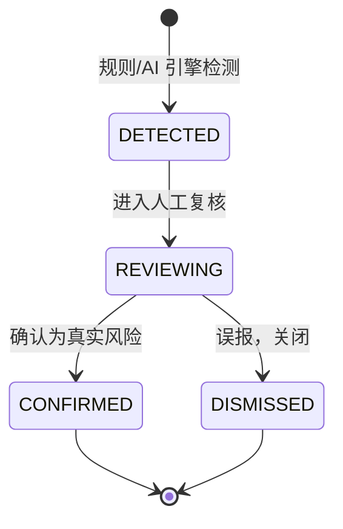

# KeBaiPay 管理后台指南

> 管理员操作手册

## 目录

- [管理员登录](#管理员登录)
- [用户管理](#用户管理)
- [商户管理](#商户管理)
- [财务管理](#财务管理)
- [风控管理](#风控管理)
- [系统配置](#系统配置)
- [管理员管理](#管理员管理)
- [多平台对账聚合（S5）管理](#多平台对账聚合s5管理)
- [AI 风控审计（S3）管理](#ai-风控审计s3管理)
- [自定义规则模板管理](#自定义规则模板管理)
- [权限矩阵](#权限矩阵)
- [常见问题](#常见问题)

---

## 管理员登录

### 登录方式

通过管理后台 API 登录。

### 登录请求

```http
POST /admin/auth/login
Content-Type: application/json

{
  "username": "admin",
  "password": "admin123456"
}
```

### 登录响应

```json
{
  "access_token": "eyJhbGciOiJIUzI1NiIs..."
}
```

### 修改密码

```http
POST /admin/auth/change-password
Authorization: Bearer <admin_token>
Content-Type: application/json

{
  "oldPassword": "old_password",
  "newPassword": "new_password"
}
```

---

## 用户管理

### 查看用户列表

```http
GET /admin/users?page=1&limit=20
Authorization: Bearer <admin_token>
```

### 查看用户详情

```http
GET /admin/users/:id
Authorization: Bearer <admin_token>
```

### 冻结/解冻用户

```http
POST /admin/users/:id/status
Authorization: Bearer <admin_token>
Content-Type: application/json

{
  "status": "FROZEN",
  "reason": "异常操作"
}
```

**用户状态：**

| 状态 | 说明 |
|------|------|
| ACTIVE | 正常 |
| EXPENSE_RESTRICTED | 支出受限 |
| INCOME_RESTRICTED | 收入受限 |
| FROZEN | 冻结 |

### 修改用户风控等级

```http
POST /admin/users/:id/risk-level
Authorization: Bearer <admin_token>
Content-Type: application/json

{
  "level": "HIGH"
}
```

**风控等级：**

| 等级 | 说明 |
|------|------|
| LOW | 低风险 |
| MEDIUM | 中风险 |
| HIGH | 高风险 |

### 实名认证审核

#### 查看待审核列表

```http
GET /admin/identity/pending?page=1&limit=20
Authorization: Bearer <admin_token>
```

#### 通过认证

```http
POST /admin/identity/:id/approve
Authorization: Bearer <admin_token>
```

#### 拒绝认证

```http
POST /admin/identity/:id/reject
Authorization: Bearer <admin_token>
Content-Type: application/json

{
  "reason": "身份证信息不清晰"
}
```

### 人工调账

```http
POST /admin/accounts/:userId/adjust
Authorization: Bearer <admin_token>
Content-Type: application/json

{
  "amount": 100.00,
  "reason": "系统补偿"
}
```

---

## 商户管理

### 查看商户列表

```http
GET /admin/merchants?page=1&limit=20
Authorization: Bearer <admin_token>
```

### 审核商户

```http
POST /admin/merchants/:id/audit
Authorization: Bearer <admin_token>
Content-Type: application/json

{
  "action": "APPROVE",
  "reason": ""
}
```

**审核操作：**

| 操作 | 说明 |
|------|------|
| APPROVE | 通过 |
| REJECT | 拒绝 |

### 修改商户配置

```http
POST /admin/merchants/:id/config
Authorization: Bearer <admin_token>
Content-Type: application/json

{
  "payRate": 60,
  "withdrawRate": 60,
  "dailyLimit": 10000000
}
```

**配置说明：**

| 字段 | 说明 |
|------|------|
| payRate | 收款费率（万分比） |
| withdrawRate | 提现费率（万分比） |
| dailyLimit | 日限额（分） |

---

## 财务管理

### 提现审核

#### 查看提现列表

```http
GET /admin/withdrawals?page=1&limit=20
Authorization: Bearer <admin_token>
```

#### 通过提现

```http
POST /admin/withdrawals/:id/approve
Authorization: Bearer <admin_token>
```

#### 拒绝提现

```http
POST /admin/withdrawals/:id/reject
Authorization: Bearer <admin_token>
Content-Type: application/json

{
  "reason": "信息不完整"
}
```

### 财务概览

```http
GET /admin/finance/overview
Authorization: Bearer <admin_token>
```

### 每日收支汇总

```http
GET /admin/finance/daily-summary?startDate=2024-01-01&endDate=2024-01-31
Authorization: Bearer <admin_token>
```

### 导出报表

```http
GET /admin/finance/daily-summary/export?startDate=2024-01-01&endDate=2024-01-31
Authorization: Bearer <admin_token>
```

### 商户结算

```http
GET /admin/finance/merchant-settlements?startDate=2024-01-01&endDate=2024-01-31
Authorization: Bearer <admin_token>
```

### 手续费统计

```http
GET /admin/finance/fee-income?startDate=2024-01-01&endDate=2024-01-31
Authorization: Bearer <admin_token>
```

### 资产快照

```http
GET /admin/finance/daily-snapshots?startDate=2024-01-01&endDate=2024-01-31
Authorization: Bearer <admin_token>
```

### 生成快照

```http
POST /admin/finance/snapshots/generate
Authorization: Bearer <admin_token>
Content-Type: application/json

{
  "date": "2024-01-01"
}
```

### 结算管理

#### 查看未结算订单

```http
GET /admin/finance/settlement/unfinished
Authorization: Bearer <admin_token>
```

#### 手动执行结算

```http
POST /admin/finance/settlement/run
Authorization: Bearer <admin_token>
```

### 对账管理

#### 执行对账

```http
POST /admin/reconciliation/run
Authorization: Bearer <admin_token>
Content-Type: application/json

{
  "date": "2024-01-01"
}
```

#### 查看对账报告

```http
GET /admin/reconciliation/reports?startDate=2024-01-01&endDate=2024-01-31
Authorization: Bearer <admin_token>
```

#### 导出对账报告

```http
GET /admin/reconciliation/reports/export?startDate=2024-01-01&endDate=2024-01-31
Authorization: Bearer <admin_token>
```

---

## 风控管理

### 查看风控事件

```http
GET /admin/risk-events?page=1&limit=20
Authorization: Bearer <admin_token>
```

### 处理风控事件

```http
POST /admin/risk-events/:id/handle
Authorization: Bearer <admin_token>
```

### 风控事件类型

| 类型 | 说明 |
|------|------|
| LARGE_TRANSFER | 大额转账 |
| LARGE_WITHDRAWAL | 大额提现 |
| LARGE_PAYMENT | 大额支付 |
| SUSPICIOUS_RED_PACKET | 可疑红包 |
| FREQUENT_TRANSACTION | 频繁交易 |
| FREQUENT_LOGIN | 频繁登录 |
| SUSPICIOUS_DEVICE | 可疑设备 |
| ACCOUNT_FROZEN | 账户冻结 |
| STATUS_CHANGED | 状态变更 |

### 查看风控规则

```http
GET /admin/risk-rules
Authorization: Bearer <admin_token>
```

### 更新风控规则

```http
PUT /admin/risk-rules/:code
Authorization: Bearer <admin_token>
Content-Type: application/json

{
  "enabled": true,
  "threshold": 10000,
  "action": "ALERT"
}
```

### 查看登录日志

```http
GET /admin/login-logs?page=1&limit=20
Authorization: Bearer <admin_token>
```

### 查看审计日志

```http
GET /admin/audit-logs?page=1&limit=20
Authorization: Bearer <admin_token>
```

---

## 系统配置

### 查看系统配置

```http
GET /admin/system-configs
Authorization: Bearer <admin_token>
```

### 设置系统配置

```http
POST /admin/system-configs
Authorization: Bearer <admin_token>
Content-Type: application/json

{
  "key": "DAILY_TRANSFER_LIMIT",
  "value": "100000000"
}
```

### 支付渠道管理

#### 查看渠道列表

```http
GET /admin/channels
Authorization: Bearer <admin_token>
```

#### 创建渠道

```http
POST /admin/channels
Authorization: Bearer <admin_token>
Content-Type: application/json

{
  "code": "ALIPAY",
  "name": "支付宝",
  "type": "BOTH",
  "config": {}
}
```

#### 更新渠道

```http
PUT /admin/channels/:code
Authorization: Bearer <admin_token>
Content-Type: application/json

{
  "enabled": true,
  "config": {}
}
```

#### 删除渠道

```http
DELETE /admin/channels/:code
Authorization: Bearer <admin_token>
```

#### 测试渠道

```http
POST /admin/channels/:code/test
Authorization: Bearer <admin_token>
```

---

## 管理员管理

### 查看管理员列表

```http
GET /admin/admin-users
Authorization: Bearer <admin_token>
```

### 创建管理员

```http
POST /admin/admin-users
Authorization: Bearer <admin_token>
Content-Type: application/json

{
  "username": "new_admin",
  "password": "password123",
  "role": "FINANCE"
}
```

**管理员角色：**

| 角色 | 说明 |
|------|------|
| SUPER_ADMIN | 超级管理员 |
| FINANCE | 财务 |
| CUSTOMER_SERVICE | 客服 |
| RISK_OFFICER | 风控 |

### 更新管理员

```http
PUT /admin/admin-users/:id
Authorization: Bearer <admin_token>
Content-Type: application/json

{
  "role": "FINANCE",
  "status": "ACTIVE"
}
```

### 删除管理员

```http
DELETE /admin/admin-users/:id
Authorization: Bearer <admin_token>
```

### 重置管理员密码

```http
POST /admin/admin-users/:id/reset-password
Authorization: Bearer <admin_token>
```

---

## 多平台对账聚合（S5）管理

### 模块概述

多平台对账聚合模块（S5）用于将平台订单与第三方渠道（支付宝 / 微信 / 银行）的流水进行交叉对账，自动识别差异并支持指派处理与闭环解决。

**核心能力：**

- 跨渠道对账单拉取与持久化（Alipay / WeChat / Bank）
- 渠道流水与平台订单自动匹配
- 4 类差异自动识别与分类
- 差异指派 → 调查 → 解决的完整工作流

**差异类型：**

| 差异类型 | 说明 |
|---------|------|
| MISSING_IN_CHANNEL | 平台有订单，渠道无对应流水 |
| MISSING_IN_PLATFORM | 渠道有流水，平台无对应订单 |
| AMOUNT_MISMATCH | 金额不一致 |
| STATUS_MISMATCH | 状态不一致 |

### 工作流



### 状态机

**对账单状态（ChannelStatementStatus）：**

| 状态 | 说明 |
|------|------|
| PENDING | 待拉取 |
| FETCHED | 已拉取 |
| FAILED | 拉取失败 |

**匹配状态（MatchStatus）：**

| 状态 | 说明 |
|------|------|
| UNMATCHED | 未匹配 |
| MATCHED | 完全匹配 |
| MISMATCHED | 匹配但有差异（金额/状态不一致） |

**差异处理状态（ReconciliationDiffStatus）：**

| 状态 | 说明 | 允许的流转 |
|------|------|-----------|
| PENDING | 待处理 | → INVESTIGATING |
| INVESTIGATING | 调查中 | → RESOLVED / IGNORED |
| RESOLVED | 已解决 | 终态 |
| IGNORED | 已忽略 | 终态 |

**所需权限：** `reconciliation:diff:handle`（指派 / 解决差异），`reconciliation:run`（拉取 / 匹配），`finance:view`（查询）

### 接口列表

| 方法 | 路径 | 说明 | 权限 |
|------|------|------|------|
| POST | /admin/channel-reconciliation/statements/fetch | 拉取渠道对账单 | reconciliation:run |
| GET | /admin/channel-reconciliation/statements | 对账单列表 | finance:view |
| GET | /admin/channel-reconciliation/statements/:id | 对账单详情（含前 50 条 items） | finance:view |
| GET | /admin/channel-reconciliation/statements/:id/items | 对账单条目分页查询 | finance:view |
| POST | /admin/channel-reconciliation/statements/:id/match | 执行匹配 | reconciliation:run |
| GET | /admin/channel-reconciliation/differences | 差异项列表 | finance:view |
| GET | /admin/channel-reconciliation/differences/:id | 差异项详情 | finance:view |
| POST | /admin/channel-reconciliation/differences/:id/assign | 指派差异处理人 | reconciliation:diff:handle |
| POST | /admin/channel-reconciliation/differences/:id/resolve | 标记差异已解决 | reconciliation:diff:handle |

### 拉取渠道对账单

```http
POST /admin/channel-reconciliation/statements/fetch
Authorization: Bearer <admin_token>
Content-Type: application/json

{
  "channelCode": "ALIPAY",
  "date": "2024-01-01"
}
```

响应：

```json
{
  "id": "stmt_001",
  "channelCode": "ALIPAY",
  "date": "2024-01-01",
  "status": "FETCHED",
  "totalCount": 128,
  "totalAmount": 1024000
}
```

### 对账单列表

```http
GET /admin/channel-reconciliation/statements?channelCode=ALIPAY&date=2024-01-01&status=FETCHED&page=1&limit=20
Authorization: Bearer <admin_token>
```

### 对账单详情

```http
GET /admin/channel-reconciliation/statements/:id
Authorization: Bearer <admin_token>
```

### 对账单条目分页查询

```http
GET /admin/channel-reconciliation/statements/:id/items?type=RECHARGE&matchStatus=UNMATCHED&page=1&limit=50
Authorization: Bearer <admin_token>
```

### 执行匹配

```http
POST /admin/channel-reconciliation/statements/:id/match
Authorization: Bearer <admin_token>
```

响应：

```json
{
  "matched": 120,
  "mismatched": 5,
  "unmatched": 3,
  "differencesCreated": 8
}
```

### 差异项列表

```http
GET /admin/channel-reconciliation/differences?reportDate=2024-01-01&channelCode=ALIPAY&diffType=AMOUNT_MISMATCH&status=PENDING&page=1&limit=20
Authorization: Bearer <admin_token>
```

### 差异项详情

```http
GET /admin/channel-reconciliation/differences/:id
Authorization: Bearer <admin_token>
```

### 指派差异处理人

将差异从 `PENDING` 流转为 `INVESTIGATING`。

```http
POST /admin/channel-reconciliation/differences/:id/assign
Authorization: Bearer <admin_token>
Content-Type: application/json

{
  "assignedTo": "admin_002"
}
```

### 标记差异已解决

将差异从 `INVESTIGATING` 流转为 `RESOLVED` 或 `IGNORED`。

```http
POST /admin/channel-reconciliation/differences/:id/resolve
Authorization: Bearer <admin_token>
Content-Type: application/json

{
  "resolution": "渠道方确认延迟到账，金额已对齐",
  "finalStatus": "RESOLVED"
}
```

---

## AI 风控审计（S3）管理

### 模块概述

AI 风控审计模块（S3）采用双引擎架构对管理员操作与用户行为进行审计：

- **规则引擎**：基于阈值、频率、白名单、黑名单等硬规则实时拦截
- **AI 引擎**：基于意图识别 + 模板回复（沙箱环境无 LLM 时使用本地模板），支持自然语言查询规则、事件、交易、账户状态并提交申诉

所有审计操作写入防篡改审计日志，采用 **SHA-256 链式哈希**（每条日志包含 `previousHash`），任何中间记录被篡改都会导致后续哈希校验失败。

### AI 事件生命周期



| 状态 | 说明 |
|------|------|
| DETECTED | 已检测，待复核 |
| REVIEWING | 人工复核中 |
| CONFIRMED | 确认为真实风险 |
| DISMISSED | 误报，已关闭 |

**所需权限：** `risk:event:handle`（处理风险事件），`risk:config`（配置规则），管理端会话查询使用 `admin:view`

### 管理端接口

| 方法 | 路径 | 说明 | 权限 |
|------|------|------|------|
| GET | /admin/risk-audit/sessions | 管理员查询所有会话 | admin:view |
| GET | /admin/risk-audit/sessions/:sessionNo | 管理员查询任意会话详情 | admin:view |
| GET | /admin/risk-audit/stats | 管理员查询会话统计 | admin:view |

### 用户端接口

| 方法 | 路径 | 说明 |
|------|------|------|
| POST | /risk-audit/sessions | 创建风控审计会话 |
| GET | /risk-audit/sessions | 查询我的会话列表 |
| GET | /risk-audit/sessions/:sessionNo | 查询会话详情（含消息） |
| POST | /risk-audit/sessions/:sessionNo/messages | 发送消息并获取 AI 回复 |
| POST | /risk-audit/sessions/:sessionNo/close | 关闭会话 |

### 管理员查询所有会话

```http
GET /admin/risk-audit/sessions?status=ACTIVE&page=1&limit=20
Authorization: Bearer <admin_token>
```

### 管理员查询会话详情

```http
GET /admin/risk-audit/sessions/:sessionNo
Authorization: Bearer <admin_token>
```

### 管理员查询会话统计

```http
GET /admin/risk-audit/stats
Authorization: Bearer <admin_token>
```

响应：

```json
{
  "totalSessions": 156,
  "activeSessions": 12,
  "closedSessions": 144,
  "appealCount": 8
}
```

### 创建风控审计会话（用户端）

```http
POST /risk-audit/sessions
Authorization: Bearer <user_token>
Content-Type: application/json

{
  "title": "查询交易拦截原因"
}
```

### 发送消息并获取 AI 回复（用户端）

```http
POST /risk-audit/sessions/:sessionNo/messages
Authorization: Bearer <user_token>
Content-Type: application/json

{
  "content": "为什么我的交易被拦截了？"
}
```

响应：

```json
{
  "role": "ASSISTANT",
  "content": "经核查，您最近的交易触发以下风险规则：...",
  "intent": "EVENT_EXPLAIN",
  "metadata": {
    "event": { "type": "LARGE_TRANSFER", "level": "HIGH" },
    "matchedRule": { "code": "single_amount", "action": "BLOCK" }
  }
}
```

### 关闭会话（用户端）

```http
POST /risk-audit/sessions/:sessionNo/close
Authorization: Bearer <user_token>
Content-Type: application/json

{
  "summary": "问题已解决"
}
```

---

## 自定义规则模板管理

### 模块概述

自定义规则模板模块允许风控人员通过 DSL（领域特定语言）配置灵活的风控规则模板，无需改代码即可上线新规则。

**规则要素：**

| 要素 | 说明 |
|------|------|
| 阈值（threshold） | 通过 `>`, `>=`, `<`, `<=`, `in_range` 等算子设置 |
| 白名单（whitelist） | 通过 `not_in` 算子实现 |
| 黑名单（blacklist） | 通过 `in` 算子实现 |
| 动作（action） | BLOCK / WARN / REVIEW |

**支持的字段（CustomRuleField）：**

| 字段 | 说明 |
|------|------|
| amount | 交易金额（分） |
| type | 交易类型 |
| hour | 当前小时 (0-23) |
| dayOfWeek | 星期几 (0=周日, 6=周六) |
| userRiskLevel | 用户风险等级 |
| ip | 用户 IP |

**支持的算子（CustomRuleOperator）：**

`==`, `!=`, `>`, `>=`, `<`, `<=`, `in`, `not_in`, `in_range`, `contains`

**逻辑运算符（CustomRuleLogicalOp）：** `AND` / `OR`

**所需权限：** `risk:config`（创建 / 更新 / 删除 / 启停 / 测试），`admin:view`（查询）

### 接口列表

| 方法 | 路径 | 说明 | 权限 |
|------|------|------|------|
| POST | /admin/risk-rules/custom | 创建自定义规则 | risk:config |
| GET | /admin/risk-rules/custom | 查询自定义规则列表 | admin:view |
| GET | /admin/risk-rules/custom/:ruleNo | 查询自定义规则详情 | admin:view |
| PUT | /admin/risk-rules/custom/:ruleNo | 更新自定义规则 | risk:config |
| DELETE | /admin/risk-rules/custom/:ruleNo | 删除自定义规则 | risk:config |
| POST | /admin/risk-rules/custom/:ruleNo/toggle | 启用/禁用自定义规则 | risk:config |
| POST | /admin/risk-rules/custom/test | 测试自定义规则（不持久化） | risk:config |

### 创建自定义规则

```http
POST /admin/risk-rules/custom
Authorization: Bearer <admin_token>
Content-Type: application/json

{
  "name": "夜间大额拦截",
  "description": "每天 23:00-06:00 单笔金额超过 5000 元拦截",
  "enabled": true,
  "action": "BLOCK",
  "priority": 100,
  "conditions": [
    { "field": "amount", "operator": ">", "value": 500000 },
    { "field": "hour", "operator": "in_range", "value": [23, 6] }
  ],
  "logicalOp": "AND"
}
```

响应：

```json
{
  "ruleNo": "CR20240101001",
  "name": "夜间大额拦截",
  "enabled": true,
  "action": "BLOCK",
  "priority": 100
}
```

### 查询自定义规则列表

```http
GET /admin/risk-rules/custom?enabled=true&action=BLOCK&page=1&limit=20
Authorization: Bearer <admin_token>
```

### 查询自定义规则详情

```http
GET /admin/risk-rules/custom/:ruleNo
Authorization: Bearer <admin_token>
```

### 更新自定义规则

```http
PUT /admin/risk-rules/custom/:ruleNo
Authorization: Bearer <admin_token>
Content-Type: application/json

{
  "name": "夜间大额拦截（调整）",
  "priority": 200,
  "enabled": false
}
```

### 删除自定义规则

```http
DELETE /admin/risk-rules/custom/:ruleNo
Authorization: Bearer <admin_token>
```

### 启用/禁用自定义规则

```http
POST /admin/risk-rules/custom/:ruleNo/toggle
Authorization: Bearer <admin_token>
Content-Type: application/json

{
  "enabled": false
}
```

### 测试自定义规则

不持久化，仅模拟一次交易上下文验证规则是否命中。

```http
POST /admin/risk-rules/custom/test
Authorization: Bearer <admin_token>
Content-Type: application/json

{
  "conditions": [
    { "field": "amount", "operator": ">", "value": 500000 },
    { "field": "hour", "operator": "in_range", "value": [23, 6] }
  ],
  "logicalOp": "AND",
  "amount": 800000,
  "type": "TRANSFER",
  "ip": "1.2.3.4",
  "userRiskLevel": "LOW"
}
```

响应：

```json
{
  "hit": true,
  "action": "BLOCK",
  "matchedConditions": ["amount > 500000", "hour in_range [23,6]"]
}
```

---

## 权限矩阵

下表列出系统全部 11 个细粒度权限码与各管理角色的对应关系。`✓` 表示该角色拥有此权限，`SUPER_ADMIN` 拥有全部权限。

| 权限码 | 说明 | SUPER_ADMIN | FINANCE | CUSTOMER_SERVICE | RISK_OFFICER | AUDITOR |
|--------|------|:-----------:|:-------:|:----------------:|:------------:|:-------:|
| account:adjust | 人工调账 | ✓ | ✓ | | | |
| withdrawal:audit | 提现审核 | ✓ | ✓ | | | |
| reconciliation:run | 执行对账 / 拉取对账单 / 匹配 | ✓ | ✓ | | | |
| reconciliation:diff:handle | 对账差异指派与解决 | ✓ | ✓ | | | |
| finance:view | 财务数据查询 | ✓ | ✓ | | | ✓ |
| identity:audit | 实名认证审核 | ✓ | | ✓ | | |
| merchant:audit | 商户审核 | ✓ | | ✓ | | |
| user:status | 用户状态管理 | ✓ | | ✓ | | |
| risk:config | 风控规则配置 | ✓ | | | ✓ | |
| risk:event:handle | 风险事件处理 | ✓ | | | ✓ | |
| admin:view | 管理后台基础查询 | ✓ | ✓ | ✓ | ✓ | ✓ |

**角色说明：**

| 角色 | 职责 |
|------|------|
| SUPER_ADMIN | 超级管理员，拥有系统全部权限 |
| FINANCE | 财务人员，负责调账、提现审核、对账等 |
| CUSTOMER_SERVICE | 客服人员，负责实名审核、商户审核、用户状态 |
| RISK_OFFICER | 风控人员，负责规则配置与风险事件处理 |
| AUDITOR | 审计人员，只读查看财务与管理后台数据 |

> 权限为 OR 关系校验：端点声明多个权限时，拥有其中任一即可通过。权限映射源码见 `src/admin/permissions.decorator.ts` 中的 `ROLE_PERMISSIONS`。

---

## 常见问题

### Q: 如何创建新的管理员？

通过 `POST /admin/admin-users` 接口创建，需要超级管理员权限。

### Q: 管理员角色有什么区别？

- 超级管理员：所有权限
- 财务：财务相关操作
- 客服：用户管理相关操作
- 风控：风控相关操作

### Q: 如何查看操作记录？

通过 `GET /admin/audit-logs` 查看审计日志。

### Q: 人工调账会影响对账吗？

人工调账会产生调整记录，对账时会单独显示。

### Q: 如何配置风控规则？

通过 `PUT /admin/risk-rules/:code` 更新风控规则。

### Q: 结算什么时候执行？

系统每日自动执行结算，也可以手动执行。

### Q: 如何导出财务报表？

通过对应的 `/export` 接口导出 CSV 格式报表。

### Q: 支付渠道测试失败怎么办？

检查渠道配置是否正确，联系渠道服务商确认接口状态。

### Q: 多平台对账发现差异后如何处理？

按工作流处理：先 `POST /admin/channel-reconciliation/statements/:id/match` 执行匹配生成差异项，再通过 `POST /admin/channel-reconciliation/differences/:id/assign` 指派处理人（状态由 `PENDING` 变为 `INVESTIGATING`），调查完成后调用 `POST /admin/channel-reconciliation/differences/:id/resolve` 标记为 `RESOLVED` 或 `IGNORED`。指派与解决需要 `reconciliation:diff:handle` 权限。

### Q: AI 风控审计的链式哈希有什么作用？

所有审计操作（调账、状态变更、提现审核、配置修改等）写入审计日志时，每条记录包含上一条记录的 `previousHash`，整体形成 SHA-256 哈希链。任何中间记录被篡改都会导致后续所有哈希校验失败，从而实现对管理员操作的防篡改保护。可通过审计日志服务校验整条哈希链完整性。

### Q: 自定义规则模板支持哪些字段和算子？

支持 6 个字段（amount、type、hour、dayOfWeek、userRiskLevel、ip）和 10 个算子（`==`、`!=`、`>`、`>=`、`<`、`<=`、`in`、`not_in`、`in_range`、`contains`），条件之间可用 `AND` / `OR` 组合。创建规则需 `risk:config` 权限，正式上线前可调用 `POST /admin/risk-rules/custom/test` 模拟交易上下文验证是否命中，不持久化。

### Q: 各角色的权限范围在哪里查看？

参见本文档 [权限矩阵](#权限矩阵) 一节，列出了全部 11 个权限码与 5 个角色（SUPER_ADMIN / FINANCE / CUSTOMER_SERVICE / RISK_OFFICER / AUDITOR）的对应关系。权限映射源码位于 `src/admin/permissions.decorator.ts` 的 `ROLE_PERMISSIONS`，端点声明的多个权限为 OR 关系，拥有其中任一即可通过校验。
