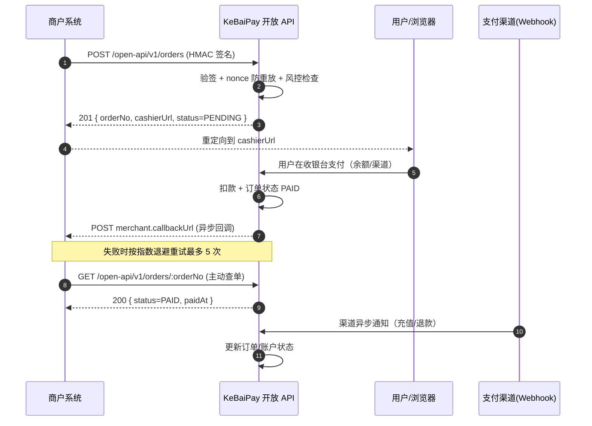

# KeBaiPay API 参考文档

> 完整的 REST API 端点列表、请求/响应格式及认证详情
> 版本 2.0.0 | 共 204 个端点，覆盖 35 个模块

## 目录

- [基础信息](#基础信息)
- [认证方式](#认证方式)
  - [用户 JWT 认证](#用户-jwt-认证)
  - [管理员 JWT 认证](#管理员-jwt-认证)
  - [商户 HMAC 签名认证](#商户-hmac-签名认证)
- [端点列表](#端点列表)
  - [1. 认证接口 (auth)](#1-认证接口-auth)
  - [2. 用户接口 (users)](#2-用户接口-users)
  - [3. 账户接口 (accounts)](#3-账户接口-accounts)
  - [4. 交易接口 (transactions)](#4-交易接口-transactions)
  - [5. 转账接口 (transfers)](#5-转账接口-transfers)
  - [6. 提现接口 (withdrawals)](#6-提现接口-withdrawals)
  - [7. 红包接口 (red-packets)](#7-红包接口-red-packets)
  - [8. 收款码接口 (qr-codes)](#8-收款码接口-qr-codes)
  - [9. 账单接口 (bills)](#9-账单接口-bills)
  - [10. 银行卡接口 (bank-cards) [新增]](#10-银行卡接口-bank-cards-新增)
  - [11. 担保交易接口 (escrow) [S2 新增]](#11-担保交易接口-escrow-s2-新增)
  - [12. 批量转账接口 (batch-transfers) [新增]](#12-批量转账接口-batch-transfers-新增)
  - [13. 订阅接口 (subscriptions) [新增]](#13-订阅接口-subscriptions-新增)
  - [14. 分账接口 (splits) [新增]](#14-分账接口-splits-新增)
  - [15. 优惠券接口 (coupons) [新增]](#15-优惠券接口-coupons-新增)
  - [16. 邀请返现接口 (referrals) [新增]](#16-邀请返现接口-referrals-新增)
  - [17. 消息中心接口 (messages) [新增]](#17-消息中心接口-messages-新增)
  - [18. 发票接口 (invoices) [新增]](#18-发票接口-invoices-新增)
  - [19. 商户接口 (merchants)](#19-商户接口-merchants)
  - [20. 收银台接口 (cashier)](#20-收银台接口-cashier)
  - [21. 开放 API (open-api, HMAC 签名)](#21-开放-api-open-api-hmac-签名)
  - [22. 管理后台接口 (admin)](#22-管理后台接口-admin)
  - [23. 财务接口 (admin/finance)](#23-财务接口-adminfinance)
  - [24. 对账接口 (admin/reconciliation)](#24-对账接口-adminreconciliation)
  - [25. 多平台对账聚合接口 (admin/channel-reconciliation) [S5]](#25-多平台对账聚合接口-adminchannel-reconciliation-s5)
  - [26. AI 风控审计接口 (risk-audit / admin/risk-audit) [S3]](#26-ai-风控审计接口-risk-audit--adminrisk-audit-s3)
  - [27. 自定义规则接口 (admin/risk-rules/custom) [新增]](#27-自定义规则接口-adminrisk-rulescustom-新增)
  - [28. 健康检查 (health)](#28-健康检查-health)
  - [29. 监控指标 (metrics)](#29-监控指标-metrics)
  - [30. 短信接口 (sms)](#30-短信接口-sms)
  - [31. Webhooks 回调接口 (webhooks)](#31-webhooks-回调接口-webhooks)
- [错误码表](#错误码表)
- [分页指南](#分页指南)
- [频率限制](#频率限制)
- [错误处理](#错误处理)

---

## 基础信息

| 项目 | 值 |
|------|-----|
| Base URL | `http://localhost:3000` |
| Swagger 文档 | `http://localhost:3000/api/docs`（仅开发环境） |
| Content-Type | `application/json` |
| 金额单位 | 接口入参/出参：元（Yuan），数据库存储：分（Fen） |
| 时间格式 | ISO 8601（`2025-01-01T00:00:00.000Z`）或 Unix 毫秒时间戳 |
| 字符编码 | UTF-8 |

### 响应格式约定

| 路径 | 返回结构 |
|------|---------|
| 成功响应（HTTP 2xx） | body 直接返回业务数据，不包裹 envelope |
| 异常响应（HTTP 4xx/5xx） | `{ code, message, data: null, traceId }` |
| 所有响应 | 携带 `X-Request-Id` 响应头用于链路追踪 |

### 认证图例

| 图例 | 含义 |
|------|------|
| 🔒 User JWT | 需要 `Authorization: Bearer <user_token>` |
| 🔒 Admin JWT | 需要 `Authorization: Bearer <admin_token>` |
| 🔒 HMAC | 需要商户 HMAC 签名头 |
| 无 | 公开接口，无需认证 |

---

## 认证方式

KeBaiPay 同时支持三种独立的认证方式，分别用于用户端、管理后台与商户开放 API。

### 用户 JWT 认证

适用于 C 端用户接口（`/auth`、`/users`、`/accounts`、`/transactions` 等），由 `JwtAuthGuard`（基于 `@nestjs/passport` 的 `jwt` 策略）守卫。

```http
Authorization: Bearer <user_token>
```

- Token 通过 `POST /auth/login` 或 `POST /auth/register` 获取
- 使用 `JWT_USER_SECRET` 签发，typ 字段声明为 `user`
- 默认有效期由 `JWT_EXPIRES_IN` 控制
- 缺失/过期返回 `401 KB401 签名/认证失败`

### 管理员 JWT 认证

适用于管理后台接口（`/admin/*`），由 `AdminJwtAuthGuard` 守卫，与用户 JWT **完全隔离**：

- 使用独立的 `JWT_ADMIN_SECRET` 签发
- 强制校验 `typ === 'admin'`，防止用户 token 被当 admin token 使用
- 校验管理员账号仍处于 `ACTIVE` 状态
- 使用 DB 中的最新 role（而非 JWT 中的 role），防止降权后权限残留
- 与 `PermissionsGuard` 配合实现细粒度权限校验

```http
Authorization: Bearer <admin_token>
```

权限码共 11 个，详见 [权限码列表](#权限码列表)。

### 商户 HMAC 签名认证

适用于开放 API（`/open-api/v1/*`），由 `OpenApiGuard` 守卫。每个请求需携带四个签名头：

```http
X-App-Id: <app_id>
X-Timestamp: <timestamp_ms>
X-Nonce: <unique_nonce>
X-Signature: <hmac_sha256_hex>
```

**签名算法：**

```text
sign_string = HTTP_METHOD\nPATH\nRAW_BODY\nTIMESTAMP\nNONCE\nAPP_ID
signature   = HMAC-SHA256(app_secret, sign_string)  # 输出小写 hex
```

**安全机制：**

- 时间戳窗口：过去 120 秒 ~ 未来 30 秒，超出返回 `KB401`
- nonce 防重放：Redis `SET NX` 原子去重（Redis 不可用时降级到进程内 Map），TTL 2 分钟
- 签名比对使用 `timingSafeEqual` 防时序攻击
- appSecret 永不出现在请求中，仅服务端持有

### 权限码列表

`@RequirePermissions(...)` 装饰器支持以下 11 个权限码，多权限为 OR 关系：

| 权限码 | 说明 | 默认拥有该权限的角色 |
|--------|------|---------------------|
| `account:adjust` | 人工调账 | SUPER_ADMIN, FINANCE |
| `withdrawal:audit` | 提现审核 | SUPER_ADMIN, FINANCE |
| `reconciliation:run` | 执行对账/快照/结算 | SUPER_ADMIN, FINANCE |
| `reconciliation:diff:handle` | 处理对账差异 | SUPER_ADMIN, FINANCE |
| `finance:view` | 财务数据查看 | SUPER_ADMIN, FINANCE |
| `identity:audit` | 实名审核 | SUPER_ADMIN, CUSTOMER_SERVICE |
| `merchant:audit` | 商户审核/发票开具 | SUPER_ADMIN, CUSTOMER_SERVICE |
| `user:status` | 用户状态/管理员管理 | SUPER_ADMIN, CUSTOMER_SERVICE |
| `risk:config` | 风控规则/系统配置/渠道配置 | SUPER_ADMIN, RISK_OFFICER |
| `risk:event:handle` | 风控事件处理 | SUPER_ADMIN, RISK_OFFICER |
| `admin:view` | 后台基础数据查看 | SUPER_ADMIN, FINANCE, CUSTOMER_SERVICE, RISK_OFFICER |

`SUPER_ADMIN` 拥有 `*`（全部权限）。

---

## 端点列表

### 1. 认证接口 (auth)

用户注册与登录。无需认证；登录注册接口走独立限流（60 秒 5 次）。

| Method | Path | 说明 | 认证 | 权限 |
|--------|------|------|------|------|
| POST | `/auth/register` | 用户注册（手机号或邮箱） | 无 | - |
| POST | `/auth/login` | 用户登录（手机号/邮箱 + 密码） | 无 | - |

#### POST /auth/register

**请求体：**
```json
{
  "nickname": "用户昵称",
  "phone": "13800138000",
  "email": "user@example.com",
  "password": "Password123"
}
```

| 字段 | 类型 | 必填 | 说明 |
|------|------|------|------|
| nickname | string | 是 | 昵称，1-32 字符 |
| phone | string | 否 | 手机号（phone/email 至少提供一个） |
| email | string | 否 | 邮箱 |
| password | string | 是 | 至少 8 位，包含大写/小写/数字中的至少两类 |

**响应 201：**
```json
{
  "accessToken": "eyJhbGciOiJIUzI1NiIsInR5cCI6IkpXVCJ9...",
  "user": {
    "id": "uuid",
    "nickname": "用户昵称",
    "phone": "13800138000",
    "realNameStatus": "UNVERIFIED"
  }
}
```

#### POST /auth/login

**请求体：**
```json
{
  "account": "13800138000",
  "password": "Password123"
}
```

**响应 200：**
```json
{
  "accessToken": "eyJhbGciOiJIUzI1NiIsInR5cCI6IkpXVCJ9...",
  "user": { "id": "uuid", "nickname": "用户昵称" }
}
```

错误码：`KB102 账号或密码错误`、`KB104 账号已冻结`。

---

### 2. 用户接口 (users)

当前用户资料、实名认证、密码与绑定操作。

| Method | Path | 说明 | 认证 | 权限 |
|--------|------|------|------|------|
| GET | `/users/me` | 获取当前用户信息 | 🔒 User JWT | - |
| PATCH | `/users/me` | 更新当前用户资料（昵称/头像） | 🔒 User JWT | - |
| POST | `/users/verify-identity` | 提交实名认证 | 🔒 User JWT | - |
| POST | `/users/reset-pay-password` | 重置支付密码 | 🔒 User JWT | - |
| POST | `/users/change-password` | 修改登录密码 | 🔒 User JWT | - |
| POST | `/users/bind-phone` | 绑定/换绑手机号 | 🔒 User JWT | - |
| POST | `/users/bind-email` | 绑定/换绑邮箱 | 🔒 User JWT | - |
| GET | `/users/login-logs` | 查询最近 30 天登录日志 | 🔒 User JWT | - |
| GET | `/users/daily-limit` | 查询当日限额使用情况 | 🔒 User JWT | - |

#### POST /users/verify-identity

```json
{
  "realName": "张三",
  "idCardNo": "110101199001011234"
}
```

错误码：`KB202 已实名认证`、`KB203 实名审核中`、`KB216 身份证号已被使用`。

#### POST /users/reset-pay-password

```json
{
  "oldPassword": "old12345",
  "newPassword": "new12345"
}
```

错误码：`KB205 支付密码已锁定`、`KB206 未设置支付密码`、`KB207 错误次数过多已锁定`、`KB208 支付密码错误`。

---

### 3. 账户接口 (accounts)

查询当前用户钱包账户与资金流水。

| Method | Path | 说明 | 认证 | 权限 |
|--------|------|------|------|------|
| GET | `/accounts/me` | 获取当前用户账户信息（含资金流水） | 🔒 User JWT | - |

**响应 200：**
```json
{
  "id": "uuid",
  "availableBalanceYuan": "100.00",
  "frozenBalanceYuan": "10.00",
  "totalBalanceYuan": "110.00",
  "ledgers": [
    {
      "id": "uuid",
      "amountYuan": "10.00",
      "balanceBeforeYuan": "90.00",
      "balanceAfterYuan": "100.00",
      "type": "RECHARGE",
      "remark": "充值"
    }
  ]
}
```

---

### 4. 交易接口 (transactions)

钱包充值。

| Method | Path | 说明 | 认证 | 权限 |
|--------|------|------|------|------|
| POST | `/transactions/recharge` | 账户充值（通过支付渠道） | 🔒 User JWT | - |

**请求体：**
```json
{
  "amount": 100.00,
  "payPassword": "12345",
  "idempotencyKey": "recharge-uuid-001"
}
```

错误码：`KB503 充值金额无效`、`KB504 无可用渠道`、`KB003 超出单日限额`、`KB005 余额不足`。

---

### 5. 转账接口 (transfers)

用户间转账。

| Method | Path | 说明 | 认证 | 权限 |
|--------|------|------|------|------|
| POST | `/transfers` | 用户间转账 | 🔒 User JWT | - |

**请求体：**
```json
{
  "toUserId": "uuid-of-payee",
  "amount": 50.00,
  "remark": "请客吃饭",
  "payPassword": "12345",
  "idempotencyKey": "transfer-uuid-001"
}
```

错误码：`KB501 金额无效`、`KB502 不能给自己转账`、`KB005 余额不足`、`KB213 收款用户不存在`、`KB214 对方未实名认证`。

---

### 6. 提现接口 (withdrawals)

申请提现与查询提现记录。

| Method | Path | 说明 | 认证 | 权限 |
|--------|------|------|------|------|
| POST | `/withdrawals` | 申请提现 | 🔒 User JWT | - |
| GET | `/withdrawals` | 查询当前用户的提现记录 | 🔒 User JWT | - |

**POST /withdrawals 请求体：**
```json
{
  "amount": 100.00,
  "payPassword": "12345",
  "bankCardId": "uuid-of-bank-card",
  "remark": "提现到银行卡"
}
```

错误码：`KB506 提现金额无效`、`KB005 余额不足`、`KB212 请先完成实名认证`、`KB217 银行卡不存在`。

---

### 7. 红包接口 (red-packets)

发红包、领红包、查询红包记录。支持拼手气/普通/专属/口令四种类型。

| Method | Path | 说明 | 认证 | 权限 |
|--------|------|------|------|------|
| POST | `/red-packets` | 发红包 | 🔒 User JWT | - |
| POST | `/red-packets/:packetNo/receive` | 领取红包（口令红包需 password） | 🔒 User JWT | - |
| GET | `/red-packets/sent` | 查询已发红包 | 🔒 User JWT | - |
| GET | `/red-packets/received` | 查询已收红包 | 🔒 User JWT | - |

**POST /red-packets 请求体：**
```json
{
  "type": "LUCKY",
  "totalAmount": 88.88,
  "count": 8,
  "greeting": "恭喜发财",
  "payPassword": "12345",
  "designatedUserId": null,
  "password": null
}
```

type 取值：`LUCKY`（拼手气）/ `ORDINARY`（普通）/ `EXCLUSIVE`（专属，需 designatedUserId）/ `PASSWORD`（口令，需 password）。

错误码：`KB613 金额无效`、`KB615 已领取或过期`、`KB616 不能领自己的红包`、`KB622 类型无效`、`KB623 数量无效`、`KB625 非专属收款人`、`KB626 需口令`、`KB627 口令错误`、`KB628 该用户已领取过此红包`。

---

### 8. 收款码接口 (qr-codes)

个人/固定金额收款码管理与扫码付款。

| Method | Path | 说明 | 认证 | 权限 |
|--------|------|------|------|------|
| GET | `/qr-codes/personal` | 获取个人动态收款码 | 🔒 User JWT | - |
| POST | `/qr-codes/fixed` | 创建固定金额收款码 | 🔒 User JWT | - |
| POST | `/qr-codes/pay` | 扫码付款 | 🔒 User JWT | - |

**POST /qr-codes/pay 请求体：**
```json
{
  "code": "QR-xxxxxx",
  "amount": 10.00,
  "payPassword": "12345"
}
```

错误码：`KB610 收款码无效`、`KB611 不能扫自己的码`、`KB619 收款码已失效`、`KB620 商户二维码请通过收银台支付`。

---

### 9. 账单接口 (bills)

查询用户收支账单。

| Method | Path | 说明 | 认证 | 权限 |
|--------|------|------|------|------|
| GET | `/bills` | 查询账单列表（可按 direction 过滤） | 🔒 User JWT | - |

**查询参数：**

| 参数 | 类型 | 必填 | 说明 |
|------|------|------|------|
| direction | string | 否 | `INCOME` / `EXPENSE` |

**响应 200：**
```json
[
  {
    "id": "uuid",
    "type": "TRANSFER",
    "direction": "EXPENSE",
    "amountYuan": "50.00",
    "remark": "转账给张三",
    "createdAt": "2025-01-01T00:00:00.000Z"
  }
]
```

---

### 10. 银行卡接口 (bank-cards) [新增]

用户银行卡绑定、查询、更新、解绑。卡号加密入库，返回脱敏信息。

| Method | Path | 说明 | 认证 | 权限 |
|--------|------|------|------|------|
| POST | `/bank-cards` | 绑定银行卡 | 🔒 User JWT | - |
| GET | `/bank-cards` | 查询我的银行卡列表（脱敏） | 🔒 User JWT | - |
| GET | `/bank-cards/default` | 查询默认银行卡 | 🔒 User JWT | - |
| PATCH | `/bank-cards/:id` | 更新银行卡资料（不可改卡号） | 🔒 User JWT | - |
| DELETE | `/bank-cards/:id` | 解绑银行卡（软删除） | 🔒 User JWT | - |

**POST /bank-cards 请求体：**
```json
{
  "cardNumber": "6222021234567890123",
  "holderName": "张三",
  "bankName": "工商银行",
  "bankBranch": "北京分行",
  "isDefault": true
}
```

错误码：`KB217 银行卡不存在`、`KB218 该银行卡已被绑定`、`KB219 绑卡超过上限（最多 10 张）`、`KB220 卡号格式不正确`。

---

### 11. 担保交易接口 (escrow) [S2 新增]

买卖双方担保交易流程：创建订单 → 买家付款（冻结）→ 卖家发货 → 买家确认收货（放款）。支持退款申请与处理。

| Method | Path | 说明 | 认证 | 权限 |
|--------|------|------|------|------|
| POST | `/escrow/orders` | 创建担保订单（仅创建不扣款） | 🔒 User JWT | - |
| POST | `/escrow/orders/:orderNo/pay` | 买家付款（冻结到 frozenBalance） | 🔒 User JWT | - |
| POST | `/escrow/orders/:orderNo/ship` | 卖家标记发货 | 🔒 User JWT | - |
| POST | `/escrow/orders/:orderNo/confirm` | 买家确认收货（放款） | 🔒 User JWT | - |
| POST | `/escrow/orders/:orderNo/refund-request` | 买家申请退款（仅 SHIPPED 状态） | 🔒 User JWT | - |
| POST | `/escrow/orders/:orderNo/refund-resolve` | 卖家处理退款（APPROVE_REFUND/REJECT_REFUND） | 🔒 User JWT | - |
| POST | `/escrow/orders/:orderNo/cancel` | 买家取消订单（仅 CREATED 状态） | 🔒 User JWT | - |
| GET | `/escrow/orders/:orderNo` | 查询担保订单详情 | 🔒 User JWT | - |
| GET | `/escrow/orders` | 列出担保订单（role=buyer/seller/all） | 🔒 User JWT | - |

**POST /escrow/orders 请求体：**
```json
{
  "sellerUserId": "uuid-of-seller",
  "amount": 1000.00,
  "subject": "iPhone 15",
  "body": "二手 iPhone 15 128G"
}
```

**POST /escrow/orders/:orderNo/pay 请求体：**
```json
{ "payPassword": "12345" }
```

订单状态机：`CREATED` → `PAID` → `SHIPPED` → `COMPLETED` / `REFUND_REQUESTED` → `REFUNDED` / `REJECTED` → `CANCELLED` / `EXPIRED`。

- 付款前有效期：30 分钟
- 发货后自动确认时间：7 天
- 日限额默认：5 万元

错误码：`KB630 担保订单不存在`、`KB631 状态不允许该操作`、`KB632 只有买家可以执行此操作`、`KB633 只有卖家可以执行此操作`、`KB634 不能与自己进行担保交易`、`KB635 必须填写原因`、`KB636 订单已被处理`、`KB637 担保订单已过期`、`KB638 状态已变化`。

---

### 12. 批量转账接口 (batch-transfers) [新增]

一次性向多个收款方转账，原子提交、逐笔处理。

| Method | Path | 说明 | 认证 | 权限 |
|--------|------|------|------|------|
| POST | `/batch-transfers` | 提交批量转账 | 🔒 User JWT | - |
| GET | `/batch-transfers/:batchNo` | 查询批次详情（含全部明细） | 🔒 User JWT | - |
| GET | `/batch-transfers` | 列出我的批次（分页） | 🔒 User JWT | - |
| POST | `/batch-transfers/:batchNo/cancel` | 取消批次（PENDING/PROCESSING 可取消） | 🔒 User JWT | - |

**POST /batch-transfers 请求体：**
```json
{
  "items": [
    { "toUserId": "uuid-1", "amount": 10.00, "remark": "工资" },
    { "toUserId": "uuid-2", "amount": 20.00, "remark": "报销" }
  ],
  "payPassword": "12345",
  "idempotencyKey": "batch-uuid-001"
}
```

约束：单批次最多 500 笔，单笔上限 5000 元，单日累计 5 万元。

错误码：`KB640 批次不存在`、`KB641 明细不能为空`、`KB642 明细数超过上限（500 笔）`、`KB643 存在重复收款方`、`KB644 明细参数无效`、`KB645 批次状态不允许取消`。

---

### 13. 订阅接口 (subscriptions) [新增]

商家创建订阅计划，用户订阅后按周期自动扣款。

| Method | Path | 说明 | 认证 | 权限 |
|--------|------|------|------|------|
| POST | `/subscriptions/plans` | 创建订阅计划 | 🔒 User JWT | - |
| GET | `/subscriptions/plans/:planNo` | 查询计划详情 | 🔒 User JWT | - |
| GET | `/subscriptions/plans` | 列出我的订阅计划 | 🔒 User JWT | - |
| PUT | `/subscriptions/plans/:planNo/status` | 启用/禁用计划 | 🔒 User JWT | - |
| POST | `/subscriptions/:planNo/subscribe` | 订阅计划（立即扣首期款或试用期） | 🔒 User JWT | - |
| POST | `/subscriptions/subscriptions/:subscriptionNo/cancel` | 取消订阅 | 🔒 User JWT | - |
| POST | `/subscriptions/subscriptions/:subscriptionNo/suspend` | 暂停订阅 | 🔒 User JWT | - |
| POST | `/subscriptions/subscriptions/:subscriptionNo/resume` | 恢复订阅 | 🔒 User JWT | - |
| GET | `/subscriptions/subscriptions/:subscriptionNo` | 查询订阅详情 | 🔒 User JWT | - |
| GET | `/subscriptions/subscriptions` | 列出我的订阅 | 🔒 User JWT | - |
| GET | `/subscriptions/subscriptions/:subscriptionNo/charges` | 列出订阅扣款记录 | 🔒 User JWT | - |

**POST /subscriptions/plans 请求体：**
```json
{
  "name": "月度会员",
  "period": "MONTHLY",
  "amount": 30.00,
  "totalCycles": null,
  "description": "每月自动扣款",
  "trialPeriodDays": 7
}
```

period 取值：`DAILY` / `WEEKLY` / `MONTHLY` / `YEARLY`。

约束：每期金额上限 10000 元，单用户订阅计划数上限 100，连续失败 3 次自动暂停。

错误码：`KB650 计划不存在`、`KB651 计划已下架`、`KB652 订阅不存在`、`KB653 订阅状态不允许该操作`、`KB654 已订阅该计划`、`KB655 扣款记录不存在`、`KB656 不能订阅自己的计划`、`KB657 周期参数无效`、`KB658 订阅金额必须大于 0`。

---

### 14. 分账接口 (splits) [新增]

将一笔已支付订单的金额按比例/固定金额分给多个接收方。

| Method | Path | 说明 | 认证 | 权限 |
|--------|------|------|------|------|
| POST | `/splits` | 发起分账 | 🔒 User JWT | - |
| GET | `/splits/:splitNo` | 查询分账订单详情 | 🔒 User JWT | - |
| GET | `/splits` | 列出我的分账订单 | 🔒 User JWT | - |
| POST | `/splits/:splitNo/cancel` | 取消分账（仅 PENDING 状态） | 🔒 User JWT | - |

**POST /splits 请求体：**
```json
{
  "sourceOrderNo": "PAY-xxxxxxxxxxxx",
  "receivers": [
    { "userId": "uuid-1", "amount": 10.00 },
    { "userId": "uuid-2", "amount": 5.00 }
  ],
  "remark": "分账给合作方"
}
```

约束：单次最多 50 个接收方，单笔 0.01 ~ 10000 元，单日累计 5 万元。

错误码：`KB660 分账订单不存在`、`KB661 源订单不存在或非已支付状态`、`KB662 分账总额超过源订单可分账金额`、`KB663 存在重复接收方`、`KB664 接收方无效`、`KB665 状态不允许该操作`、`KB666 明细不存在`、`KB667 金额必须大于 0`、`KB668 至少包含 1 个接收方`。

---

### 15. 优惠券接口 (coupons) [新增]

商家创建优惠券，用户领取/使用优惠券。

| Method | Path | 说明 | 认证 | 权限 |
|--------|------|------|------|------|
| POST | `/coupons` | 创建优惠券 | 🔒 User JWT | - |
| GET | `/coupons/:couponNo` | 查询优惠券详情 | 🔒 User JWT | - |
| GET | `/coupons` | 列出我创建的优惠券 | 🔒 User JWT | - |
| PUT | `/coupons/:couponNo/status` | 启用/禁用优惠券 | 🔒 User JWT | - |
| POST | `/coupons/:couponNo/claim` | 领取优惠券 | 🔒 User JWT | - |
| GET | `/coupons/mine/list` | 列出我领取的优惠券 | 🔒 User JWT | - |
| POST | `/coupons/mine/:userCouponNo/use` | 使用用户优惠券 | 🔒 User JWT | - |
| GET | `/coupons/mine/:userCouponNo` | 查询用户优惠券详情 | 🔒 User JWT | - |

**POST /coupons 请求体：**
```json
{
  "name": "满 100 减 20",
  "type": "DISCOUNT",
  "value": 20.00,
  "minAmount": 100.00,
  "quota": 1000,
  "validFrom": "2025-01-01T00:00:00.000Z",
  "validUntil": "2025-12-31T23:59:59.000Z"
}
```

**POST /coupons/mine/:userCouponNo/use 请求体：**
```json
{ "orderAmount": 150.00 }
```

**响应：**
```json
{
  "discountAmount": 20.00,
  "finalAmount": 130.00,
  "userCouponNo": "UC-xxxxxx"
}
```

错误码：`KB670 优惠券不存在`、`KB671 已下架`、`KB672 已过期`、`KB673 已领完`、`KB674 已领取过`、`KB675 面值无效`、`KB676 状态不允许该操作`、`KB677 用户优惠券不存在`、`KB678 已被使用`。

---

### 16. 邀请返现接口 (referrals) [新增]

邀请人/被邀请人双向操作：生成邀请码、绑定邀请关系、触发奖励发放。

| Method | Path | 说明 | 认证 | 权限 |
|--------|------|------|------|------|
| POST | `/referrals/code` | 生成或获取我的邀请码 | 🔒 User JWT | - |
| GET | `/referrals/code` | 查询我的邀请码 | 🔒 User JWT | - |
| GET | `/referrals/stats` | 我的邀请统计 | 🔒 User JWT | - |
| GET | `/referrals` | 列出我邀请的人 | 🔒 User JWT | - |
| GET | `/referrals/:referralNo` | 查询邀请关系详情 | 🔒 User JWT | - |
| POST | `/referrals/:referralNo/cancel` | 取消邀请关系（仅 PENDING） | 🔒 User JWT | - |
| POST | `/referrals/bind` | 绑定邀请关系（被邀请人调用） | 🔒 User JWT | - |
| POST | `/referrals/mine/trigger` | 触发我的邀请奖励发放 | 🔒 User JWT | - |

**POST /referrals/bind 请求体：**
```json
{ "referralCode": "ABC12345" }
```

**POST /referrals/mine/trigger 请求体：**
```json
{
  "transactionType": "TRANSFER",
  "transactionNo": "TX-xxxxxx",
  "amount": 100.00
}
```

约束：邀请码 8 位（去除易混字符 0/O/I/1），默认奖励 10 元，最大 1000 元，触发交易最小金额 1 元。

错误码：`KB680 邀请码不存在`、`KB681 邀请码已存在`、`KB682 邀请关系不存在`、`KB683 已绑定邀请关系`、`KB684 不能邀请自己`、`KB685 状态不允许该操作`、`KB686 奖励配置无效`、`KB687 触发奖励的交易无效`、`KB688 邀请关系非待结算状态`。

---

### 17. 消息中心接口 (messages) [新增]

用户消息列表、未读数量、标记已读、删除定向消息。

| Method | Path | 说明 | 认证 | 权限 |
|--------|------|------|------|------|
| GET | `/messages` | 我的消息列表（广播+定向） | 🔒 User JWT | - |
| GET | `/messages/unread/count` | 我的未读消息数量 | 🔒 User JWT | - |
| POST | `/messages/read/all` | 一键全部已读 | 🔒 User JWT | - |
| GET | `/messages/:messageNo` | 消息详情 | 🔒 User JWT | - |
| POST | `/messages/:messageNo/read` | 标记消息已读 | 🔒 User JWT | - |
| POST | `/messages/:messageNo/delete` | 删除定向消息（广播不可删） | 🔒 User JWT | - |

错误码：`KB690 消息不存在`、`KB691 消息已读`、`KB692 消息不可删除`。

---

### 18. 发票接口 (invoices) [新增]

商户申请发票，管理员开具/作废。

| Method | Path | 说明 | 认证 | 权限 |
|--------|------|------|------|------|
| POST | `/invoices` | 商户申请发票 | 🔒 User JWT | - |
| GET | `/invoices` | 商户查询自己的发票列表 | 🔒 User JWT | - |
| GET | `/invoices/:invoiceNo` | 查询发票详情 | 🔒 User JWT | - |
| POST | `/invoices/:invoiceNo/cancel` | 商户作废自己的发票（仅 PENDING） | 🔒 User JWT | - |
| GET | `/admin/invoices` | 管理员查询所有发票列表 | 🔒 Admin JWT | `admin:view` |
| GET | `/admin/invoices/:invoiceNo` | 管理员查询发票详情 | 🔒 Admin JWT | `admin:view` |
| POST | `/admin/invoices/:invoiceNo/issue` | 管理员开具发票 | 🔒 Admin JWT | `merchant:audit` |
| POST | `/admin/invoices/:invoiceNo/cancel` | 管理员作废发票 | 🔒 Admin JWT | `merchant:audit` |

**POST /invoices 请求体：**
```json
{
  "title": "北京某某科技有限公司",
  "taxNo": "91110100XXXXXXXXXX",
  "amount": 1000.00,
  "type": "VAT_GENERAL",
  "email": "finance@example.com"
}
```

错误码：`KB695 发票不存在`、`KB696 状态不允许该操作`、`KB697 金额必须大于 0`、`KB698 无权操作该发票`。

---

### 19. 商户接口 (merchants)

商户入驻、资料管理、应用管理、收款码、数据看板。

| Method | Path | 说明 | 认证 | 权限 |
|--------|------|------|------|------|
| POST | `/merchants/register` | 商户入驻申请 | 🔒 User JWT | - |
| GET | `/merchants/me` | 获取当前商户信息 | 🔒 User JWT | - |
| PATCH | `/merchants/me` | 更新商户资料（PENDING/REJECTED 状态） | 🔒 User JWT | - |
| POST | `/merchants/apps` | 创建商户应用（获取 appId/appSecret） | 🔒 User JWT | - |
| GET | `/merchants/apps` | 列出商户所有应用 | 🔒 User JWT | - |
| PATCH | `/merchants/apps/:appId` | 更新应用设置（名称/回调地址） | 🔒 User JWT | - |
| POST | `/merchants/apps/:appId/regenerate-secret` | 重新生成应用密钥 | 🔒 User JWT | - |
| GET | `/merchants/dashboard` | 商户数据看板 | 🔒 User JWT | - |
| POST | `/merchants/qrcodes` | 创建商户收款码 | 🔒 User JWT | - |
| GET | `/merchants/qrcodes` | 列出商户收款码 | 🔒 User JWT | - |
| DELETE | `/merchants/qrcodes/:id` | 删除商户收款码 | 🔒 User JWT | - |

**POST /merchants/register 请求体：**
```json
{
  "name": "某某餐饮店",
  "shortName": "某某",
  "contactPhone": "13800138000",
  "contactEmail": "owner@example.com",
  "businessLicense": "91110100XXXXXXXXXX",
  "category": "CATERING"
}
```

**POST /merchants/apps 响应 201：**
```json
{
  "appId": "app_xxxxxxxxxxxx",
  "appSecret": "sk_xxxxxxxxxxxxxxxxxxxxxxxx",
  "name": "线上收银台",
  "callbackUrl": "https://merchant.example.com/callback"
}
```

> ⚠️ appSecret 仅在创建与重置时返回一次，请妥善保管。

错误码：`KB301 已申请过商户`、`KB302 商户信息不存在`、`KB303 当前状态不可修改`、`KB304 商户不存在`、`KB309 无变更`、`KB310 商户未审核通过`、`KB311 应用不存在`、`KB312 收款码不存在`、`KB225 应用名称不能为空`。

---

### 20. 收银台接口 (cashier)

用户向商户付款的收银台订单全流程，含 CSV 导出与对账查询。

| Method | Path | 说明 | 认证 | 权限 |
|--------|------|------|------|------|
| POST | `/cashier/orders` | 创建收银台订单 | 🔒 User JWT | - |
| GET | `/cashier/orders` | 查询我的收银台订单（分页） | 🔒 User JWT | - |
| GET | `/cashier/orders/export` | 导出订单 CSV | 🔒 User JWT | - |
| GET | `/cashier/orders/reconciliation` | 对账查询（按日期范围） | 🔒 User JWT | - |
| GET | `/cashier/orders/:orderNo` | 查询订单详情 | 🔒 User JWT | - |
| POST | `/cashier/orders/:orderNo/pay` | 支付订单（余额支付） | 🔒 User JWT | - |
| POST | `/cashier/orders/:orderNo/notify` | 重试回调通知 | 🔒 User JWT | - |
| GET | `/cashier/qrcode/:code` | 扫码获取收款信息（无需登录） | 无 | - |

**POST /cashier/orders 请求体：**
```json
{
  "merchantOrderNo": "M-2025-001",
  "merchantId": "uuid-of-merchant",
  "amount": 100.00,
  "subject": "订单标题",
  "body": "订单描述",
  "expiredAt": "2025-01-01T01:00:00.000Z"
}
```

**POST /cashier/orders/:orderNo/pay 请求体：**
```json
{ "payPassword": "12345" }
```

错误码：`KB601 商户订单号已存在`、`KB602 过期时间必须在未来`、`KB603 订单不存在`、`KB604 商户当前不可收款`、`KB605 商户用户不存在`、`KB606 订单状态已变化`、`KB607 该订单未配置回调地址`、`KB608 该订单已通知成功`、`KB612 商户状态异常`、`KB621 幂等键冲突`。

---

### 21. 开放 API (open-api, HMAC 签名)

商户服务端通过 HMAC 签名调用，实现下单、查单、退款、转账、查余额。

| Method | Path | 说明 | 认证 | 权限 |
|--------|------|------|------|------|
| POST | `/open-api/v1/orders` | 创建收款订单（返回收银台链接） | 🔒 HMAC | - |
| GET | `/open-api/v1/orders/:orderNo` | 查询订单详情 | 🔒 HMAC | - |
| POST | `/open-api/v1/refunds` | 申请退款（全额或部分） | 🔒 HMAC | - |
| POST | `/open-api/v1/transfers` | 商户转账（向用户转账） | 🔒 HMAC | - |
| GET | `/open-api/v1/balance` | 查询商户余额 | 🔒 HMAC | - |

#### POST /open-api/v1/orders

**请求头（除签名头外）：**
```http
Content-Type: application/json
X-App-Id: app_xxxxxxxxxxxx
X-Timestamp: 1735689600000
X-Nonce: 7f8e9d6c-5b4a-3210-fedc-ba9876543210
X-Signature: 9c8b7a6f5e4d3c2b1a0987654321fedcba9876543210987654321fedcba98765
```

**请求体：**
```json
{
  "merchantOrderNo": "M-2025-001",
  "amount": 100.00,
  "subject": "订单标题",
  "body": "订单描述",
  "callbackUrl": "https://merchant.example.com/callback",
  "expiredAt": "2025-01-01T01:00:00.000Z"
}
```

**响应 201：**
```json
{
  "orderNo": "PAY-20250101-xxxxxx",
  "merchantOrderNo": "M-2025-001",
  "amount": 100.00,
  "status": "PENDING",
  "cashierUrl": "https://cashier.kebai.com/pay/PAY-20250101-xxxxxx",
  "expiredAt": "2025-01-01T01:00:00.000Z"
}
```

#### POST /open-api/v1/refunds

```json
{
  "orderNo": "PAY-20250101-xxxxxx",
  "refundAmount": 50.00,
  "reason": "部分退款",
  "idempotencyKey": "refund-uuid-001"
}
```

#### 支付流程时序图



错误码：`KB401 签名/认证失败`、`KB403 无权操作该订单`、`KB603 订单不存在`、`KB711 金额必须大于 0`、`KB712 订单有效期不能超过 24 小时`、`KB713 订单状态不可退款`、`KB714 订单已全额退款`、`KB715 退款金额必须大于 0`、`KB716 退款金额超过可退金额`、`KB717 应用已禁用`。

---

### 22. 管理后台接口 (admin)

管理后台各模块：认证、管理员管理、用户管理、商户审核、提现审核、风控、实名审核、调账、审计日志等。

#### 22.1 管理员认证 (admin/auth)

| Method | Path | 说明 | 认证 | 权限 |
|--------|------|------|------|------|
| POST | `/admin/auth/login` | 管理员登录 | 无 | - |
| POST | `/admin/auth/change-password` | 修改管理员密码 | 🔒 Admin JWT | - |

#### 22.2 管理员管理 (admin/admin-users)

| Method | Path | 说明 | 认证 | 权限 |
|--------|------|------|------|------|
| GET | `/admin/admin-users` | 管理员列表 | 🔒 Admin JWT | `user:status` |
| POST | `/admin/admin-users` | 创建管理员 | 🔒 Admin JWT | `user:status` |
| PUT | `/admin/admin-users/:id` | 更新管理员信息 | 🔒 Admin JWT | `user:status` |
| DELETE | `/admin/admin-users/:id` | 删除管理员 | 🔒 Admin JWT | `user:status` |
| POST | `/admin/admin-users/:id/reset-password` | 重置管理员密码 | 🔒 Admin JWT | `user:status` |

#### 22.3 通用管理 (admin)

| Method | Path | 说明 | 认证 | 权限 |
|--------|------|------|------|------|
| GET | `/admin/dashboard` | 管理后台数据概览 | 🔒 Admin JWT | `admin:view` |
| GET | `/admin/users` | 用户列表（分页） | 🔒 Admin JWT | `admin:view` |
| GET | `/admin/users/:id` | 用户详情 | 🔒 Admin JWT | `admin:view` |
| POST | `/admin/users/:id/status` | 修改用户状态（冻结/解冻） | 🔒 Admin JWT | `user:status` |
| POST | `/admin/users/:id/risk-level` | 修改用户风控等级 | 🔒 Admin JWT | `risk:config` |
| GET | `/admin/merchants` | 商户列表（分页） | 🔒 Admin JWT | `admin:view` |
| POST | `/admin/merchants/:id/audit` | 审核商户（通过/拒绝） | 🔒 Admin JWT | `merchant:audit` |
| POST | `/admin/merchants/:id/config` | 修改商户配置（费率/日限额） | 🔒 Admin JWT | `merchant:audit` |
| GET | `/admin/withdrawals` | 提现审核列表 | 🔒 Admin JWT | `admin:view` |
| POST | `/admin/withdrawals/:id/approve` | 通过提现申请 | 🔒 Admin JWT | `withdrawal:audit` |
| POST | `/admin/withdrawals/:id/reject` | 拒绝提现申请 | 🔒 Admin JWT | `withdrawal:audit` |
| GET | `/admin/payment-orders` | 支付订单列表 | 🔒 Admin JWT | `admin:view` |
| GET | `/admin/risk-events` | 风控事件列表 | 🔒 Admin JWT | `admin:view` |
| POST | `/admin/risk-events/:id/handle` | 处理风控事件 | 🔒 Admin JWT | `risk:event:handle` |
| GET | `/admin/login-logs` | 登录日志 | 🔒 Admin JWT | `admin:view` |
| GET | `/admin/system-configs` | 获取系统配置 | 🔒 Admin JWT | `risk:config` |
| POST | `/admin/system-configs` | 设置系统配置 | 🔒 Admin JWT | `risk:config` |
| GET | `/admin/risk-rules` | 获取风控规则 | 🔒 Admin JWT | `risk:config` |
| PUT | `/admin/risk-rules/:code` | 更新风控规则 | 🔒 Admin JWT | `risk:config` |
| GET | `/admin/identity/pending` | 待审核实名列表 | 🔒 Admin JWT | `admin:view` |
| POST | `/admin/identity/:id/approve` | 通过实名认证 | 🔒 Admin JWT | `identity:audit` |
| POST | `/admin/identity/:id/reject` | 拒绝实名认证 | 🔒 Admin JWT | `identity:audit` |
| POST | `/admin/accounts/:userId/adjust` | 人工调账 | 🔒 Admin JWT | `account:adjust` |
| GET | `/admin/audit-logs` | 操作审计日志 | 🔒 Admin JWT | `admin:view` |

#### 22.4 支付渠道配置 (admin/channels)

| Method | Path | 说明 | 认证 | 权限 |
|--------|------|------|------|------|
| GET | `/admin/channels` | 支付渠道列表（敏感字段脱敏） | 🔒 Admin JWT | `admin:view` |
| POST | `/admin/channels` | 创建支付渠道 | 🔒 Admin JWT | `risk:config` |
| PUT | `/admin/channels/:code` | 更新支付渠道 | 🔒 Admin JWT | `risk:config` |
| DELETE | `/admin/channels/:code` | 删除支付渠道 | 🔒 Admin JWT | `risk:config` |
| POST | `/admin/channels/:code/test` | 测试支付渠道 | 🔒 Admin JWT | `risk:config` |

#### 22.5 系统配置 (admin/system-config)

| Method | Path | 说明 | 认证 | 权限 |
|--------|------|------|------|------|
| GET | `/admin/system-config` | 获取所有系统配置 | 🔒 Admin JWT | `risk:config` |
| GET | `/admin/system-config/:key` | 获取指定配置项 | 🔒 Admin JWT | `risk:config` |
| POST | `/admin/system-config` | 创建系统配置 | 🔒 Admin JWT | `risk:config` |
| PUT | `/admin/system-config/:key` | 更新系统配置 | 🔒 Admin JWT | `risk:config` |

#### POST /admin/merchants/:id/audit 请求体：
```json
{
  "action": "APPROVE",
  "reason": null
}
```
或拒绝：
```json
{
  "action": "REJECT",
  "reason": "营业执照不清晰"
}
```

#### POST /admin/accounts/:userId/adjust 请求体：
```json
{
  "amount": 100.00,
  "reason": "客服补偿"
}
```
> amount 正数为加款，负数为扣款；为 0 报 `KB006`；reason 必填否则报 `KB007`。

#### POST /admin/withdrawals/:id/reject 请求体：
```json
{ "reason": "风控拒绝" }
```
> reason 必填，否则报 `KB008`。

错误码：`KB910 管理员不存在`、`KB911 用户名已存在`、`KB912 不能删除自己`、`KB913 旧密码错误`、`KB914 配置键已存在`、`KB915 配置键不存在`、`KB916 权限不足`。

---

### 23. 财务接口 (admin/finance)

平台财务概览、每日汇总、商户结算、手续费收入、资产快照、未结算汇总、手动结算。

| Method | Path | 说明 | 认证 | 权限 |
|--------|------|------|------|------|
| GET | `/admin/finance/overview` | 财务概览 | 🔒 Admin JWT | `finance:view` |
| GET | `/admin/finance/daily-summary` | 每日收支汇总 | 🔒 Admin JWT | `finance:view` |
| GET | `/admin/finance/daily-summary/export` | 导出每日汇总 CSV | 🔒 Admin JWT | `finance:view` |
| GET | `/admin/finance/merchant-settlements` | 商户结算明细 | 🔒 Admin JWT | `finance:view` |
| GET | `/admin/finance/merchant-settlements/export` | 导出商户结算 CSV | 🔒 Admin JWT | `finance:view` |
| GET | `/admin/finance/fee-income` | 手续费收入统计 | 🔒 Admin JWT | `finance:view` |
| GET | `/admin/finance/fee-income/export` | 导出手续费 CSV | 🔒 Admin JWT | `finance:view` |
| GET | `/admin/finance/daily-snapshots` | 每日资产快照 | 🔒 Admin JWT | `finance:view` |
| GET | `/admin/finance/snapshots/export` | 导出资产快照 CSV | 🔒 Admin JWT | `finance:view` |
| POST | `/admin/finance/snapshots/generate` | 手动生成每日快照 | 🔒 Admin JWT | `reconciliation:run` |
| GET | `/admin/finance/settlement/unfinished` | 未结算订单汇总 | 🔒 Admin JWT | `finance:view` |
| POST | `/admin/finance/settlement/run` | 手动执行结算 | 🔒 Admin JWT | `reconciliation:run` |

**POST /admin/finance/snapshots/generate 请求体：**
```json
{ "date": "2025-01-01" }
```

错误码：`KB902 复式记账借贷不平衡`。

---

### 24. 对账接口 (admin/reconciliation)

每日对账执行与对账报告查询/导出。

| Method | Path | 说明 | 认证 | 权限 |
|--------|------|------|------|------|
| POST | `/admin/reconciliation/run` | 执行对账 | 🔒 Admin JWT | `reconciliation:run` |
| GET | `/admin/reconciliation/reports` | 对账报告列表 | 🔒 Admin JWT | `finance:view` |
| GET | `/admin/reconciliation/reports/export` | 导出对账报告 CSV | 🔒 Admin JWT | `finance:view` |
| GET | `/admin/reconciliation/reports/:date` | 查询指定日期对账报告 | 🔒 Admin JWT | `finance:view` |

**POST /admin/reconciliation/run 请求体：**
```json
{ "date": "2025-01-01" }
```

---

### 25. 多平台对账聚合接口 (admin/channel-reconciliation) [S5]

聚合多个支付渠道对账单，与平台订单交叉匹配，生成差异项并走指派/解决工作流。

| Method | Path | 说明 | 认证 | 权限 |
|--------|------|------|------|------|
| POST | `/admin/channel-reconciliation/statements/fetch` | 拉取渠道对账单 | 🔒 Admin JWT | `reconciliation:run` |
| GET | `/admin/channel-reconciliation/statements` | 渠道对账单列表 | 🔒 Admin JWT | `finance:view` |
| GET | `/admin/channel-reconciliation/statements/:id` | 对账单详情（含前 50 条 items） | 🔒 Admin JWT | `finance:view` |
| GET | `/admin/channel-reconciliation/statements/:id/items` | 对账单条目分页查询 | 🔒 Admin JWT | `finance:view` |
| POST | `/admin/channel-reconciliation/statements/:id/match` | 执行匹配（生成差异项） | 🔒 Admin JWT | `reconciliation:run` |
| GET | `/admin/channel-reconciliation/differences` | 差异项列表 | 🔒 Admin JWT | `finance:view` |
| GET | `/admin/channel-reconciliation/differences/:id` | 差异项详情 | 🔒 Admin JWT | `finance:view` |
| POST | `/admin/channel-reconciliation/differences/:id/assign` | 指派差异处理人（PENDING→INVESTIGATING） | 🔒 Admin JWT | `reconciliation:diff:handle` |
| POST | `/admin/channel-reconciliation/differences/:id/resolve` | 标记差异已解决（INVESTIGATING→RESOLVED/IGNORED） | 🔒 Admin JWT | `reconciliation:diff:handle` |

**POST /admin/channel-reconciliation/statements/fetch 请求体：**
```json
{
  "channel": "alipay",
  "date": "2025-01-01"
}
```

**POST /admin/channel-reconciliation/differences/:id/resolve 请求体：**
```json
{
  "resolution": "RESOLVED",
  "note": "渠道延迟到账，已补单"
}
```

错误码：`KB940 渠道对账单不存在`、`KB941 已拉取不可重复拉取`、`KB942 拉取失败`、`KB943 对账单未拉取`、`KB944 对账差异项不存在`、`KB945 差异项状态不允许该操作`。

---

### 26. AI 风控审计接口 (risk-audit / admin/risk-audit) [S3]

用户与 AI 对话式风控审计会话。用户端创建/查询/对话/关闭；管理端查看所有会话与统计。

#### 26.1 用户端 (risk-audit)

| Method | Path | 说明 | 认证 | 权限 |
|--------|------|------|------|------|
| POST | `/risk-audit/sessions` | 创建风控审计会话 | 🔒 User JWT | - |
| GET | `/risk-audit/sessions` | 查询我的会话列表 | 🔒 User JWT | - |
| GET | `/risk-audit/sessions/:sessionNo` | 查询会话详情（含消息） | 🔒 User JWT | - |
| POST | `/risk-audit/sessions/:sessionNo/messages` | 发送消息并获取 AI 回复 | 🔒 User JWT | - |
| POST | `/risk-audit/sessions/:sessionNo/close` | 关闭会话 | 🔒 User JWT | - |

#### 26.2 管理端 (admin/risk-audit)

| Method | Path | 说明 | 认证 | 权限 |
|--------|------|------|------|------|
| GET | `/admin/risk-audit/sessions` | 管理员查询所有会话 | 🔒 Admin JWT | `admin:view` |
| GET | `/admin/risk-audit/sessions/:sessionNo` | 管理员查询任意会话详情 | 🔒 Admin JWT | `admin:view` |
| GET | `/admin/risk-audit/stats` | 管理员查询会话统计 | 🔒 Admin JWT | `admin:view` |

**POST /risk-audit/sessions 请求体：**
```json
{
  "title": "查询我的转账被拦截原因",
  "context": { "transactionNo": "TX-xxxxxx" }
}
```

**POST /risk-audit/sessions/:sessionNo/messages 请求体：**
```json
{ "content": "为什么我的转账会被风控拦截？" }
```

错误码：`KB920 风控审计会话不存在`、`KB921 会话已关闭`、`KB922 消息内容不能为空`、`KB923 无权访问该会话`。

---

### 27. 自定义规则接口 (admin/risk-rules/custom) [新增]

管理端创建/更新/删除/测试自定义风控规则；用户端只读查看当前生效规则。

#### 27.1 管理端 (admin/risk-rules/custom)

| Method | Path | 说明 | 认证 | 权限 |
|--------|------|------|------|------|
| POST | `/admin/risk-rules/custom` | 创建自定义规则 | 🔒 Admin JWT | `risk:config` |
| GET | `/admin/risk-rules/custom` | 查询自定义规则列表 | 🔒 Admin JWT | `admin:view` |
| GET | `/admin/risk-rules/custom/:ruleNo` | 查询自定义规则详情 | 🔒 Admin JWT | `admin:view` |
| PUT | `/admin/risk-rules/custom/:ruleNo` | 更新自定义规则 | 🔒 Admin JWT | `risk:config` |
| DELETE | `/admin/risk-rules/custom/:ruleNo` | 删除自定义规则 | 🔒 Admin JWT | `risk:config` |
| POST | `/admin/risk-rules/custom/:ruleNo/toggle` | 启用/禁用规则 | 🔒 Admin JWT | `risk:config` |
| POST | `/admin/risk-rules/custom/test` | 测试规则（不持久化） | 🔒 Admin JWT | `risk:config` |

#### 27.2 用户端 (risk-rules/custom)

| Method | Path | 说明 | 认证 | 权限 |
|--------|------|------|------|------|
| GET | `/risk-rules/custom` | 用户查询当前生效的自定义规则（仅返回名称/描述/动作/优先级） | 🔒 User JWT | - |

**POST /admin/risk-rules/custom 请求体：**
```json
{
  "name": "大额转账二次校验",
  "description": "转账金额超过 5000 元触发人工审核",
  "priority": 100,
  "action": "REVIEW",
  "conditions": [
    { "field": "amount", "operator": "GTE", "value": 5000 },
    { "field": "type", "operator": "EQ", "value": "TRANSFER" }
  ]
}
```

**POST /admin/risk-rules/custom/test 请求体：**
```json
{
  "conditions": [
    { "field": "amount", "operator": "GTE", "value": 5000 }
  ],
  "payload": { "amount": 6000, "type": "TRANSFER" }
}
```

错误码：`KB930 自定义规则不存在`、`KB931 规则名称已存在`、`KB932 规则条件格式无效`、`KB933 条件字段无效`、`KB934 条件算子无效`。

---

### 28. 健康检查 (health)

K8s/Docker 探针端点，`@SkipThrottle()` 不受限流，返回原始结构不经响应包装。

| Method | Path | 说明 | 认证 | 权限 |
|--------|------|------|------|------|
| GET | `/health` | 存活探针（liveness） | 无 | - |
| GET | `/health/ready` | 就绪探针（检查 DB/Redis，失败返回 503） | 无 | - |
| GET | `/health/schedules` | 调度任务健康状态 | 无 | - |
| GET | `/health/channels` | 支付渠道健康状态 | 无 | - |
| GET | `/health/channels/summary` | 支付渠道健康摘要 | 无 | - |

**GET /health 响应 200：**
```json
{ "status": "ok", "timestamp": "2025-01-01T00:00:00.000Z" }
```

**GET /health/ready 失败响应 503：**
```json
{ "status": "error", "timestamp": "2025-01-01T00:00:00.000Z" }
```

---

### 29. 监控指标 (metrics)

Prometheus 指标暴露端点。`@SkipThrottle()` 不受限流，返回纯文本。

| Method | Path | 说明 | 认证 | 权限 |
|--------|------|------|------|------|
| GET | `/metrics` | Prometheus 指标（供 Prometheus server 抓取） | 无 | - |

**响应头：** `Content-Type: text/plain; version=0.0.4; charset=utf-8`

> ⚠️ 生产环境建议通过反向代理或网络策略限制 `/metrics` 仅内网可访问，避免暴露内部运行时指标给公网。

---

### 30. 短信接口 (sms)

短信验证码发送/校验与配置查询。无需登录，防轰炸靠手机号 + IP 双维度限流。

| Method | Path | 说明 | 认证 | 权限 |
|--------|------|------|------|------|
| POST | `/sms/send` | 发送验证码 | 无 | - |
| POST | `/sms/verify` | 验证码校验 | 无 | - |
| GET | `/sms/config` | 获取短信配置状态 | 无 | - |

**POST /sms/send 请求体：**
```json
{
  "phone": "13800138000",
  "scene": "login"
}
```
scene 取值：`login` / `register` / `reset_password` / `bind_phone` / `bind_email`。

**响应 200：**
```json
{ "success": true, "message": "验证码已发送" }
```

**POST /sms/verify 请求体：**
```json
{
  "phone": "13800138000",
  "code": "123456",
  "scene": "login"
}
```

**响应 200：**
```json
{ "valid": true }
```

错误码：`KB224 短信验证码错误或已过期`。

---

### 31. Webhooks 回调接口 (webhooks)

支付渠道服务端回调通知入口。无需登录态，由渠道签名/校验在 service 层完成。

| Method | Path | 说明 | 认证 | 权限 |
|--------|------|------|------|------|
| POST | `/webhooks/recharge/:channel` | 充值回调 | 渠道签名校验 | - |
| POST | `/webhooks/payout/:channel` | 代付回调 | 渠道签名校验 | - |
| POST | `/webhooks/refund/:channel` | 退款回调 | 渠道签名校验 | - |

:channel 取值：`alipay` / `wechat-pay` / `mock` 等。

**POST /webhooks/recharge/alipay 请求体（示例，由渠道决定）：**
```json
{
  "out_trade_no": "PAY-20250101-xxxxxx",
  "trade_status": "TRADE_SUCCESS",
  "total_amount": "100.00",
  "sign": "xxxxxxxxxxxx"
}
```

**响应 200：**
```json
{ "code": "SUCCESS", "message": "OK" }
```

错误码：`KB513 订单状态不支持回调处理`、`KB701 回调渠道与订单渠道不匹配`、`KB702 渠道订单号不匹配`。

---

## 错误码表

KeBaiPay 统一错误码范围为 `KB001 ~ KB999`，按业务域分段。所有错误响应 body 形如：

```json
{
  "code": "KB501",
  "message": "KB501 转账金额必须大于 0",
  "data": null,
  "traceId": "abc-123"
}
```

### KB001-KB099 系统/通用

| 错误码 | 名称 | 消息 |
|--------|------|------|
| KB001 | UNKNOWN_ERROR | 系统错误 |
| KB002 | IDENTITY_RECORD_NOT_FOUND | 实名记录不存在 |
| KB003 | DAILY_LIMIT_EXCEEDED | 超出单日限额 |
| KB004 | ACCOUNT_NOT_FOUND | 账户不存在 |
| KB005 | INSUFFICIENT_BALANCE | 余额不足 |
| KB006 | ADJUSTMENT_AMOUNT_INVALID | 调账金额不能为 0 |
| KB007 | ADJUSTMENT_REASON_REQUIRED | 调账必须填写原因 |
| KB008 | REJECT_REASON_REQUIRED | 拒绝审核必须填写原因 |

### KB100-KB199 认证/授权/签名

| 错误码 | 名称 | 消息 |
|--------|------|------|
| KB101 | MISSING_PHONE_OR_EMAIL | 手机号或邮箱至少提供一个 |
| KB102 | INVALID_CREDENTIALS | 账号或密码错误 |
| KB103 | AUTH_FAILED | 认证失败 |
| KB104 | ACCOUNT_FROZEN | 账号已冻结 |

### KB200-KB299 用户/账户

| 错误码 | 名称 | 消息 |
|--------|------|------|
| KB201 | USER_NOT_FOUND | 用户不存在 |
| KB202 | ALREADY_VERIFIED | 已实名认证 |
| KB203 | VERIFICATION_PENDING | 实名审核中，请勿重复提交 |
| KB205 | PAY_PASSWORD_LOCKED | 支付密码已锁定 |
| KB206 | PAY_PASSWORD_NOT_SET | 未设置支付密码 |
| KB207 | PAY_PASSWORD_LOCKED_OUT | 支付密码错误次数过多，已锁定 15 分钟 |
| KB208 | PAY_PASSWORD_INCORRECT | 支付密码错误 |
| KB209 | IDENTITY_NOT_FOUND | 未找到实名信息 |
| KB210 | IDENTITY_MISMATCH | 实名信息不匹配 |
| KB212 | REAL_NAME_REQUIRED | 请先完成实名认证 |
| KB213 | PAYEE_NOT_FOUND | 收款用户不存在 |
| KB214 | PAYEE_NOT_VERIFIED | 对方未实名认证，无法收款 |
| KB215 | IDENTITY_NOT_PENDING | 该实名记录不在待审核状态 |
| KB216 | IDENTITY_IDCARD_USED | 该身份证号已被使用 |
| KB217 | BANKCARD_NOT_FOUND | 银行卡不存在 |
| KB218 | BANKCARD_ALREADY_BOUND | 该银行卡已被绑定 |
| KB219 | BANKCARD_LIMIT_EXCEEDED | 绑卡数量超过上限（最多 10 张） |
| KB220 | BANKCARD_CARD_NUMBER_INVALID | 银行卡号格式不正确 |
| KB221 | LOGIN_PASSWORD_INCORRECT | 原登录密码错误 |
| KB222 | PHONE_ALREADY_BOUND | 该手机号已被其他账号绑定 |
| KB223 | EMAIL_ALREADY_BOUND | 该邮箱已被其他账号绑定 |
| KB224 | SMS_CODE_INVALID | 短信验证码错误或已过期 |
| KB225 | MERCHANT_APP_NAME_REQUIRED | 应用名称不能为空 |

### KB300-KB399 商户

| 错误码 | 名称 | 消息 |
|--------|------|------|
| KB301 | MERCHANT_ALREADY_APPLIED | 已申请过商户 |
| KB302 | MERCHANT_INFO_NOT_FOUND | 商户信息不存在 |
| KB303 | MERCHANT_NOT_MODIFIABLE | 当前状态不可修改资料 |
| KB304 | MERCHANT_NOT_FOUND | 商户不存在 |
| KB305 | MERCHANT_AUDIT_PENDING_ONLY | 只能审核待审核的商户 |
| KB306 | MERCHANT_PAY_RATE_INVALID | 收款费率必须在 0 ~ 10000 之间 |
| KB307 | MERCHANT_WITHDRAW_RATE_INVALID | 提现费率必须在 0 ~ 10000 之间 |
| KB308 | MERCHANT_DAILY_LIMIT_INVALID | 日限额必须大于 0 |
| KB309 | MERCHANT_CONFIG_NO_CHANGE | 至少修改一个配置项 |
| KB310 | MERCHANT_NOT_APPROVED | 商户未审核通过 |
| KB311 | MERCHANT_APP_NOT_FOUND | 应用不存在 |
| KB312 | QR_CODE_NOT_FOUND | 收款码不存在 |

### KB400-KB499 参数/请求错误

| 错误码 | 名称 | 消息 |
|--------|------|------|
| KB400 | INVALID_PARAMETER | 通用参数错误 |
| KB401 | AUTHENTICATION_FAILED | 签名/认证失败 |
| KB403 | FORBIDDEN | 权限/风控禁止 |
| KB404 | RESOURCE_NOT_FOUND | 资源不存在 |

### KB500-KB599 资金操作

| 错误码 | 名称 | 消息 |
|--------|------|------|
| KB501 | TRANSFER_AMOUNT_INVALID | 转账金额必须大于 0 |
| KB502 | TRANSFER_TO_SELF | 不能给自己转账 |
| KB503 | RECHARGE_AMOUNT_INVALID | 充值金额必须大于 0 |
| KB504 | NO_RECHARGE_CHANNEL | 暂无可用充值渠道 |
| KB505 | RECHARGE_CHANNEL_FAILED | 充值渠道调用失败 |
| KB506 | WITHDRAWAL_AMOUNT_INVALID | 提现金额必须大于 0 |
| KB507 | WITHDRAWAL_ORDER_NOT_FOUND | 提现订单不存在 |
| KB508 | WITHDRAWAL_ORDER_STATUS_INVALID | 订单状态不正确 |
| KB509 | NO_PAYOUT_CHANNEL | 暂无可用代付渠道 |
| KB510 | ORDER_ALREADY_HANDLED | 订单已被处理或状态已变更 |
| KB511 | FROZEN_BALANCE_INSUFFICIENT | 冻结余额不足，数据异常 |
| KB512 | PAYOUT_CHANNEL_FAILED | 代付渠道调用失败 |
| KB513 | CALLBACK_STATUS_INVALID | 订单状态不支持回调处理 |

### KB600-KB699 支付订单/收银台/红包/收款码/担保/批量/订阅/分账/优惠券/邀请/消息/发票

| 错误码 | 名称 | 消息 |
|--------|------|------|
| KB601 | MERCHANT_ORDER_NO_EXISTS | 商户订单号已存在 |
| KB602 | EXPIRED_TIME_INVALID | 过期时间必须在未来 |
| KB603 | ORDER_NOT_FOUND | 订单不存在 |
| KB604 | MERCHANT_CANNOT_RECEIVE | 商户当前不可收款 |
| KB605 | MERCHANT_USER_NOT_FOUND | 商户用户不存在 |
| KB606 | ORDER_STATUS_CHANGED | 订单状态已变化或已过期 |
| KB607 | CALLBACK_URL_NOT_SET | 该订单未配置回调地址 |
| KB608 | CALLBACK_ALREADY_SUCCESS | 该订单已通知成功，无需重试 |
| KB609 | QR_CODE_NOT_MERCHANT | 非商户收款码 |
| KB610 | QR_CODE_INVALID | 收款码无效 |
| KB611 | QR_CODE_PAY_SELF | 不能向自己的收款码付款 |
| KB612 | MERCHANT_STATUS_ABNORMAL | 商户状态异常 |
| KB613 | RED_PACKET_AMOUNT_INVALID | 红包金额必须大于 0 |
| KB614 | RED_PACKET_NOT_FOUND | 红包不存在 |
| KB615 | RED_PACKET_CLAIMED_OR_EXPIRED | 红包已被领取或已过期 |
| KB616 | RED_PACKET_CLAIM_SELF | 不能领取自己的红包 |
| KB617 | RED_PACKET_EXPIRED | 红包已过期，系统将自动退回 |
| KB618 | RED_PACKET_STATUS_CHANGED | 红包状态已变化 |
| KB619 | QR_CODE_EXPIRED | 收款码已失效 |
| KB620 | QR_CODE_USE_CASHIER | 商户二维码请通过收银台支付 |
| KB621 | IDEMPOTENCY_KEY_CONFLICT | 幂等键冲突，请更换后重试 |
| KB622 | RED_PACKET_TYPE_INVALID | 红包类型无效，仅支持 LUCKY/ORDINARY/EXCLUSIVE/PASSWORD |
| KB623 | RED_PACKET_COUNT_INVALID | 红包数量无效，群红包数量需在 1-100 之间 |
| KB624 | RED_PACKET_PER_AMOUNT_INVALID | 普通红包每人金额无效或总额不匹配 |
| KB625 | RED_PACKET_DESIGNATED_MISMATCH | 专属红包仅指定收款人可领取 |
| KB626 | RED_PACKET_PASSWORD_REQUIRED | 口令红包需提供密码 |
| KB627 | RED_PACKET_PASSWORD_INCORRECT | 红包口令错误 |
| KB628 | RED_PACKET_ALREADY_CLAIMED | 该用户已领取过此红包 |
| KB630 | ESCROW_ORDER_NOT_FOUND | 担保订单不存在 |
| KB631 | ESCROW_STATUS_INVALID | 担保订单状态不允许该操作 |
| KB632 | ESCROW_BUYER_ONLY | 只有买家可以执行此操作 |
| KB633 | ESCROW_SELLER_ONLY | 只有卖家可以执行此操作 |
| KB634 | ESCROW_CANNOT_SELF | 不能与自己进行担保交易 |
| KB635 | ESCROW_REASON_REQUIRED | 必须填写原因 |
| KB636 | ESCROW_ALREADY_HANDLED | 订单已被处理 |
| KB637 | ESCROW_EXPIRED | 担保订单已过期 |
| KB638 | ESCROW_STATUS_CHANGED | 担保订单状态已变化 |
| KB640 | BATCH_TRANSFER_NOT_FOUND | 批量转账批次不存在 |
| KB641 | BATCH_TRANSFER_EMPTY | 批量转账明细不能为空 |
| KB642 | BATCH_TRANSFER_TOO_MANY | 单批次明细数超过上限（500 笔） |
| KB643 | BATCH_TRANSFER_ITEM_DUPLICATED | 同一批次中存在重复的收款方 |
| KB644 | BATCH_TRANSFER_ITEM_INVALID | 明细参数无效 |
| KB645 | BATCH_TRANSFER_NOT_CANCELLABLE | 批次状态不允许取消 |
| KB650 | SUBSCRIPTION_PLAN_NOT_FOUND | 订阅计划不存在 |
| KB651 | SUBSCRIPTION_PLAN_DISABLED | 订阅计划已下架 |
| KB652 | SUBSCRIPTION_NOT_FOUND | 订阅不存在 |
| KB653 | SUBSCRIPTION_STATUS_INVALID | 订阅状态不允许该操作 |
| KB654 | SUBSCRIPTION_ALREADY_EXISTS | 已订阅该计划 |
| KB655 | SUBSCRIPTION_CHARGE_NOT_FOUND | 订阅扣款记录不存在 |
| KB656 | SUBSCRIPTION_CANNOT_SELF_SUBSCRIBE | 不能订阅自己的计划 |
| KB657 | SUBSCRIPTION_PERIOD_INVALID | 订阅周期参数无效 |
| KB658 | SUBSCRIPTION_AMOUNT_INVALID | 订阅金额必须大于 0 |
| KB660 | SPLIT_ORDER_NOT_FOUND | 分账订单不存在 |
| KB661 | SPLIT_SOURCE_ORDER_NOT_FOUND | 源订单不存在或非已支付状态 |
| KB662 | SPLIT_AMOUNT_EXCEED_SOURCE | 分账总额超过源订单可分账金额 |
| KB663 | SPLIT_RECEIVER_DUPLICATED | 同一批次存在重复的分账接收方 |
| KB664 | SPLIT_RECEIVER_INVALID | 分账接收方无效 |
| KB665 | SPLIT_STATUS_INVALID | 分账订单状态不允许该操作 |
| KB666 | SPLIT_ITEM_NOT_FOUND | 分账明细不存在 |
| KB667 | SPLIT_AMOUNT_INVALID | 分账金额必须大于 0 |
| KB668 | SPLIT_RECEIVER_EMPTY | 至少包含 1 个分账接收方 |
| KB670 | COUPON_NOT_FOUND | 优惠券不存在 |
| KB671 | COUPON_DISABLED | 优惠券已下架 |
| KB672 | COUPON_EXPIRED | 优惠券已过期 |
| KB673 | COUPON_QUOTA_EXHAUSTED | 优惠券已被领完 |
| KB674 | COUPON_ALREADY_CLAIMED | 已领取过该优惠券 |
| KB675 | COUPON_VALUE_INVALID | 优惠券面值无效 |
| KB676 | COUPON_STATUS_INVALID | 优惠券状态不允许该操作 |
| KB677 | USER_COUPON_NOT_FOUND | 用户优惠券不存在 |
| KB678 | USER_COUPON_USED | 优惠券已被使用 |
| KB680 | REFERRAL_CODE_NOT_FOUND | 邀请码不存在 |
| KB681 | REFERRAL_CODE_EXISTS | 邀请码已存在 |
| KB682 | REFERRAL_NOT_FOUND | 邀请关系不存在 |
| KB683 | REFERRAL_ALREADY_BOUND | 该用户已绑定邀请关系 |
| KB684 | REFERRAL_CANNOT_SELF | 不能邀请自己 |
| KB685 | REFERRAL_STATUS_INVALID | 邀请状态不允许该操作 |
| KB686 | REFERRAL_REWARD_CONFIG_INVALID | 奖励配置无效 |
| KB687 | REFERRAL_TRIGGER_INVALID | 触发奖励的交易无效 |
| KB688 | REFERRAL_NOT_PENDING | 邀请关系非待结算状态 |
| KB690 | MESSAGE_NOT_FOUND | 消息不存在 |
| KB691 | MESSAGE_ALREADY_READ | 消息已读 |
| KB692 | MESSAGE_CANNOT_DELETE | 消息不可删除 |
| KB695 | INVOICE_NOT_FOUND | 发票不存在 |
| KB696 | INVOICE_STATUS_INVALID | 发票状态不允许该操作 |
| KB697 | INVOICE_AMOUNT_INVALID | 发票金额必须大于 0 |
| KB698 | INVOICE_MERCHANT_MISMATCH | 无权操作该发票 |

### KB700-KB799 开放 API / 渠道回调

| 错误码 | 名称 | 消息 |
|--------|------|------|
| KB701 | CALLBACK_CHANNEL_MISMATCH | 回调渠道与订单渠道不匹配 |
| KB702 | CALLBACK_CHANNEL_ORDER_NO_MISMATCH | 渠道订单号不匹配 |
| KB703 | CALLBACK_URL_PROTOCOL_INVALID | 回调地址协议仅支持 http/https |
| KB704 | CALLBACK_URL_INTERNAL | 回调地址不允许指向内网 |
| KB705 | CALLBACK_URL_FORMAT_INVALID | 回调地址格式无效 |
| KB711 | ORDER_AMOUNT_INVALID | 金额必须大于 0 |
| KB712 | ORDER_EXPIRED_TIME_TOO_LATE | 订单有效期不能超过 24 小时 |
| KB713 | ORDER_NOT_REFUNDABLE | 订单状态不可退款 |
| KB714 | ORDER_FULLY_REFUNDED | 订单已全额退款 |
| KB715 | REFUND_AMOUNT_INVALID | 退款金额必须大于 0 |
| KB716 | REFUND_AMOUNT_EXCEEDED | 退款金额超过可退金额 |
| KB717 | MERCHANT_APP_DISABLED | 应用已禁用 |

### KB800-KB899 风控（KB403 表达通用禁止）

> 风控拦截的具体规则名通过 `KB403` 的 message 动态携带，无独立错误码段。

### KB900-KB999 管理后台/财务/风控审计/自定义规则/S5 对账聚合

| 错误码 | 名称 | 消息 |
|--------|------|------|
| KB901 | RISK_EVENT_NOT_FOUND | 风险事件不存在 |
| KB902 | JOURNAL_UNBALANCED | 复式记账借贷不平衡 |
| KB910 | ADMIN_USER_NOT_FOUND | 管理员不存在 |
| KB911 | ADMIN_USERNAME_EXISTS | 用户名已存在 |
| KB912 | ADMIN_CANNOT_DELETE_SELF | 不能删除自己 |
| KB913 | ADMIN_OLD_PASSWORD_INCORRECT | 旧密码错误 |
| KB914 | ADMIN_CONFIG_KEY_EXISTS | 配置键已存在 |
| KB915 | ADMIN_CONFIG_KEY_NOT_FOUND | 配置键不存在 |
| KB916 | ADMIN_INSUFFICIENT_PERMISSIONS | 权限不足，仅超级管理员可操作 |
| KB920 | RISK_AUDIT_SESSION_NOT_FOUND | 风控审计会话不存在 |
| KB921 | RISK_AUDIT_SESSION_CLOSED | 会话已关闭 |
| KB922 | RISK_AUDIT_MESSAGE_EMPTY | 消息内容不能为空 |
| KB923 | RISK_AUDIT_PERMISSION_DENIED | 无权访问该会话 |
| KB930 | CUSTOM_RULE_NOT_FOUND | 自定义规则不存在 |
| KB931 | CUSTOM_RULE_DUPLICATED | 规则名称已存在 |
| KB932 | CUSTOM_RULE_CONDITIONS_INVALID | 规则条件格式无效 |
| KB933 | CUSTOM_RULE_FIELD_INVALID | 条件字段无效 |
| KB934 | CUSTOM_RULE_OPERATOR_INVALID | 条件算子无效 |
| KB940 | CHANNEL_STATEMENT_NOT_FOUND | 渠道对账单不存在 |
| KB941 | CHANNEL_STATEMENT_ALREADY_FETCHED | 渠道对账单已拉取，不可重复拉取 |
| KB942 | CHANNEL_STATEMENT_FETCH_FAILED | 渠道对账单拉取失败 |
| KB943 | CHANNEL_STATEMENT_NOT_FETCHED | 对账单未拉取，请先执行拉取 |
| KB944 | RECONCILIATION_DIFF_NOT_FOUND | 对账差异项不存在 |
| KB945 | RECONCILIATION_DIFF_STATUS_INVALID | 差异项状态不允许该操作 |

---

## 分页指南

所有列表接口遵循统一分页约定。

### 请求参数（Query）

| 参数 | 类型 | 默认 | 上限 | 说明 |
|------|------|------|------|------|
| page | number | 1 | - | 页码，从 1 开始；不传或非法回退到 1 |
| limit | number | 10 | 100 | 每页条数；超过 MAX_PAGE_SIZE 自动截断 |

**示例：**
```http
GET /admin/users?page=2&limit=20 HTTP/1.1
Authorization: Bearer <admin_token>
```

### 响应结构

分页接口统一返回 `PaginatedData<T>`：

```json
{
  "data": [
    { "id": "uuid", "nickname": "张三" },
    { "id": "uuid", "nickname": "李四" }
  ],
  "total": 158,
  "page": 2,
  "limit": 20
}
```

| 字段 | 类型 | 说明 |
|------|------|------|
| data | T[] | 当前页数据 |
| total | number | 总记录数 |
| page | number | 当前页码 |
| limit | number | 每页条数 |

### 特殊上限

| 接口 | 单页上限 | 备注 |
|------|---------|------|
| 通用列表 | 100 | `MAX_PAGE_SIZE` |
| 账单列表 | 50 | `BILL_LIST_LIMIT` |
| CSV 导出 | 10000 行 | `MAX_EXPORT_ROWS` |

---

## 频率限制

KeBaiPay 通过 `@nestjs/throttler` 实现多维度限流，所有响应在超限时返回 `429`。

### 限流策略表

| 类别 | 限流规则 | TTL | 适用范围 |
|------|---------|-----|---------|
| 全局限流 | 100 次 | 60 秒 | 所有未单独配置的接口 |
| 认证接口 | 5 次 | 60 秒 | `/auth/register`、`/auth/login`、`/admin/auth/login` |
| 开放 API | 30 次 | 60 秒 | `/open-api/v1/*`（HMAC 签名） |
| 短信验证码 | 手机号 + IP 双维度 | 60 秒 | `/sms/send`（在 SmsService 内基于 Redis 实现） |
| 健康检查 | 不限流 | - | `/health/*`（`@SkipThrottle()`） |
| 监控指标 | 不限流 | - | `/metrics`（`@SkipThrottle()`） |

### 429 响应

```json
{
  "code": "KB403",
  "message": "请求过于频繁",
  "data": null,
  "traceId": "abc-123"
}
```

### 单日限额（业务侧）

除了 HTTP 限流外，资金类接口受单日业务限额约束，超限返回 `KB003 超出单日限额`：

| 业务 | 默认单日限额 |
|------|-------------|
| 转账 | 5 万元 |
| 收款（用户） | 5 万元 |
| 商户收款 | 10 万元 |
| 提现 | 2 万元 |
| 红包 | 5 千元 |
| 担保交易 | 5 万元 |
| 批量转账 | 5 万元 |
| 分账 | 5 万元 |
| 订阅扣款 | 1 万元 |

大额交易告警阈值：转账 500 元、提现 200 元、担保 500 元、批量转账 5000 元（单批次）、分账 5000 元、订阅 1000 元。

---

## 错误处理

### 统一异常响应

所有异常由 `AllExceptionsFilter` 统一构造为 `ApiErrorResponse` envelope：

```typescript
interface ApiErrorResponse {
  code: string       // 业务错误码，格式 KBxxx
  message: string    // 错误消息，含 KBxxx 前缀
  data: null         // 错误响应固定为 null
  traceId: string    // 链路追踪 ID，与 X-Request-Id 一致
}
```

### HTTP 状态码与业务码映射

| HTTP 状态码 | 触发场景 | 典型业务码 |
|------------|---------|-----------|
| 200 | 请求成功 | - |
| 201 | 资源创建成功 | - |
| 400 | 参数错误/业务校验失败 | KB400、KB501、KB613 等 |
| 401 | 未认证或认证失败 | KB401 |
| 403 | 权限不足或风控拦截 | KB403、KB717 |
| 404 | 资源不存在 | KB404、KB603、KB614 |
| 409 | 资源冲突 | KB218、KB601 |
| 429 | 请求过于频繁 | KB403 |
| 500 | 服务器内部错误 | KB001 |
| 503 | 服务不可用（readiness 失败） | - |

### 错误响应示例

**参数错误：**
```http
HTTP/1.1 400 Bad Request
Content-Type: application/json

{
  "code": "KB501",
  "message": "KB501 转账金额必须大于 0",
  "data": null,
  "traceId": "a1b2c3d4-e5f6-7890"
}
```

**认证失败：**
```http
HTTP/1.1 401 Unauthorized
Content-Type: application/json

{
  "code": "KB401",
  "message": "KB401 管理员令牌无效或已过期",
  "data": null,
  "traceId": "a1b2c3d4-e5f6-7890"
}
```

**权限不足：**
```http
HTTP/1.1 403 Forbidden
Content-Type: application/json

{
  "code": "KB916",
  "message": "KB916 权限不足，仅超级管理员可操作",
  "data": null,
  "traceId": "a1b2c3d4-e5f6-7890"
}
```

### 客户端处理建议

1. **优先用 HTTP 状态码判断成功/失败**：2xx 直接读 body 作为业务数据；4xx/5xx 读 envelope。
2. **业务码定位具体错误**：`code` 字段是稳定契约，可用于客户端分支处理；`message` 可直接展示给用户。
3. **链路追踪**：将 `traceId`（或响应头 `X-Request-Id`）记录到客户端日志，便于与服务端日志关联排查。
4. **重试策略**：
   - 401/403：不重试，引导用户重新登录或申请权限
   - 429：按指数退避重试，初始 1 秒
   - 5xx：可重试，最多 3 次
   - 4xx（非 429）：业务错误，不重试
5. **幂等性**：资金类接口（转账、提现、充值、退款、批量转账等）支持 `idempotencyKey`，重复请求返回同一结果，不会重复扣款。冲突时返回 `KB621`。
