# KeBaiPay 商户接入指南

> 面向商户开发者与运营人员的完整接入手册（v2.0.0）
> 涵盖商户入驻、收银台支付、担保交易、批量转账、订阅、分账、对账、Webhook 等全功能

## 目录

- [1. 商户平台介绍](#1-商户平台介绍)
- [2. 商户入驻流程](#2-商户入驻流程)
- [3. 应用管理](#3-应用管理)
- [4. 收款码管理](#4-收款码管理)
- [5. 收银台支付接入](#5-收银台支付接入)
- [6. 担保交易接入（S2）](#6-担保交易接入s2)
- [7. 批量转账接入](#7-批量转账接入)
- [8. 订阅接入](#8-订阅接入)
- [9. 分账接入](#9-分账接入)
- [10. 商户数据看板](#10-商户数据看板)
- [11. Webhook 回调接入](#11-webhook-回调接入)
- [12. 商户费率说明](#12-商户费率说明)
- [13. 商户 FAQ](#13-商户-faq)
- [14. 相关文档](#14-相关文档)

---

## 1. 商户平台介绍

KeBaiPay 商户平台是一站式资金中台，为商户提供从收款到结算、从单笔到批量、从即时到分期的全场景能力。商户入驻后可获得商户号、应用密钥与商户收款码，结合开放 API 与 Webhook 体系即可完成全链路接入。

### 1.1 核心能力矩阵

| 能力域 | 关键场景 | 认证方式 | 入口接口 |
|--------|----------|----------|----------|
| 收款（Cashier） | PC/H5 收银台、扫码收款 | 用户 JWT 或 HMAC 签名 | `POST /cashier/orders`、`POST /open-api/v1/orders` |
| 退款（Refund） | 全额退款、部分退款 | HMAC 签名 | `POST /open-api/v1/refunds` |
| 商户转账（Transfer） | 向用户钱包转账、营销返现 | HMAC 签名 | `POST /open-api/v1/transfers` |
| 批量打款（Batch） | 发工资、批量供应商结算 | 用户 JWT | `POST /batch-transfers` |
| 订阅（Subscription） | 会员订阅、SaaS 订阅 | 用户 JWT | `POST /subscriptions/...` |
| 分账（Split） | 多方分润、平台抽成 | 用户 JWT | `POST /splits` |
| 担保交易（Escrow，S2） | C2C 二手交易、虚拟商品担保 | 用户 JWT | `POST /escrow/orders` |
| 对账（Reconciliation） | 日终对账、CSV 导出 | 用户 JWT | `GET /cashier/orders/reconciliation` |
| 数据看板（Dashboard） | 今日交易额、订单数 | 用户 JWT | `GET /merchants/dashboard` |
| 商户余额（Balance） | 余额查询、可用额度 | HMAC 签名 | `GET /open-api/v1/balance` |
| 商户收款码（QR Code） | 线下扫码收款 | 用户 JWT | `POST /merchants/qrcodes` |
| Webhook 回调 | 支付/退款/转账异步通知 | HMAC 签名校验 | 商户提供的 `callbackUrl` |

### 1.2 接入流程总览

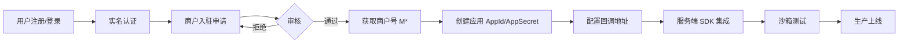

---

## 2. 商户入驻流程

### 2.1 入驻前置条件

- 已注册 KeBaiPay 用户账号（手机号或邮箱）
- 已完成实名认证且审核通过（`realNameStatus = VERIFIED`）
- 持有合法的经营资质（企业商户需提供营业执照号）

### 2.2 入驻步骤

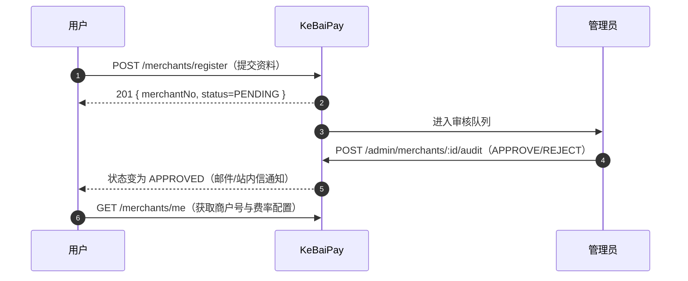

### 2.3 提交入驻申请

```http
POST /merchants/register HTTP/1.1
Host: api.kebaipay.com
Content-Type: application/json
Authorization: Bearer <user_token>

{
  "name": "科佰示例商城",
  "shortName": "科佰",
  "contactPhone": "13800138000",
  "contactEmail": "owner@example.com",
  "businessLicense": "91110100XXXXXXXXXX",
  "category": "CATERING"
}
```

| 字段 | 类型 | 必填 | 说明 |
|------|------|------|------|
| name | string | 是 | 商户名称（1-64 字符） |
| shortName | string | 否 | 商户简称 |
| contactPhone | string | 是 | 联系电话 |
| contactEmail | string | 否 | 联系邮箱（接收审核结果通知） |
| businessLicense | string | 否 | 营业执照号（企业商户建议填写） |
| category | string | 否 | 经营类目，如 `CATERING`、`RETAIL`、`SERVICE` |

**响应 201：**

```json
{
  "merchantNo": "M202607210001",
  "name": "科佰示例商城",
  "status": "PENDING",
  "payRate": 60,
  "withdrawRate": 60,
  "dailyLimit": 1000000,
  "createdAt": "2026-07-21T10:00:00.000Z"
}
```

### 2.4 商户状态机

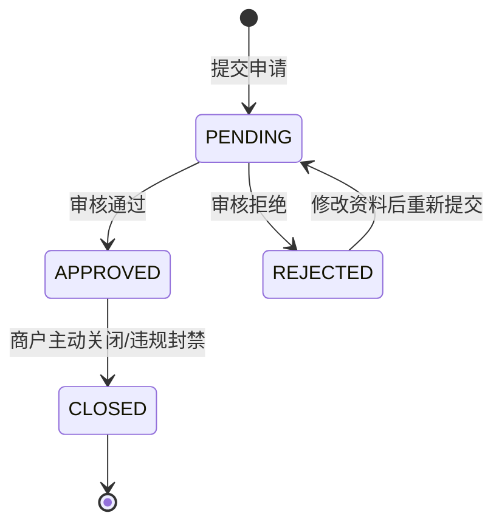

| 状态 | 含义 | 可执行操作 |
|------|------|-----------|
| `PENDING` | 待审核 | 修改资料（`PATCH /merchants/me`） |
| `APPROVED` | 已通过 | 创建应用、收款、转账、退款等全部商户能力 |
| `REJECTED` | 已拒绝 | 修改资料后重新提交（`PATCH /merchants/me`） |
| `CLOSED` | 已关闭 | 仅可查询，不可发起交易 |

### 2.5 查询当前商户信息

```http
GET /merchants/me HTTP/1.1
Host: api.kebaipay.com
Authorization: Bearer <user_token>
```

> 仅 `APPROVED` 状态的商户可创建应用并发起交易，否则调用交易接口会返回 `KB310 商户未审核通过`。

---

## 3. 应用管理

### 3.1 应用与密钥的关系

一个商户可创建多个应用（如「官网收银台」「小程序商城」「内部 ERP」），每个应用拥有独立的 `AppId`、`AppSecret`、`callbackUrl`，签名密钥彼此隔离，便于权限分级与密钥轮换。

### 3.2 创建应用

```http
POST /merchants/apps HTTP/1.1
Host: api.kebaipay.com
Content-Type: application/json
Authorization: Bearer <user_token>

{
  "name": "官网收银台",
  "callbackUrl": "https://merchant.example.com/webhooks/kebaipay"
}
```

| 字段 | 类型 | 必填 | 说明 |
|------|------|------|------|
| name | string | 是 | 应用名称（不可为空，否则返回 `KB225`） |
| callbackUrl | string | 否 | 默认 Webhook 回调地址（必须 http/https，不可指向内网） |

**响应 201：**

```json
{
  "appId": "app_3f9b2a1c8d7e4f60",
  "appSecret": "sk_8c2f1a9b3d7e4f60a1b2c3d4e5f6a7b8",
  "name": "官网收银台",
  "callbackUrl": "https://merchant.example.com/webhooks/kebaipay",
  "status": "ACTIVE",
  "createdAt": "2026-07-21T10:00:00.000Z"
}
```

> ⚠️ **`appSecret` 仅在创建时返回一次**，KeBaiPay 后端只保存其 SHA-256 哈希，**丢失后无法找回**，只能重置。请立即写入环境变量/密钥管理服务。

### 3.3 AppId / AppSecret 保管原则

| 原则 | 说明 |
|------|------|
| 仅服务端持有 | `appSecret` 仅存在于商户后端进程/密钥管理服务（如 Vault、KMS），**禁止**前端、小程序、App 持有 |
| 环境变量读取 | 使用 `KEBAIPAY_APP_ID` / `KEBAIPAY_APP_SECRET` 环境变量，**禁止硬编码**进源码或提交到 Git |
| 最小授权 | 不同业务用不同应用，避免一个应用密钥泄露影响全量业务 |
| 定期轮换 | 建议每 6~12 个月或在密钥疑似泄露时立即重置 |
| 日志脱敏 | 日志中**不得**打印 `appSecret`、回调原始 body 中的敏感字段 |
| HTTPS 强制 | 商户后端与 KeBaiPay 之间必须 HTTPS，防止中间人窃取密钥与签名 |

### 3.4 重置密钥

当 `appSecret` 疑似泄露、员工离职、安全事件触发时，应立即重置密钥。**重置后旧密钥立即失效**，所有依赖旧密钥的调用方必须同步更新。

```http
POST /merchants/apps/app_3f9b2a1c8d7e4f60/regenerate-secret HTTP/1.1
Host: api.kebaipay.com
Authorization: Bearer <user_token>
```

**响应 200：**

```json
{
  "appId": "app_3f9b2a1c8d7e4f60",
  "appSecret": "sk_9d3e2b8c4f6a5d71b2c3d4e5f6a7b8c9",
  "rotatedAt": "2026-07-21T11:00:00.000Z"
}
```

> 重置后请立即更新所有调用方的环境变量，并验证 Webhook 验签是否仍正常工作。

### 3.5 应用管理接口一览

| Method | Path | 说明 |
|--------|------|------|
| POST | `/merchants/apps` | 创建应用 |
| GET | `/merchants/apps` | 列出商户所有应用 |
| PATCH | `/merchants/apps/:appId` | 更新应用（名称/回调地址） |
| POST | `/merchants/apps/:appId/regenerate-secret` | 重置密钥 |

---

## 4. 收款码管理

商户收款码用于线下扫码场景。用户扫码后跳转 KeBaiPay 收银台完成付款，资金直接进入商户余额。

### 4.1 创建商户收款码

```http
POST /merchants/qrcodes HTTP/1.1
Host: api.kebaipay.com
Content-Type: application/json
Authorization: Bearer <user_token>

{
  "name": "前台 1 号码",
  "fixedAmount": 19.90,
  "subject": "堂食套餐",
  "body": "招牌套餐扫码即付"
}
```

| 字段 | 类型 | 必填 | 说明 |
|------|------|------|------|
| name | string | 是 | 收款码名称（便于商户管理） |
| fixedAmount | number | 否 | 固定金额（元），不填则用户扫码时手动输入 |
| subject | string | 否 | 默认订单标题 |
| body | string | 否 | 默认订单描述 |

**响应 201：**

```json
{
  "id": "qr_6f8a2b1c9d3e4f50",
  "code": "MQ-8K2F9A3B",
  "name": "前台 1 号码",
  "fixedAmount": 19.90,
  "subject": "堂食套餐",
  "qrcodeUrl": "https://cashier.kebaipay.com/q/MQ-8K2F9A3B",
  "status": "ACTIVE",
  "createdAt": "2026-07-21T10:30:00.000Z"
}
```

### 4.2 列出收款码

```http
GET /merchants/qrcodes?page=1&limit=20 HTTP/1.1
Host: api.kebaipay.com
Authorization: Bearer <user_token>
```

### 4.3 删除收款码

```http
DELETE /merchants/qrcodes/qr_6f8a2b1c9d3e4f50 HTTP/1.1
Host: api.kebaipay.com
Authorization: Bearer <user_token>
```

> 删除后收款码立即失效，扫码会返回 `KB619 收款码已失效`。已创建的订单不受影响。

### 4.4 扫码支付流程

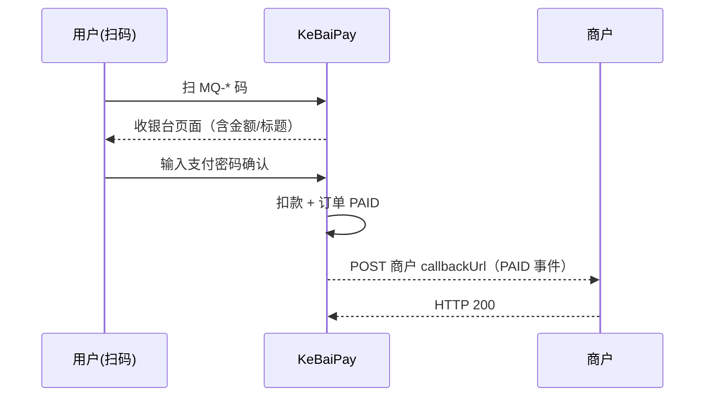

---

## 5. 收银台支付接入

### 5.1 收银台流程图

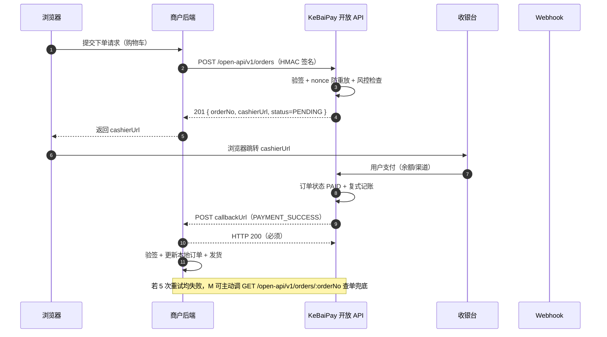

### 5.2 创建订单（两种方式）

KeBaiPay 提供两种下单方式，分别适用于不同业务场景：

| 方式 | 接口 | 认证 | 适用场景 |
|------|------|------|---------|
| 用户登录态下单 | `POST /cashier/orders` | 用户 JWT | 内部应用（用户已登录 KeBaiPay 账号） |
| 商户服务端下单 | `POST /open-api/v1/orders` | HMAC 签名 | 商户自有商城、SaaS、第三方平台（推荐） |

#### 5.2.1 用户登录态下单（内部应用）

```http
POST /cashier/orders HTTP/1.1
Host: api.kebaipay.com
Content-Type: application/json
Authorization: Bearer <user_token>

{
  "merchantOrderNo": "M-2026-001",
  "merchantId": "uuid-of-merchant",
  "amount": 99.90,
  "subject": "订单标题",
  "body": "订单描述",
  "expiredAt": "2026-07-21T01:00:00.000Z"
}
```

| 字段 | 类型 | 必填 | 说明 |
|------|------|------|------|
| merchantOrderNo | string | 是 | 商户订单号（同一商户唯一，重复返回 `KB601`） |
| merchantId | string | 是 | 收款商户 ID |
| amount | number | 是 | 金额（元），必须 > 0，否则返回 `KB711` |
| subject | string | 是 | 订单标题 |
| body | string | 否 | 订单描述 |
| expiredAt | string | 否 | 过期时间（ISO 8601），不能超过 24 小时（`KB712`） |

#### 5.2.2 商户服务端下单（HMAC 签名，推荐）

```http
POST /open-api/v1/orders HTTP/1.1
Host: api.kebaipay.com
Content-Type: application/json
X-App-Id: app_3f9b2a1c8d7e4f60
X-Timestamp: 1735689600000
X-Nonce: 7f8e9d6c-5b4a-3210-fedc-ba9876543210
X-Signature: 9c8b7a6f5e4d3c2b1a0987654321fedcba9876543210987654321fedcba98765

{
  "merchantOrderNo": "M-2026-001",
  "amount": 99.90,
  "subject": "订单标题",
  "body": "订单描述",
  "callbackUrl": "https://merchant.example.com/webhooks/kebaipay",
  "expiredAt": "2026-07-21T01:00:00.000Z"
}
```

**响应 201：**

```json
{
  "orderNo": "PAY-20260721-xxxxxx",
  "merchantOrderNo": "M-2026-001",
  "amount": 99.90,
  "status": "PENDING",
  "cashierUrl": "https://cashier.kebaipay.com/pay/PAY-20260721-xxxxxx",
  "expiredAt": "2026-07-21T01:00:00.000Z"
}
```

> 商户后端应将 `cashierUrl` 返回给前端浏览器，由前端跳转完成支付。

#### 5.2.3 HMAC-SHA256 签名算法

```
sign_string = HTTP_METHOD\nPATH\nRAW_BODY\nTIMESTAMP\nNONCE\nAPP_ID
signature   = HMAC-SHA256(appSecret, sign_string)  // 输出小写 hex
```

| 请求头 | 说明 |
|--------|------|
| `X-App-Id` | 商户应用 AppId |
| `X-Timestamp` | 当前时间戳（毫秒），窗口：过去 120s ~ 未来 30s |
| `X-Nonce` | 唯一随机串（2 分钟内不可重复，防重放） |
| `X-Signature` | HMAC-SHA256 签名（hex） |

Node.js 签名实现：

```javascript
const crypto = require('crypto')

function signRequest(method, path, body, timestamp, nonce, appId, appSecret) {
  const rawBody = body ? JSON.stringify(body) : ''
  const signString = `${method}\n${path}\n${rawBody}\n${timestamp}\n${nonce}\n${appId}`
  return crypto.createHmac('sha256', appSecret).update(signString, 'utf8').digest('hex')
}
```

### 5.3 查询订单

提供两种查询接口，分别对应两种下单方式：

```http
GET /cashier/orders/PAY-20260721-xxxxxx HTTP/1.1
Host: api.kebaipay.com
Authorization: Bearer <user_token>
```

```http
GET /open-api/v1/orders/PAY-20260721-xxxxxx HTTP/1.1
Host: api.kebaipay.com
X-App-Id: app_3f9b2a1c8d7e4f60
X-Timestamp: 1735689600000
X-Nonce: 7f8e9d6c-5b4a-3210-fedc-ba9876543210
X-Signature: <computed_signature>
```

**响应 200：**

```json
{
  "orderNo": "PAY-20260721-xxxxxx",
  "merchantOrderNo": "M-2026-001",
  "amount": 99.90,
  "amountYuan": "99.90",
  "feeYuan": "0.60",
  "status": "PAID",
  "subject": "订单标题",
  "paidAt": "2026-07-21T00:05:00.000Z",
  "createdAt": "2026-07-21T00:00:00.000Z"
}
```

### 订单状态机

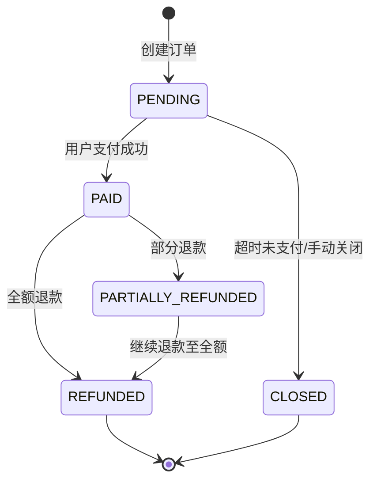

| 状态 | 说明 |
|------|------|
| `PENDING` | 待支付 |
| `PAID` | 已支付 |
| `CLOSED` | 已关闭（超时或主动关单） |
| `REFUNDED` | 已全额退款 |
| `PARTIALLY_REFUNDED` | 部分退款（中间态） |

### 5.4 支付订单

收银台内部接口，用户在收银台页面输入支付密码后由前端调用。商户一般无需直接调用此接口。

```http
POST /cashier/orders/PAY-20260721-xxxxxx/pay HTTP/1.1
Host: api.kebaipay.com
Content-Type: application/json
Authorization: Bearer <user_token>

{
  "payPassword": "123456"
}
```

> 支付密码错误 3 次将锁定 15 分钟（返回 `KB207`）。

### 5.5 退款

支持全额退款与部分退款，可多次部分退款直至订单金额退完。退款金额不能超过可退金额（`KB716`），订单必须为 `PAID` 状态（`KB713`）。

#### 5.5.1 全额退款

```http
POST /open-api/v1/refunds HTTP/1.1
Host: api.kebaipay.com
Content-Type: application/json
X-App-Id: app_3f9b2a1c8d7e4f60
X-Timestamp: 1735689600000
X-Nonce: 7f8e9d6c-5b4a-3210-fedc-ba9876543210
X-Signature: <computed_signature>

{
  "orderNo": "PAY-20260721-xxxxxx",
  "refundAmount": 99.90,
  "reason": "用户申请全额退款",
  "idempotencyKey": "refund-uuid-001"
}
```

#### 5.5.2 部分退款

```http
POST /open-api/v1/refunds HTTP/1.1
Host: api.kebaipay.com
Content-Type: application/json
X-App-Id: app_3f9b2a1c8d7e4f60
X-Timestamp: 1735689600000
X-Nonce: 7f8e9d6c-5b4a-3210-fedc-ba9876543210
X-Signature: <computed_signature>

{
  "orderNo": "PAY-20260721-xxxxxx",
  "refundAmount": 30.00,
  "reason": "部分退货（缺件）",
  "idempotencyKey": "refund-uuid-002"
}
```

| 字段 | 类型 | 必填 | 说明 |
|------|------|------|------|
| orderNo | string | 是 | 待退款的订单号 |
| refundAmount | number | 是 | 退款金额（元），>0 且 ≤ 可退金额 |
| reason | string | 否 | 退款原因（建议必填，便于对账） |
| idempotencyKey | string | 是 | 幂等键，重复请求返回同一结果（`KB621`） |

**响应 200：**

```json
{
  "refundNo": "RF-20260721-xxxxxx",
  "orderNo": "PAY-20260721-xxxxxx",
  "refundAmount": 30.00,
  "status": "PENDING",
  "reason": "部分退货（缺件）"
}
```

> 退款异步处理，最终状态通过 `REFUND_SUCCESS` / `REFUND_FAILED` Webhook 通知。原路退回通常 1~3 个工作日到账（依渠道而定），钱包余额退款即时到账。

### 5.6 商户转账

商户向 KeBaiPay 用户钱包转账，常用于营销返现、佣金结算、用户补偿等场景。

```http
POST /open-api/v1/transfers HTTP/1.1
Host: api.kebaipay.com
Content-Type: application/json
X-App-Id: app_3f9b2a1c8d7e4f60
X-Timestamp: 1735689600000
X-Nonce: 7f8e9d6c-5b4a-3210-fedc-ba9876543210
X-Signature: <computed_signature>

{
  "toUserId": "uuid-of-payee",
  "amount": 10.00,
  "remark": "佣金返现",
  "idempotencyKey": "transfer-uuid-001"
}
```

| 字段 | 类型 | 必填 | 说明 |
|------|------|------|------|
| toUserId | string | 是 | 收款用户 ID（须已实名，否则 `KB214`） |
| amount | number | 是 | 转账金额（元），> 0 |
| remark | string | 否 | 转账备注（用户可在账单中看到） |
| idempotencyKey | string | 是 | 幂等键 |

> 转账实时到账到用户钱包余额。商户余额不足返回 `KB005`，超出当日限额返回 `KB003`。

### 5.7 查询商户余额

```http
GET /open-api/v1/balance HTTP/1.1
Host: api.kebaipay.com
X-App-Id: app_3f9b2a1c8d7e4f60
X-Timestamp: 1735689600000
X-Nonce: 7f8e9d6c-5b4a-3210-fedc-ba9876543210
X-Signature: <computed_signature>
```

**响应 200：**

```json
{
  "merchantNo": "M202607210001",
  "availableBalanceYuan": "12580.00",
  "frozenBalanceYuan": "500.00",
  "totalBalanceYuan": "13080.00",
  "currency": "CNY",
  "updatedAt": "2026-07-21T10:00:00.000Z"
}
```

### 5.8 对账查询

#### 5.8.1 按日期范围对账

```http
GET /cashier/orders/reconciliation?startDate=2026-07-01&endDate=2026-07-21 HTTP/1.1
Host: api.kebaipay.com
Authorization: Bearer <user_token>
```

**响应 200：**

```json
{
  "summary": {
    "totalOrders": 158,
    "totalAmount": "15800.00",
    "totalFee": "94.80",
    "refundOrders": 3,
    "refundAmount": "120.00",
    "netAmount": "15680.00"
  },
  "dailyBreakdown": [
    {
      "date": "2026-07-21",
      "orderCount": 10,
      "totalAmount": "1000.00",
      "totalFee": "6.00",
      "settlementAmount": "994.00"
    }
  ]
}
```

#### 5.8.2 导出 CSV

```http
GET /cashier/orders/export?startDate=2026-07-01&endDate=2026-07-21 HTTP/1.1
Host: api.kebaipay.com
Authorization: Bearer <user_token>
Accept: text/csv
```

**响应 200：**

```
orderNo,merchantOrderNo,amount,status,fee,paidAt,createdAt
PAY-20260721-0001,M-2026-001,99.90,PAID,0.60,2026-07-21T00:05:00.000Z,2026-07-21T00:00:00.000Z
PAY-20260721-0002,M-2026-002,19.90,PAID,0.12,2026-07-21T00:10:00.000Z,2026-07-21T00:08:00.000Z
```

> 单次导出最多 10000 行（`MAX_EXPORT_ROWS`），超出请缩小日期范围分批导出。

---

## 6. 担保交易接入（S2）

### 6.1 适用场景

| 场景 | 典型业务 |
|------|---------|
| C2C 二手交易 | 闲鱼式二手商品交易，资金先冻结到平台 |
| 虚拟商品担保 | 游戏道具、域名、账号交易 |
| 服务类担保 | 设计外包、自由职业者交付担保 |
| 高客单价商品担保 | 奢侈品、定制商品防跑路 |

担保交易的核心价值：**资金先冻结到平台担保账户，买家确认收货后才释放给卖家**，解决陌生人交易的信任问题。

### 6.2 创建担保订单

```http
POST /escrow/orders HTTP/1.1
Host: api.kebaipay.com
Content-Type: application/json
Authorization: Bearer <user_token>

{
  "sellerUserId": "uuid-of-seller",
  "amount": 1000.00,
  "subject": "iPhone 15 128G",
  "body": "二手 iPhone 15 128G 国行，95 新"
}
```

| 字段 | 类型 | 必填 | 说明 |
|------|------|------|------|
| sellerUserId | string | 是 | 卖家用户 ID（不可为自己，`KB634`） |
| amount | number | 是 | 担保金额（元），默认日限额 5 万元 |
| subject | string | 是 | 商品标题 |
| body | string | 否 | 商品描述 |

**响应 201：**

```json
{
  "orderNo": "ESC-20260721-xxxxxx",
  "sellerUserId": "uuid-of-seller",
  "buyerUserId": "uuid-of-buyer",
  "amount": 1000.00,
  "status": "CREATED",
  "expireAt": "2026-07-21T00:30:00.000Z"
}
```

> 担保订单付款有效期为 30 分钟，超时自动 `EXPIRED`。发货后 7 天买家未确认收货则自动放款。

### 6.3 担保状态机

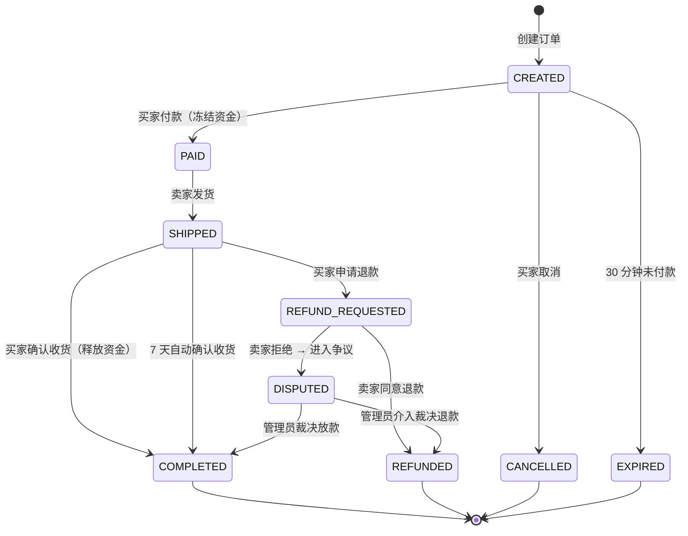

### 6.4 关键操作

#### 6.4.1 买家付款（资金冻结）

```http
POST /escrow/orders/ESC-20260721-xxxxxx/pay HTTP/1.1
Host: api.kebaipay.com
Authorization: Bearer <user_token>

{
  "payPassword": "123456"
}
```

> 仅买家可调用（`KB632`），资金从买家钱包进入平台冻结账户，**未直接到卖家账户**。

#### 6.4.2 卖家发货

```http
POST /escrow/orders/ESC-20260721-xxxxxx/ship HTTP/1.1
Host: api.kebaipay.com
Authorization: Bearer <user_token>
```

> 仅卖家可调用（`KB633`），订单状态从 `PAID` 变为 `SHIPPED`，开始 7 天自动确认收货倒计时。

#### 6.4.3 买家确认收货（放款）

```http
POST /escrow/orders/ESC-20260721-xxxxxx/confirm HTTP/1.1
Host: api.kebaipay.com
Authorization: Bearer <user_token>
```

> 资金从平台冻结账户释放到卖家钱包，订单状态变为 `COMPLETED`。

#### 6.4.4 买家申请退款

```http
POST /escrow/orders/ESC-20260721-xxxxxx/refund-request HTTP/1.1
Host: api.kebaipay.com
Content-Type: application/json
Authorization: Bearer <user_token>

{
  "reason": "商品与描述不符"
}
```

> 仅 `SHIPPED` 状态可申请退款，`reason` 必填（`KB635`）。

#### 6.4.5 卖家处理退款

```http
POST /escrow/orders/ESC-20260721-xxxxxx/refund-resolve HTTP/1.1
Host: api.kebaipay.com
Content-Type: application/json
Authorization: Bearer <user_token>

{
  "action": "APPROVE_REFUND",
  "reason": "同意退款"
}
```

`action` 取值：`APPROVE_REFUND`（同意退款，资金原路退回买家）/ `REJECT_REFUND`（拒绝，进入 `DISPUTED` 争议状态等待管理员介入）。

### 6.5 担保交易接口一览

| Method | Path | 说明 |
|--------|------|------|
| POST | `/escrow/orders` | 创建担保订单 |
| POST | `/escrow/orders/:orderNo/pay` | 买家付款（冻结） |
| POST | `/escrow/orders/:orderNo/ship` | 卖家发货 |
| POST | `/escrow/orders/:orderNo/confirm` | 买家确认收货（放款） |
| POST | `/escrow/orders/:orderNo/refund-request` | 买家申请退款 |
| POST | `/escrow/orders/:orderNo/refund-resolve` | 卖家处理退款 |
| POST | `/escrow/orders/:orderNo/cancel` | 买家取消订单（仅 CREATED） |
| GET | `/escrow/orders/:orderNo` | 查询担保订单详情 |
| GET | `/escrow/orders?role=buyer\|seller\|all` | 列出担保订单 |

---

## 7. 批量转账接入

### 7.1 适用场景

| 场景 | 典型业务 |
|------|---------|
| 发工资 | 月度工资批量发放 |
| 批量打款 | 供应商结算、分销商返佣 |
| 营销批量发放 | 红包雨批量发放、活动返现 |
| 财务报销 | 批量报销打款 |

### 7.2 批量提交

```http
POST /batch-transfers HTTP/1.1
Host: api.kebaipay.com
Content-Type: application/json
Authorization: Bearer <user_token>

{
  "items": [
    { "toUserId": "uuid-001", "amount": 8000.00, "remark": "张三工资" },
    { "toUserId": "uuid-002", "amount": 12000.00, "remark": "李四工资" },
    { "toUserId": "uuid-003", "amount": 9500.00, "remark": "王五工资" }
  ],
  "payPassword": "123456",
  "idempotencyKey": "batch-salary-202607"
}
```

| 字段 | 类型 | 必填 | 说明 |
|------|------|------|------|
| items | array | 是 | 转账明细列表（最多 500 笔，`KB642`） |
| items[].toUserId | string | 是 | 收款用户 ID（不可重复，`KB643`） |
| items[].amount | number | 是 | 单笔金额（≤ 5000 元） |
| items[].remark | string | 否 | 单笔备注 |
| payPassword | string | 是 | 支付密码 |
| idempotencyKey | string | 是 | 幂等键 |

**约束：**
- 单批次最多 500 笔
- 单笔上限 5000 元
- 单日累计 5 万元
- 同一批次收款方不可重复

### 7.3 批量转账状态机

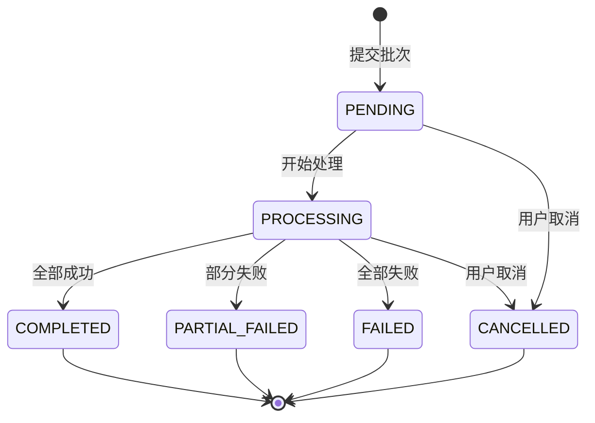

### 7.4 查询批次明细

```http
GET /batch-transfers/BT-20260721-xxxxxx HTTP/1.1
Host: api.kebaipay.com
Authorization: Bearer <user_token>
```

**响应 200：**

```json
{
  "batchNo": "BT-20260721-xxxxxx",
  "totalCount": 3,
  "successCount": 2,
  "failedCount": 1,
  "totalAmount": 29500.00,
  "status": "PARTIAL_FAILED",
  "items": [
    {
      "itemNo": "BTI-001",
      "toUserId": "uuid-001",
      "amount": 8000.00,
      "remark": "张三工资",
      "status": "SUCCESS",
      "processedAt": "2026-07-21T10:00:05.000Z"
    },
    {
      "itemNo": "BTI-003",
      "toUserId": "uuid-003",
      "amount": 9500.00,
      "remark": "王五工资",
      "status": "FAILED",
      "failureReason": "收款方账户异常",
      "processedAt": "2026-07-21T10:00:05.000Z"
    }
  ]
}
```

### 7.5 取消批次

```http
POST /batch-transfers/BT-20260721-xxxxxx/cancel HTTP/1.1
Host: api.kebaipay.com
Authorization: Bearer <user_token>
```

> 仅 `PENDING` 或 `PROCESSING` 状态可取消（`KB645`），已处理完成的明细不会回滚。

---

## 8. 订阅接入

### 8.1 适用场景

| 场景 | 典型业务 |
|------|---------|
| 会员订阅 | 视频/音乐/知识付费会员 |
| SaaS 订阅 | 软件按月/按年订阅 |
| 周期性服务 | 月度健身卡、年度云存储 |
| 内容订阅 | 付费专栏、新闻订阅 |

### 8.2 商户配置订阅计划

商户创建订阅计划，配置周期、金额、试用期等参数。计划创建后可启用/禁用。

```http
POST /subscriptions/plans HTTP/1.1
Host: api.kebaipay.com
Content-Type: application/json
Authorization: Bearer <user_token>

{
  "name": "月度会员",
  "period": "MONTHLY",
  "amount": 30.00,
  "totalCycles": 12,
  "description": "每月自动扣款 30 元，连续 12 期",
  "trialPeriodDays": 7
}
```

| 字段 | 类型 | 必填 | 说明 |
|------|------|------|------|
| name | string | 是 | 计划名称 |
| period | string | 是 | `DAILY` / `WEEKLY` / `MONTHLY` / `YEARLY` |
| amount | number | 是 | 每期扣款金额（≤ 10000 元） |
| totalCycles | number | 否 | 总期数（null 表示无限期） |
| description | string | 否 | 计划描述 |
| trialPeriodDays | number | 否 | 试用期天数（试用期内不扣款） |

**响应 201：**

```json
{
  "planNo": "SP-20260721-xxxxxx",
  "name": "月度会员",
  "period": "MONTHLY",
  "amount": 30.00,
  "totalCycles": 12,
  "trialPeriodDays": 7,
  "status": "ACTIVE",
  "createdAt": "2026-07-21T10:00:00.000Z"
}
```

### 8.3 用户订阅

```http
POST /subscriptions/SP-20260721-xxxxxx/subscribe HTTP/1.1
Host: api.kebaipay.com
Content-Type: application/json
Authorization: Bearer <user_token>

{
  "payPassword": "123456"
}
```

**响应 201：**

```json
{
  "subscriptionNo": "SUB-20260721-xxxxxx",
  "planNo": "SP-20260721-xxxxxx",
  "status": "ACTIVE",
  "trialEndAt": "2026-07-28T10:00:00.000Z",
  "nextChargeAt": "2026-07-28T10:00:00.000Z",
  "currentCycle": 0
}
```

> 若计划配置了试用期，首期不扣款；否则立即扣首期款。扣款失败连续 3 次自动暂停订阅（`PAST_DUE`）。

### 8.4 订阅状态机

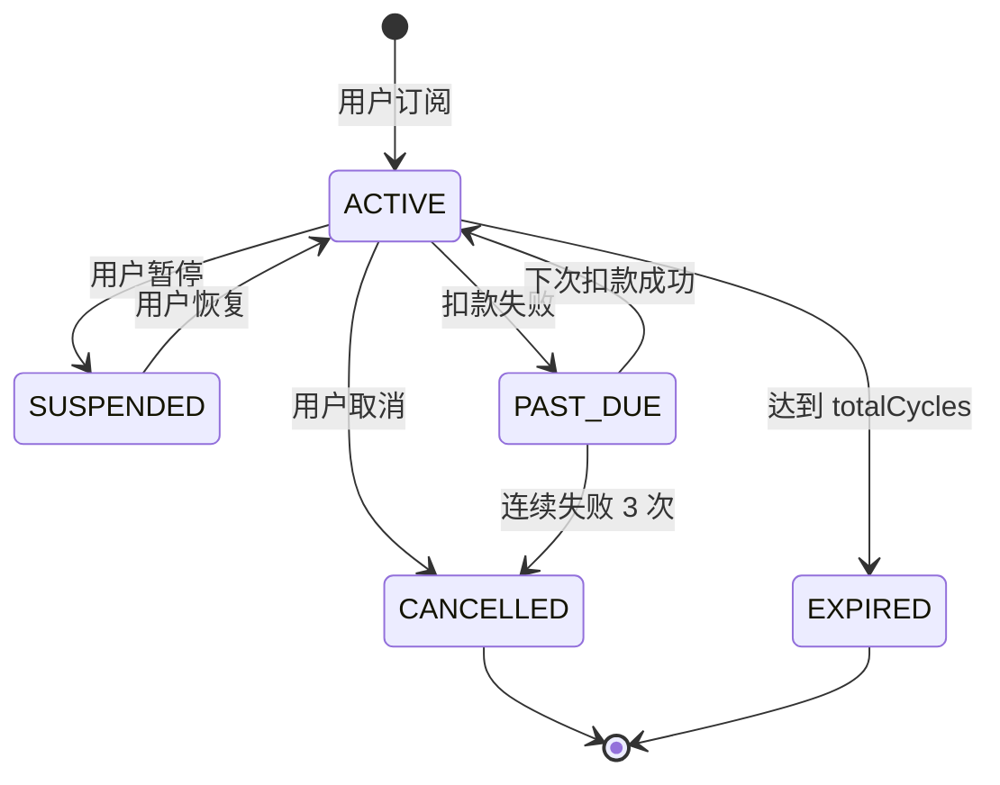

### 8.5 自动扣款时序图

KeBaiPay 调度器每天 00:30 扫描所有到期订阅，自动发起扣款：

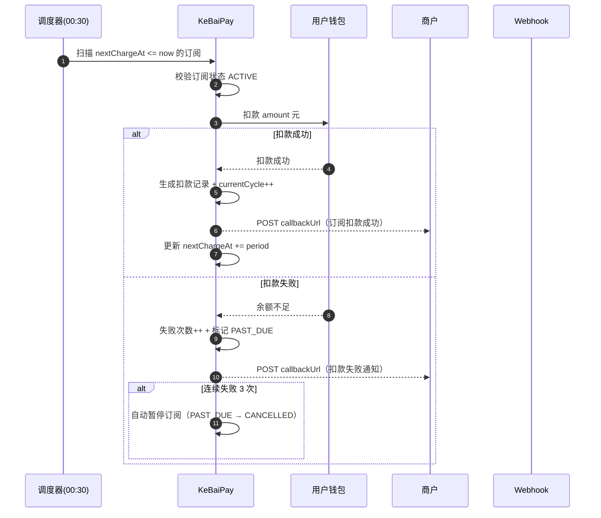

### 8.6 订阅管理接口

| Method | Path | 说明 |
|--------|------|------|
| POST | `/subscriptions/plans` | 创建订阅计划 |
| GET | `/subscriptions/plans/:planNo` | 查询计划详情 |
| GET | `/subscriptions/plans` | 列出我的订阅计划 |
| PUT | `/subscriptions/plans/:planNo/status` | 启用/禁用计划 |
| POST | `/subscriptions/:planNo/subscribe` | 用户订阅 |
| POST | `/subscriptions/subscriptions/:subscriptionNo/cancel` | 取消订阅 |
| POST | `/subscriptions/subscriptions/:subscriptionNo/suspend` | 暂停订阅 |
| POST | `/subscriptions/subscriptions/:subscriptionNo/resume` | 恢复订阅 |
| GET | `/subscriptions/subscriptions/:subscriptionNo` | 查询订阅详情 |
| GET | `/subscriptions/subscriptions` | 列出我的订阅 |
| GET | `/subscriptions/subscriptions/:subscriptionNo/charges` | 列出扣款记录 |

---

## 9. 分账接入

### 9.1 适用场景

| 场景 | 典型业务 |
|------|---------|
| 多方分润 | 联营商品按比例分给多个合作方 |
| 平台抽成 | 平台从交易中抽取服务费 |
| 二级商户分账 | 总店 → 分店资金分配 |
| 内容创作者分成 | 平台抽取后剩余分给创作者 |

### 9.2 创建分账计划

将一笔已支付订单的金额按比例/固定金额分给多个接收方。

```http
POST /splits HTTP/1.1
Host: api.kebaipay.com
Content-Type: application/json
Authorization: Bearer <user_token>

{
  "sourceOrderNo": "PAY-20260721-xxxxxx",
  "receivers": [
    { "userId": "uuid-platform", "amount": 5.00 },
    { "userId": "uuid-creator", "amount": 15.00 },
    { "userId": "uuid-partner", "amount": 10.00 }
  ],
  "remark": "三方分账：平台抽成 5 元 + 创作者 15 元 + 合伙人 10 元"
}
```

| 字段 | 类型 | 必填 | 说明 |
|------|------|------|------|
| sourceOrderNo | string | 是 | 源订单号（必须为 `PAID` 状态，否则 `KB661`） |
| receivers | array | 是 | 接收方列表（1~50 个，`KB668`/重复返回 `KB663`） |
| receivers[].userId | string | 是 | 接收方用户 ID |
| receivers[].amount | number | 是 | 分账金额（0.01~10000 元） |
| remark | string | 否 | 分账备注 |

**约束：**
- 分账总额不能超过源订单可分账金额（`KB662`）
- 单次最多 50 个接收方
- 单日累计 5 万元
- 仅 `PENDING` 状态可取消（`KB665`）

**响应 201：**

```json
{
  "splitNo": "SPL-20260721-xxxxxx",
  "sourceOrderNo": "PAY-20260721-xxxxxx",
  "totalAmount": 30.00,
  "receiverCount": 3,
  "status": "PENDING",
  "createdAt": "2026-07-21T10:00:00.000Z"
}
```

### 9.3 分账状态机

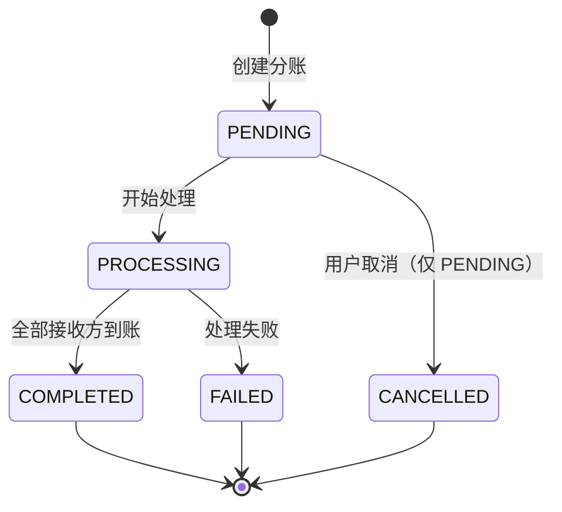

### 9.4 分账管理接口

| Method | Path | 说明 |
|--------|------|------|
| POST | `/splits` | 发起分账 |
| GET | `/splits/:splitNo` | 查询分账订单详情 |
| GET | `/splits` | 列出我的分账订单 |
| POST | `/splits/:splitNo/cancel` | 取消分账（仅 PENDING） |

---

## 10. 商户数据看板

提供商户视角的实时业务数据，便于商户监控当日经营状况。

```http
GET /merchants/dashboard HTTP/1.1
Host: api.kebaipay.com
Authorization: Bearer <user_token>
```

**响应 200：**

```json
{
  "merchantNo": "M202607210001",
  "today": {
    "date": "2026-07-21",
    "orderCount": 38,
    "totalAmountYuan": "3820.00",
    "totalFeeYuan": "22.92",
    "netAmountYuan": "3797.08",
    "refundCount": 1,
    "refundAmountYuan": "50.00",
    "successRate": "97.37%"
  },
  "balance": {
    "availableBalanceYuan": "12580.00",
    "frozenBalanceYuan": "500.00",
    "totalBalanceYuan": "13080.00"
  },
  "trend7d": [
    { "date": "2026-07-15", "orderCount": 28, "totalAmountYuan": "2980.00" },
    { "date": "2026-07-16", "orderCount": 32, "totalAmountYuan": "3450.00" },
    { "date": "2026-07-17", "orderCount": 35, "totalAmountYuan": "3610.00" },
    { "date": "2026-07-18", "orderCount": 30, "totalAmountYuan": "3120.00" },
    { "date": "2026-07-19", "orderCount": 41, "totalAmountYuan": "4280.00" },
    { "date": "2026-07-20", "orderCount": 45, "totalAmountYuan": "4720.00" },
    { "date": "2026-07-21", "orderCount": 38, "totalAmountYuan": "3820.00" }
  ]
}
```

| 字段 | 说明 |
|------|------|
| today.orderCount | 今日订单数 |
| today.totalAmountYuan | 今日交易总额 |
| today.totalFeeYuan | 今日手续费 |
| today.netAmountYuan | 今日净收入（交易额 - 手续费 - 退款） |
| today.successRate | 今日支付成功率 |
| balance.* | 商户当前余额（可用/冻结/总余额） |
| trend7d | 近 7 天交易趋势 |

---

## 11. Webhook 回调接入

KeBaiPay 在订单状态变更时通过 HTTP POST 主动通知商户。商户必须实现回调接收端点并验证签名。

### 11.1 回调事件类型

| 事件类型 | 触发场景 | 关键字段 |
|---------|---------|---------|
| `PAYMENT_SUCCESS` | 支付成功 | orderNo、amount、paidAt |
| `PAYMENT_FAILED` | 支付失败 | orderNo、failureReason |
| `REFUND_SUCCESS` | 退款成功 | refundNo、orderNo、refundAmount |
| `REFUND_FAILED` | 退款失败 | refundNo、orderNo、failureReason |
| `TRANSFER_SUCCESS` | 商户转账成功 | transferNo、toUserId、amount |
| `TRANSFER_FAILED` | 商户转账失败 | transferNo、failureReason |

**回调请求体（示例）：**

```json
{
  "event": "PAYMENT_SUCCESS",
  "orderNo": "PAY-20260721-xxxxxx",
  "merchantOrderNo": "M-2026-001",
  "status": "PAID",
  "amount": 9999,
  "amountYuan": "99.99",
  "feeYuan": "0.60",
  "paidAt": "2026-07-21T00:05:00.000Z",
  "timestamp": "2026-07-21T00:05:00.123Z"
}
```

### 11.2 签名验证（HMAC-SHA256）

KeBaiPay 发往商户的回调请求携带三个签名头：

| Header | 说明 |
|--------|------|
| `X-Webhook-Timestamp` | 时间戳（毫秒） |
| `X-Webhook-Nonce` | 随机字符串（同一回调重试时相同） |
| `X-Webhook-Signature` | HMAC-SHA256 签名（hex） |

**签名串构造：**

```
sign_string = `${timestamp}\n${nonce}\n${rawBody}`
signature   = HMAC-SHA256(appSecret, sign_string)  // 输出 hex
```

#### Node.js 完整验签示例

```javascript
const express = require('express')
const crypto = require('crypto')

const app = express()

// ⚠️ 必须保留原始 body 用于验签，express.json() 会消费流
app.use(
  express.json({
    verify: (req, res, buf) => {
      req.rawBody = buf.toString('utf8')
    },
  }),
)

const APP_SECRET = process.env.KEBAIPAY_APP_SECRET

/**
 * 验证 KeBaiPay Webhook 签名
 * @param {string} rawBody 原始请求体字符串
 * @param {object} headers 请求头对象（小写键）
 * @returns {boolean}
 */
function verifyWebhookSignature(rawBody, headers) {
  const timestamp = headers['x-webhook-timestamp']
  const nonce = headers['x-webhook-nonce']
  const signature = headers['x-webhook-signature']

  // 1. 头部完整性检查
  if (!timestamp || !nonce || !signature) return false

  // 2. 时间戳防重放（允许 5 分钟内）
  const now = Date.now()
  if (Math.abs(now - Number(timestamp)) > 5 * 60 * 1000) return false

  // 3. 计算预期签名
  const signString = `${timestamp}\n${nonce}\n${rawBody}`
  const expected = crypto
    .createHmac('sha256', APP_SECRET)
    .update(signString, 'utf8')
    .digest('hex')

  // 4. 恒定时间比较防侧信道攻击
  if (signature.length !== expected.length) return false
  return crypto.timingSafeEqual(Buffer.from(signature), Buffer.from(expected))
}

app.post('/webhooks/kebaipay', async (req, res) => {
  // 1. 验证签名（必须，否则可被伪造）
  if (!verifyWebhookSignature(req.rawBody, req.headers)) {
    console.error('[webhook] 签名验证失败')
    return res.status(401).json({ error: 'Invalid signature' })
  }

  // 2. 解析事件
  const { event, orderNo, status, paidAt, amount } = req.body

  // 3. 先返回 200（避免触发重试），再异步处理业务
  res.status(200).json({ success: true })

  // 4. 异步处理（注意幂等：同一 orderNo 可能被多次投递）
  setImmediate(async () => {
    try {
      switch (event) {
        case 'PAYMENT_SUCCESS':
          console.log(`[webhook] 订单 ${orderNo} 支付成功，金额 ${amount}`)
          // TODO: 更新本地订单状态为已支付，发货
          break
        case 'PAYMENT_FAILED':
          console.log(`[webhook] 订单 ${orderNo} 支付失败`)
          // TODO: 关闭本地订单
          break
        case 'REFUND_SUCCESS':
          console.log(`[webhook] 退款 ${orderNo} 成功`)
          // TODO: 更新退款状态
          break
        case 'REFUND_FAILED':
          console.log(`[webhook] 退款 ${orderNo} 失败`)
          // TODO: 人工介入
          break
        case 'TRANSFER_SUCCESS':
          console.log(`[webhook] 转账成功 ${orderNo}`)
          break
        case 'TRANSFER_FAILED':
          console.log(`[webhook] 转账失败 ${orderNo}`)
          break
        default:
          console.warn(`[webhook] 未知事件类型: ${event}`)
      }
    } catch (err) {
      console.error('[webhook] 业务处理失败', err)
    }
  })
})

app.listen(3001, () => {
  console.log('Merchant webhook server on http://localhost:3001')
})
```

### 11.3 重试机制

KeBaiPay 对商户回调采取指数退避重试策略：

| 重试次数 | 间隔 | 累计耗时 |
|---------|------|---------|
| 第 1 次 | 即时 | 0s |
| 第 2 次 | 1 分钟 | 1m |
| 第 3 次 | 5 分钟 | 6m |
| 第 4 次 | 30 分钟 | 36m |
| 第 5 次（最后一次） | 2 小时 | 2h36m |
| 超过 5 次仍失败 | 6 小时（兜底重试） | 8h36m |

**重试规则：**
- 商户必须返回 HTTP 200 才算成功，否则触发重试
- 同一回调多次投递时 `X-Webhook-Nonce` 保持一致，商户可据此去重
- 5 次重试后仍失败，停止自动重试；商户可通过主动查单兜底
- 商户可在收银台订单详情页手动触发回调重试

**主动触发重试：**

```http
POST /cashier/orders/PAY-20260721-xxxxxx/notify HTTP/1.1
Host: api.kebaipay.com
Authorization: Bearer <user_token>
```

> 适用于回调失败、本地订单状态与 KeBaiPay 不一致时主动触发通知。若订单未配置回调地址返回 `KB607`，若已通知成功返回 `KB608`。

### 11.4 回调接入最佳实践

1. **必须验签**：不验签的回调接口可被伪造，攻击者可伪造支付成功通知骗取发货
2. **必须返回 200**：业务处理失败也先返回 200，避免无限重试；通过日志+告警+对账兜底
3. **必须幂等**：同一回调可能因重试被多次投递，业务侧用 `orderNo + status` 或 `nonce` 去重
4. **先验签后处理**：先验签确认请求来源合法，再处理业务逻辑
5. **异步处理**：先返回 200 再处理业务，避免业务阻塞导致重试
6. **HTTPS 必须**：`callbackUrl` 必须为 `https://` 开头，否则可被中间人篡改
7. **日志完整**：记录原始 body、签名头、处理耗时、业务结果，便于排查
8. **对账兜底**：定期调用 `GET /cashier/orders/reconciliation` 与本地订单核对

---

## 12. 商户费率说明

商户费率在入驻审核通过时由管理员配置，可在 `GET /merchants/me` 返回中查看。费率调整需联系平台管理员（`POST /admin/merchants/:id/config`）。

### 12.1 费率字段

| 字段 | 单位 | 默认值 | 说明 |
|------|------|--------|------|
| `payRate` | 万分比 | 60（即 0.6%） | 收款费率，每笔交易手续费 = 订单金额 × payRate ÷ 10000 |
| `withdrawRate` | 万分比 | 60（即 0.6%） | 提现费率，提现手续费 = 提现金额 × withdrawRate ÷ 10000 |
| `dailyLimit` | 分 | 1000000（即 1 万元） | 商户单日收款限额（分），超出返回 `KB003` |

### 12.2 费率计算示例

**场景 1：一笔 99.90 元的收款订单**

```
订单金额 = 99.90 元
收款费率 = 60（万分之 6，即 0.6%）
手续费 = 99.90 × 60 / 10000 = 0.5994 元 ≈ 0.60 元
商户到账 = 99.90 - 0.60 = 99.30 元
```

**场景 2：商户提现 1000 元到银行卡**

```
提现金额 = 1000.00 元
提现费率 = 60（万分之 6，即 0.6%）
手续费 = 1000.00 × 60 / 10000 = 6.00 元
实际到账 = 1000.00 - 6.00 = 994.00 元（银行卡）
```

### 12.3 单日业务限额

| 业务 | 默认单日限额 | 说明 |
|------|-------------|------|
| 商户收款 | 10 万元 | 受 `dailyLimit` 控制 |
| 商户转账 | 5 万元 | 向用户转账 |
| 提现 | 2 万元 | 提现到银行卡 |
| 批量转账 | 5 万元 | 单日累计 |
| 分账 | 5 万元 | 单日累计 |
| 担保交易 | 5 万元 | 单日累计 |
| 订阅扣款 | 1 万元 | 单个用户 |

> 大额交易会触发风控告警：转账 500 元、提现 200 元、担保 500 元、批量转账 5000 元（单批次）、分账 5000 元、订阅 1000 元。告警不阻塞交易，但会进入风控事件列表供管理员复核。

### 12.4 结算周期

- **T+1 结算**：每日自动结算前一日已完成的订单
- 结算金额 = 订单金额 − 手续费 − 退款金额
- 结算后自动打入商户可用余额
- 可通过 `GET /cashier/orders/reconciliation` 或管理端 `/admin/finance/merchant-settlements` 查询结算明细

---

## 13. 商户 FAQ

### Q1: 怎么提现？

商户提现需通过 KeBaiPay 用户端发起（商户账号本身也是 KeBaiPay 用户）：

1. 在 KeBaiPay App 或网页端进入「钱包 → 提现」
2. 选择已绑定的银行卡（首次需先绑卡，最多 10 张）
3. 输入提现金额与支付密码
4. 等待管理员审核（大额需人工审核，小额自动通过）
5. 审核通过后资金通过代付渠道打到银行卡

接口方式：`POST /withdrawals`（用户 JWT 认证）。提现费率参考 [第 12 章](#12-商户费率说明)。

### Q2: 钱什么时候到账？

| 业务 | 到账时间 |
|------|---------|
| 用户支付订单 | 实时进入商户冻结余额，T+1 结算后转入可用余额 |
| 商户转账给用户 | 实时到账用户钱包 |
| 提现到银行卡 | 审核通过后 1~3 个工作日（依代付渠道） |
| 退款给用户 | 钱包余额即时退回；原路退回 1~3 个工作日 |
| 担保交易放款 | 买家确认收货后实时到账卖家 |
| 批量转账 | 提交后逐笔处理，通常几分钟内完成 |
| 订阅扣款 | 调度器 00:30 发起，扣款成功后实时到账商户 |

### Q3: 怎么查手续费？

三种方式查询手续费：

1. **单笔订单**：调用 `GET /open-api/v1/orders/:orderNo`，响应中的 `feeYuan` 字段为该订单手续费
2. **汇总查询**：调用 `GET /cashier/orders/reconciliation?startDate=&endDate=`，响应 `summary.totalFee` 为手续费总额
3. **明细导出**：调用 `GET /cashier/orders/export`，CSV 中包含每笔订单的 `fee` 字段

### Q4: 怎么修改商户资料？

仅 `PENDING` 或 `REJECTED` 状态可修改资料：

```http
PATCH /merchants/me HTTP/1.1
Host: api.kebaipay.com
Content-Type: application/json
Authorization: Bearer <user_token>

{
  "name": "新商户名称",
  "contactPhone": "13900000000"
}
```

> `APPROVED` 状态的商户如需修改资料，请联系平台管理员。若未修改任何字段返回 `KB309`。

### Q5: 怎么取消订阅？

用户取消订阅：

```http
POST /subscriptions/subscriptions/SUB-20260721-xxxxxx/cancel HTTP/1.1
Host: api.kebaipay.com
Authorization: Bearer <user_token>
```

取消后：
- 当前周期已扣款不退回，下个周期不再扣款
- 订阅状态变为 `CANCELLED`
- 若想恢复，可调用 `POST /subscriptions/subscriptions/:subscriptionNo/resume`（仅 `SUSPENDED` 状态可恢复，`CANCELLED` 需重新订阅）

商户也可在管理端禁用订阅计划（`PUT /subscriptions/plans/:planNo/status`），禁用后新用户无法订阅，已订阅用户不受影响。

### Q6: appSecret 丢了怎么办？

`appSecret` 仅在创建时显示一次，后端只保存哈希，**无法找回**。请立即重置：

```http
POST /merchants/apps/app_xxx/regenerate-secret HTTP/1.1
Host: api.kebaipay.com
Authorization: Bearer <user_token>
```

**重置后旧密钥立即失效**，所有依赖旧密钥的调用方必须同步更新环境变量，否则会返回 `KB401`。

### Q7: 回调一直收不到怎么办？

排查清单：

1. **回调地址是否 HTTPS 且外网可访问**：`callbackUrl` 必须为公网可达的 HTTPS 地址，本地开发可用 ngrok 内网穿透
2. **是否返回 200**：回调处理必须返回 HTTP 200，否则会触发重试直到上限后停止
3. **是否被防火墙/WAF 拦截**：确认 KeBaiPay 服务器 IP 未被拦截
4. **签名是否验通过**：检查 `appSecret` 是否正确、`rawBody` 是否被中间件改写
5. **手动重试**：调用 `POST /cashier/orders/:orderNo/notify` 主动触发回调通知

### Q8: 签名失败（KB401）怎么办？

按以下顺序排查：

1. `appSecret` 是否正确，与 `appId` 是否匹配
2. 签名串拼接顺序是否为 `${method}\n${path}\n${rawBody}\n${timestamp}\n${nonce}\n${appId}`，换行符为 `\n`
3. `rawBody` 是否为原始字节（不能是 `JSON.stringify` 后的字符串，中间件可能改写）
4. `path` 是否包含 query string（应使用不含 query 的路径）
5. 时间戳是否在窗口内（过去 120s ~ 未来 30s），检查服务器时钟是否漂移
6. `nonce` 是否重复（2 分钟内同一 nonce 会被判为重放）

### Q9: 订单一直 PENDING 怎么办？

- 检查渠道配置是否正确（微信/支付宝参数、证书）
- 检查是否误用 mock 渠道（生产环境会拦截）
- 调用 `GET /open-api/v1/orders/:orderNo` 查询最新状态
- 调用 `POST /cashier/orders/:orderNo/notify` 手动触发回调重试

### Q10: 支持部分退款吗？

支持。可对同一订单多次发起部分退款，累计退款金额不超过订单可退金额即可。订单状态变化：`PAID` → `PARTIALLY_REFUNDED`（中间态）→ `REFUNDED`（全额退款后）。

### Q11: 测试环境怎么用？

KeBaiPay 内置 `mock` 渠道用于开发与测试环境，**生产环境会自动拦截 mock 渠道调用**：

- 创建订单时渠道会返回 `PENDING` + 一个 mock 支付链接
- 渠道订单号末位为 `1` 时模拟 `FAILED`，否则 `SUCCESS`（可用于测试失败链路）
- mock 渠道密钥取环境变量 `MOCK_CHANNEL_SECRET`，未配置时使用 dev 默认值

---

## 14. 相关文档

| 文档 | 说明 | 适用读者 |
|------|------|---------|
| [API_REFERENCE.md](./API_REFERENCE.md) | 完整 REST API 端点列表、请求/响应格式、错误码表（v2.0.0，204 个端点） | 商户开发者 |
| [SDK_GUIDE.md](./SDK_GUIDE.md) | Node.js SDK 详细使用指南、Webhook 验签、错误处理、环境变量配置 | 商户后端开发者 |
| [QUICKSTART.md](./QUICKSTART.md) | 商户 5 分钟快速接入指南（注册 → 实名 → 入驻 → 创建应用 → 集成 → 沙箱测试） | 第一次接入的商户 |
| [DEVELOPER_GUIDE.md](./DEVELOPER_GUIDE.md) | 项目架构、v2.0.0 模块概览、数据库与复式记账、权限系统、认证方式 | 平台开发者 |
| [ADMIN_GUIDE.md](./ADMIN_GUIDE.md) | 管理后台使用手册（商户审核、提现审核、对账、风控、AI 审计） | 平台管理员 |
| [TROUBLESHOOT.md](./TROUBLESHOOT.md) | 常见问题排查指南 | 所有接入者 |

> 更多帮助：
> - Swagger 文档：`http://your-domain:3000/api/docs`（仅开发环境）
> - 技术支持邮箱：`support@kebaipay.com`
> - 工作时间：周一至周五 9:00-18:00
