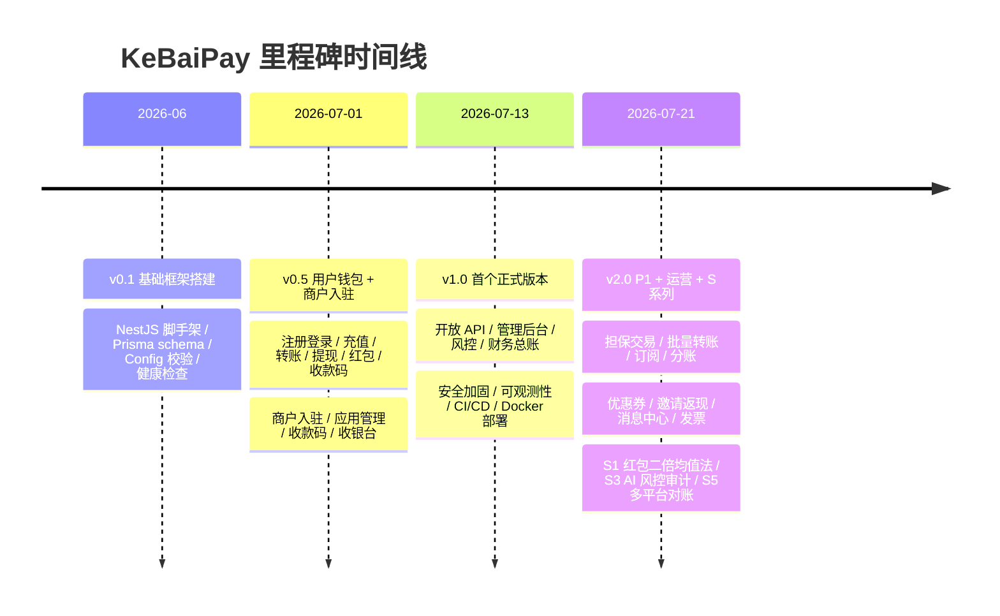
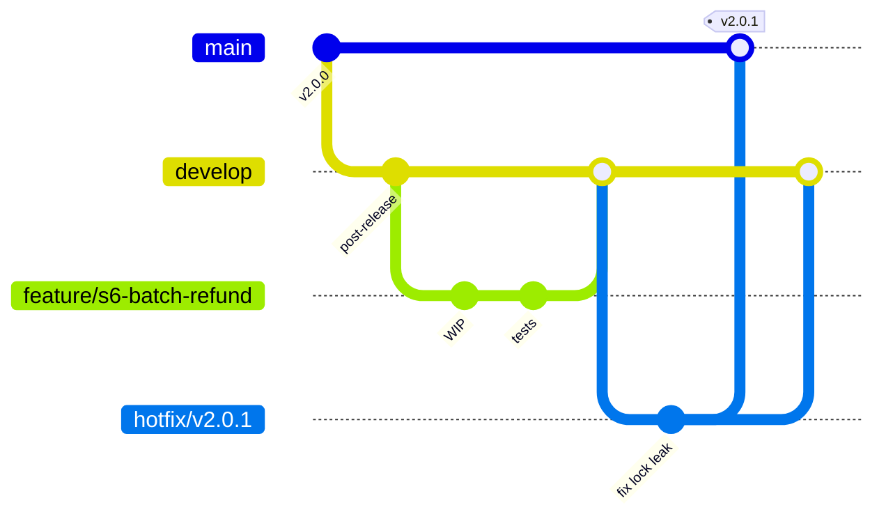
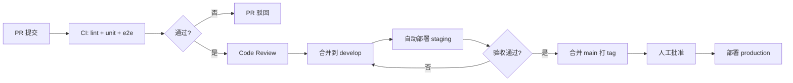

# KeBaiPay 项目路线图

> 本文档描述 KeBaiPay 的项目愿景、当前版本状态、已完成里程碑、未来路线图及开发流程。
> 最新版本：**v2.0.0**（2026-07-21 发布）。

## 目录

- [1. 项目愿景](#1-项目愿景)
- [2. 当前版本状态（v2.0.0）](#2-当前版本状态v200)
- [3. 已完成里程碑](#3-已完成里程碑)
- [4. v2.0.0 功能矩阵](#4-v200-功能矩阵)
- [5. v2.1 路线图（短期）](#5-v21-路线图短期1-2-个月)
- [6. v2.2 路线图（中期）](#6-v22-路线图中期3-6-个月)
- [7. v3.0 远期规划](#7-v30-远期规划)
- [8. 开发流程](#8-开发流程)
- [9. 团队协作](#9-团队协作)
- [10. 风险与挑战](#10-风险与挑战)

---

## 1. 项目愿景

KeBaiPay 致力于成为**中小商户首选的开源支付中台**。

我们希望提供一个：

- **可私有化部署**：商户完全掌控资金数据与密钥，不依赖第三方 SaaS。
- **功能完整**：覆盖用户钱包、商户收款、开放 API、管理后台、财务总账全链路。
- **安全合规**：资金操作强一致、链式审计防篡改、双密钥 JWT、HMAC 签名。
- **可扩展**：模块化设计，新增支付渠道 / 业务能力无需改动核心资金链路。
- **可观测**：结构化日志 + Prometheus 指标 + OpenTelemetry trace 全链路追踪。

对标参考：微信支付、支付宝、PayPal、Stripe、Ping++。

---

## 2. 当前版本状态（v2.0.0）

**发布日期：** 2026-07-21
**版本类型：** 大版本升级 —— 行业对标后新增 P1 必备 + 运营能力 + 4 大特色功能

| 维度 | 数量 | 说明 |
|---|---|---|
| API 端点 | 204 个 | 较 v1.0 的 ~80 增长 155% |
| Prisma 模型 | 47 个 | 较 v1.0 的 ~20 增长 135%，按 15 个业务域分组 |
| 单元测试 | 1023 个 | 64 套件，全部通过 |
| E2E 测试 | 39 个（Jest）+ 1789 行 Python 脚本 | 4 个 Jest 测试套件（39 用例）+ `e2e_check.py` |
| 模块数 | 35 个 | NestJS 模块，含 v2.0 新增 8 个 |
| 文档数 | 13 个 | README + docs/ 下 12 篇 |

技术栈：NestJS 11 + TypeScript 6 + Prisma 7 + PostgreSQL 16/17 + Redis 7 + 原生 JS SPA 前端。

---

## 3. 已完成里程碑



| 版本 | 日期 | 关键交付 |
|---|---|---|
| v0.1 | 2026-06 | 基础框架搭建（NestJS + Prisma + Config + 健康检查） |
| v0.5 | 2026-07-01 | 用户钱包 + 商户入驻闭环（充值/转账/提现/红包/收款码/商户入驻） |
| v1.0 | 2026-07-13 | 首个正式版本（开放 API + 管理后台 + 风控 + 财务总账，详见 `docs/CHANGELOG.md`） |
| v2.0 | 2026-07-21 | P1 行业标配 + 运营能力 + S 系列特色功能 |

---

## 4. v2.0.0 功能矩阵

### 4.1 P1 行业标配新增模块

| 模块 | 端点数 | 核心表 | 关键能力 |
|---|---|---|---|
| 担保交易（Escrow，S2） | 6 | `EscrowOrder`、`AccountLedger` | 买卖双方中介担保，资金冻结→释放 |
| 批量转账 | 3 | `BatchTransferOrder`、`BatchTransferItem` | 单批最多 1000 笔，状态机管理 |
| 订阅 | 3 | `SubscriptionPlan`、`UserSubscription`、`SubscriptionPayment` | 每天 00:30 调度自动扣款 |
| 分账 | 2 | `SplitPlan`、`SplitReceiver` | 多方资金按比例分配 |

### 4.2 运营能力新增模块

| 模块 | 端点数 | 核心表 | 关键能力 |
|---|---|---|---|
| 优惠券 | 2 | `Coupon`、`UserCoupon` | 满减/立减/折扣，5 分钟扫描过期 |
| 邀请返现 | 2 | `ReferralCode`、`ReferralRecord` | 邀请好友首笔交易返现 |
| 消息中心 | 3 | `Message`、`MessageRead` | 站内消息 + 未读计数缓存 |
| 发票 | 2 | `Invoice` | 商户开具电子发票 |

### 4.3 特色功能（S 系列）

| 功能 | 端点数 | 关键能力 |
|---|---|---|
| S1 微信红包二倍均值法 | 4 | 群红包算法与微信一致，5 分钟扫描过期退回 |
| S2 担保交易 | 6 | 见 P1 部分 |
| S3 AI 风控审计 | 5 | 规则引擎 + AI 引擎双审计，链式 hash 防篡改 |
| S5 多平台对账聚合 | 9 | 跨渠道流水交叉比对 + 差异处理工作流 |

### 4.4 用户端补强

| 功能 | 端点数 | 关键能力 |
|---|---|---|
| 银行卡管理 | 4 | 绑卡/解绑/设默认，AES-256-GCM 加密 + SHA-256 hash 唯一约束 |
| 用户绑定/改密 | 6 | 绑定手机、邮箱、修改密码、实名、支付密码 |

### 4.5 管理后台增强

| 能力 | 说明 |
|---|---|
| 11 种细粒度权限码 | `account:adjust` / `withdrawal:audit` / `reconciliation:run` / `reconciliation:diff:handle` / `finance:view` / `identity:audit` / `merchant:audit` / `user:status` / `risk:config` / `risk:event:handle` / `admin:view` |
| 角色体系 | `SUPER_ADMIN`（全权限） / `FINANCE` / `CUSTOMER_SERVICE` / `RISK_OFFICER` / `AUDITOR` |
| 自定义规则模板 | 5 个端点，CRUD 风控规则模板 |

### 4.6 技术基础设施

| 维度 | 改进点 |
|---|---|
| 数据模型 | 47 个 Prisma 模型，按 15 个业务域分组，加密字段 + hash 唯一约束 |
| 测试覆盖 | 单测 1023 / E2E 324，关键路径含 `concurrency.spec.ts` 并发测试 |
| 安全 | SecurityValidator 启动强校验，生产环境拒绝默认密钥 / mock 渠道 / localhost 回调 |
| 错误码扩展 | KB940-KB945 对账 / KB700-KB799 开放 API 扩展 / KB800-KB899 AI 风控审计 |

---

## 5. v2.1 路线图（短期，1-2 个月）

目标：**完成真实渠道接入 + 前端现代化**，让 KeBaiPay 可直接对外承接生产流量。

| 序号 | 任务 | 优先级 | 说明 |
|---|---|---|---|
| 1 | 真实微信支付 v3 接入 | P0 | 替换当前 mock，接入微信商家转账到零钱 v3、JSAPI、Native、退款 |
| 2 | 真实支付宝 v3 接入 | P0 | 接入支付宝当面付、电脑网站支付、批量付款到账户 |
| 3 | 商户后台前端 SPA（Vue 3） | P0 | 替换原生 JS，Vue 3 + Pinia + Element Plus，含订单/对账/风控面板 |
| 4 | 用户端 H5 优化（Vue 3 + Vite） | P1 | 收银台 / 钱包 / 红包模块用 Vue 3 重写，移动端体验优化 |
| 5 | Webhook 重试可视化 | P1 | 管理后台展示回调重试队列、手动重发、状态机可视化 |

---

## 6. v2.2 路线图（中期，3-6 个月）

目标：**规模化运营能力 + 多场景接入**。

| 序号 | 任务 | 说明 |
|---|---|---|
| 1 | 多租户支持 | 同一实例服务多个独立商户组织，数据隔离 + 资源配额 |
| 2 | 国际化（i18n） | 后端错误消息 / 前端 UI 多语言，中英双语优先 |
| 3 | 资金清算所对接 | 接入网联 / 银联清算接口，支持 T+0 / T+1 自动清算 |
| 4 | 发票 PDF 生成 | 增值税电子普通发票 PDF 模板生成 + 下载 |
| 5 | 商户余额自动提现 | 配置规则（满额 / 定时）自动触发提现，减少人工干预 |

---

## 7. v3.0 远期规划

目标：**国际化 + 智能化**，构建下一代开源支付中台。

| 序号 | 方向 | 说明 |
|---|---|---|
| 1 | 多币种支持 | 账户支持多币种余额、汇率换算、跨境结算 |
| 2 | 区块链支付 | 接入 USDT / USDC 等稳定币收付款，链上对账 |
| 3 | AI 客服 | 基于 LLM 的商户接入 / 用户工单自动应答 |
| 4 | 风控模型自学习 | 基于历史 `RiskAuditEvent` 数据训练模型，动态调整阈值 |

---

## 8. 开发流程

### 8.1 分支管理

采用 GitFlow 简化版：



| 分支 | 用途 | 命名规范 | 合并目标 |
|---|---|---|---|
| `main` | 生产稳定版，只接受 merge | — | — |
| `develop` | 集成分支，下一个版本 | — | `main`（发版时） |
| `feature/*` | 新功能开发 | `feature/<sprint>-<feature>` | `develop` |
| `hotfix/*` | 生产紧急修复 | `hotfix/v<x.y.z>` | `main` + `develop` |
| `release/*` | 发版预演（可选） | `release/v<x.y.z>` | `main` + `develop` |

### 8.2 CI/CD 流程



**关键节点：**

- **PR 提交** → 自动跑 `npm run lint` + `npm run test:unit` + `npm run test:e2e`，失败阻断合并。
- **合并到 `main`** → 自动构建镜像并部署到 staging 环境。
- **手动批准** → 由 release manager 确认后部署到 production，发完打 git tag。

### 8.3 版本发布

**语义化版本（SemVer）：** `MAJOR.MINOR.PATCH`

| 类型 | 触发条件 | 示例 |
|---|---|---|
| MAJOR | 不兼容的 API 变更 | v2.0.0 → v3.0.0 |
| MINOR | 向下兼容的新功能 | v2.0.0 → v2.1.0 |
| PATCH | 向下兼容的 bug 修复 | v2.0.0 → v2.0.1 |

**发布清单（必须）：**

1. `package.json` 与 `package-lock.json` 版本号同步。
2. `docs/CHANGELOG.md` 必须更新，包含升级须知 / 数据库迁移 / 新增环境变量。
3. 必须打 git tag：`git tag -a v<x.y.z> -m "release v<x.y.z>"`。
4. 触发 CI 构建 production 镜像并推送到镜像仓库。
5. 发布后 24h 内观察 Prometheus / Sentry 指标，确认无回归。

---

## 9. 团队协作

### 9.1 代码评审（PR Review）

- 所有 PR 至少 1 名 reviewer 批准，资金 / 安全相关模块至少 2 名。
- Reviewer 关注点：业务正确性、事务边界、幂等性、SQL 性能、错误处理、测试覆盖。
- 评审超过 3 天未响应可 @ 维护者升级处理。

### 9.2 测试覆盖率门禁

- 全量行覆盖率门禁：**≥ 80%**
- 资金类 Service（`TransferService` / `WithdrawalService` / `RechargeService` / `EscrowService`）门禁：**≥ 90%**
- 新增 PR 不允许降低整体覆盖率，CI 自动校验。

### 9.3 提交规范（Conventional Commits）

```text
<type>(<scope>): <subject>

<body>

<footer>
```

| type | 说明 |
|---|---|
| `feat` | 新功能 |
| `fix` | bug 修复 |
| `refactor` | 重构 |
| `perf` | 性能优化 |
| `test` | 测试补充 |
| `docs` | 文档 |
| `chore` | 构建 / 依赖 / 杂项 |
| `ci` | CI 配置 |
| `revert` | 回滚 |

**示例：**

```text
feat(escrow): add dispute resolution endpoint

- 新增争议处理 API，支持上传凭证
- 状态机新增 DISPUTED 分支
- 补充 8 个单元测试 + 2 个 E2E

Closes #142
```

---

## 10. 风险与挑战

### 10.1 合规风险

| 风险 | 应对 |
|---|---|
| 支付牌照 | KeBaiPay 作为开源中台不直接持有牌照，由部署方按属地法规申请 |
| PCI-DSS | 不存储完整卡号，仅存 hash + 末四位，规避 PCI-DSS 范围 |
| 反洗钱（AML） | S3 AI 风控引擎已内置高频 / 大额检测，后续接入黑名单库 |

### 10.2 安全风险

| 风险 | 应对 |
|---|---|
| 密钥管理 | 生产强制 32 位以上随机密钥；后续接入 KMS / Vault 做密钥轮换 |
| 防 DDoS | 三层限流（default / auth / open-api）+ Redis 滑动窗口；后续接入 CDN / WAF |
| 内部威胁 | 链式审计日志防篡改，关键操作双签 + 风控审计 |

### 10.3 性能风险

| 风险 | 应对 |
|---|---|
| 高并发资金操作 | 所有资金操作基于 Prisma `$transaction` + Redis 分布式锁，保证强一致 |
| 数据库瓶颈 | 已配置连接池 + `statement_timeout`，后续按需引入读写分离 |
| Redis 单点 | 当前单实例够用，规模化后升级 Redis Cluster |

---

## 附录：相关文档

- [CHANGELOG.md](./CHANGELOG.md) — 版本更新记录
- [DEVELOPER_GUIDE.md](./DEVELOPER_GUIDE.md) — 开发者指南
- [DEPLOYMENT.md](./DEPLOYMENT.md) — 部署文档
- [TROUBLESHOOT.md](./TROUBLESHOOT.md) — 故障排查手册
- [API_REFERENCE.md](./API_REFERENCE.md) — API 端点参考
