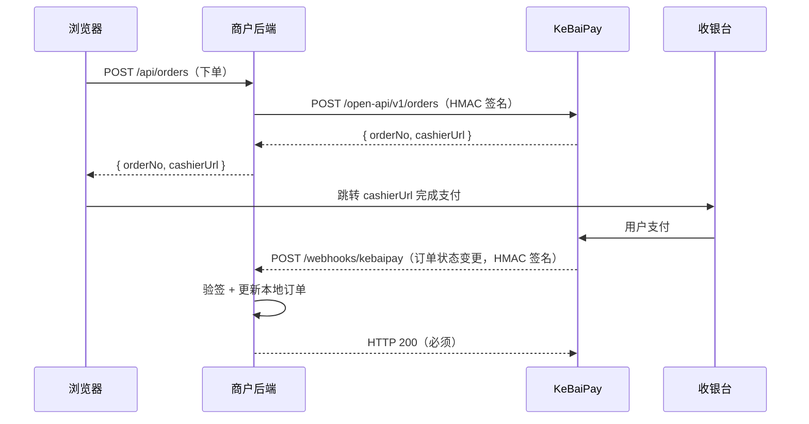

# KeBaiPay 商户 5 分钟快速接入指南

> 本指南面向第一次接入 KeBaiPay 的商户开发者，按步骤走完即可完成一笔真实收款。

## 1. 项目介绍

KeBaiPay（科佰支付）是一个面向 C 端钱包用户与 B 端商户的综合性支付与资金平台，提供个人钱包（充值、转账、提现、红包）、商户收银台、开放 API（创建订单、退款、转账、查余额）以及担保交易、批量转账、订阅、分账、多平台对账等高级资金能力。商户通过本指南可在 5 分钟内完成「注册 → 实名 → 入驻 → 创建应用 → 服务端集成 → 沙箱测试」全流程，并跑通一笔 1 分钱的收款订单。

---

## 2. 三种接入场景对比

KeBaiPay 对外提供三种典型接入场景，请根据业务形态选择：

| 场景 | 适用对象 | 认证方式 | 起步时间 |
|------|----------|----------|----------|
| 普通用户钱包（C 端） | 个人用户：充值、转账、提现、收发红包 | 用户 JWT | 2 分钟注册 |
| 商户收银台（B 端） | 商户通过页面/扫码向用户收款 | 用户 JWT + 应用 AppId | 10 分钟接入 |
| 开放 API（B 端服务端） | 商户后端服务端调用：创建订单、退款、转账、查余额 | HMAC-SHA256 签名 | 30 分钟接入 |

> 本指南聚焦「商户收银台 + 开放 API」组合，即最常见的「服务端下单 → 浏览器跳收银台 → Webhook 回调」场景。

---

## 3. 商户 5 分钟接入

### Step 1: 注册账号

通过手机号或邮箱注册新用户，成功后返回 JWT `token`，后续所有用户态接口都需要携带它。

```http
POST /auth/register HTTP/1.1
Host: your-domain:3000
Content-Type: application/json

{
  "nickname": "kebai_merchant",
  "phone": "13800000000",
  "password": "Kebai@2026"
}
```

> 密码策略：至少 8 位，且必须包含大写字母、小写字母、数字中的至少两类。

响应示例：

```json
{
  "userId": "c8f3...-9a1b",
  "token": "eyJhbGciOiJIUzI1NiIsInR5cCI6IkpXVCJ9..."
}
```

> 将 `token` 保存下来，Step 2~4 都会用到：`Authorization: Bearer <token>`。

---

### Step 2: 实名认证

KeBaiPay 要求所有商户主体必须先完成实名认证，提交后进入 `PENDING_REVIEW` 状态，等待管理员审核通过后才能申请商户入驻。

```http
POST /users/verify-identity HTTP/1.1
Host: your-domain:3000
Content-Type: application/json
Authorization: Bearer <token>

{
  "realName": "张三",
  "idCard": "110101199001011234",
  "payPassword": "123456"
}
```

| 参数 | 说明 |
|------|------|
| `realName` | 真实姓名，2~30 字符 |
| `idCard` | 身份证号，15~18 位 |
| `payPassword` | 支付密码，6 位纯数字（与银行惯例一致） |

响应示例：

```json
{
  "userId": "c8f3...-9a1b",
  "realNameStatus": "PENDING_REVIEW",
  "message": "实名认证已提交，等待管理员审核"
}
```

> 审核通过后 `realNameStatus` 变为 `VERIFIED`，可通过 `GET /users/me` 查询。审核未通过前不能进入 Step 3。

---

### Step 3: 商户入驻

实名通过后提交商户入驻申请，等待管理员审核。

```http
POST /merchants/register HTTP/1.1
Host: your-domain:3000
Content-Type: application/json
Authorization: Bearer <token>

{
  "merchantName": "科佰示例商城",
  "merchantType": "ENTERPRISE",
  "contactName": "张三",
  "contactPhone": "13800000000",
  "settleAccount": "6222020200112345678",
  "businessLicenseNo": "91110000XXXXXXXXXX"
}
```

| 参数 | 必填 | 说明 |
|------|------|------|
| `merchantName` | 是 | 商户名称 |
| `merchantType` | 否 | `PERSONAL`（个人）/ `ENTERPRISE`（企业），默认 `PERSONAL` |
| `contactName` | 否 | 联系人姓名 |
| `contactPhone` | 否 | 联系电话 |
| `settleAccount` | 否 | 结算账户（加密存储） |
| `businessLicenseNo` | 否 | 营业执照号 |

响应示例：

```json
{
  "merchantNo": "M202607210001",
  "merchantName": "科佰示例商城",
  "status": "PENDING",
  "payRate": 60,
  "withdrawRate": 60,
  "dailyLimit": 1000000
}
```

> 商户状态流转：`PENDING` → `APPROVED` / `REJECTED`。仅 `APPROVED` 状态可创建应用。可通过 `GET /merchants/me` 查询当前状态。

---

### Step 4: 创建应用获取 AppId/AppSecret

商户审核通过后，创建一个 API 应用以获取接入开放 API 所需的 `appId` 和 `appSecret`。

```http
POST /merchants/apps HTTP/1.1
Host: your-domain:3000
Content-Type: application/json
Authorization: Bearer <token>

{
  "name": "官网收银台",
  "callbackUrl": "https://your-domain.com/webhooks/kebaipay"
}
```

响应示例：

```json
{
  "appId": "app_3f9b2a1c8d7e4f60",
  "appSecret": "sk_8c2f1a9b3d7e4f60a1b2c3d4e5f6a7b8",
  "name": "官网收银台",
  "callbackUrl": "https://your-domain.com/webhooks/kebaipay",
  "status": "ACTIVE",
  "createdAt": "2026-07-21T10:00:00.000Z"
}
```

> ⚠️ **安全警告（务必遵守）**
>
> - `appSecret` **仅在创建时显示一次**，KeBaiPay 后端只保存其 SHA-256 哈希，丢失后无法找回。
> - `appSecret` **必须保存到环境变量**（如 `KEBAIPAY_APP_SECRET`），**禁止硬编码**进源码、禁止提交到 Git。
> - `appSecret` **禁止放在前端**（浏览器、小程序、App）。一旦泄露可伪造任意 OpenAPI 请求（创建订单、退款、转账、查余额），相当于完全接管商户账户。
> - 若不慎泄露，立即调用 `POST /merchants/apps/:appId/regenerate-secret` 重新生成密钥，旧密钥立即失效。

将密钥写入环境变量：

```bash
export KEBAIPAY_APP_ID="app_3f9b2a1c8d7e4f60"
export KEBAIPAY_APP_SECRET="sk_8c2f1a9b3d7e4f60a1b2c3d4e5f6a7b8"
export KEBAIPAY_BASE_URL="https://your-domain.com"
```

---

### Step 5: 服务端集成（Node.js SDK 示例）

KeBaiPay 提供 Node.js SDK（`public/sdk/kebaipay.js`），可直接拷贝到商户后端项目使用。下面是一个完整的 Express 示例，覆盖「创建订单 → 接收回调 → 验签」全流程。

#### 5.1 时序图



#### 5.2 完整 Express 示例

```javascript
// server.js
const express = require('express')
const crypto = require('crypto')
const { KeBaiPay } = require('./kebaipay.js') // 从 public/sdk/ 拷贝

const app = express()

// ⚠️ 必须保留原始 body 用于验签，express.json() 会消费流
app.use(
  express.json({
    verify: (req, res, buf) => {
      req.rawBody = buf.toString('utf8')
    },
  }),
)

// 初始化 SDK（密钥从环境变量读取）
const kebaipay = new KeBaiPay({
  appId: process.env.KEBAIPAY_APP_ID,
  appSecret: process.env.KEBAIPAY_APP_SECRET,
  baseUrl: process.env.KEBAIPAY_BASE_URL,
  timeout: 30000,
  maxRetries: 3,
})

// ============== 1) 创建订单（浏览器调用商户后端，商户后端再调用 KeBaiPay） ==============
app.post('/api/orders', async (req, res) => {
  try {
    const { amount, subject } = req.body

    const order = await kebaipay.createOrder({
      merchantOrderNo: `ORDER_${Date.now()}`,
      amount, // 单位：元，最小 0.01
      subject,
      callbackUrl: 'https://your-domain.com/webhooks/kebaipay',
    })

    // 返回 cashierUrl 给浏览器，由前端跳转完成支付
    res.json({
      success: true,
      orderNo: order.orderNo,
      cashierUrl: order.cashierUrl,
    })
  } catch (err) {
    console.error('创建订单失败:', err.code, err.message)
    res.status(500).json({ success: false, error: err.message })
  }
})

// ============== 2) 接收 KeBaiPay 回调 + 验签 ==============
app.post('/webhooks/kebaipay', async (req, res) => {
  // 1. 验证签名（必须，否则可被伪造）
  if (!verifyWebhookSignature(req.rawBody, req.headers, process.env.KEBAIPAY_APP_SECRET)) {
    return res.status(401).json({ error: 'Invalid signature' })
  }

  // 2. 处理订单状态（建议异步：先回 200 再处理业务，避免触发重试）
  const { orderNo, status, paidAt } = req.body
  if (status === 'PAID') {
    console.log(`订单 ${orderNo} 已支付，支付时间：${paidAt}`)
    // TODO: 更新本地数据库、发货等
  }

  // 3. 必须返回 200，否则 KeBaiPay 会触发重试
  res.json({ success: true })
})

app.listen(3001, () => {
  console.log('Merchant server running on http://localhost:3001')
})
```

#### 5.3 签名算法实现（HMAC-SHA256）

开放 API 的请求签名与回调验签都使用 HMAC-SHA256，签名串构造方式如下：

**开放 API 请求签名**（商户 → KeBaiPay）：

```
签名串 = `${method}\n${path}\n${rawBody}\n${timestamp}\n${nonce}\n${appId}`
签名值 = HMAC-SHA256(appSecret, 签名串)  // 输出 hex
```

```javascript
// 开放 API 请求签名（SDK 内部已实现，此处仅供理解原理）
function signRequest(method, path, body, timestamp, nonce, appId, appSecret) {
  const rawBody = body ? JSON.stringify(body) : ''
  const signString = `${method}\n${path}\n${rawBody}\n${timestamp}\n${nonce}\n${appId}`
  return crypto.createHmac('sha256', appSecret).update(signString, 'utf8').digest('hex')
}

// 调用时把签名放进请求头
//   x-app-id:     <appId>
//   x-timestamp:  <毫秒时间戳>      // 有效窗口：过去 120s ~ 未来 30s
//   x-nonce:      <随机字符串>      // 2 分钟内不可重复
//   x-signature:  <上面算出的签名>
```

#### 5.4 Webhook 验签示例

**回调验签**（KeBaiPay → 商户）签名串构造方式：

```
签名串 = `${timestamp}\n${nonce}\n${rawBody}`
签名值 = HMAC-SHA256(appSecret, 签名串)  // 输出 hex
```

```javascript
// Webhook 回调验签
function verifyWebhookSignature(rawBody, headers, appSecret) {
  const timestamp = headers['x-webhook-timestamp']
  const nonce = headers['x-webhook-nonce']
  const signature = headers['x-webhook-signature']

  if (!timestamp || !nonce || !signature) return false

  // 可选：校验时间戳防重放（建议 5 分钟内）
  const now = Date.now()
  if (Math.abs(now - Number(timestamp)) > 5 * 60 * 1000) return false

  const signString = `${timestamp}\n${nonce}\n${rawBody}`
  const expected = crypto
    .createHmac('sha256', appSecret)
    .update(signString, 'utf8')
    .digest('hex')

  // 使用恒定时间比较防侧信道
  return crypto.timingSafeEqual(Buffer.from(signature), Buffer.from(expected))
}
```

**Webhook 请求头**：

| Header | 说明 |
|--------|------|
| `X-Webhook-Timestamp` | 时间戳（毫秒） |
| `X-Webhook-Nonce` | 随机字符串（同一回调重试时相同） |
| `X-Webhook-Signature` | HMAC-SHA256 签名（hex） |

> 注意事项：
> 1. 必须返回 HTTP 200，否则会触发重试。
> 2. 建议异步处理业务逻辑：先返回 200 再处理，避免阻塞导致重试。
> 3. 签名验证失败应返回 401。
> 4. 同一回调可能因重试被多次投递，业务侧需做幂等。

---

### Step 6: 测试支付（沙箱）

KeBaiPay 内置 `mock` 渠道用于开发与测试环境，模拟真实渠道的异步支付流程，**生产环境会自动拦截 mock 渠道调用**。

#### mock 渠道行为

| 行为 | 说明 |
|------|------|
| 创建支付 | 返回 `PENDING` 状态和支付链接 |
| 订单查询 | 渠道订单号末位为 `1` → `FAILED`，否则 → `SUCCESS` |
| 退款查询 | 同上规则 |
| 签名验证 | HMAC-SHA256，密钥取 `MOCK_CHANNEL_SECRET`（未配置时使用 dev 默认值） |

#### 1 分钱测试订单

```javascript
// 创建一笔 0.01 元的测试订单
const testOrder = await kebaipay.createOrder({
  merchantOrderNo: `TEST_${Date.now()}`,
  amount: 0.01, // 单位：元
  subject: '测试商品 - 1 分钱',
  callbackUrl: 'https://your-domain.com/webhooks/kebaipay',
})

console.log('订单号:', testOrder.orderNo)
console.log('收银台:', testOrder.cashierUrl) // 浏览器打开此 URL 完成支付

// 主动查询订单状态
const result = await kebaipay.getOrder(testOrder.orderNo)
console.log('订单状态:', result.status) // PENDING | PAID | REFUNDED | CLOSED
```

#### 测试用 curl

```bash
# 用 curl 直接调用开放 API（需自行计算签名，建议用 SDK）
curl -X POST https://your-domain.com/open-api/v1/orders \
  -H "Content-Type: application/json" \
  -H "x-app-id: $KEBAIPAY_APP_ID" \
  -H "x-timestamp: $(date +%s%3N)" \
  -H "x-nonce: $(openssl rand -hex 16)" \
  -H "x-signature: <computed_signature>" \
  -d '{"merchantOrderNo":"TEST_001","amount":0.01,"subject":"测试商品"}'
```

---

### Step 7: 上线前 checklist

正式上线前，请逐项确认：

- [ ] **配置真实支付通道**：在管理后台配置微信支付 / 支付宝渠道参数（AppId、商户号、密钥、证书），并禁用 mock 渠道。
- [ ] **HTTPS 必须开启**：KeBaiPay 服务端与商户后端都必须 HTTPS，禁止 HTTP 明文传输 token 与密钥。
- [ ] **回调地址必须 HTTPS**：`callbackUrl` 必须为 `https://` 开头，否则可能被中间人篡改。
- [ ] **错误监控接入**：接入日志/告警系统，关注 `KB7xx`（订单/退款）、`KB401`（签名失败）、`KB005`（余额不足）等错误码。
- [ ] **限额配置**：根据业务在管理后台设置商户日限额（`dailyLimit`）、单笔限额，避免被异常订单打爆。
- [ ] **appSecret 安全**：确认 `appSecret` 仅存在于环境变量/密钥管理服务，未出现在源码、日志、前端。
- [ ] **幂等处理**：Webhook 回调与 `createOrder` 都需做幂等（使用 `idempotencyKey` 或 `merchantOrderNo` 去重）。
- [ ] **重试与超时**：SDK 默认 30s 超时、5xx 指数退避重试 3 次，按需调整。
- [ ] **对账机制**：定期调用 `GET /cashier/orders/reconciliation` 或管理端对账接口核对账务。

---

## 4. 高级功能速览

v2.0.0 新增了多项资金编排能力，商户可按需接入：

| 功能 | 接口前缀 | 适用对象 | 说明 |
|------|----------|----------|------|
| 担保交易（S2） | `/escrow` | C 端用户（买家/卖家） | 卖家可调用担保交易接口：创建订单 → 买家付款（资金冻结）→ 卖家发货 → 买家确认收货（放款）；支持退款申请与卖家处理 |
| 批量转账 | `/batch-transfers` | 商户 | 商户批量打款接口：一次性向多个收款方转账，原子提交、逐笔处理 |
| 订阅 | `/subscriptions` | 商户 | 商户配置订阅计划接口：创建计划、用户订阅、按周期自动扣款，支持试用期/暂停/恢复/取消 |
| 分账 | `/splits` | 商户 | 多方资金分配：把一笔已支付订单的金额按比例/固定金额分给多个接收方 |
| 多平台对账 | `/admin/channel-reconciliation` | 管理端（仅 FINANCE/SUPER_ADMIN） | 管理员对账接口：拉取渠道对账单、执行匹配、处理差异项 |

> 以上接口均为 JWT 认证（除多平台对账为管理员权限），详细参数请参考 [API_REFERENCE.md](./API_REFERENCE.md)。

---

## 5. 常见问题

### Q1: appSecret 丢了怎么办？

`appSecret` 仅在创建时显示一次，后端只保存哈希，无法找回。请调用 `POST /merchants/apps/:appId/regenerate-secret` 重新生成密钥，**旧密钥立即失效**，需同步更新所有调用方的环境变量。

```bash
curl -X POST https://your-domain.com/merchants/apps/app_xxx/regenerate-secret \
  -H "Authorization: Bearer <token>"
```

### Q2: 回调一直收不到？

按以下顺序排查：

1. **回调地址是否 HTTPS 且外网可访问**：`callbackUrl` 必须为公网可达的 HTTPS 地址，本地开发可用 ngrok/cpolar 内网穿透。
2. **是否返回 200**：回调处理必须返回 HTTP 200，否则会触发重试（重试到上限后停止）。
3. **是否被防火墙/WAF 拦截**：确认 KeBaiPay 服务器 IP 未被拦截。
4. **签名是否验通过**：临时关闭验签日志看是否收到请求，若收到但验签失败，检查 `appSecret` 是否正确、`rawBody` 是否被中间件改写。
5. **手动重试**：可调用 `POST /cashier/orders/:orderNo/notify` 手动触发回调通知。

### Q3: 订单一直 PENDING？

- 检查渠道配置是否正确（微信/支付宝参数、证书）。
- 检查是否误用 mock 渠道（生产环境会拦截）。
- 调用 `GET /open-api/v1/orders/:orderNo` 查询最新状态，或 `POST /cashier/orders/:orderNo/notify` 手动重试回调。

### Q4: 退款何时到账？

- 退款提交后进入 `PENDING`，渠道处理完成后通过退款回调更新为 `SUCCESS` / `FAILED`。
- 原路退回通常 1~3 个工作日到账（依渠道而定），钱包余额退款即时到账。
- 可通过 `GET /open-api/v1/orders/:orderNo` 查询订单状态是否变为 `REFUNDED`。

### Q5: 签名失败怎么办（KB401）？

按以下顺序排查：

1. **`appSecret` 是否正确**：与 `appId` 是否匹配，是否误用了过期密钥。
2. **签名串拼接顺序是否正确**：必须为 `${method}\n${path}\n${rawBody}\n${timestamp}\n${nonce}\n${appId}`，换行符为 `\n`。
3. **`rawBody` 是否为原始字节**：不能是 `JSON.stringify` 后的字符串（中间件可能改写），需用 `verify` 钩子保留原始 body。
4. **`path` 是否包含 query string**：签名用的 `path` 应为不含 query 的路径（如 `/open-api/v1/orders`）。
5. **时间戳是否在窗口内**：必须在过去 120s ~ 未来 30s 内，检查服务器时钟是否漂移。
6. **`nonce` 是否重复**：2 分钟内同一 `nonce` 会被判为重放，每次请求需重新生成。

### Q6: 测试环境 mock 渠道怎么用？

mock 渠道在开发/测试环境自动启用，无需额外配置：

- 创建订单时渠道会返回 `PENDING` + 一个 mock 支付链接。
- 渠道订单号末位为 `1` 时模拟 `FAILED`，否则 `SUCCESS`，可用于测试失败链路。
- mock 渠道密钥取环境变量 `MOCK_CHANNEL_SECRET`，未配置时使用 dev 默认值。
- **生产环境会自动拦截 mock 渠道**，无需手动关闭。

---

## 6. 相关文档

| 文档 | 说明 |
|------|------|
| [API_REFERENCE.md](./API_REFERENCE.md) | 完整 REST API 端点列表、请求/响应格式、错误码表（v2.0.0，204 个端点） |
| [SDK_GUIDE.md](./SDK_GUIDE.md) | Node.js SDK 详细使用指南、Webhook 验签、错误处理、环境变量配置 |
| [MERCHANT_GUIDE.md](./MERCHANT_GUIDE.md) | 商户注册、应用创建、订单管理、结算管理手册 |
| [DEVELOPER_GUIDE.md](./DEVELOPER_GUIDE.md) | 项目架构、v2.0.0 模块概览、数据库与复式记账、权限系统、认证方式 |

> 更多帮助：Swagger 文档 `http://your-domain:3000/api/docs`（仅开发环境） | 技术支持 `support@kebaipay.com` | 工作时间 周一至周五 9:00-18:00
