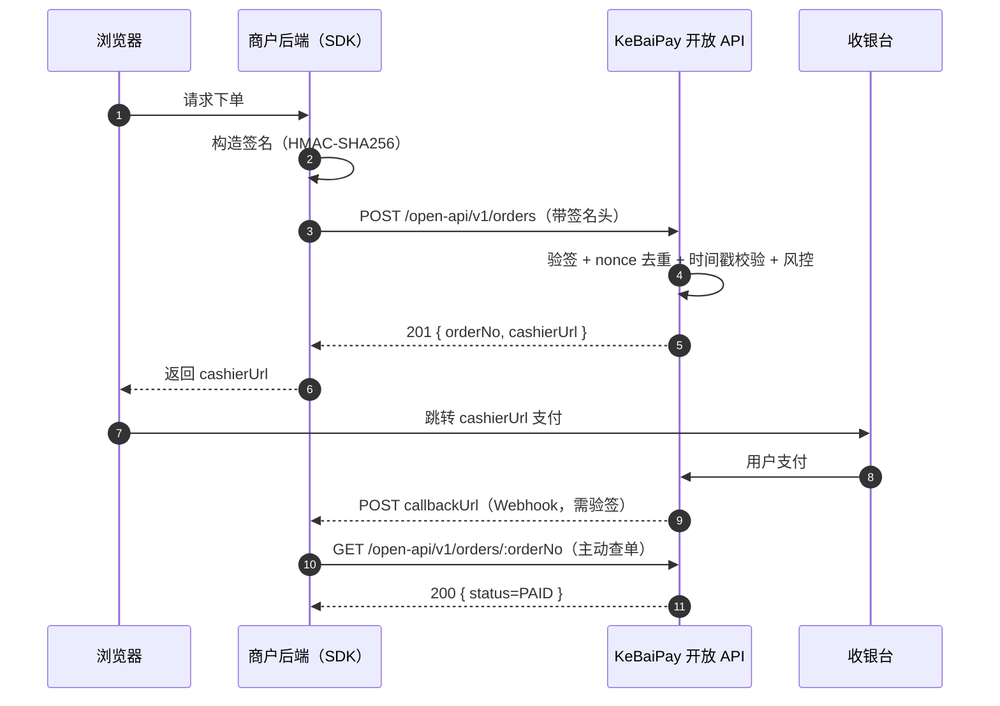

# KeBaiPay 开放 API SDK 使用说明

> 版本 2.0.0 | 适用商户后端 | 多语言 SDK 参考（Node.js / Python / Java / PHP）
> 配套文档：[API_REFERENCE.md](./API_REFERENCE.md) · [MERCHANT_GUIDE.md](./MERCHANT_GUIDE.md) · [QUICKSTART.md](./QUICKSTART.md)

---

## 目录

- [1. SDK 简介](#1-sdk-简介)
- [2. 多语言 SDK 实现](#2-多语言-sdk-实现)
  - [2.1 Node.js SDK（核心实现）](#21-nodejs-sdk核心实现)
  - [2.2 Python SDK](#22-python-sdk)
  - [2.3 Java SDK（伪代码）](#23-java-sdk伪代码)
  - [2.4 PHP SDK（伪代码）](#24-php-sdk伪代码)
- [3. Webhook 签名验证](#3-webhook-签名验证)
- [4. 错误处理](#4-错误处理)
- [5. 最佳实践](#5-最佳实践)
- [6. 测试与调试](#6-测试与调试)
- [7. 完整接入示例](#7-完整接入示例)
- [8. FAQ](#8-faq)
- [9. 相关文档](#9-相关文档)

---

## 1. SDK 简介

KeBaiPay 开放 API 是面向**商户后端**调用的 RESTful API，封装了商户最常用的 5 类资金能力：

| 能力 | 端点 | 说明 |
|------|------|------|
| 创建收款订单 | `POST /open-api/v1/orders` | 返回 `orderNo` 和 `cashierUrl`，浏览器跳转完成支付 |
| 查询订单 | `GET /open-api/v1/orders/:orderNo` | 主动查单，返回订单最新状态 |
| 申请退款 | `POST /open-api/v1/refunds` | 支持全额 / 部分退款，资金类接口需 `idempotencyKey` |
| 商户转账 | `POST /open-api/v1/transfers` | 商户向平台用户转账 |
| 查询余额 | `GET /open-api/v1/balance` | 查询商户当前可用余额 |

### 1.1 认证机制

所有请求必须通过 **HMAC-SHA256 签名认证**，签名头如下：

```http
X-App-Id:     app_xxxxxxxxxxxx
X-Timestamp:  1735689600000     # 毫秒时间戳，有效窗口：过去 120s ~ 未来 30s
X-Nonce:      7f8e9d6c-5b4a-3210-fedc-ba9876543210   # 唯一随机串，2 分钟内不可重复
X-Signature:  9c8b7a6f5e4d3c2b1a0987654321fedcba9876543210987654321fedcba98765
```

### 1.2 签名串格式

```text
sign_string = HTTP_METHOD\nPATH\nRAW_BODY\nTIMESTAMP\nNONCE\nAPP_ID
signature   = HMAC-SHA256(appSecret, sign_string)  # 输出小写 hex
```

> ⚠️ **安全警告**：`appSecret` 是商户密钥，泄露后可伪造任意 OpenAPI 请求（下单、退款、转账、查余额），等同接管商户账户。**禁止硬编码、禁止前端、必须环境变量。**

### 1.3 整体调用流程



---

## 2. 多语言 SDK 实现

### 2.1 Node.js SDK（核心实现）

完整可用的 SDK 类，**仅依赖 Node.js 内置模块**（`crypto` / `http` / `https` / `url`），无需 npm 安装，可直接拷贝到商户后端项目使用。

```javascript
/**
 * KeBaiPay Merchant Node.js SDK
 * 仅限商户后端使用，禁止在浏览器端引入。
 */
'use strict';

const crypto = require('crypto');
const https = require('https');
const http = require('http');
const { URL } = require('url');

const DEFAULT_TIMEOUT_MS = 30000;
const DEFAULT_MAX_RETRIES = 3;

class KeBaiPay {
  /**
   * @param {Object} options
   * @param {string} options.appId      商户应用 ID
   * @param {string} options.appSecret  商户应用密钥（从环境变量读取）
   * @param {string} options.baseUrl    KeBaiPay 服务地址，如 https://api.kebaipay.com
   * @param {number} [options.timeout]  请求超时，毫秒，默认 30000
   * @param {number} [options.maxRetries] 最大重试次数，默认 3（仅 5xx / 网络错误）
   */
  constructor(options) {
    if (!options || !options.appId || !options.appSecret) {
      throw new Error('KeBaiPay: appId and appSecret are required');
    }
    this.appId = options.appId;
    this.appSecret = options.appSecret;
    this.baseUrl = (options.baseUrl || '').replace(/\/+$/, '');
    this.timeout = options.timeout || DEFAULT_TIMEOUT_MS;
    this.maxRetries = options.maxRetries !== undefined ? options.maxRetries : DEFAULT_MAX_RETRIES;
  }

  /**
   * 生成 HMAC-SHA256 签名
   * 签名串：`{method}\n{path}\n{rawBody}\n{timestamp}\n{nonce}\n{appId}`
   */
  sign(method, path, rawBody, timestamp, nonce) {
    const message = [method, path, rawBody, timestamp, nonce, this.appId].join('\n');
    return crypto.createHmac('sha256', this.appSecret).update(message, 'utf8').digest('hex');
  }

  /** 生成 32 位 hex nonce */
  _nonce() {
    return crypto.randomBytes(16).toString('hex');
  }

  /** 指数退避：1s / 2s / 4s + 随机抖动 */
  _backoff(retryCount) {
    return Math.pow(2, retryCount) * 1000 + Math.floor(Math.random() * 500);
  }

  /**
   * 内部统一请求方法（带重试 + 错误处理）
   * - 网络错误：重试 maxRetries 次
   * - 5xx 错误：重试 maxRetries 次
   * - 4xx 错误：不重试，直接抛出
   */
  request(method, path, body) {
    const timestamp = Date.now().toString();
    const nonce = this._nonce();
    const bodyStr = body ? JSON.stringify(body) : '';
    const signature = this.sign(method, path, bodyStr, timestamp, nonce);
    const url = new URL(this.baseUrl + path);
    const lib = url.protocol === 'https:' ? https : http;

    const attempt = (retryCount) => new Promise((resolve, reject) => {
      const opts = {
        method,
        hostname: url.hostname,
        port: url.port,
        path: url.pathname + url.search,
        headers: {
          'Content-Type': 'application/json',
          'X-App-Id': this.appId,
          'X-Timestamp': timestamp,
          'X-Nonce': nonce,
          'X-Signature': signature,
          'Content-Length': Buffer.byteLength(bodyStr),
        },
        timeout: this.timeout,
      };

      const req = lib.request(opts, (res) => {
        let data = '';
        res.on('data', (chunk) => { data += chunk; });
        res.on('end', () => {
          let parsed;
          try {
            parsed = data ? JSON.parse(data) : {};
          } catch (e) {
            reject(new Error(`Invalid JSON response: ${data}`));
            return;
          }
          if (res.statusCode < 200 || res.statusCode >= 300) {
            const err = new Error(parsed.message || `HTTP ${res.statusCode}`);
            err.code = parsed.code || `HTTP_${res.statusCode}`;
            err.status = res.statusCode;
            err.data = parsed;
            err.traceId = parsed.traceId;
            // 4xx 业务错误不重试
            if (err.status >= 400 && err.status < 500) {
              reject(err);
              return;
            }
            // 5xx 走重试
            if (retryCount < this.maxRetries) {
              setTimeout(() => attempt(retryCount + 1).then(resolve, reject), this._backoff(retryCount));
              return;
            }
            reject(err);
            return;
          }
          resolve(parsed);
        });
      });

      req.on('error', (err) => {
        if (retryCount < this.maxRetries) {
          setTimeout(() => attempt(retryCount + 1).then(resolve, reject), this._backoff(retryCount));
          return;
        }
        reject(err);
      });

      req.on('timeout', () => {
        req.destroy();
        if (retryCount < this.maxRetries) {
          setTimeout(() => attempt(retryCount + 1).then(resolve, reject), this._backoff(retryCount));
          return;
        }
        reject(new Error(`Request timeout after ${this.timeout}ms`));
      });

      if (bodyStr) req.write(bodyStr);
      req.end();
    });

    return attempt(0);
  }

  /**
   * 创建收款订单
   * @param {Object} payload
   * @param {string} payload.merchantOrderNo 商户订单号（唯一）
   * @param {number} payload.amount          金额（元），最小 0.01
   * @param {string} payload.subject         商品标题
   * @param {string} [payload.body]          商品描述
   * @param {string} [payload.callbackUrl]   支付回调地址
   * @param {string} [payload.expiredAt]     过期时间 ISO 8601
   * @param {string} [payload.idempotencyKey] 幂等键
   * @returns {Promise<{orderNo, cashierUrl, status, amount, expiredAt}>}
   */
  createOrder(payload) {
    return this.request('POST', '/open-api/v1/orders', payload);
  }

  /**
   * 查询订单
   * @param {string} orderNo KeBaiPay 订单号
   */
  getOrder(orderNo) {
    return this.request('GET', '/open-api/v1/orders/' + encodeURIComponent(orderNo));
  }

  /**
   * 申请退款
   * @param {Object} params
   * @param {string} params.orderNo  原订单号
   * @param {number} [params.amount] 退款金额，不传则全额退款
   * @param {string} [params.reason] 退款原因
   * @param {string} [params.idempotencyKey] 幂等键（强烈建议传）
   */
  refund({ orderNo, amount, reason, idempotencyKey }) {
    const payload = { orderNo };
    if (amount !== undefined) payload.amount = amount;
    if (reason) payload.reason = reason;
    if (idempotencyKey) payload.idempotencyKey = idempotencyKey;
    return this.request('POST', '/open-api/v1/refunds', payload);
  }

  /**
   * 商户转账
   * @param {Object} params
   * @param {string} params.toUserId  收款用户 ID
   * @param {number} params.amount    金额（元）
   * @param {string} [params.remark]  转账备注
   * @param {string} [params.idempotencyKey] 幂等键
   */
  transfer({ toUserId, amount, remark, idempotencyKey }) {
    const payload = { toUserId, amount };
    if (remark) payload.remark = remark;
    if (idempotencyKey) payload.idempotencyKey = idempotencyKey;
    return this.request('POST', '/open-api/v1/transfers', payload);
  }

  /**
   * 查询商户余额
   * @returns {Promise<{availableBalanceYuan, frozenBalanceYuan, totalBalanceYuan}>}
   */
  getBalance() {
    return this.request('GET', '/open-api/v1/balance');
  }
}

module.exports = { KeBaiPay };
```

#### 使用方式

```javascript
const { KeBaiPay } = require('./kebaipay.js');

const client = new KeBaiPay({
  appId: process.env.KEBAIPAY_APP_ID,
  appSecret: process.env.KEBAIPAY_APP_SECRET,  // 必须从环境变量读取
  baseUrl: process.env.KEBAIPAY_BASE_URL || 'https://api.kebaipay.com',
  timeout: 30000,
  maxRetries: 3,
});

// 创建订单
const order = await client.createOrder({
  merchantOrderNo: `ORDER_${Date.now()}`,
  amount: 99.90,
  subject: 'VIP 会员月卡',
  body: '30 天 VIP 会员',
  callbackUrl: 'https://your-server.com/webhooks/kebaipay',
  idempotencyKey: `create_${Date.now()}`,
});
console.log(order.orderNo, order.cashierUrl);

// 查询订单
const detail = await client.getOrder(order.orderNo);
console.log(detail.status); // PENDING / PAID / REFUNDED / CLOSED

// 申请退款（部分）
const refund = await client.refund({
  orderNo: order.orderNo,
  amount: 20.00,
  reason: '商品部分退款',
  idempotencyKey: `refund_${order.orderNo}_1`,
});

// 商户转账
const transfer = await client.transfer({
  toUserId: 'user-uuid-xxxx',
  amount: 50.00,
  remark: '推广返佣',
  idempotencyKey: `transfer_${Date.now()}`,
});

// 查询余额
const balance = await client.getBalance();
console.log(balance.availableBalanceYuan);
```

---

### 2.2 Python SDK

仅依赖 Python 3 标准库（`urllib` / `hmac` / `hashlib` / `json` / `uuid` / `time`），可直接拷贝使用。

```python
"""
KeBaiPay Merchant Python SDK
仅限商户后端使用，禁止在客户端引入。
"""
import hashlib
import hmac
import json
import time
import uuid
import urllib.request
import urllib.error
from typing import Any, Dict, Optional


class KeBaiPayError(Exception):
    """SDK 异常，携带 code / status / data / trace_id"""
    def __init__(self, message: str, code: str = '', status: int = 0,
                 data: Optional[dict] = None, trace_id: str = ''):
        super().__init__(message)
        self.code = code
        self.status = status
        self.data = data or {}
        self.trace_id = trace_id


class KeBaiPay:
    DEFAULT_TIMEOUT = 30.0
    DEFAULT_MAX_RETRIES = 3

    def __init__(self, app_id: str, app_secret: str, base_url: str,
                 timeout: float = DEFAULT_TIMEOUT,
                 max_retries: int = DEFAULT_MAX_RETRIES):
        if not app_id or not app_secret:
            raise ValueError('app_id and app_secret are required')
        self.app_id = app_id
        self.app_secret = app_secret
        self.base_url = base_url.rstrip('/')
        self.timeout = timeout
        self.max_retries = max_retries

    def _sign(self, method: str, path: str, raw_body: str,
              timestamp: str, nonce: str) -> str:
        message = '\n'.join([method, path, raw_body, timestamp, nonce, self.app_id])
        return hmac.new(self.app_secret.encode('utf-8'),
                        message.encode('utf-8'),
                        hashlib.sha256).hexdigest()

    def _backoff(self, retry: int) -> float:
        # 1s / 2s / 4s + 小抖动
        return (2 ** retry) * 1.0 + (uuid.uuid4().int % 500) / 1000.0

    def _request(self, method: str, path: str, body: Optional[Dict[str, Any]] = None) -> Any:
        timestamp = str(int(time.time() * 1000))
        nonce = uuid.uuid4().hex
        raw_body = json.dumps(body, ensure_ascii=False) if body else ''
        signature = self._sign(method, path, raw_body, timestamp, nonce)
        url = self.base_url + path
        headers = {
            'Content-Type': 'application/json',
            'X-App-Id': self.app_id,
            'X-Timestamp': timestamp,
            'X-Nonce': nonce,
            'X-Signature': signature,
        }
        data = raw_body.encode('utf-8') if raw_body else None
        last_err = None
        for retry in range(self.max_retries + 1):
            try:
                req = urllib.request.Request(url, data=data, headers=headers, method=method)
                with urllib.request.urlopen(req, timeout=self.timeout) as resp:
                    payload = resp.read().decode('utf-8')
                    return json.loads(payload) if payload else {}
            except urllib.error.HTTPError as e:
                payload = e.read().decode('utf-8', errors='ignore')
                try:
                    parsed = json.loads(payload) if payload else {}
                except ValueError:
                    parsed = {'message': payload}
                err = KeBaiPayError(
                    parsed.get('message', f'HTTP {e.code}'),
                    code=parsed.get('code', f'HTTP_{e.code}'),
                    status=e.code,
                    data=parsed,
                    trace_id=parsed.get('traceId', ''),
                )
                # 4xx 业务错误不重试
                if 400 <= e.code < 500:
                    raise err
                last_err = err
            except (urllib.error.URLError, TimeoutError) as e:
                last_err = KeBaiPayError(str(e), code='NETWORK_ERROR', status=0)
            if retry < self.max_retries:
                time.sleep(self._backoff(retry))
        raise last_err  # type: ignore[misc]

    # ====== 业务方法 ======

    def create_order(self, payload: Dict[str, Any]) -> Dict[str, Any]:
        return self._request('POST', '/open-api/v1/orders', payload)

    def get_order(self, order_no: str) -> Dict[str, Any]:
        from urllib.parse import quote
        return self._request('GET', f'/open-api/v1/orders/{quote(order_no, safe="")}')

    def refund(self, order_no: str, amount: Optional[float] = None,
               reason: Optional[str] = None,
               idempotency_key: Optional[str] = None) -> Dict[str, Any]:
        payload: Dict[str, Any] = {'orderNo': order_no}
        if amount is not None:
            payload['amount'] = amount
        if reason:
            payload['reason'] = reason
        if idempotency_key:
            payload['idempotencyKey'] = idempotency_key
        return self._request('POST', '/open-api/v1/refunds', payload)

    def transfer(self, to_user_id: str, amount: float,
                 remark: Optional[str] = None,
                 idempotency_key: Optional[str] = None) -> Dict[str, Any]:
        payload: Dict[str, Any] = {'toUserId': to_user_id, 'amount': amount}
        if remark:
            payload['remark'] = remark
        if idempotency_key:
            payload['idempotencyKey'] = idempotency_key
        return self._request('POST', '/open-api/v1/transfers', payload)

    def get_balance(self) -> Dict[str, Any]:
        return self._request('GET', '/open-api/v1/balance')
```

#### 使用方式

```python
import os
from kebaipay import KeBaiPay, KeBaiPayError

client = KeBaiPay(
    app_id=os.environ['KEBAIPAY_APP_ID'],
    app_secret=os.environ['KEBAIPAY_APP_SECRET'],
    base_url=os.environ.get('KEBAIPAY_BASE_URL', 'https://api.kebaipay.com'),
)

try:
    order = client.create_order({
        'merchantOrderNo': f'ORDER_{int(time.time() * 1000)}',
        'amount': 99.90,
        'subject': 'VIP 会员月卡',
        'callbackUrl': 'https://your-server.com/webhooks/kebaipay',
        'idempotencyKey': f'create_{uuid.uuid4().hex}',
    })
    print(order['orderNo'], order['cashierUrl'])

    detail = client.get_order(order['orderNo'])
    print(detail['status'])

    refund = client.refund(
        order_no=order['orderNo'],
        amount=20.00,
        reason='部分退款',
        idempotency_key=f'refund_{order["orderNo"]}_1',
    )

    balance = client.get_balance()
    print(balance['availableBalanceYuan'])
except KeBaiPayError as e:
    print(f'调用失败 code={e.code} status={e.status} msg={e} traceId={e.trace_id}')
```

---

### 2.3 Java SDK（伪代码）

Java 接入推荐使用 `HttpURLConnection` 或 `OkHttp`，签名算法核心使用 `javax.crypto.Mac` + `javax.xml.bind.DatatypeConverter`（或 JDK 17+ 的 `HexFormat`）。

**关键接入点：**

1. **依赖**：JDK 8+，无需第三方库；若用 OkHttp 则引入 `com.squareup.okhttp3:okhttp`。
2. **签名串拼接**：严格按 `method\npath\nrawBody\ntimestamp\nnonce\nappId` 顺序拼接，**换行符必须为 `\n`**。
3. **HMAC-SHA256**：`Mac.getInstance("HmacSHA256")` → `new SecretKeySpec(appSecret.getBytes("UTF-8"), "HmacSHA256")` → 输出 hex 小写。
4. **请求头**：设置 `X-App-Id` / `X-Timestamp` / `X-Nonce` / `X-Signature` 四个签名头，外加 `Content-Type: application/json`。
5. **重试策略**：使用 `Thread.sleep` 或 `ScheduledExecutorService` 实现 1s/2s/4s 指数退避，仅对 5xx 与网络异常重试。
6. **`rawBody`**：直接使用 `JSON.toJSONString(payload)` 的字节序列，**不要在签名后再序列化**，否则签名失效。
7. **超时**：connectTimeout 10s / readTimeout 30s。
8. **错误处理**：自定义 `KeBaiPayException` 携带 `code` / `status` / `traceId`，4xx 直接抛出，5xx 触发重试。

伪代码骨架：

```java
public class KeBaiPay {
    private final String appId;
    private final String appSecret;
    private final String baseUrl;
    private final int timeoutMs;
    private final int maxRetries;

    public KeBaiPay(String appId, String appSecret, String baseUrl, int timeoutMs, int maxRetries) { /* ... */ }

    private String sign(String method, String path, String rawBody, String timestamp, String nonce) {
        String message = String.join("\n", method, path, rawBody, timestamp, nonce, appId);
        Mac mac = Mac.getInstance("HmacSHA256");
        mac.init(new SecretKeySpec(appSecret.getBytes(StandardCharsets.UTF_8), "HmacSHA256"));
        byte[] raw = mac.doFinal(message.getBytes(StandardCharsets.UTF_8));
        return HexFormat.of().formatHex(raw); // JDK 17+，或用 DatatypeConverter.printHex(raw).toLowerCase()
    }

    private String request(String method, String path, Object body, int retry) throws KeBaiPayException {
        String rawBody = body == null ? "" : JSON.toJSONString(body);
        String timestamp = String.valueOf(System.currentTimeMillis());
        String nonce = UUID.randomUUID().toString().replace("-", "");
        String signature = sign(method, path, rawBody, timestamp, nonce);

        // 使用 HttpURLConnection 或 OkHttp 发起请求，设置 4 个签名头
        // 解析响应：
        //   - 2xx：JSON.parseObject(respBody, clazz)
        //   - 4xx：抛 KeBaiPayException(code, status)，不重试
        //   - 5xx：retry < maxRetries 时 Thread.sleep(backoff(retry)) 后重试，否则抛异常
        return /* ... */ null;
    }

    public OrderResponse createOrder(CreateOrderRequest payload) { /* ... */ }
    public OrderResponse getOrder(String orderNo) { /* ... */ }
    public RefundResponse refund(RefundRequest payload) { /* ... */ }
    public TransferResponse transfer(TransferRequest payload) { /* ... */ }
    public BalanceResponse getBalance() { /* ... */ }
}
```

---

### 2.4 PHP SDK（伪代码）

PHP 接入推荐使用 cURL 扩展，签名算法使用 `hash_hmac` 内置函数即可，非常简洁。

**关键接入点：**

1. **依赖**：PHP 7.2+，开启 `curl` 扩展；JSON 编码使用 `json_encode($payload, JSON_UNESCAPED_UNICODE | JSON_UNESCAPED_SLASHES)`。
2. **签名**：`hash_hmac('sha256', $signString, $appSecret)` 直接输出小写 hex。
3. **签名串**：`implode("\n", [$method, $path, $rawBody, $timestamp, $nonce, $appId])`，注意 `\n` 必须是双引号字符串。
4. **请求头**：cURL 设置 `CURLOPT_HTTPHEADER`，包含 4 个签名头。
5. **`rawBody`**：**必须**用与签名时相同的字符串作为 `CURLOPT_POSTFIELDS`，不要再次 `json_encode`。
6. **超时**：`CURLOPT_CONNECTTIMEOUT=10`，`CURLOPT_TIMEOUT=30`。
7. **重试**：5xx / 网络错误用 `usleep(1000000 * (2 ** $retry))` 退避，4xx 不重试。
8. **时间戳**：`round(microtime(true) * 1000)` 取毫秒。
9. **nonce**：`bin2hex(random_bytes(16))` 生成 32 位随机串。

伪代码骨架：

```php
<?php
class KeBaiPay {
    private $appId;
    private $appSecret;
    private $baseUrl;
    private $timeout;
    private $maxRetries;

    public function __construct($appId, $appSecret, $baseUrl, $timeout = 30, $maxRetries = 3) { /* ... */ }

    private function sign($method, $path, $rawBody, $timestamp, $nonce) {
        $message = implode("\n", [$method, $path, $rawBody, $timestamp, $nonce, $this->appId]);
        return hash_hmac('sha256', $message, $this->appSecret); // 输出小写 hex
    }

    private function request($method, $path, $body = null) {
        $rawBody = $body === null ? '' : json_encode($body, JSON_UNESCAPED_UNICODE | JSON_UNESCAPED_SLASHES);
        $timestamp = (string) round(microtime(true) * 1000);
        $nonce = bin2hex(random_bytes(16));
        $signature = $this->sign($method, $path, $rawBody, $timestamp, $nonce);

        $ch = curl_init($this->baseUrl . $path);
        curl_setopt_array($ch, [
            CURLOPT_RETURNTRANSFER => true,
            CURLOPT_CUSTOMREQUEST  => $method,
            CURLOPT_POSTFIELDS     => $rawBody,
            CURLOPT_CONNECTTIMEOUT => 10,
            CURLOPT_TIMEOUT        => $this->timeout,
            CURLOPT_HTTPHEADER     => [
                'Content-Type: application/json',
                "X-App-Id: {$this->appId}",
                "X-Timestamp: {$timestamp}",
                "X-Nonce: {$nonce}",
                "X-Signature: {$signature}",
            ],
        ]);
        // 5xx / 网络错误重试 1s/2s/4s；4xx 直接抛 KeBaiPayException
        // 解析 body 中的 code/message/traceId
        return /* ... */;
    }

    public function createOrder($payload) { /* ... */ }
    public function getOrder($orderNo) { /* ... */ }
    public function refund($orderNo, $amount = null, $reason = null, $idempotencyKey = null) { /* ... */ }
    public function transfer($toUserId, $amount, $remark = null, $idempotencyKey = null) { /* ... */ }
    public function getBalance() { /* ... */ }
}
```

---

## 3. Webhook 签名验证

KeBaiPay 在订单状态变更时会向商户 `callbackUrl` 发起 POST 回调，**必须验签后才能信任**，否则可被伪造。

### 3.1 Webhook 事件类型

| 事件类型 | 触发时机 | 关键字段 |
|---------|---------|---------|
| `PAYMENT_SUCCESS` | 用户支付成功 | `orderNo`, `amount`, `paidAt` |
| `PAYMENT_FAILED` | 支付失败 | `orderNo`, `reason` |
| `REFUND_SUCCESS` | 退款成功 | `orderNo`, `refundNo`, `refundAmount` |
| `REFUND_FAILED` | 退款失败 | `orderNo`, `refundNo`, `reason` |
| `TRANSFER_SUCCESS` | 商户转账成功 | `transferNo`, `toUserId`, `amount` |
| `TRANSFER_FAILED` | 商户转账失败 | `transferNo`, `reason` |

**Webhook 请求头：**

| Header | 说明 |
|--------|------|
| `X-App-Id` | 触发回调的应用 ID（可校验是否为本商户应用） |
| `X-Timestamp` | 时间戳（毫秒） |
| `X-Nonce` | 随机字符串（同一回调重试时 nonce 相同，用于幂等） |
| `X-Signature` | HMAC-SHA256 签名（hex 小写） |

### 3.2 验签算法（Node.js 完整示例）

```javascript
const crypto = require('crypto');

/**
 * 验证 KeBaiPay Webhook 签名
 * @param {Object} headers   请求头（小写键）
 * @param {string} rawBody   原始 body 字符串（不能用 JSON.stringify 重新生成）
 * @param {string} appSecret 商户应用密钥
 * @returns {boolean}
 */
function verifyWebhook(headers, rawBody, appSecret) {
  const appId = headers['x-app-id'];
  const timestamp = headers['x-timestamp'];
  const nonce = headers['x-nonce'];
  const signature = headers['x-signature'];

  // 1. 缺少必要头
  if (!appId || !timestamp || !nonce || !signature) return false;

  // 2. 时间戳防重放（建议 5 分钟内）
  const now = Date.now();
  if (Math.abs(now - Number(timestamp)) > 5 * 60 * 1000) return false;

  // 3. 重新构造签名串：{timestamp}\n{nonce}\n{rawBody}
  const signString = `${timestamp}\n${nonce}\n${rawBody}`;
  const expected = crypto
    .createHmac('sha256', appSecret)
    .update(signString, 'utf8')
    .digest('hex');

  // 4. 用 timingSafeEqual 恒定时间比较，防时序攻击
  const a = Buffer.from(signature);
  const b = Buffer.from(expected);
  if (a.length !== b.length) return false;
  return crypto.timingSafeEqual(a, b);
}
```

> **关键点**：
> - `rawBody` 必须是原始字节序列，**不能用 `JSON.stringify(req.body)` 重新生成**（键顺序、空格、Unicode 转义都可能不同）。
> - 必须使用 `timingSafeEqual` 恒定时间比较，防止时序侧信道攻击。

### 3.3 验签示例（Express 中间件）

```javascript
const express = require('express');
const crypto = require('crypto');

const app = express();

// 必须在 express.json() 之前注册 verify 钩子，保留原始 body
app.use(express.json({
  verify: (req, res, buf) => {
    req.rawBody = buf.toString('utf8');
  },
}));

// Webhook 验签中间件
function webhookAuth(req, res, next) {
  const ok = verifyWebhook(req.headers, req.rawBody, process.env.KEBAIPAY_APP_SECRET);
  if (!ok) {
    return res.status(401).json({ success: false, error: 'Invalid signature' });
  }
  next();
}

app.post('/webhooks/kebaipay', webhookAuth, async (req, res) => {
  // 1. 先返回 200，避免触发重试
  res.status(200).json({ success: true });

  // 2. 异步处理业务逻辑（同一 nonce 可能因重试被多次投递，需做幂等）
  const { eventType, orderNo, amount, paidAt } = req.body;
  try {
    switch (eventType) {
      case 'PAYMENT_SUCCESS':
        await markOrderPaid(orderNo, amount, paidAt);
        break;
      case 'PAYMENT_FAILED':
        await markOrderFailed(orderNo);
        break;
      case 'REFUND_SUCCESS':
        await markRefundSuccess(orderNo, req.body.refundNo);
        break;
      case 'REFUND_FAILED':
        await markRefundFailed(orderNo, req.body.refundNo, req.body.reason);
        break;
      case 'TRANSFER_SUCCESS':
        await markTransferSuccess(req.body.transferNo);
        break;
      case 'TRANSFER_FAILED':
        await markTransferFailed(req.body.transferNo, req.body.reason);
        break;
      default:
        console.warn('未知事件类型:', eventType);
    }
  } catch (err) {
    console.error('Webhook 处理失败:', err);
    // 业务失败不要影响已返回的 200，记日志后由对账兜底
  }
});

app.listen(3001, () => console.log('Merchant server on :3001'));
```

### 3.4 验签示例（Python Flask）

```python
import os
import hmac
import hashlib
from flask import Flask, request, jsonify

app = Flask(__name__)
APP_SECRET = os.environ['KEBAIPAY_APP_SECRET'].encode('utf-8')


def verify_webhook(headers, raw_body: bytes, app_secret: bytes) -> bool:
    app_id = headers.get('X-App-Id')
    timestamp = headers.get('X-Timestamp')
    nonce = headers.get('X-Nonce')
    signature = headers.get('X-Signature')
    if not all([app_id, timestamp, nonce, signature]):
        return False
    # 时间戳校验（5 分钟内）
    import time
    try:
        if abs(int(time.time() * 1000) - int(timestamp)) > 5 * 60 * 1000:
            return False
    except ValueError:
        return False
    sign_string = f'{timestamp}\n{nonce}\n'.encode('utf-8') + raw_body
    expected = hmac.new(app_secret, sign_string, hashlib.sha256).hexdigest()
    # compare_digest 恒定时间比较
    return hmac.compare_digest(expected, signature)


@app.post('/webhooks/kebaipay')
def webhook():
    raw = request.get_data()  # 原始 body 字节
    if not verify_webhook(request.headers, raw, APP_SECRET):
        return jsonify(success=False, error='Invalid signature'), 401

    payload = request.get_json(force=True, silent=True) or {}
    event_type = payload.get('eventType')
    order_no = payload.get('orderNo')

    # 先返回 200，业务异步处理
    # 实际生产建议把 payload 丢到 Celery / RQ / 后台线程处理
    try:
        if event_type == 'PAYMENT_SUCCESS':
            print(f'订单 {order_no} 支付成功，金额 {payload.get("amount")}')
        elif event_type == 'REFUND_SUCCESS':
            print(f'订单 {order_no} 退款成功 {payload.get("refundNo")}')
        elif event_type == 'TRANSFER_SUCCESS':
            print(f'转账 {payload.get("transferNo")} 成功')
        # ... 其他事件
    except Exception as e:
        print('Webhook 处理失败:', e)

    return jsonify(success=True), 200


if __name__ == '__main__':
    app.run(port=5000)
```

---

## 4. 错误处理

### 4.1 错误响应格式

KeBaiPay 所有失败响应统一返回如下 envelope：

```json
{
  "success": false,
  "error": {
    "code": "KB711",
    "message": "金额必须大于 0",
    "traceId": "a1b2c3d4-e5f6-7890"
  }
}
```

| 字段 | 类型 | 说明 |
|------|------|------|
| `success` | boolean | 固定 `false` |
| `error.code` | string | 业务错误码，格式 `KBxxx`，是稳定契约，可作分支判断 |
| `error.message` | string | 错误描述，可直接展示给最终用户 |
| `error.traceId` | string | 链路追踪 ID，与响应头 `X-Request-Id` 一致，用于排查问题 |

### 4.2 常见错误码

| 错误码 | HTTP | 含义 | 处理建议 |
|--------|------|------|---------|
| `KB401` | 401 | 签名/认证失败 | 检查 `appSecret`、签名串拼接、时间戳窗口、nonce 是否重复 |
| `KB403` | 403 | 权限/风控禁止 | 检查应用是否被禁用、是否触发风控规则 |
| `KB404` | 404 | 资源不存在 | 检查 `orderNo` / `transferNo` 是否正确 |
| `KB429` | 429 | 请求过于频繁 | 限流，按指数退避重试 |
| `KB603` | 404 | 订单不存在 | 检查 `orderNo`，或先调用 `createOrder` |
| `KB621` | 409 | 幂等键冲突 | 更换 `idempotencyKey` 后重试，或查询上次结果 |
| `KB711` | 400 | 金额必须大于 0 | 检查 `amount` 是否合法 |
| `KB712` | 400 | 订单有效期不能超过 24 小时 | 调整 `expiredAt` |
| `KB713` | 400 | 订单状态不可退款 | 检查订单是否处于 `PAID` 状态，是否已全额退款 |
| `KB714` | 400 | 订单已全额退款 | 无需再次退款 |
| `KB715` | 400 | 退款金额必须大于 0 | 检查退款 `amount` |
| `KB716` | 400 | 退款金额超过可退金额 | 减小退款金额，或查询可退金额 |
| `KB717` | 403 | 应用已禁用 | 在商户后台重新启用应用 |
| `KB001` | 500 | 系统错误 | 5xx 自动重试 3 次后仍失败请联系运营 |

> 完整错误码表见 [API_REFERENCE.md#错误码表](./API_REFERENCE.md#错误码表)。

### 4.3 SDK 重试策略

| 触发场景 | 是否重试 | 最大次数 | 退避算法 |
|---------|---------|---------|---------|
| 网络错误（DNS / 连接 / 超时） | ✅ | 3 | 1s / 2s / 4s + 随机抖动 |
| 5xx 服务端错误 | ✅ | 3 | 1s / 2s / 4s + 随机抖动 |
| 429 限流 | ❌（SDK 默认不重试） | - | 业务侧自行退避 |
| 4xx 业务错误（含 401/403/404） | ❌ | 0 | 直接抛出 |
| 2xx 成功 | - | - | 直接返回 |

**退避算法实现：**

```javascript
// 第 N 次重试（N 从 0 开始）的等待毫秒数
function backoff(retryCount) {
  return Math.pow(2, retryCount) * 1000 + Math.floor(Math.random() * 500);
}
// retryCount=0 → ~1000ms
// retryCount=1 → ~2000ms
// retryCount=2 → ~4000ms
```

可通过构造参数 `maxRetries: 0` 关闭重试。

**错误对象属性：**

```javascript
try {
  await client.refund({ orderNo: 'PAY-xxxx', amount: 100 });
} catch (err) {
  console.log(err.code);     // 'KB713'
  console.log(err.message);  // '订单状态不可退款'
  console.log(err.status);   // 400
  console.log(err.traceId);  // 'a1b2c3d4-...'
  console.log(err.data);     // 原始响应 body
}
```

---

## 5. 最佳实践

### 5.1 appSecret 保管

| 规则 | 说明 |
|------|------|
| ❌ 禁止硬编码 | 不得写在源码、配置文件、Dockerfile |
| ❌ 禁止前端持有 | 不得出现在浏览器、小程序、App、客户端 SDK |
| ❌ 禁止提交 Git | `.gitignore` 排除 `.env`，使用密钥管理服务（KMS / Vault / AWS Secrets Manager） |
| ✅ 必须环境变量 | `KEBAIPAY_APP_SECRET` 由部署时注入 |
| ✅ 定期轮换 | 通过 `POST /merchants/apps/:appId/regenerate-secret` 重新生成，旧密钥立即失效 |

### 5.2 nonce 防重放

- 每次请求生成**唯一 nonce**（推荐 32 位 hex）
- 服务端 Redis `SET NX` 原子去重，TTL 2 分钟
- 同一 nonce 2 分钟内重复请求返回 `KB401`
- **不要**复用 nonce，即使重试也要重新生成

```javascript
// 正确：每次请求生成新 nonce
const nonce = crypto.randomBytes(16).toString('hex');
```

### 5.3 时间戳

- 客户端与服务器**时间差不超过 120 秒**
- 时间戳为毫秒级 Unix 时间戳
- 服务端窗口：过去 120s ~ 未来 30s，超出返回 `KB401`
- 生产环境必须开启 NTP 时钟同步

### 5.4 幂等性

所有**资金类接口**支持 `idempotencyKey`，强烈建议传：

| 接口 | 幂等键字段 | 重复请求行为 |
|------|-----------|------------|
| `POST /open-api/v1/orders` | `idempotencyKey` 或 `merchantOrderNo` | 返回同一 `orderNo`，不重复创建 |
| `POST /open-api/v1/refunds` | `idempotencyKey` | 返回同一 `refundNo`，不重复扣款 |
| `POST /open-api/v1/transfers` | `idempotencyKey` | 返回同一 `transferNo`，不重复转账 |

```javascript
// 推荐做法：用业务唯一键 + 时间戳/UUID 拼接
const idempotencyKey = `refund_${orderNo}_${Date.now()}`;
```

### 5.5 错误监控

- 建议集成 [Sentry](https://sentry.io) / Datadog / 自建告警
- 关注错误码：
  - `KB401`：可能密钥泄露或服务器时钟漂移
  - `KB429`：调用频率过高，需接入限流
  - `KB7xx`：业务异常，需对账
  - `KB001`：系统错误，立即告警
- 上报时携带 `traceId` 便于服务端关联日志

### 5.6 日志记录

所有 API 调用必须记录**请求与响应**：

```javascript
const logger = require('pino')();

async function callWithLog(fn, args) {
  const startedAt = Date.now();
  try {
    const res = await fn(args);
    logger.info({
      method: 'createOrder',
      args,
      response: res,
      costMs: Date.now() - startedAt,
    }, 'KeBaiPay API success');
    return res;
  } catch (err) {
    logger.error({
      method: 'createOrder',
      args,
      errCode: err.code,
      errStatus: err.status,
      traceId: err.traceId,
      message: err.message,
      costMs: Date.now() - startedAt,
    }, 'KeBaiPay API failed');
    throw err;
  }
}
```

> ⚠️ 日志中**禁止打印 `appSecret` / 签名串 / 完整 `appSecret` 派生值**。

### 5.7 限流应对

| 接口 | 限流规则 |
|------|---------|
| `/open-api/v1/*` | 30 次 / 分钟（按 appId） |
| `/auth/*` | 5 次 / 60 秒 |
| 全局其他 | 100 次 / 60 秒 |

超限返回 `429`：

```json
{
  "success": false,
  "error": {
    "code": "KB429",
    "message": "请求过于频繁",
    "traceId": "..."
  }
}
```

**应对策略：**
- 客户端令牌桶 / 漏桶限流，控制 QPS 在 0.5（即每 2 秒最多 1 次）
- 429 后按指数退避（1s / 2s / 4s / 8s）重试，最多 5 次
- 批量场景使用业务侧队列削峰

---

## 6. 测试与调试

### 6.1 mock 渠道（开发环境）

KeBaiPay 内置 `mock` 渠道用于开发与测试环境，模拟真实支付流程，**生产环境自动拦截**。

| 配置项 | 说明 |
|--------|------|
| `MOCK_CHANNEL_SECRET` | mock 渠道签名密钥，未配置时使用 dev 默认值 |
| mock 行为 | 创建订单返回 `PENDING` + 支付链接 |
| 模拟成功 | 渠道订单号末位非 `1` → `SUCCESS` |
| 模拟失败 | 渠道订单号末位为 `1` → `FAILED` |
| 适用范围 | 开发 / 测试环境，**生产环境自动拦截** |

```bash
# .env.dev
MOCK_CHANNEL_SECRET=dev_mock_secret_change_me
KEBAIPAY_BASE_URL=http://localhost:3000
```

**1 分钱测试订单：**

```javascript
const order = await client.createOrder({
  merchantOrderNo: `TEST_${Date.now()}`,
  amount: 0.01,
  subject: '测试商品 - 1 分钱',
  callbackUrl: 'https://your-ngrok-url/webhooks/kebaipay',
});
console.log('收银台:', order.cashierUrl); // 浏览器打开即可完成支付
```

### 6.2 签名调试

**签名串格式（OpenAPI 请求）：**

```text
{method}\n{path}\n{rawBody}\n{timestamp}\n{nonce}\n{appId}
```

示例：

```text
POST
/open-api/v1/orders
{"merchantOrderNo":"M001","amount":0.01,"subject":"test"}
1735689600000
7f8e9d6c5b4a3210fedcba9876543210
app_3f9b2a1c8d7e4f60
```

**调试步骤：**

1. 用上述字符串作为 message，`appSecret` 作为 key，在任意 [HMAC-SHA256 在线工具](https://www.liavaag.org/English/online-tools/hmac-generator/) 计算签名
2. 与请求头 `X-Signature` 比较，必须**完全一致**（小写 hex）
3. 常见问题：
   - 换行符必须是 `\n`（LF），不是 `\r\n`（CRLF）
   - `path` 不含 query string
   - `rawBody` 必须与实际发送的 body 字节序列一致
   - `appId` / `appSecret` 必须配对，且应用未被禁用

**签名验证代码：**

```javascript
const crypto = require('crypto');
const message = ['POST', '/open-api/v1/orders', rawBody, timestamp, nonce, appId].join('\n');
const signature = crypto.createHmac('sha256', appSecret).update(message, 'utf8').digest('hex');
console.log('expected signature:', signature);
```

### 6.3 Postman 集合

KeBaiPay 提供 Postman 集合，包含所有 OpenAPI 端点的预置请求与签名脚本：

- 📥 **下载链接**：[KeBaiPay-OpenAPI.postman_collection.json](https://docs.kebaipay.com/postman/KeBaiPay-OpenAPI.postman_collection.json)（占位，正式发布后更新）
- 使用方式：在 Postman 中 Import → 选择文件 → 配置环境变量 `KEBAIPAY_APP_ID` / `KEBAIPAY_APP_SECRET` / `KEBAIPAY_BASE_URL`
- 集合内置 Pre-request Script 自动计算 HMAC-SHA256 签名

---

## 7. 完整接入示例

完整的 Node.js 商户后端，覆盖：**创建订单 → 接收回调 → 验签 → 查询订单状态 → 处理退款**。

```javascript
// server.js
const express = require('express');
const crypto = require('crypto');
const { KeBaiPay } = require('./kebaipay.js');

const app = express();

// 必须保留原始 body 用于验签
app.use(express.json({
  verify: (req, res, buf) => { req.rawBody = buf.toString('utf8'); },
}));

// 初始化 SDK（密钥从环境变量读取）
const client = new KeBaiPay({
  appId: process.env.KEBAIPAY_APP_ID,
  appSecret: process.env.KEBAIPAY_APP_SECRET,
  baseUrl: process.env.KEBAIPAY_BASE_URL || 'https://api.kebaipay.com',
  timeout: 30000,
  maxRetries: 3,
});

// ============== Webhook 验签函数 ==============
function verifyWebhook(headers, rawBody, appSecret) {
  const appId = headers['x-app-id'];
  const timestamp = headers['x-timestamp'];
  const nonce = headers['x-nonce'];
  const signature = headers['x-signature'];
  if (!appId || !timestamp || !nonce || !signature) return false;
  if (Math.abs(Date.now() - Number(timestamp)) > 5 * 60 * 1000) return false;
  const signString = `${timestamp}\n${nonce}\n${rawBody}`;
  const expected = crypto.createHmac('sha256', appSecret).update(signString, 'utf8').digest('hex');
  const a = Buffer.from(signature);
  const b = Buffer.from(expected);
  if (a.length !== b.length) return false;
  return crypto.timingSafeEqual(a, b);
}

// ============== 1) 浏览器端调用：创建订单 ==============
app.post('/api/orders', async (req, res) => {
  try {
    const { amount, subject } = req.body;
    const order = await client.createOrder({
      merchantOrderNo: `ORDER_${Date.now()}`,
      amount,
      subject,
      callbackUrl: `${process.env.PUBLIC_BASE_URL}/webhooks/kebaipay`,
      idempotencyKey: `create_${Date.now()}_${Math.random().toString(36).slice(2)}`,
    });
    res.json({
      success: true,
      orderNo: order.orderNo,
      cashierUrl: order.cashierUrl,
    });
  } catch (err) {
    console.error('创建订单失败:', err.code, err.message, err.traceId);
    res.status(500).json({ success: false, error: err.message, code: err.code });
  }
});

// ============== 2) Webhook 回调：验签 + 处理订单状态 ==============
app.post('/webhooks/kebaipay', async (req, res) => {
  // 验签
  if (!verifyWebhook(req.headers, req.rawBody, process.env.KEBAIPAY_APP_SECRET)) {
    return res.status(401).json({ success: false, error: 'Invalid signature' });
  }

  // 先返回 200，业务异步处理（同一 nonce 重试时需做幂等）
  res.status(200).json({ success: true });

  const { eventType, orderNo, refundNo, transferNo, amount, paidAt, reason } = req.body;
  try {
    switch (eventType) {
      case 'PAYMENT_SUCCESS':
        console.log(`[PAID] 订单 ${orderNo} 支付 ${amount} 元，时间 ${paidAt}`);
        // TODO: 更新本地数据库、发货等
        break;
      case 'PAYMENT_FAILED':
        console.warn(`[FAILED] 订单 ${orderNo} 支付失败：${reason}`);
        break;
      case 'REFUND_SUCCESS':
        console.log(`[REFUND] 订单 ${orderNo} 退款 ${refundNo} 成功`);
        break;
      case 'REFUND_FAILED':
        console.warn(`[REFUND_FAILED] 订单 ${orderNo} 退款 ${refundNo} 失败：${reason}`);
        break;
      case 'TRANSFER_SUCCESS':
        console.log(`[TRANSFER] 转账 ${transferNo} 成功`);
        break;
      case 'TRANSFER_FAILED':
        console.warn(`[TRANSFER_FAILED] 转账 ${transferNo} 失败：${reason}`);
        break;
      default:
        console.warn('未知事件:', eventType);
    }
  } catch (e) {
    console.error('Webhook 业务处理失败:', e);
  }
});

// ============== 3) 查询订单状态（兜底，防止回调丢失） ==============
app.get('/api/orders/:orderNo', async (req, res) => {
  try {
    const order = await client.getOrder(req.params.orderNo);
    res.json({ success: true, order });
  } catch (err) {
    res.status(500).json({ success: false, error: err.message, code: err.code });
  }
});

// ============== 4) 主动对账：定时任务查未完成订单 ==============
app.post('/api/orders/:orderNo/sync', async (req, res) => {
  try {
    const order = await client.getOrder(req.params.orderNo);
    if (order.status === 'PAID') {
      // 同步本地状态
      await markOrderPaid(order.orderNo, order.amount, order.paidAt);
    }
    res.json({ success: true, status: order.status });
  } catch (err) {
    res.status(500).json({ success: false, error: err.message });
  }
});

// ============== 5) 申请退款 ==============
app.post('/api/refunds', async (req, res) => {
  try {
    const { orderNo, amount, reason } = req.body;
    // 先查询订单状态，仅 PAID 可退
    const order = await client.getOrder(orderNo);
    if (order.status !== 'PAID') {
      return res.status(400).json({
        success: false,
        error: `订单状态 ${order.status} 不可退款`,
        code: 'KB713',
      });
    }

    const refund = await client.refund({
      orderNo,
      amount,                       // 不传则全额退款
      reason: reason || '用户申请退款',
      idempotencyKey: `refund_${orderNo}_${Date.now()}`,
    });
    res.json({ success: true, refund });
  } catch (err) {
    console.error('退款失败:', err.code, err.message, err.traceId);
    res.status(500).json({ success: false, error: err.message, code: err.code });
  }
});

// ============== 6) 查询商户余额 ==============
app.get('/api/balance', async (req, res) => {
  try {
    const balance = await client.getBalance();
    res.json({ success: true, balance });
  } catch (err) {
    res.status(500).json({ success: false, error: err.message });
  }
});

// ============== 启动 ==============
app.listen(3001, () => {
  console.log('Merchant server running on http://localhost:3001');
});
```

**环境变量：**

```bash
# .env
KEBAIPAY_APP_ID=app_xxxxxxxxxxxx
KEBAIPAY_APP_SECRET=sk_xxxxxxxxxxxxxxxxxxxxxxxx
KEBAIPAY_BASE_URL=https://api.kebaipay.com
PUBLIC_BASE_URL=https://your-public-domain.com
```

**运行：**

```bash
node server.js
# 浏览器端调用：
#   curl -X POST http://localhost:3001/api/orders \
#     -H "Content-Type: application/json" \
#     -d '{"amount": 0.01, "subject": "测试商品"}'
```

---

## 8. FAQ

### Q1: 签名失败（KB401）？

按以下顺序排查：

1. **`appSecret` 是否正确**：与 `appId` 配对，是否误用了已重新生成过的旧密钥。
2. **签名串拼接顺序**：必须为 `method\npath\nrawBody\ntimestamp\nnonce\nappId`，换行符是 `\n`（LF）。
3. **`rawBody` 是否为原始字节**：不能用 `JSON.stringify(req.body)` 重新生成，需用 `verify` 钩子保留原始 body。
4. **`path` 是否包含 query string**：签名用的 `path` 应为不含 query 的路径。
5. **时间戳是否在窗口内**：过去 120s ~ 未来 30s，检查服务器时钟是否漂移。
6. **`nonce` 是否重复**：2 分钟内同一 `nonce` 会被判重放，每次请求重新生成。

### Q2: 时间戳过期？

服务端窗口为「过去 120 秒 ~ 未来 30 秒」。若报 `KB401 时间戳过期`：

- 检查服务器系统时间：`date`（Linux）/ `w32time`（Windows）
- 开启 NTP 同步：`sudo ntpd -gq` 或 `chronyc makestep`
- 容器环境检查宿主机时间，Docker 默认会同步宿主时间
- 不要缓存 timestamp，每次请求都重新生成

### Q3: nonce 重复？

服务端用 Redis `SET NX` 原子去重，TTL 2 分钟。同一 `nonce` 2 分钟内重复请求会返回 `KB401`。

- SDK 内部每次请求都会重新生成 nonce，正常使用不会冲突
- 如果手动构造请求，**不要复用 nonce**
- 重试时也必须重新生成 nonce（SDK 已自动处理）

### Q4: 429 限流？

`/open-api/v1/*` 限流 30 次 / 分钟。超限返回 `429 KB429 请求过于频繁`。

应对策略：

- 客户端令牌桶限流，控制 QPS 在 0.5（每 2 秒最多 1 次）
- 收到 429 后按指数退避重试：1s / 2s / 4s / 8s / 16s，最多 5 次
- 批量场景使用业务侧队列（如 Bull / Celery）削峰
- 高频查询订单建议本地缓存 5~10 秒

### Q5: 退款怎么查？

KeBaiPay 当前未提供独立的退款查询端点，可通过以下方式查询退款状态：

1. **Webhook 回调**：监听 `REFUND_SUCCESS` / `REFUND_FAILED` 事件，更新本地退款记录
2. **查询订单**：`GET /open-api/v1/orders/:orderNo` 返回的订单详情中包含退款状态（`REFUNDED` / `PARTIALLY_REFUNDED`）和退款金额
3. **对账文件**：管理后台导出对账 CSV，包含每笔退款明细
4. **管理端查询**：管理员可通过 `/admin/payment-orders` 查询订单及关联退款

```javascript
// 通过订单查询退款状态
const order = await client.getOrder(orderNo);
if (order.status === 'REFUNDED') {
  console.log('已全额退款');
} else if (order.refundedAmount > 0) {
  console.log('部分退款，已退', order.refundedAmount);
}
```

---

## 9. 相关文档

| 文档 | 说明 |
|------|------|
| [API_REFERENCE.md](./API_REFERENCE.md) | 完整 REST API 端点列表、请求/响应格式、错误码表（v2.0.0，204 个端点） |
| [MERCHANT_GUIDE.md](./MERCHANT_GUIDE.md) | 商户入驻、应用管理、收银台支付、担保交易、批量转账、订阅、分账、对账全功能手册 |
| [QUICKSTART.md](./QUICKSTART.md) | 商户 5 分钟快速接入指南（注册 → 实名 → 入驻 → 创建应用 → 服务端集成 → 沙箱测试） |
| [DEVELOPER_GUIDE.md](./DEVELOPER_GUIDE.md) | 项目架构、模块概览、数据库与复式记账、权限系统、认证方式 |
| [TROUBLESHOOT.md](./TROUBLESHOOT.md) | 常见问题排查手册 |

> 更多帮助：Swagger 文档 `http://your-domain:3000/api/docs`（仅开发环境） | 技术支持 `support@kebaipay.com` | 工作时间 周一至周五 9:00-18:00
