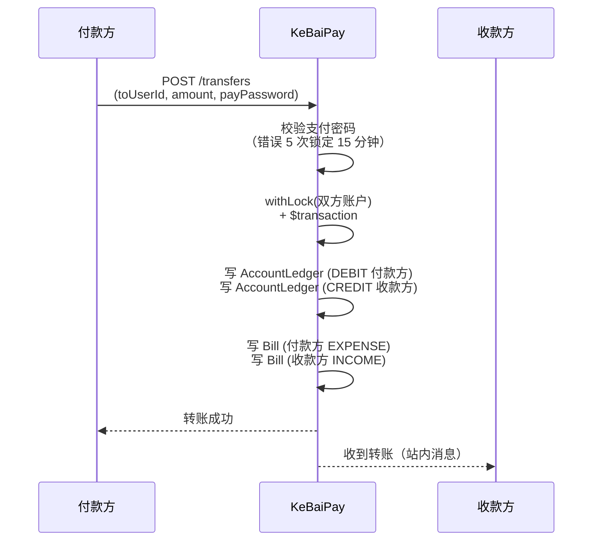
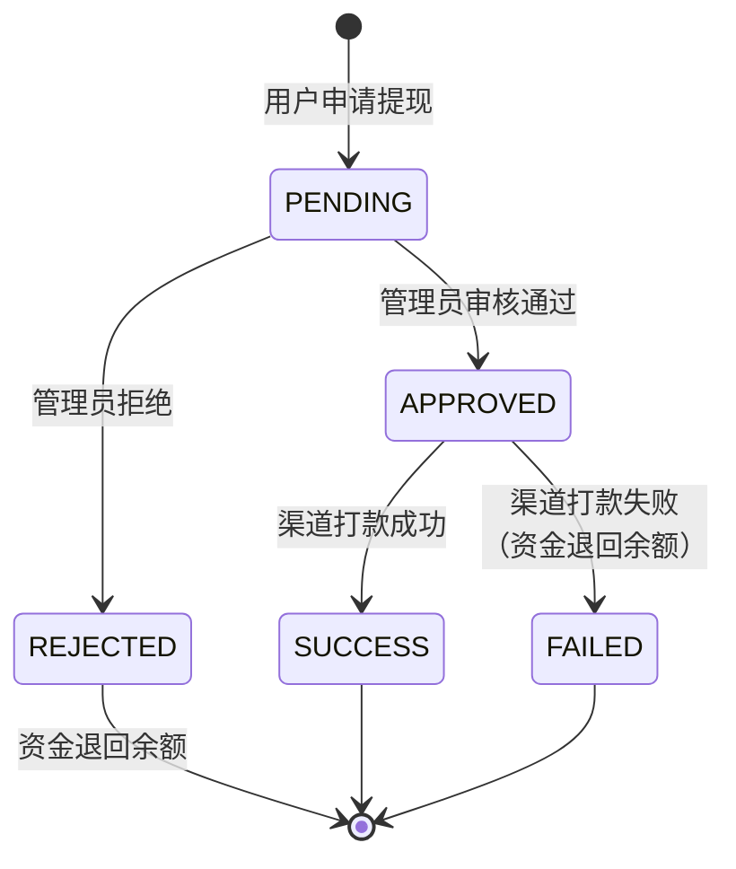
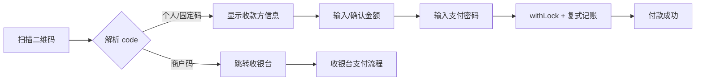
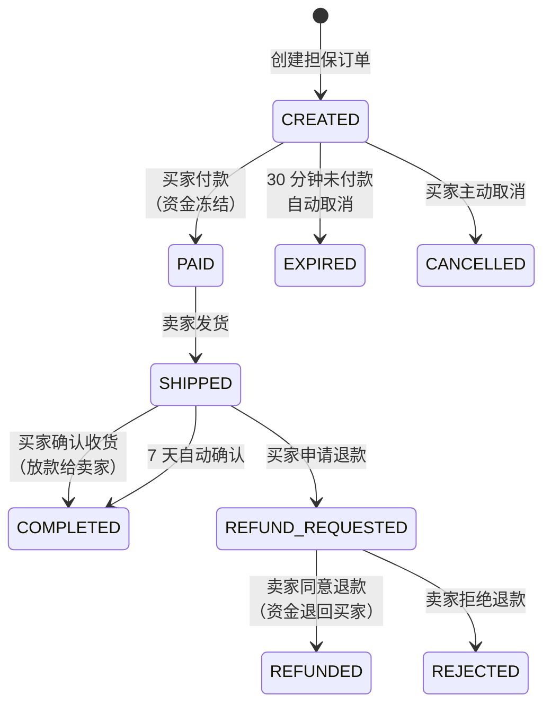

# KeBaiPay 用户使用指南

> 个人钱包用户完整使用手册 · 版本 2.0.0
> 适用对象：注册并使用 KeBaiPay 钱包的 C 端用户

## 目录

- [1. 欢迎使用 KeBaiPay 钱包](#1-欢迎使用-kebaipay-钱包)
- [2. 注册与登录](#2-注册与登录)
- [3. 实名认证](#3-实名认证)
- [4. 支付密码](#4-支付密码)
- [5. 账户余额](#5-账户余额)
- [6. 充值](#6-充值)
- [7. 转账](#7-转账)
- [8. 提现](#8-提现)
- [9. 红包（S1）](#9-红包s1)
- [10. 收款码](#10-收款码)
- [11. 账单查询](#11-账单查询)
- [12. 银行卡管理](#12-银行卡管理)
- [13. 担保交易（S2 - 买家视角）](#13-担保交易s2---买家视角)
- [14. 订阅管理](#14-订阅管理)
- [15. 优惠券](#15-优惠券)
- [16. 邀请返现](#16-邀请返现)
- [17. 消息中心](#17-消息中心)
- [18. 发票申请](#18-发票申请)
- [19. 当日限额查询](#19-当日限额查询)
- [20. 常见问题](#20-常见问题)

---

## 1. 欢迎使用 KeBaiPay 钱包

欢迎使用 KeBaiPay！KeBaiPay 是一个面向个人钱包 + 商户收款的综合性支付平台，帮助你轻松完成充值、转账、提现、红包、收款码、担保交易等日常资金操作。

### 你能用 KeBaiPay 做什么？

| 场景 | 能力 |
|------|------|
| 钱包基础 | 充值、转账、提现、查看余额与流水 |
| 社交支付 | 发红包（拼手气/普通/专属/口令）、领红包 |
| 收款 | 个人动态收款码、固定金额收款码、扫码付款 |
| 银行卡 | 绑卡、解绑、设默认卡，卡号加密存储 |
| 担保交易 | 买家付款资金冻结 → 卖家发货 → 确认收货放款 |
| 增值服务 | 订阅管理、优惠券、邀请返现、消息中心、发票申请 |

### 使用前的准备

- 一部可上网的手机或电脑浏览器
- 大陆手机号 或 常用邮箱（用于注册与找回密码）
- 大陆二代身份证（用于实名认证）
- 一张本人银行卡（用于提现）

> 💡 推荐使用 Chrome / Safari / 微信内置浏览器访问，体验更佳。

---

## 2. 注册与登录

### 2.1 注册步骤（手机号 / 邮箱）

1. 打开 KeBaiPay 应用首页 `http://你的服务器地址:3000/`
2. 点击右上角「注册」
3. 填写以下信息：
   - **昵称**（1-32 字符，必填）
   - **手机号 或 邮箱**（至少提供一个，二选一即可）
   - **登录密码**（至少 8 位，包含大写字母、小写字母、数字中的至少两类）
4. 勾选同意《用户协议》和《隐私政策》
5. 点击「注册」

#### 密码强度要求

| 要求 | 说明 |
|------|------|
| 长度 | 至少 8 位 |
| 字符类型 | 大写字母（A-Z）、小写字母（a-z）、数字（0-9）|
| 强度 | 至少包含上述三类中的两类 |

> ❌ 弱密码示例：`12345678`（仅数字）、`abcdefgh`（仅小写）  
> ✅ 强密码示例：`MyPass2026`、`Abc12345`

#### HTTP 示例

```http
POST /auth/register
Content-Type: application/json

{
  "nickname": "张三",
  "phone": "13800138000",
  "password": "MyPass2026"
}
```

注册成功后响应：

```json
{
  "accessToken": "eyJhbGciOiJIUzI1NiIsInR5cCI6IkpXVCJ9...",
  "user": {
    "id": "uuid",
    "nickname": "张三",
    "phone": "13800138000",
    "realNameStatus": "UNVERIFIED"
  }
}
```

> 🔐 `accessToken` 是你的登录凭证，前端会保存到 localStorage，后续所有需要登录的操作都会自动携带。

### 2.2 登录

```http
POST /auth/login
Content-Type: application/json

{
  "account": "13800138000",
  "password": "MyPass2026"
}
```

| 字段 | 说明 |
|------|------|
| account | 手机号 或 邮箱（与注册时填写的对应） |
| password | 登录密码 |

错误码：

| 错误码 | 说明 |
|--------|------|
| KB102 | 账号或密码错误 |
| KB104 | 账号已冻结 |

> ⚠️ 登录接口有频率限制：60 秒内最多 5 次失败尝试，超过会被锁定。如果是手机端收不到验证码、密码错误次数过多，请等待 15 分钟后重试。

### 2.3 找回密码

如果你忘记了登录密码：

1. 在登录页点击「忘记密码」
2. 输入注册时的手机号 或 邮箱
3. 接收并填入短信/邮件验证码
4. 设置新的登录密码（仍需满足强度要求）
5. 使用新密码登录

---

## 3. 实名认证

### 3.1 为什么需要实名？

| 用途 | 说明 |
|------|------|
| 监管要求 | 国家反洗钱（AML）和支付账户实名制规定要求 |
| 解锁资金功能 | 必须实名才能转账、提现、发红包、收红包、使用担保交易 |
| 提高安全等级 | 实名后账号安全性更高，可享受更高日限额 |
| 风控合规 | 实名信息是异常交易调查、争议处理的基础 |

> 🔒 你的身份证信息使用 AES-256-GCM 加密存储，身份证号生成 SHA-256 hash 做唯一约束，无法被泄露或重复使用。

### 3.2 提交步骤

1. 登录后进入「我的」 → 「实名认证」
2. 填写：
   - **真实姓名**（与身份证一致，2-30 字符）
   - **身份证号**（15-18 位大陆二代身份证）
   - **支付密码**（6 位纯数字，会同时设置你的支付密码）
3. 点击「提交认证」

#### HTTP 示例

```http
POST /users/verify-identity
Authorization: Bearer <accessToken>
Content-Type: application/json

{
  "realName": "张三",
  "idCard": "110101199001011234",
  "payPassword": "123456"
}
```

> 💡 提交实名认证时会**同时初始化支付密码**，请牢记这 6 位数字。后续转账/提现/发红包都需要它。

### 3.3 等待审核

提交后状态变为 `PENDING`，由平台管理员人工审核（通常 1 个工作日内完成）。审核结果会通过站内消息通知你。

| 状态 | 说明 | 可执行操作 |
|------|------|-----------|
| `UNVERIFIED` | 未认证 | 可充值，但不能转账/提现 |
| `PENDING` | 审核中 | 不能重复提交，等待审核结果 |
| `VERIFIED` | 已认证 | 解锁全部资金功能 |
| `REJECTED` | 认证被拒绝 | 可重新提交（需修正资料） |

错误码：

| 错误码 | 说明 |
|--------|------|
| KB202 | 已实名认证，无需重复提交 |
| KB203 | 实名审核中，请耐心等待 |
| KB216 | 该身份证号已被其他账号使用 |

---

## 4. 支付密码

### 4.1 什么是支付密码？

支付密码是**与登录密码完全独立的第二层密码**，专门用于资金操作时的二次确认。

| 操作类型 | 登录密码 | 支付密码 |
|---------|---------|---------|
| 登录账户 | ✅ | - |
| 充值 | - | ✅ |
| 转账 | - | ✅ |
| 提现 | - | ✅ |
| 发红包 | - | ✅ |
| 扫码付款 | - | ✅ |
| 担保交易付款 | - | ✅ |
| 订阅首次扣款 | - | ✅ |

**密码规则**：
- 6 位纯数字（与银行惯例一致）
- 不可包含连续/重复数字（如 `123456`、`000000`）

### 4.2 设置支付密码

支付密码在**实名认证时同步设置**，无需单独操作。详见 [3.2 提交步骤](#32-提交步骤)。

### 4.3 重置支付密码

如果忘记支付密码，可通过实名信息 + 身份证号验证后重置：

```http
POST /users/reset-pay-password
Authorization: Bearer <accessToken>
Content-Type: application/json

{
  "realName": "张三",
  "idCard": "110101199001011234",
  "newPayPassword": "654321"
}
```

| 字段 | 说明 |
|------|------|
| realName | 真实姓名（必须与实名认证一致） |
| idCard | 身份证号（必须与实名认证一致） |
| newPayPassword | 新支付密码（6 位纯数字） |

错误码：

| 错误码 | 说明 |
|--------|------|
| KB205 | 支付密码已锁定，请稍后再试 |
| KB206 | 未设置支付密码，请先完成实名认证 |
| KB207 | 错误次数过多已锁定 |
| KB208 | 实名信息不匹配 |

### 4.4 锁定规则

为防止暴力破解，支付密码错误会触发锁定：

| 规则 | 数值 |
|------|------|
| 最大连续错误次数 | **5 次** |
| 锁定时长 | **15 分钟** |
| 锁定期间 | 无法使用支付密码进行任何资金操作 |
| 自动解锁 | 锁定 15 分钟后自动解锁，错误计数清零 |

> ⚠️ 锁定期间即使输入正确密码也会被拒绝，请耐心等待。

---

## 5. 账户余额

### 5.1 查看余额

```http
GET /accounts/me
Authorization: Bearer <accessToken>
```

响应：

```json
{
  "id": "uuid",
  "availableBalanceYuan": "100.00",
  "frozenBalanceYuan": "10.00",
  "totalBalanceYuan": "110.00",
  "ledgers": [
    {
      "id": "uuid",
      "amountYuan": "10.00",
      "balanceBeforeYuan": "90.00",
      "balanceAfterYuan": "100.00",
      "type": "RECHARGE",
      "remark": "充值"
    }
  ]
}
```

| 字段 | 含义 |
|------|------|
| `availableBalanceYuan` | 可用余额（元），可立即用于消费/转账 |
| `frozenBalanceYuan` | 冻结余额（元），如担保交易付款冻结、提现冻结 |
| `totalBalanceYuan` | 总余额（元）= 可用 + 冻结 |
| `ledgers` | 资金流水列表，按时间倒序 |

### 5.2 资金流水（INCOME/EXPENSE 筛选）

通过 `direction` 参数筛选收入或支出流水：

```http
GET /accounts/me?direction=INCOME
Authorization: Bearer <accessToken>
```

| direction 取值 | 说明 |
|---------------|------|
| `INCOME` | 仅显示收入流水（充值入账、转账收入、红包收入等） |
| `EXPENSE` | 仅显示支出流水（转账支出、提现支出、红包支出等） |
| 不传 | 显示全部流水 |

---

## 6. 充值

### 6.1 充值步骤

1. 进入「我的钱包」 → 点击「充值」
2. 输入充值金额（单位：元，最低 0.01 元）
3. 输入支付密码
4. 系统调用支付渠道（微信/支付宝/Mock）完成扣款
5. 渠道回调通知成功后，余额自动到账

### 6.2 充值限额

| 限额项 | 默认值 | 说明 |
|--------|--------|------|
| 单笔最小 | 0.01 元 | 不可低于 |
| 单笔最大 | 由渠道决定 | 微信/支付宝通常 5 万元 |
| 单日累计 | 由系统配置 | 可在「当日限额查询」查看 |

### 6.3 幂等键防重复

为了避免网络重试导致重复扣款，每次充值需要传入一个唯一的 `idempotencyKey`：

```http
POST /transactions/recharge
Authorization: Bearer <accessToken>
Content-Type: application/json

{
  "amount": 100.00,
  "payPassword": "123456",
  "idempotencyKey": "recharge_20260721_001"
}
```

| 字段 | 说明 |
|------|------|
| amount | 充值金额（元） |
| payPassword | 6 位支付密码 |
| idempotencyKey | 唯一幂等键，**同一键多次请求只会成功一次**，重复请求会返回首次结果 |

> 💡 推荐幂等键格式：`recharge_<日期>_<序号>`，例如 `recharge_20260721_001`。如果充值时网络超时，可以用同一个幂等键重新发起，不会重复扣款。

错误码：

| 错误码 | 说明 |
|--------|------|
| KB503 | 充值金额无效 |
| KB504 | 无可用渠道（请联系管理员） |
| KB003 | 超出单日限额 |
| KB005 | 余额不足（指支付渠道余额） |

---

## 7. 转账

### 7.1 转账给其他用户

```http
POST /transfers
Authorization: Bearer <accessToken>
Content-Type: application/json

{
  "toUserId": "uuid-of-payee",
  "amount": 50.00,
  "remark": "晚餐费",
  "payPassword": "123456",
  "idempotencyKey": "transfer_20260721_001"
}
```

| 字段 | 必填 | 说明 |
|------|------|------|
| toUserId | 是 | 收款方用户 ID（UUID） |
| amount | 是 | 转账金额（元），最低 0.01 |
| remark | 否 | 转账备注（用户视角账单中显示） |
| payPassword | 是 | 6 位支付密码 |
| idempotencyKey | 是 | 幂等键，防重复扣款 |

### 7.2 收款方需实名

**收款方必须完成实名认证**才能接收转账，否则会返回 `KB214 对方未实名认证`。

#### 转账流程



错误码：

| 错误码 | 说明 | 解决方法 |
|--------|------|----------|
| KB501 | 转账金额无效 | 检查金额是否大于 0 |
| KB502 | 不能给自己转账 | 选择其他收款方 |
| KB005 | 余额不足 | 先充值再转账 |
| KB213 | 收款用户不存在 | 检查 toUserId 是否正确 |
| KB214 | 对方未实名认证 | 提醒对方先完成实名认证 |

---

## 8. 提现

### 8.1 申请提现

将钱包余额提现到本人银行卡：

```http
POST /withdrawals
Authorization: Bearer <accessToken>
Content-Type: application/json

{
  "amount": 100.00,
  "payPassword": "123456",
  "bankCardId": "uuid-of-bank-card",
  "remark": "提现到工商银行卡"
}
```

| 字段 | 必填 | 说明 |
|------|------|------|
| amount | 是 | 提现金额（元） |
| payPassword | 是 | 6 位支付密码 |
| bankCardId | 是 | 银行卡 ID（先绑卡，详见 [12. 银行卡管理](#12-银行卡管理)） |
| remark | 否 | 提现备注 |

### 8.2 提现到银行卡

- 必须先绑定一张本人银行卡（最多 10 张）
- 卡号使用 AES-256-GCM 加密存储，列表展示时脱敏（如 `****1234`）
- 提现时选择目标银行卡，资金从可用余额扣除并冻结

### 8.3 提现审核

提现需要平台管理员人工审核，审核通过后调用支付渠道打款：



| 状态 | 说明 |
|------|------|
| PENDING | 等待管理员审核 |
| APPROVED | 审核通过，渠道处理中 |
| SUCCESS | 提现成功，资金到账银行卡（通常 1-3 个工作日） |
| FAILED | 提现失败，资金退回钱包余额 |
| REJECTED | 提现被拒绝，资金退回钱包余额 |

> 💡 查询提现记录：`GET /withdrawals`

错误码：

| 错误码 | 说明 |
|--------|------|
| KB506 | 提现金额无效 |
| KB005 | 余额不足 |
| KB212 | 请先完成实名认证 |
| KB217 | 银行卡不存在 |

---

## 9. 红包（S1）

KeBaiPay 红包功能采用与微信一致的**二倍均值法**算法，支持 4 种类型。

### 9.1 发红包（普通/拼手气）

```http
POST /red-packets
Authorization: Bearer <accessToken>
Content-Type: application/json

{
  "type": "LUCKY",
  "totalAmount": 88.88,
  "count": 8,
  "greeting": "恭喜发财",
  "payPassword": "123456",
  "designatedUserId": null,
  "password": null,
  "idempotencyKey": "redpacket_20260721_001"
}
```

#### 4 种红包类型

| type | 名称 | 必填字段 | 说明 |
|------|------|---------|------|
| `LUCKY` | 拼手气红包 | totalAmount + count | 每人金额随机，按二倍均值法分配 |
| `ORDINARY` | 普通红包 | totalAmount + count | 每人金额固定 = totalAmount / count |
| `EXCLUSIVE` | 专属红包 | totalAmount + count + designatedUserId | 仅指定用户可领取 |
| `PASSWORD` | 口令红包 | totalAmount + count + password | 领取时需输入正确口令 |

#### 二倍均值法说明

以拼手气红包为例，总金额 88.88 元，8 个包：
- 第 1 人：在 `[0.01, 88.88/8 × 2]` 区间随机，假设拿到 18.50 元
- 第 2 人：剩余 70.38 元分给 7 人，在 `[0.01, 70.38/7 × 2]` 区间随机
- 以此类推，最后一人拿剩余全部

> 💡 与微信红包算法一致，最刺激的玩法就是抢到「运气王」！

### 9.2 领红包

```http
POST /red-packets/:packetNo/receive
Authorization: Bearer <accessToken>
Content-Type: application/json

{
  "password": "abc123"
}
```

| 字段 | 必填 | 说明 |
|------|------|------|
| password | 仅口令红包 | 6-32 位口令 |

领取规则：

- ❌ 不能领取自己发的红包
- ❌ 每个红包每人只能领取一次
- ❌ 红包过期后无法领取（默认 24 小时过期）
- ❌ 专属红包仅指定收款人可领
- ✅ 领取金额立即存入钱包余额

### 9.3 红包过期退回

红包到期后未领取的剩余金额会**自动退回**到发送者钱包：

| 状态 | 说明 |
|------|------|
| `PENDING` | 待领取（刚发出） |
| `PARTIALLY_RECEIVED` | 部分被领取 |
| `RECEIVED` | 全部领完 |
| `EXPIRED` | 已过期，剩余金额已退回 |
| `RETURNED` | 退回记录（与 RECEIVE 区分） |

> ⏰ 红包调度任务每 5 分钟扫描一次过期红包，自动调用 `expireReturn` 退回剩余金额。

查询红包记录：

```http
GET /red-packets/sent       # 我发出的红包
GET /red-packets/received   # 我收到的红包
Authorization: Bearer <accessToken>
```

错误码：

| 错误码 | 说明 |
|--------|------|
| KB613 | 红包金额无效 |
| KB615 | 已领取或已过期 |
| KB616 | 不能领自己的红包 |
| KB622 | 红包类型无效 |
| KB623 | 红包数量无效 |
| KB625 | 非专属收款人 |
| KB626 | 此红包需要口令 |
| KB627 | 口令错误 |
| KB628 | 该用户已领取过此红包 |

---

## 10. 收款码

### 10.1 个人收款码

每个用户都拥有一个**个人动态收款码**，可分享给任何人收款：

```http
GET /qr-codes/personal
Authorization: Bearer <accessToken>
```

返回的二维码内容包含你的用户 ID，付款方扫码后输入金额并支付即可。

### 10.2 固定金额收款码

适用于固定金额收款场景（如门店商品、活动报名费）：

```http
POST /qr-codes/fixed
Authorization: Bearer <accessToken>
Content-Type: application/json

{
  "amount": 10.00,
  "remark": "午餐费"
}
```

| 字段 | 必填 | 说明 |
|------|------|------|
| amount | 是 | 固定金额（元） |
| remark | 否 | 收款备注 |

固定金额收款码扫码后无需输入金额，直接确认支付即可。

### 10.3 扫码付款

```http
POST /qr-codes/pay
Authorization: Bearer <accessToken>
Content-Type: application/json

{
  "code": "QR-xxxxxx",
  "amount": 10.00,
  "payPassword": "123456"
}
```

| 字段 | 必填 | 说明 |
|------|------|------|
| code | 是 | 二维码内容（如 `QR-xxxxxx`） |
| amount | 否 | 付款金额（个人收款码需填，固定金额码可不填） |
| payPassword | 是 | 6 位支付密码 |

#### 扫码付款流程



限制：
- ❌ 不能扫自己的收款码
- ❌ 收款码已失效（DELETED 状态）不可使用
- ❌ 商户二维码请走收银台流程（`KB620`）

错误码：

| 错误码 | 说明 |
|--------|------|
| KB610 | 收款码无效 |
| KB611 | 不能扫自己的码 |
| KB619 | 收款码已失效 |
| KB620 | 商户二维码请通过收银台支付 |

---

## 11. 账单查询

### 11.1 收入/支出筛选

```http
GET /bills?direction=INCOME
Authorization: Bearer <accessToken>
```

| 参数 | 必填 | 取值 | 说明 |
|------|------|------|------|
| direction | 否 | `INCOME` / `EXPENSE` | 不传则返回全部账单 |

### 11.2 账单详情

响应示例：

```json
[
  {
    "id": "uuid",
    "type": "TRANSFER",
    "direction": "EXPENSE",
    "amountYuan": "50.00",
    "remark": "转账给张三",
    "counterparty": "张三",
    "createdAt": "2026-07-21T10:30:00.000Z"
  }
]
```

#### 账单类型对照表

| type | direction | 说明 |
|------|-----------|------|
| `RECHARGE` | INCOME | 充值入账 |
| `WITHDRAW` | EXPENSE | 提现支出 |
| `TRANSFER` | EXPENSE / INCOME | 转账（付款方/收款方） |
| `RECEIPT` | INCOME | 收款（扫码收入、红包收入等） |
| `PAYMENT` | EXPENSE | 商户付款 |
| `REFUND` | INCOME | 退款 |
| `RED_PACKET` | EXPENSE / INCOME | 红包发出/领取 |
| `ESCROW` | EXPENSE / INCOME | 担保交易 |
| `SUBSCRIPTION` | EXPENSE | 订阅扣款 |
| `SPLIT` | INCOME | 分账收入 |
| `REFERRAL` | INCOME | 邀请返现 |

---

## 12. 银行卡管理

### 12.1 绑卡

```http
POST /bank-cards
Authorization: Bearer <accessToken>
Content-Type: application/json

{
  "cardNumber": "6222021234567890123",
  "holderName": "张三",
  "bankName": "工商银行",
  "bankBranch": "北京分行",
  "isDefault": true
}
```

| 字段 | 必填 | 说明 |
|------|------|------|
| cardNumber | 是 | 银行卡号（16-19 位数字） |
| holderName | 是 | 持卡人姓名（须与实名一致） |
| bankName | 是 | 开户行（如「工商银行」） |
| bankBranch | 否 | 支行名称 |
| isDefault | 否 | 是否设为默认卡（默认 false） |

> 🔒 卡号采用 AES-256-GCM 加密存储，同时生成 SHA-256 hash 用于唯一约束。列表展示时仅返回脱敏卡号（如 `****1234`）。

#### 绑卡约束

| 限制 | 数值 |
|------|------|
| 单用户最多绑卡数 | 10 张 |
| 同一卡号 | 同一用户下唯一（不可重复绑定） |
| 持卡人姓名 | 必须与实名认证姓名一致 |

### 12.2 解绑

```http
DELETE /bank-cards/:id
Authorization: Bearer <accessToken>
```

- 软删除（status 置为 `DELETED`），不删除历史记录便于审计
- 如果解绑的是默认卡，系统会自动将另一张可用卡设为默认

### 12.3 设默认卡

绑卡时设置 `isDefault: true` 即可。后续可通过 `PATCH /bank-cards/:id` 更新。

查询默认卡：

```http
GET /bank-cards/default
Authorization: Bearer <accessToken>
```

错误码：

| 错误码 | 说明 |
|--------|------|
| KB217 | 银行卡不存在 |
| KB218 | 该银行卡已被绑定 |
| KB219 | 绑卡超过上限（最多 10 张） |
| KB220 | 卡号格式不正确 |

---

## 13. 担保交易（S2 - 买家视角）

担保交易是为买卖双方提供的中介担保服务：买家付款资金先冻结在平台，卖家发货后买家确认收货才放款，保障双方权益。与支付宝/微信担保支付逻辑一致。

### 13.1 什么是担保交易



### 13.2 创建担保订单

```http
POST /escrow/orders
Authorization: Bearer <accessToken>
Content-Type: application/json

{
  "sellerUserId": "uuid-of-seller",
  "amount": 1000.00,
  "subject": "iPhone 15",
  "body": "二手 iPhone 15 128G",
  "idempotencyKey": "escrow_20260721_001"
}
```

> ⚠️ 创建订单不会扣款，仅占位。需要在 30 分钟内付款，否则订单自动过期。

### 13.3 付款

```http
POST /escrow/orders/:orderNo/pay
Authorization: Bearer <accessToken>
Content-Type: application/json

{
  "payPassword": "123456"
}
```

付款后资金**冻结在平台账户**（你的 `frozenBalance` 不变，但平台账户记录该笔冻结），卖家可以看到「已付款」状态。

### 13.4 确认收货

收到商品后，确认收货才会把资金放给卖家：

```http
POST /escrow/orders/:orderNo/confirm
Authorization: Bearer <accessToken>
```

> ⏰ 如果你忘记确认收货，订单 SHIPPED 后 7 天会自动确认放款。

### 13.5 申请退款

如果商品有问题，可在 `SHIPPED` 状态申请退款：

```http
POST /escrow/orders/:orderNo/refund-request
Authorization: Bearer <accessToken>
Content-Type: application/json

{
  "reason": "商品描述不符，存在划痕"
}
```

卖家会收到退款申请，可选择 `APPROVE_REFUND`（同意退款，资金退回你的余额）或 `REJECT_REFUND`（拒绝退款，进入争议处理）。

> 💡 担保交易默认日限额 5 万元。详情可联系客服。

错误码：

| 错误码 | 说明 |
|--------|------|
| KB630 | 担保订单不存在 |
| KB631 | 当前状态不允许该操作 |
| KB632 | 只有买家可以执行此操作 |
| KB633 | 只有卖家可以执行此操作 |
| KB634 | 不能与自己进行担保交易 |
| KB635 | 必须填写原因 |
| KB636 | 订单已被处理 |
| KB637 | 担保订单已过期 |
| KB638 | 状态已变化，请刷新 |

---

## 14. 订阅管理

订阅功能允许你按周期自动扣款（如会员费、SaaS 服务费）。

### 14.1 查看可订阅计划

```http
GET /subscriptions/plans
Authorization: Bearer <accessToken>
```

返回所有可用订阅计划，包含名称、周期、金额、试用期等信息。

#### 周期类型

| period | 说明 |
|--------|------|
| `DAILY` | 每日扣款 |
| `WEEKLY` | 每周扣款 |
| `MONTHLY` | 每月扣款 |
| `YEARLY` | 每年扣款 |

### 14.2 订阅

```http
POST /subscriptions/:planNo/subscribe
Authorization: Bearer <accessToken>
Content-Type: application/json

{
  "payPassword": "123456",
  "idempotencyKey": "subscribe_20260721_001"
}
```

订阅成功后：
- 如果计划有试用期（如 7 天免费试用），首期不扣款，试用期结束后开始扣款
- 如果无试用期，立即扣首期款
- 系统调度任务每 5 分钟扫描到期订阅自动扣款

### 14.3 取消订阅

```http
POST /subscriptions/subscriptions/:subscriptionNo/cancel
Authorization: Bearer <accessToken>
```

取消后不再继续扣款，已扣款不退还。其他可用操作：

| 操作 | 端点 | 说明 |
|------|------|------|
| 暂停订阅 | `POST /subscriptions/subscriptions/:subscriptionNo/suspend` | 临时停止扣款 |
| 恢复订阅 | `POST /subscriptions/subscriptions/:subscriptionNo/resume` | 恢复扣款 |
| 查询详情 | `GET /subscriptions/subscriptions/:subscriptionNo` | 包含扣款记录 |
| 列出我的订阅 | `GET /subscriptions/subscriptions` | 分页返回 |
| 扣款记录 | `GET /subscriptions/subscriptions/:subscriptionNo/charges` | 历史扣款明细 |

#### 订阅约束

| 限制 | 数值 |
|------|------|
| 每期金额上限 | 10000 元 |
| 单用户订阅计划数 | 最多 100 个 |
| 连续扣款失败 | 3 次后自动暂停订阅 |
| 不能订阅 | 自己创建的计划 |

错误码：

| 错误码 | 说明 |
|--------|------|
| KB650 | 计划不存在 |
| KB651 | 计划已下架 |
| KB652 | 订阅不存在 |
| KB653 | 订阅状态不允许该操作 |
| KB654 | 已订阅该计划 |
| KB656 | 不能订阅自己的计划 |
| KB657 | 周期参数无效 |
| KB658 | 订阅金额必须大于 0 |

---

## 15. 优惠券

### 15.1 领取优惠券

```http
POST /coupons/:couponNo/claim
Authorization: Bearer <accessToken>
```

领取规则：
- 每个优惠券每人只能领一次（`KB674 已领取过`）
- 优惠券有发放配额，领完即止（`KB673 已领完`）
- 优惠券过期后不可领取（`KB672 已过期`）

### 15.2 我的优惠券

```http
GET /coupons/mine/list
Authorization: Bearer <accessToken>
```

#### 优惠券类型

| type | 说明 | 使用规则 |
|------|------|---------|
| `FIXED` | 固定金额减免 | 订单金额 ≥ `minAmount` 时，扣减 `value` 元 |
| `PERCENT` | 百分比折扣 | 订单金额 × `value%`，有最大减免上限 |
| `DISCOUNT` | 折扣券 | 订单金额直接打折 |

#### 优惠券状态

| 状态 | 说明 |
|------|------|
| `ISSUED` | 已发放，未使用 |
| `USED` | 已使用 |
| `EXPIRED` | 已过期（调度任务每小时扫描自动标记） |

#### 使用优惠券

```http
POST /coupons/mine/:userCouponNo/use
Authorization: Bearer <accessToken>
Content-Type: application/json

{
  "orderAmount": 150.00
}
```

响应：

```json
{
  "discountAmount": 20.00,
  "finalAmount": 130.00,
  "userCouponNo": "UC-xxxxxx"
}
```

错误码：

| 错误码 | 说明 |
|--------|------|
| KB670 | 优惠券不存在 |
| KB671 | 已下架 |
| KB672 | 已过期 |
| KB673 | 已领完 |
| KB674 | 已领取过 |
| KB677 | 用户优惠券不存在 |
| KB678 | 已被使用 |

---

## 16. 邀请返现

### 16.1 我的邀请码

```http
POST /referrals/code
Authorization: Bearer <accessToken>
```

或查询现有邀请码：

```http
GET /referrals/code
Authorization: Bearer <accessToken>
```

返回 8 位邀请码（已去除易混字符 `0/O/I/1`），如 `ABC23456`。

### 16.2 邀请记录

#### 邀请统计

```http
GET /referrals/stats
Authorization: Bearer <accessToken>
```

返回总邀请人数、已生效人数、累计奖励金额等统计。

#### 邀请列表

```http
GET /referrals
Authorization: Bearer <accessToken>
```

返回我邀请的所有用户列表，包含邀请状态（PENDING / COMPLETED / CANCELLED）。

#### 邀请奖励规则

| 项 | 默认值 |
|-----|--------|
| 默认奖励金额 | 10 元 |
| 最大奖励金额 | 1000 元 |
| 触发交易最小金额 | 1 元 |
| 触发条件 | 被邀请人首笔交易（转账/付款等）成功后，由邀请人手动触发 |

#### 被邀请人绑定邀请码

被邀请人登录后可绑定邀请码：

```http
POST /referrals/bind
Authorization: Bearer <accessToken>
Content-Type: application/json

{
  "referralCode": "ABC23456"
}
```

#### 邀请人触发奖励

被邀请人完成首笔交易后，邀请人触发奖励发放：

```http
POST /referrals/mine/trigger
Authorization: Bearer <accessToken>
Content-Type: application/json

{
  "transactionType": "TRANSFER",
  "transactionNo": "TX-xxxxxx",
  "amount": 100.00
}
```

错误码：

| 错误码 | 说明 |
|--------|------|
| KB680 | 邀请码不存在 |
| KB681 | 邀请码已存在 |
| KB682 | 邀请关系不存在 |
| KB683 | 已绑定邀请关系 |
| KB684 | 不能邀请自己 |
| KB685 | 状态不允许该操作 |
| KB687 | 触发奖励的交易无效 |
| KB688 | 邀请关系非待结算状态 |

---

## 17. 消息中心

### 17.1 消息列表

```http
GET /messages
Authorization: Bearer <accessToken>
```

返回当前用户的所有消息，包含**广播消息**（系统通知所有用户）和**定向消息**（仅发给当前用户）。

### 17.2 未读数

```http
GET /messages/unread/count
Authorization: Bearer <accessToken>
```

返回数字：`{ "count": 5 }`

### 17.3 标记已读

#### 标记单条已读

```http
POST /messages/:messageNo/read
Authorization: Bearer <accessToken>
```

#### 一键全部已读

```http
POST /messages/read/all
Authorization: Bearer <accessToken>
```

#### 删除定向消息

```http
POST /messages/:messageNo/delete
Authorization: Bearer <accessToken>
```

> ⚠️ 仅定向消息可删除，广播消息不可删除（`KB692`）。

错误码：

| 错误码 | 说明 |
|--------|------|
| KB690 | 消息不存在 |
| KB691 | 消息已读 |
| KB692 | 消息不可删除 |

---

## 18. 发票申请

### 18.1 申请开票

```http
POST /invoices
Authorization: Bearer <accessToken>
Content-Type: application/json

{
  "title": "北京某某科技有限公司",
  "taxNo": "91110100XXXXXXXXXX",
  "amount": 1000.00,
  "type": "VAT_GENERAL",
  "email": "finance@example.com"
}
```

| 字段 | 必填 | 说明 |
|------|------|------|
| title | 是 | 发票抬头 |
| taxNo | 是 | 税号 |
| amount | 是 | 开票金额（元） |
| type | 是 | `VAT_GENERAL`（增值税普通发票）/ `VAT_SPECIAL`（增值税专用发票） |
| email | 是 | 接收发票的邮箱 |

提交后状态变为 `PENDING`，等待管理员开具。

### 18.2 查询开票记录

```http
GET /invoices
Authorization: Bearer <accessToken>
```

#### 发票状态

| 状态 | 说明 |
|------|------|
| `PENDING` | 待开具 |
| `ISSUED` | 已开具（已发送至邮箱） |
| `CANCELLED` | 已作废 |

#### 其他操作

| 操作 | 端点 | 说明 |
|------|------|------|
| 查询详情 | `GET /invoices/:invoiceNo` | 单条发票详情 |
| 商户作废 | `POST /invoices/:invoiceNo/cancel` | 仅 PENDING 状态可作废 |

错误码：

| 错误码 | 说明 |
|--------|------|
| KB695 | 发票不存在 |
| KB696 | 状态不允许该操作 |
| KB697 | 金额必须大于 0 |
| KB698 | 无权操作该发票 |

---

## 19. 当日限额查询

查询当前用户当日各业务类型的限额使用情况：

```http
GET /users/daily-limit
Authorization: Bearer <accessToken>
```

响应示例：

```json
{
  "TRANSFER": {
    "usedYuan": "500.00",
    "limitYuan": "50000.00",
    "remainingYuan": "49500.00"
  },
  "WITHDRAW": {
    "usedYuan": "1000.00",
    "limitYuan": "50000.00",
    "remainingYuan": "49000.00"
  },
  "RECHARGE": {
    "usedYuan": "200.00",
    "limitYuan": "50000.00",
    "remainingYuan": "49800.00"
  }
}
```

#### 各业务类型限额

| limitType | 说明 | 默认日限额 |
|-----------|------|----------|
| `TRANSFER` | 转账 | 5 万元 |
| `WITHDRAW` | 提现 | 5 万元 |
| `RECHARGE` | 充值 | 5 万元 |
| `ESCROW` | 担保交易 | 5 万元 |
| `BATCH_TRANSFER` | 批量转账 | 5 万元 |
| `SPLIT` | 分账 | 5 万元 |

> 💡 限额由平台管理员通过 SystemConfig 配置，可通过本接口实时查看。当日累计超限会返回 `KB003 超出单日限额`。

---

## 20. 常见问题

### Q1: 收不到验证码？

可能原因与解决：

| 原因 | 解决方法 |
|------|---------|
| 手机号填错 | 检查手机号是否正确，是否加了 `+86` 前缀（系统会自动处理） |
| 短信被拦截 | 查看短信拦截箱 / 安全中心 / 验证码过滤 |
| 频率限制 | 同一手机号 60 秒内只能发 1 条，1 小时内最多 5 条 |
| 平台未配置短信服务 | 联系客服确认 SMS_PROVIDER 是否启用 |
| 邮箱验证码 | 检查垃圾邮件文件夹 |

> ⚠️ 若 5 分钟内未收到，可重新点击「发送验证码」。如果连续多次未收到，请联系客服。

### Q2: 充值没到账？

可能原因：

| 原因 | 解决方法 |
|------|---------|
| 渠道回调延迟 | 通常 1-5 秒到账，偶尔延迟 1-2 分钟 |
| 渠道回调失败 | 系统每 5 分钟扫描 PENDING 超 15 分钟的充值订单并告警 |
| 网络重试导致重复 | 传入相同 `idempotencyKey` 重发，不会重复扣款 |

**排查步骤**：
1. 在「账单」中查看是否有这笔充值记录
2. 如果没有，请提供：充值时间、金额、支付渠道、幂等键
3. 联系客服查询渠道订单状态

### Q3: 转账失败？

常见错误及解决：

| 错误 | 解决 |
|------|------|
| 余额不足 | 先充值或减少金额 |
| 收款方未实名 | 提醒对方先完成实名认证（`KB214`） |
| 收款用户不存在 | 检查 toUserId 是否正确 |
| 不能给自己转账 | 选择其他收款方（`KB502`） |
| 超出单日限额 | 次日再转，或联系客服提额（`KB003`） |
| 支付密码错误 5 次 | 锁定 15 分钟后自动解锁 |

### Q4: 提现慢？

| 阶段 | 预计耗时 |
|------|---------|
| 管理员审核 | 通常 1-2 小时内（工作日） |
| 渠道打款 | 审核通过后 1-3 个工作日到账 |
| 银行处理 | 不同银行到账时间略有差异 |

**加速建议**：
- 工作日工作时间（9:00-18:00）提交审核更快
- 优先选择大行银行卡（工行/建行/招行等到账更快）
- 单笔金额低于 5 万元通常 T+1 到账

### Q5: 红包领不了？

| 原因 | 解决 |
|------|------|
| 已领取过 | 每个红包每人只能领一次（`KB628`） |
| 不能领自己发的 | 让其他人领（`KB616`） |
| 红包已过期 | 默认 24 小时过期，过期后剩余金额退回发送者 |
| 专属红包非指定人 | 仅 designatedUserId 可领（`KB625`） |
| 口令红包口令错 | 输入正确口令（`KB627`） |
| 已被领完 | 红包已被全部领完 |

### Q6: 怎么改手机号？

1. 登录后进入「我的」 → 「账户安全」 → 「修改手机号」
2. 输入新手机号
3. 接收新手机号的短信验证码
4. 输入验证码确认

```http
POST /users/bind-phone
Authorization: Bearer <accessToken>
Content-Type: application/json

{
  "phone": "13900000000",
  "code": "123456"
}
```

> ⚠️ 改手机号后**使用新手机号登录**。如果手机号已被其他账号绑定会返回 `KB222`。

---

## 附录：用户端 API 端点速查

| 模块 | 关键端点 |
|------|---------|
| 认证 | `POST /auth/register`、`POST /auth/login` |
| 用户 | `GET /users/me`、`POST /users/verify-identity`、`POST /users/reset-pay-password`、`POST /users/change-password`、`POST /users/bind-phone`、`POST /users/bind-email`、`GET /users/login-logs`、`GET /users/daily-limit` |
| 账户 | `GET /accounts/me` |
| 交易 | `POST /transactions/recharge` |
| 转账 | `POST /transfers` |
| 提现 | `POST /withdrawals`、`GET /withdrawals` |
| 红包 | `POST /red-packets`、`POST /red-packets/:packetNo/receive`、`GET /red-packets/sent`、`GET /red-packets/received` |
| 收款码 | `GET /qr-codes/personal`、`POST /qr-codes/fixed`、`POST /qr-codes/pay` |
| 账单 | `GET /bills` |
| 银行卡 | `POST /bank-cards`、`GET /bank-cards`、`GET /bank-cards/default`、`PATCH /bank-cards/:id`、`DELETE /bank-cards/:id` |
| 担保交易 | `POST /escrow/orders`、`POST /escrow/orders/:orderNo/pay`、`POST /escrow/orders/:orderNo/confirm`、`POST /escrow/orders/:orderNo/refund-request` |
| 订阅 | `GET /subscriptions/plans`、`POST /subscriptions/:planNo/subscribe`、`POST /subscriptions/subscriptions/:subscriptionNo/cancel` |
| 优惠券 | `POST /coupons/:couponNo/claim`、`GET /coupons/mine/list`、`POST /coupons/mine/:userCouponNo/use` |
| 邀请返现 | `POST /referrals/code`、`GET /referrals/code`、`GET /referrals`、`POST /referrals/bind`、`POST /referrals/mine/trigger` |
| 消息中心 | `GET /messages`、`GET /messages/unread/count`、`POST /messages/:messageNo/read`、`POST /messages/read/all` |
| 发票 | `POST /invoices`、`GET /invoices`、`GET /invoices/:invoiceNo`、`POST /invoices/:invoiceNo/cancel` |

> 📖 完整接口文档（请求体/响应/错误码）：开发环境访问 `http://你的服务器地址:3000/api/docs`

## 联系客服

- 应用内：「我的」 → 「在线客服」
- 邮箱：support@kebaipay.com
- 站内消息：通过「消息中心」发送
